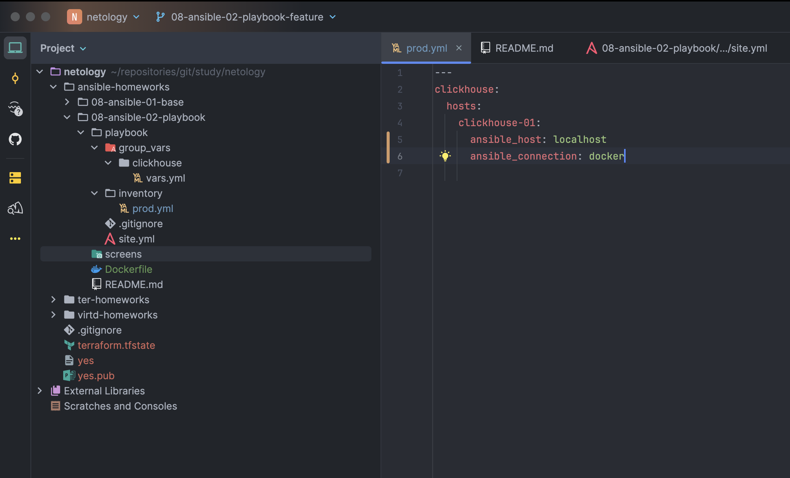
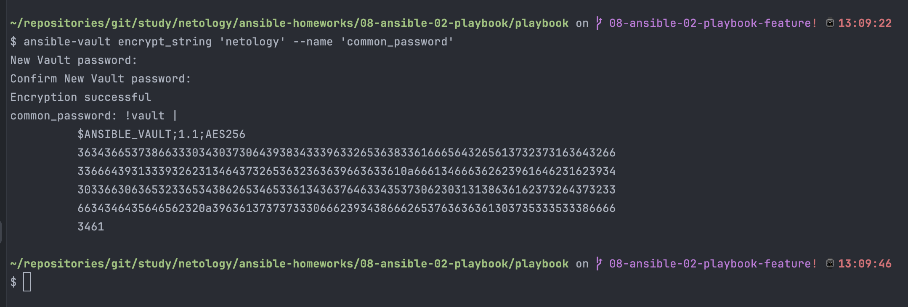
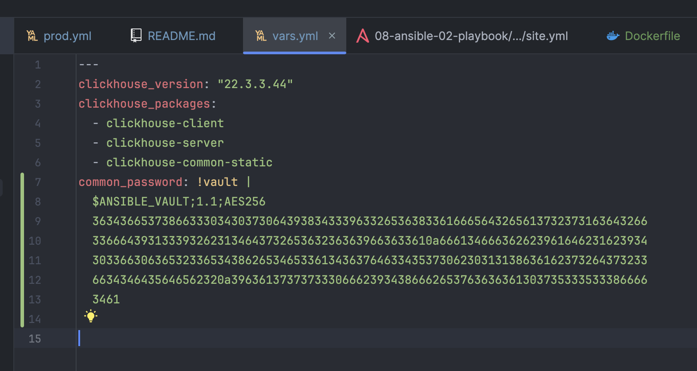
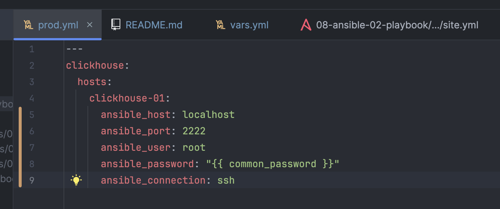
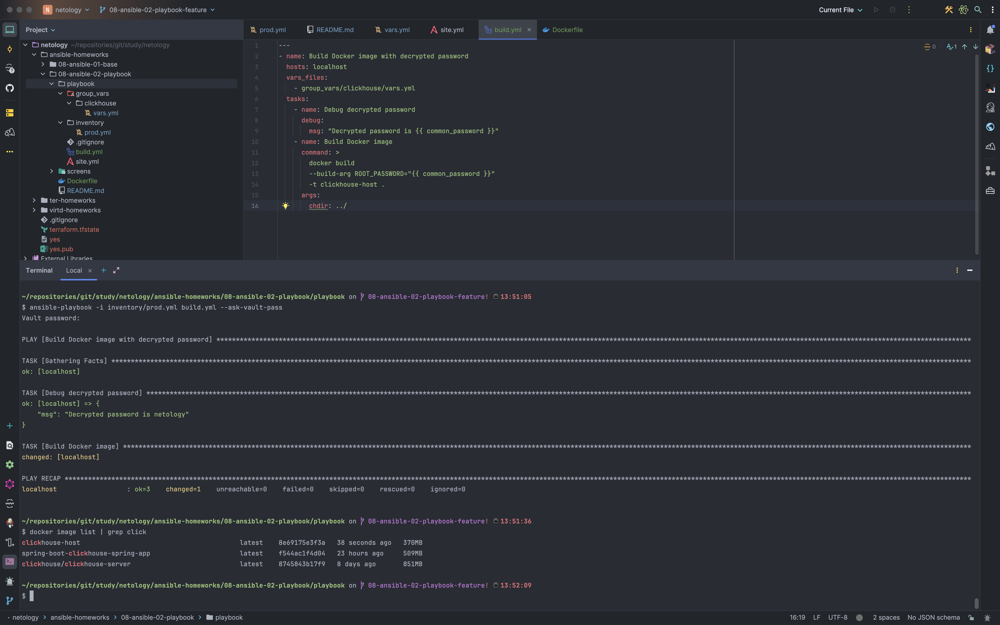
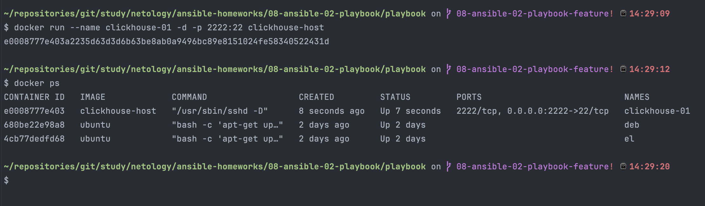
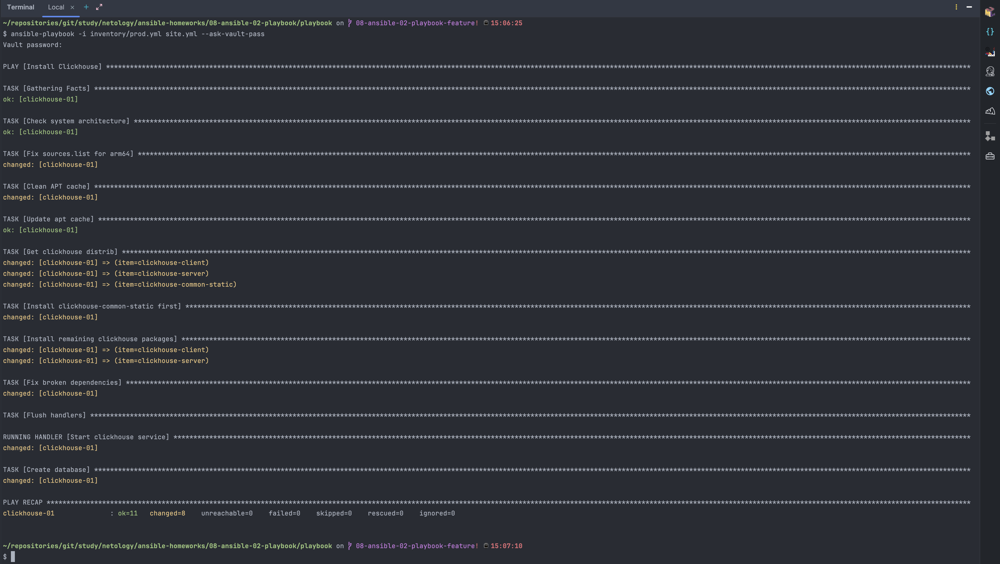
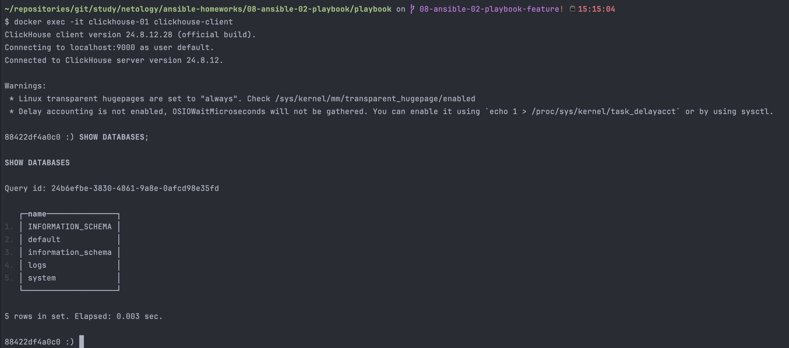

# Домашнее задание к занятию 2 «Работа с Playbook»

## Факутальтивный вопрос 1-ого занятия: 

1. Как называется режим работы в Ansible где можно интерактивно debug Ansible task?

### Ответ

Интерактивный режим работы, при котором можно отслеживать и анализировать цепочки возникновения технической и/или иной природы проблемы, называется отладкой. А в рамках терминологии Ansible - стратегией отладки.

Включить режим отладки можно на уровне playbook, задачи или глобально через конфигурацию.

На уровне задачи (task) в **playbook**:
```yml
- name: Example task with debugger
  debug:
  msg: "This is a debug message"
  debugger: on
```

На уровне конфигурации **ansible.cfg**

```editorconfig
[defaults]
enable_task_debugger = True
```

На уровне запуска **playbook** при включенном режиме **debugger** (_step_ - позволяет пошагово отладить процесс):

```bash
ansible-playbook playbook.yml --step
```

## Основная часть

1. Подготовьте свой inventory-файл `prod.yml`.
2. Допишите playbook: нужно сделать ещё один play, который устанавливает и настраивает [vector](https://vector.dev). Конфигурация vector должна деплоиться через template файл jinja2. От вас не требуется использовать все возможности шаблонизатора, просто вставьте стандартный конфиг в template файл. Информация по шаблонам по [ссылке](https://www.dmosk.ru/instruktions.php?object=ansible-nginx-install). не забудьте сделать handler на перезапуск vector в случае изменения конфигурации!
3. При создании tasks рекомендую использовать модули: `get_url`, `template`, `unarchive`, `file`.
4. Tasks должны: скачать дистрибутив нужной версии, выполнить распаковку в выбранную директорию, установить vector.
5. Запустите `ansible-lint site.yml` и исправьте ошибки, если они есть.
6. Попробуйте запустить playbook на этом окружении с флагом `--check`.
7. Запустите playbook на `prod.yml` окружении с флагом `--diff`. Убедитесь, что изменения на системе произведены.
8. Повторно запустите playbook с флагом `--diff` и убедитесь, что playbook идемпотентен.
9. Подготовьте README.md-файл по своему playbook. В нём должно быть описано: что делает playbook, какие у него есть параметры и теги. Пример качественной документации ansible playbook по [ссылке](https://github.com/opensearch-project/ansible-playbook). Так же приложите скриншоты выполнения заданий №5-8
10. Готовый playbook выложите в свой репозиторий, поставьте тег `08-ansible-02-playbook` на фиксирующий коммит, в ответ предоставьте ссылку на него.

### Ответ

1. Изменим **inventory** файл `prod.yml` так, что мы будем подключаться к **docker-контейнеру**



Перед работой проверим работоспособность и подготовить файл **playbook** для отладки и запуска **clickhouse** базы данных на **control-хосте** под управлением операционной системы **macOS** на базе _ARM-архитектуры_

Сначала создадим пароль ```netology```, но зашифруем его с помощью команды

```bash
ansible-vault encrypt_string 'netology' --name 'common_password'
```



Далее сохраним зашифрованное значение в файле **фактов**



Поменяем подключение с ```docker``` на ```ssh```



Создал новый **docker-образ**, описанного в Dockerfile

```docker
# Базовый образ Ubuntu
FROM ubuntu:22.04

# Определение переменных
ARG ROOT_PASSWORD

# Обновление пакетов и установка необходимых зависимостей
RUN apt-get update && \
    apt-get install -y openssh-server python3 sudo && \
    apt-get clean

# Настройка SSH
RUN mkdir /var/run/sshd && \
    echo "root:${ROOT_PASSWORD}" | chpasswd && \
    sed -i 's/#PermitRootLogin prohibit-password/PermitRootLogin yes/' /etc/ssh/sshd_config && \
    sed -i 's/#PasswordAuthentication yes/PasswordAuthentication yes/' /etc/ssh/sshd_config

# Отключение DNS-проверки для ускорения подключения
RUN sed -i 's@session\s*required\s*pam_loginuid.so@session optional pam_loginuid.so@g' /etc/pam.d/sshd

# Порт SSH
EXPOSE 2222

# Запуск SSH-сервера
CMD ["/usr/sbin/sshd", "-D"]
```

C помощью команды поднял всё необходимое

```bash
ansible-playbook -i inventory/prod.yml build.yml --ask-vault-pass
```



После поднял образ в новом контейнере **clickhouse-01**, наименование которого совпадает с нашим **inventory**



Далее изменил исходные данные фактов, а именно, помимо зашифрованного пароля, указал новую версию пакетов ```clickhouse_version: "24.8.12.28"```

После этого с помощью команды запустил **playbook**

```bash
ansible-playbook -i inventory/prod.yml site.yml --ask-vault-pass
```



Проверил работоспособность БД, подключившись к контейнеру



Playbook **site.yml** претерпел сильные изменения, так как на операционной системе **macOS** на базе **ARM**-чипов помимо актуальной версии пакетов ряд проблем собран был. Пришлось в сети интернет находить разные решения и описания

---
