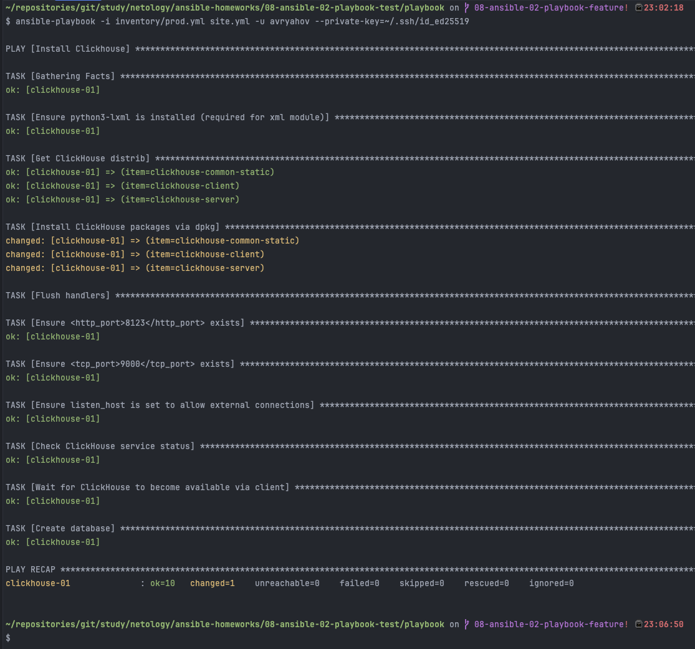
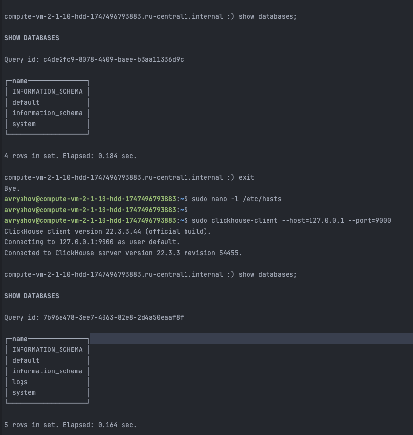
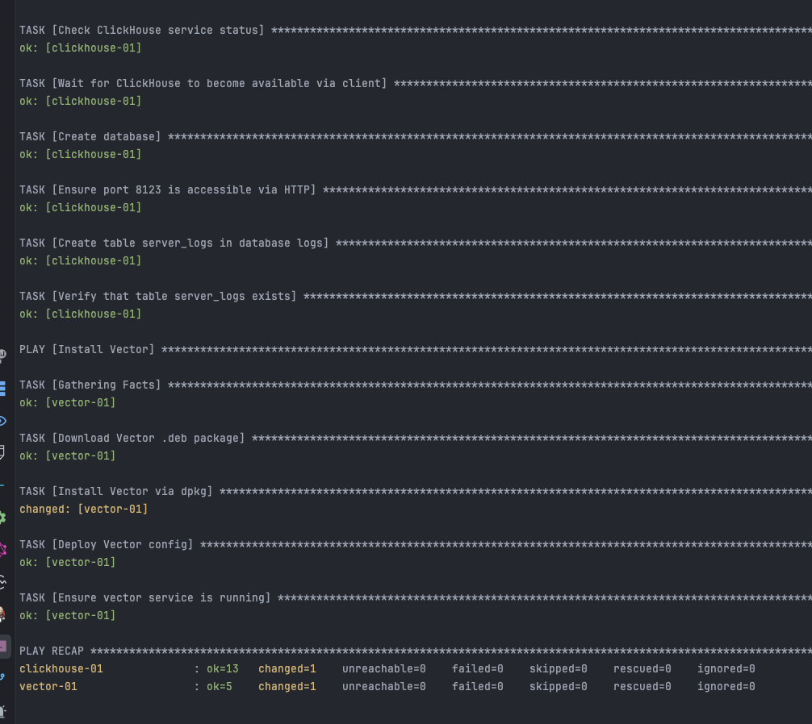
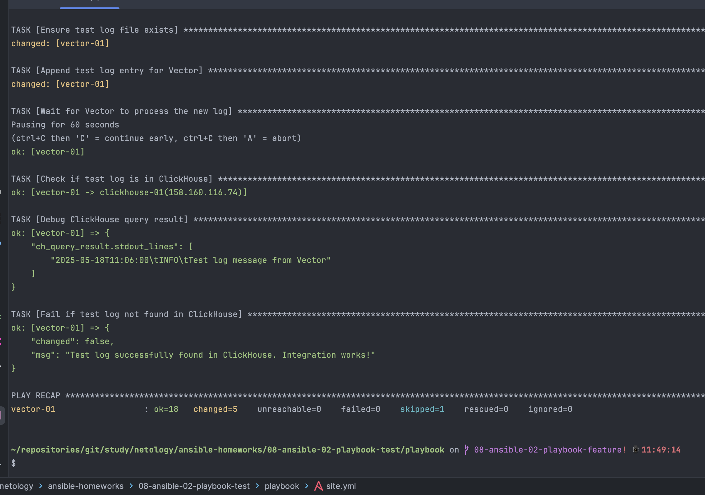
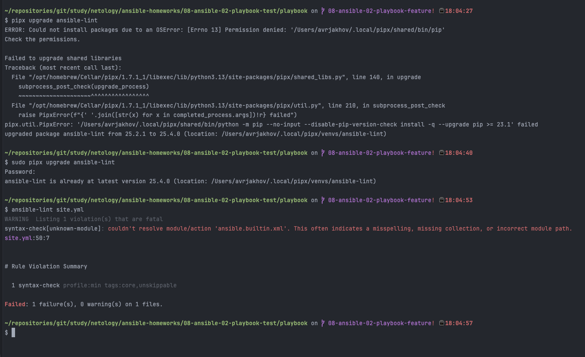
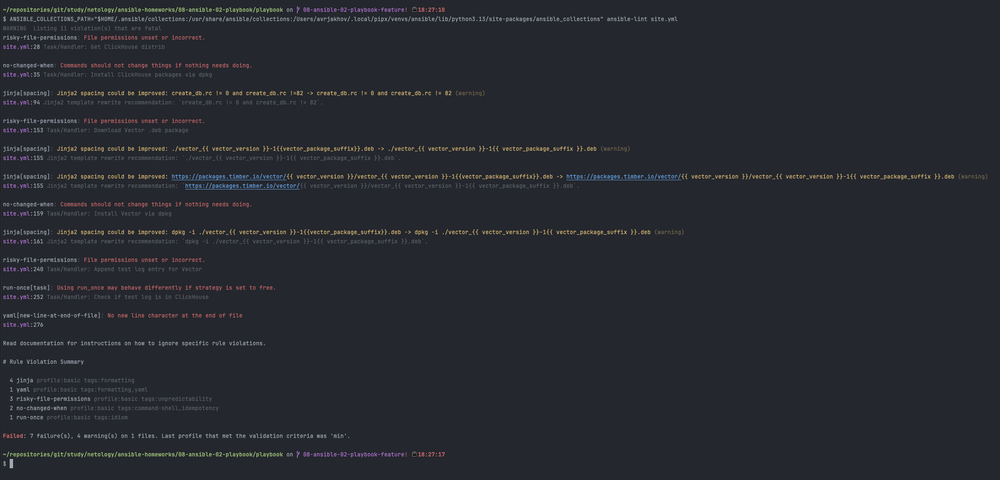
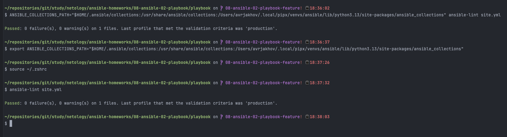

# Домашнее задание к занятию 2 «Работа с Playbook»

## Факутальтивный вопрос 1-ог
о занятия: 

1. Как называется режим работы в Ansible где можно интерактивно debug Ansible task?

### Ответ

Интерактивный режим работы, при котором можно отслеживать и анализировать цепочки возникновения технической и/или иной природы проблемы, называется отладкой. А в рамках терминологии Ansible - стратегией отладки.

Включить режим отладки можно на уровне playbook, задачи или глобально через конфигурацию.

На уровне задачи (task) в **playbook**:
```yml
- name: Example task with debugger
  debug:
  msg: "This is a debug message"
  debugger: on
```

На уровне конфигурации **ansible.cfg**

```editorconfig
[defaults]
enable_task_debugger = True
```

На уровне запуска **playbook** при включенном режиме **debugger** (_step_ - позволяет пошагово отладить процесс):

```bash
ansible-playbook playbook.yml --step
```

## Основная часть

1. Подготовьте свой inventory-файл `prod.yml`.
2. Допишите playbook: нужно сделать ещё один play, который устанавливает и настраивает [vector](https://vector.dev). Конфигурация vector должна деплоиться через template файл jinja2. От вас не требуется использовать все возможности шаблонизатора, просто вставьте стандартный конфиг в template файл. Информация по шаблонам по [ссылке](https://www.dmosk.ru/instruktions.php?object=ansible-nginx-install). не забудьте сделать handler на перезапуск vector в случае изменения конфигурации!
3. При создании tasks рекомендую использовать модули: `get_url`, `template`, `unarchive`, `file`.
4. Tasks должны: скачать дистрибутив нужной версии, выполнить распаковку в выбранную директорию, установить vector.
5. Запустите `ansible-lint site.yml` и исправьте ошибки, если они есть.
6. Попробуйте запустить playbook на этом окружении с флагом `--check`.
7. Запустите playbook на `prod.yml` окружении с флагом `--diff`. Убедитесь, что изменения на системе произведены.
8. Повторно запустите playbook с флагом `--diff` и убедитесь, что playbook идемпотентен.
9. Подготовьте README.md-файл по своему playbook. В нём должно быть описано: что делает playbook, какие у него есть параметры и теги. Пример качественной документации ansible playbook по [ссылке](https://github.com/opensearch-project/ansible-playbook). Так же приложите скриншоты выполнения заданий №5-8
10. Готовый playbook выложите в свой репозиторий, поставьте тег `08-ansible-02-playbook` на фиксирующий коммит, в ответ предоставьте ссылку на него.

### Ответ

1. Изменим **inventory** файл `prod.yml` так, что мы будем подключаться к удаленным ВМ на **Yandex Cloud**

Работаю без Terraform. На время выполнения задачи IP-адреса указаны явно без генерации

```yml
---
clickhouse:
    hosts:
        clickhouse-01:
            ansible_host: 158.160.116.74
            ansible_user: avryahov
vector:
    hosts:
        vector-01:
            ansible_host: 89.169.136.74
            ansible_user: avryahov
```

Переработал **playbook** `site.yml` с переменными так, чтобы скачивались deb-пакеты. Установка прошла успешно



Базы данных читаются. Запросы отрабатывают



2. Дополнил новым play-ем по загрузке, установки и развертке **Vector-а** c учетом новых требований, а также шаблона jinja2 конфигурации

```toml
[sources.test_logs]
type = "file"
include = ["/var/log/test.log"]
read_from = "beginning"

[transforms.parse_logs]
type = "remap"
inputs = ["test_logs"]
source = '''
parsed = parse_regex!(.message, r'^(?P<timestamp>[^ ]+) (?P<level>[A-Z]+): (?P<message>.+)$')
. = merge(., parsed)
'''

[sinks.clickhouse]
type = "clickhouse"
inputs = ["parse_logs"]
endpoint = "http://192.168.1.4:8123"
database = "logs"
table = "server_logs"
compression = "none"
skip_unknown_fields = true
healthcheck = true
```

Вектор запустился на втором хосте успешно. Однако были трудности



А именно настройка vector и clickhouse между собой. Пришлось в службе явно указывать ссылку на конфигурацию. Добавлять таймауты после рестарта сервиса



В итоге. Удалось связать. Отправка логов в БД успешно прошла

3. Фрагмент плейбука по вектору с учетом использования `get_url`, `template`, `unarchive` или `file`.

```yml
# === PLAY 2: Установка и настройка Vector ===
- name: Install Vector
  hosts: vector
  tags:
    - vector
      become: true

  # Хендлер: перезапуск vector при изменении конфига
  handlers:
    - name: Restart vector
      ansible.builtin.systemd:
      name: vector
      state: restarted
      enabled: true
      daemon_reload: true  # Важно: перечитать unit-файл перед рестартом

  tasks:
  # Скачиваем официальный .deb дистрибутив Vector
    - name: Download Vector .deb package
      ansible.builtin.get_url:
      url: "https://packages.timber.io/vector/{{ vector_version }}/vector_{{ vector_version }}-1{{vector_package_suffix}}.deb"
      dest: "./vector_{{ vector_version }}-1{{vector_package_suffix}}.deb"

  # Устанавливаем Vector
    - name: Install Vector via dpkg
      ansible.builtin.command:
      cmd: "dpkg -i ./vector_{{ vector_version }}-1{{vector_package_suffix}}.deb"
      register: dpkg_result
      until: dpkg_result is succeeded

  # Копируем конфигурационный файл из шаблона
    - name: Deploy Vector config
      ansible.builtin.template:
      src: templates/vector.toml.j2
      dest: /etc/vector/vector.toml
      mode: '0644'

  # Проверка наличия конфига перед валидацией
    - name: Ensure Vector config exists before restart
      ansible.builtin.stat:
      path: /etc/vector/vector.toml
      register: config_stat

  # Проверка корректности конфигурационного файла
    - name: Validate Vector config before restart
      ansible.builtin.command: "vector validate /etc/vector/vector.toml"
      changed_when: false
      ignore_errors: no
      when: config_stat.stat.exists
```

Как видно из фрагмента, а также исходных файлов можно отдельно поднимать плейбук по тегам. Ниже пример команды

```bash
ansible-playbook -i inventory/prod.yml site.yml -u avryahov --private-key=~/.ssh/id_ed25519 --tags=vector
```

5. С линковщиком проблемы были на макбуке. Во-первых ругался на `ansible.builtin.xml`. Заменил на установленный `community.general.xml`. Добавлял комментарий `# noqa syntax-check[unknown-module]`. Линковщику не почем. После апгрейда. Ситуация та же



После попробовал использовать явно указание коллекции и глобальную переменную. В итоге команда стала такой


```bash
ANSIBLE_COLLECTIONS_PATH="$HOME/.ansible/collections:/usr/share/ansible/collections:/Users/avrjakhov/.local/pipx/venvs/ansible/lib/python3.13/site-packages/ansible_collections" ansible-lint site.yml
```

Результат её работы ниже на снимке экрана. Куда лучше стало



После устранения всех проблем и предупреждений. Я экспортировал в настройки командной оболочки. Использование полного пути отпало. Утилита стала работать как надо



---
