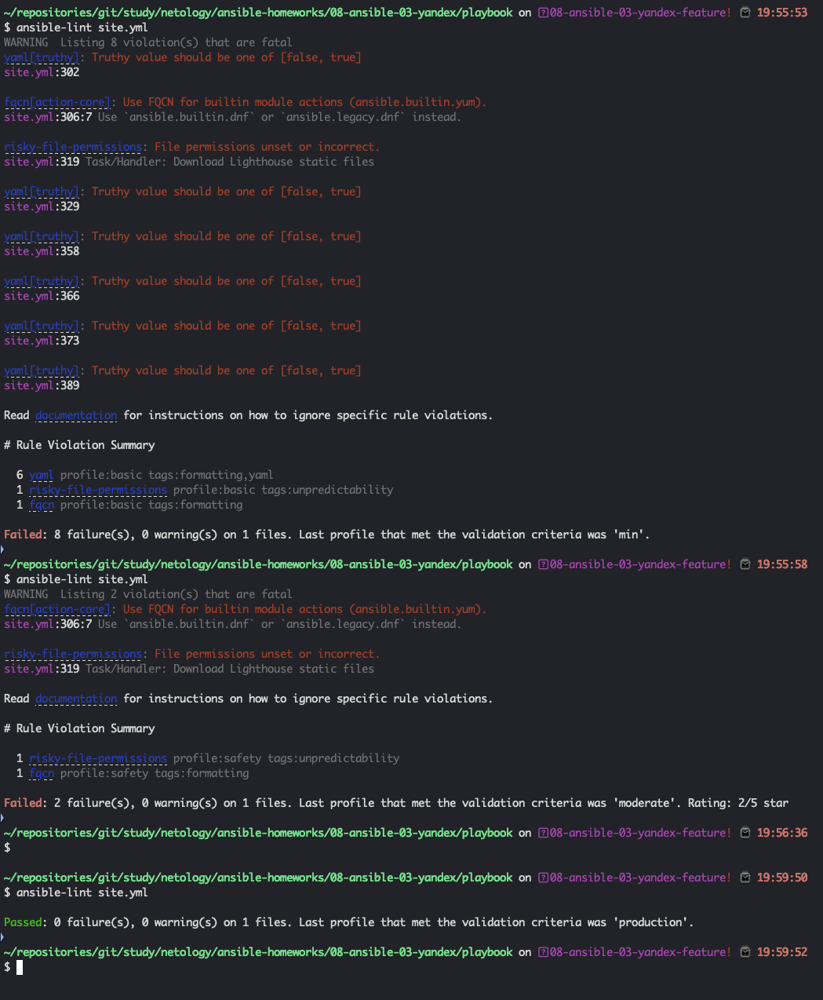
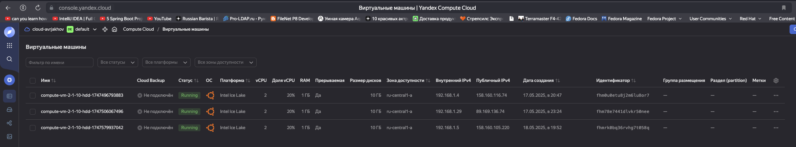
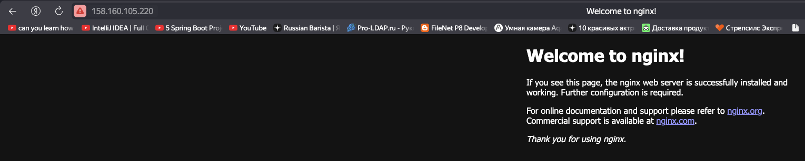
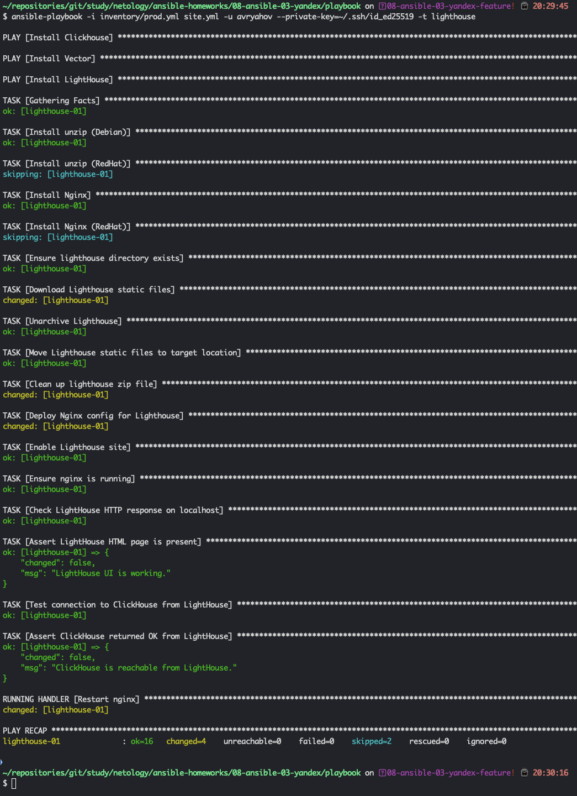
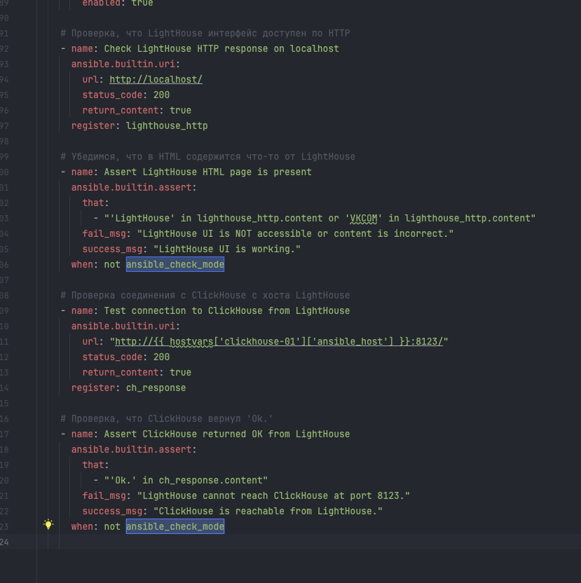
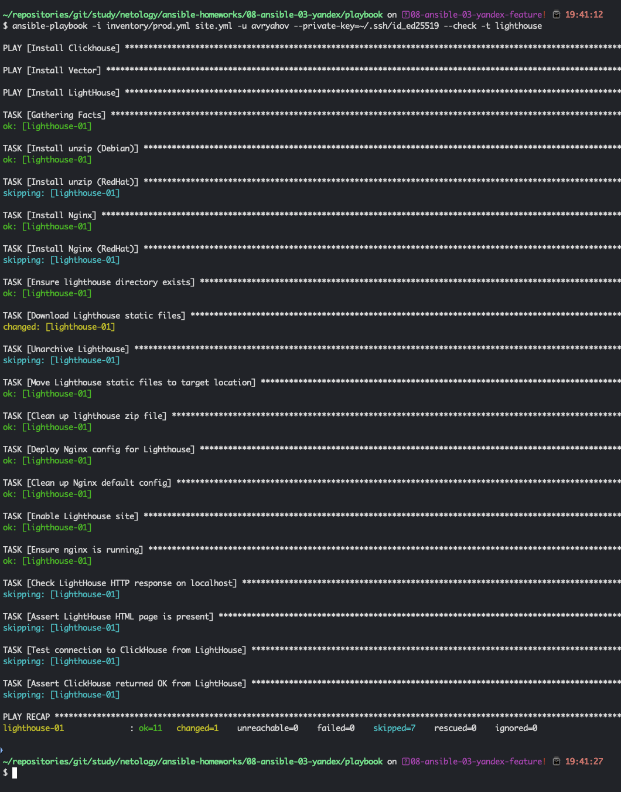
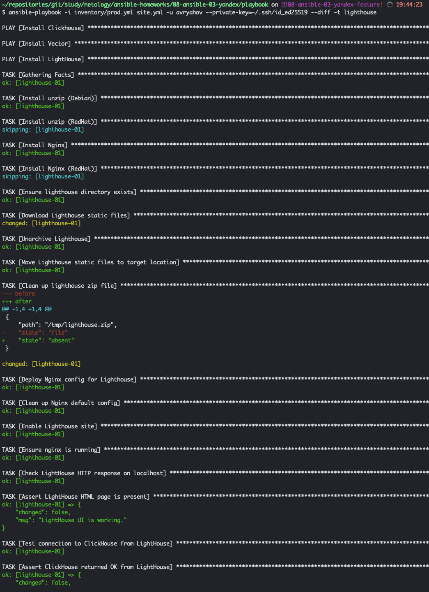

# Домашнее задание к занятию 3 «Использование Ansible»

## Подготовка к выполнению

1. Подготовьте в Yandex Cloud три хоста: для `clickhouse`, для `vector` и для `lighthouse`.
2. Репозиторий LightHouse находится [по ссылке](https://github.com/VKCOM/lighthouse).

## Основная часть

1. Допишите playbook: нужно сделать ещё один play, который устанавливает и настраивает LightHouse.
2. При создании tasks рекомендую использовать модули: `get_url`, `template`, `yum`, `apt`.
3. Tasks должны: скачать статику LightHouse, установить Nginx или любой другой веб-сервер, настроить его конфиг для открытия LightHouse, запустить веб-сервер.
4. Подготовьте свой inventory-файл `prod.yml`.
5. Запустите `ansible-lint site.yml` и исправьте ошибки, если они есть.
6. Попробуйте запустить playbook на этом окружении с флагом `--check`.
7. Запустите playbook на `prod.yml` окружении с флагом `--diff`. Убедитесь, что изменения на системе произведены.
8. Повторно запустите playbook с флагом `--diff` и убедитесь, что playbook идемпотентен.
9. Подготовьте README.md-файл по своему playbook. В нём должно быть описано: что делает playbook, какие у него есть параметры и теги.
10. Готовый playbook выложите в свой репозиторий, поставьте тег `08-ansible-03-yandex` на фиксирующий коммит, в ответ предоставьте ссылку на него.

---

### Ответ

1-4. Дописан новый `play` по запуску LightHouse. Как видно ниже, используется пакет Debian в пре-тасках, и отдельный хендлер для перезапуска сервиса

```yaml

# === PLAY 3: Установка и настройка LightHouse ===
- name: Install LightHouse
  hosts: lighthouse
  become: true
  tags:
    - lighthouse

  # Предзадачи
  pre_tasks:
  # Установка unzip
  - name: Install unzip (Debian)
    ansible.builtin.apt:
      name: unzip
      state: present
    when: ansible_os_family == 'Debian'

  - name: Install unzip (RedHat)
    ansible.builtin.dnf:
      name: unzip
      state: present
    when: ansible_os_family == 'RedHat'

  # Хендлер: перезапуск nginx при изменениях
  handlers:
    - name: Restart nginx
      ansible.builtin.service:
        name: nginx
        state: restarted

  tasks:
    # Установка nginx
    - name: Install Nginx
      ansible.builtin.apt:
        name: nginx
        state: present
        update_cache: true
      when: ansible_os_family == 'Debian'

    - name: Install Nginx (RedHat)
      ansible.builtin.dnf:
        name: nginx
        state: present
      when: ansible_os_family == 'RedHat'

    # Создание директории под Lighthouse
    - name: Ensure lighthouse directory exists
      ansible.builtin.file:
        path: "{{ lighthouse_dest }}"
        state: directory
        mode: '0755'

    # Скачиваем LightHouse из GitHub
    - name: Download Lighthouse static files
      ansible.builtin.get_url:
        url: "https://github.com/VKCOM/lighthouse/archive/refs/heads/{{ lighthouse_version }}.zip"
        dest: "/tmp/lighthouse.zip"
        mode: '0644'

    # Распаковываем
    - name: Unarchive Lighthouse
      ansible.builtin.unarchive:
        src: "/tmp/lighthouse.zip"
        dest: "/var/www"
        remote_src: true

    # Переименовываем директорию в стандартную
    - name: Move Lighthouse static files to target location
      ansible.builtin.command:
        cmd: mv /var/www/lighthouse-{{ lighthouse_version }} {{ lighthouse_dest }}
      args:
        creates: "{{ lighthouse_dest }}"

    # Удаляем zip-архив
    - name: Clean up lighthouse zip file
      ansible.builtin.file:
        path: /tmp/lighthouse.zip
        state: absent

    # Копируем конфиг nginx
    - name: Deploy Nginx config for Lighthouse
      ansible.builtin.template:
        src: templates/lighthouse-nginx.conf.j2
        dest: /etc/nginx/sites-available/lighthouse.conf
        mode: '0644'

    # Удаляем конфиг nginx по умолчанию
    - name: Clean up Nginx default config
      ansible.builtin.file:
        path: /etc/nginx/sites-enabled/default
        state: absent

    # Ссылка в sites-enabled
    - name: Enable Lighthouse site
      ansible.builtin.file:
        src: /etc/nginx/sites-available/lighthouse.conf
        dest: /etc/nginx/sites-enabled/lighthouse.conf
        state: link
        force: true
      notify: Restart nginx

    # Убедимся, что nginx запущен
    - name: Ensure nginx is running
      ansible.builtin.service:
        name: nginx
        state: started
        enabled: true

    # Проверка, что LightHouse интерфейс доступен по HTTP
    - name: Check LightHouse HTTP response on localhost
      ansible.builtin.uri:
        url: http://localhost/
        status_code: 200
        return_content: true
      register: lighthouse_http

    # Убедимся, что в HTML содержится что-то от LightHouse
    - name: Assert LightHouse HTML page is present
      ansible.builtin.assert:
        that:
          - "'LightHouse' in lighthouse_http.content or 'VKCOM' in lighthouse_http.content"
        fail_msg: "LightHouse UI is NOT accessible or content is incorrect."
        success_msg: "LightHouse UI is working."

    # Проверка соединения с ClickHouse с хоста LightHouse
    - name: Test connection to ClickHouse from LightHouse
      ansible.builtin.uri:
        url: "http://{{ hostvars['clickhouse-01']['ansible_host'] }}:8123/"
        status_code: 200
        return_content: true
      register: ch_response

    # Проверка, что ClickHouse вернул 'Ok.'
    - name: Assert ClickHouse returned OK from LightHouse
      ansible.builtin.assert:
        that:
          - "'Ok.' in ch_response.content"
        fail_msg: "LightHouse cannot reach ClickHouse at port 8123."
        success_msg: "ClickHouse is reachable from LightHouse."
```

5. С помощью линковки проверили на валидность. Исправили ошибки
ª


Снимок ВМ в облаке Яндекса



Запуск **Nginx** на хосте



Успешное поднятие по тэгу LightHouse на удаленном хосте 



Повторно создал новые виртуальные машины, так как не делал снимки чека и дифа изначально. Текущий плей дополнил, чтобы обоходить чек



6. Чек `--check` прошел



7-8. Дважды запускал сверку `--diff`. Оба раз идентично поведение



### Как оформить решение задания

Выполненное домашнее задание пришлите в виде ссылки на .md-файл в вашем репозитории.

---