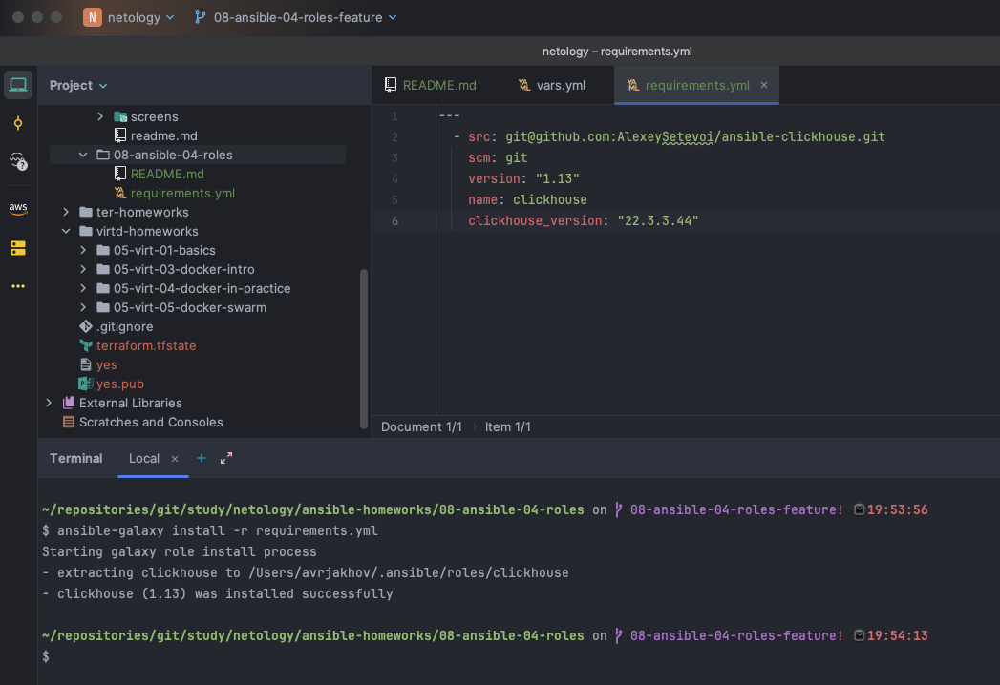
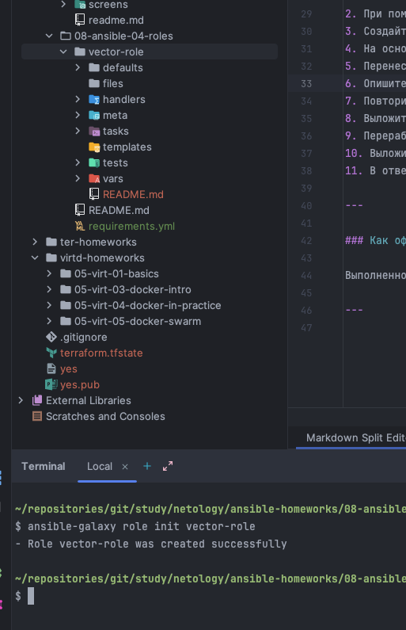
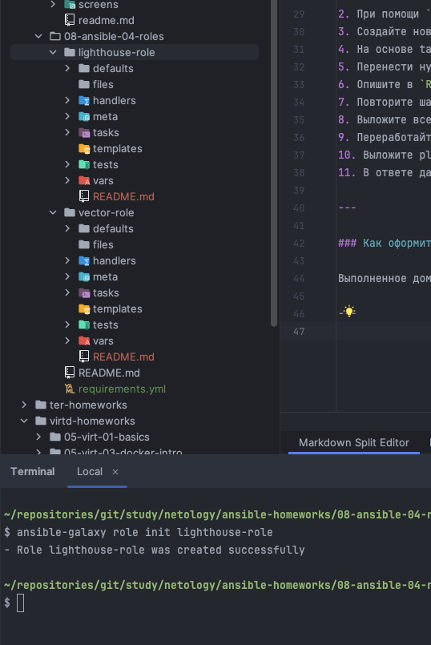
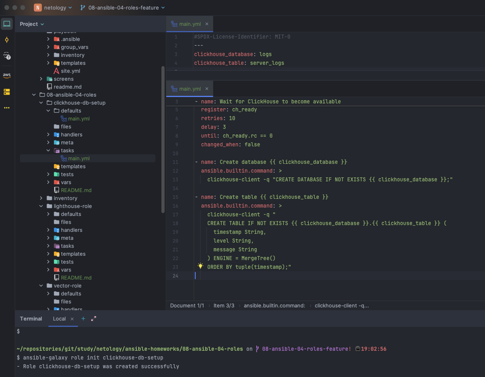
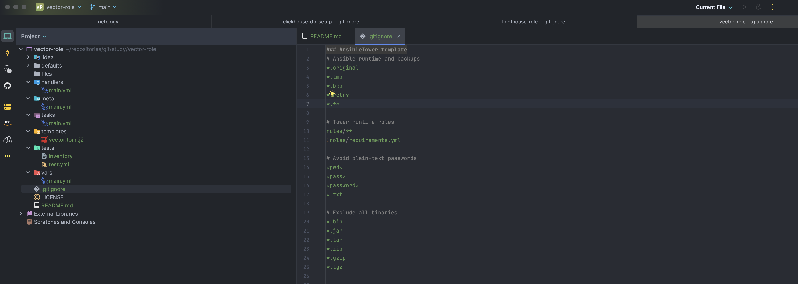
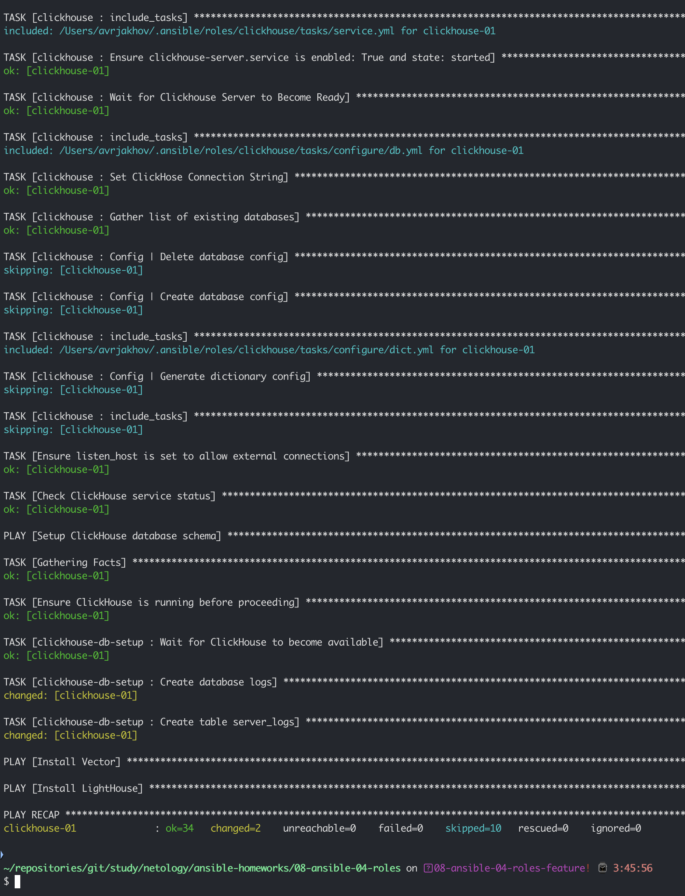
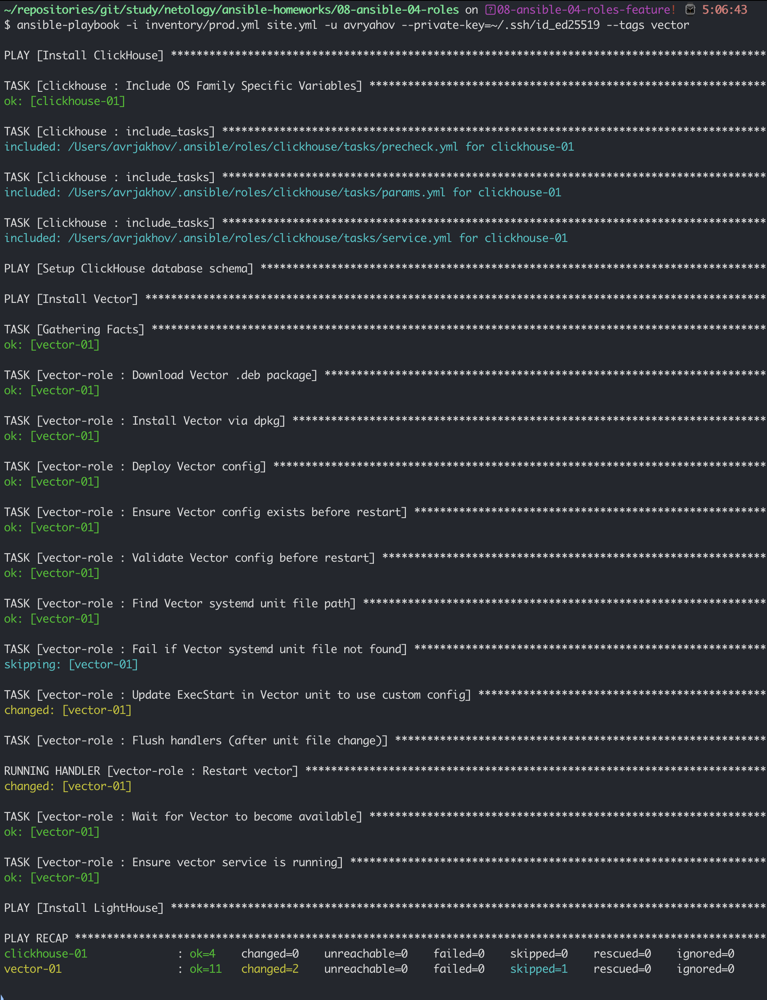
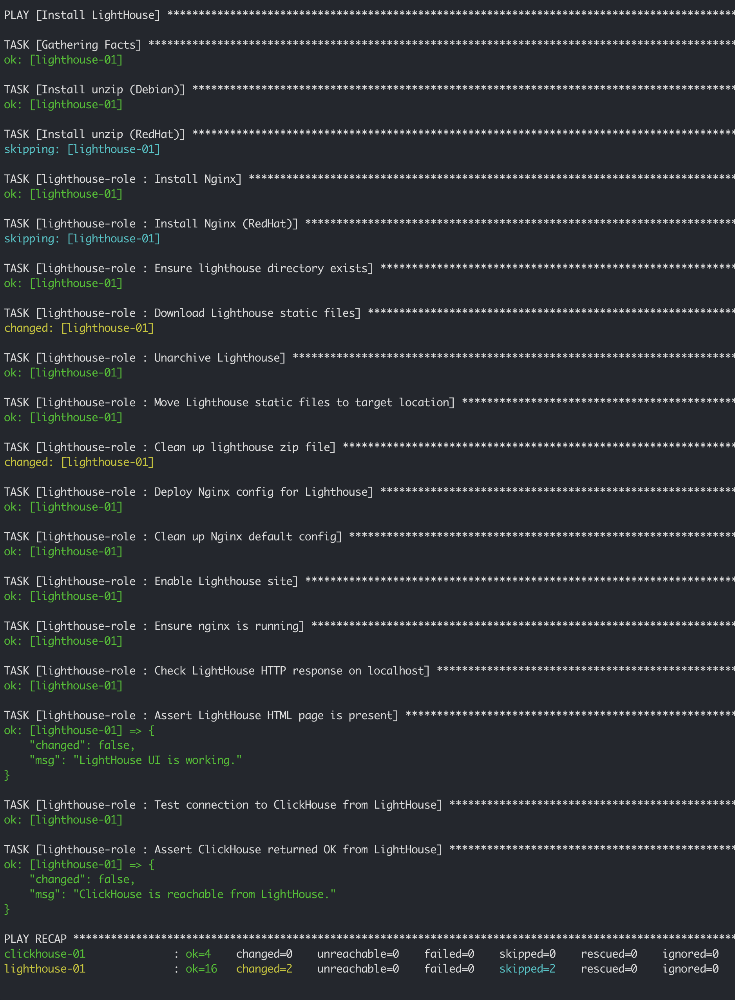
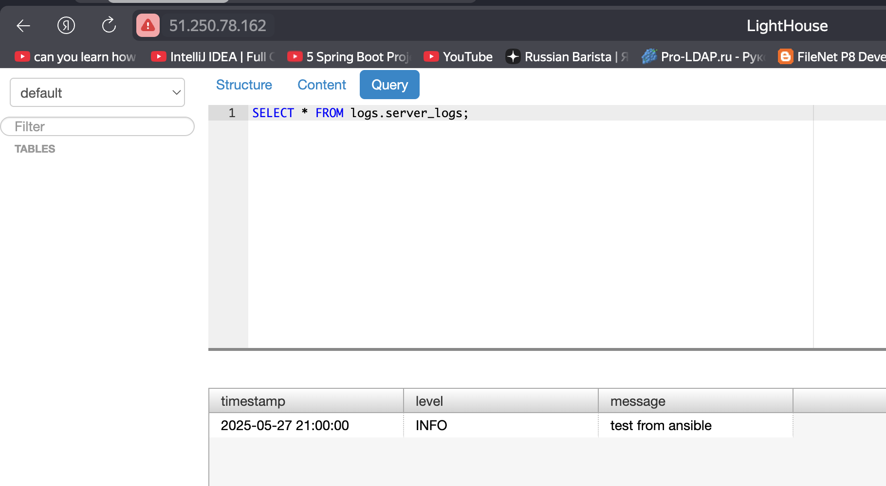

# Домашнее задание к занятию 4 «Работа с roles»

## Подготовка к выполнению

1. * Необязательно. Познакомьтесь с [LightHouse](https://youtu.be/ymlrNlaHzIY?t=929).
2. Создайте два пустых публичных репозитория в любом своём проекте: vector-role и lighthouse-role.
3. Добавьте публичную часть своего ключа к своему профилю на GitHub.

## Основная часть

Ваша цель — разбить ваш playbook на отдельные roles.

Задача — сделать roles для ClickHouse, Vector и LightHouse и написать playbook для использования этих ролей.

Ожидаемый результат — существуют три ваших репозитория: два с roles и один с playbook.

**Что нужно сделать**

1. Создайте в старой версии playbook файл `requirements.yml` и заполните его содержимым:

   ```yaml
   ---
     - src: git@github.com:AlexeySetevoi/ansible-clickhouse.git
       scm: git
       version: "1.13"
       name: clickhouse 
   ```
2. При помощи `ansible-galaxy` скачайте себе эту роль.
3. Создайте новый каталог с ролью при помощи `ansible-galaxy role init vector-role`.
4. На основе tasks из старого playbook заполните новую role. Разнесите переменные между `vars` и `default`.
5. Перенести нужные шаблоны конфигов в `templates`.
6. Опишите в `README.md` обе роли и их параметры. Пример качественной документации ansible role [по ссылке](https://github.com/cloudalchemy/ansible-prometheus).
7. Повторите шаги 3–6 для LightHouse. Помните, что одна роль должна настраивать один продукт.
8. Выложите все roles в репозитории. Проставьте теги, используя семантическую нумерацию. Добавьте roles в `requirements.yml` в playbook.
9. Переработайте playbook на использование roles. Не забудьте про зависимости LightHouse и возможности совмещения `roles` с `tasks`.
10. Выложите playbook в репозиторий.
11. В ответе дайте ссылки на оба репозитория с roles и одну ссылку на репозиторий с playbook.

---

### Ответ

1,8. Документ обновлен с учетом новых ролей

```yaml
---
  - src: git@github.com:AlexeySetevoi/ansible-clickhouse.git
    scm: git
    version: "1.13"
    name: clickhouse
    clickhouse_version: "22.3.3.44"

  - src: git@github.com:avryahov/clickhouse-db-setup.git
    scm: git
    version: "0.0.1"
    name: clickhouse-db-setup

  - src: git@github.com:avryahov/vector-role.git
    scm: git
    version: "0.0.1"
    name: vector-role

  - src: git@github.com:avryahov/lighthouse-role.git
    scm: git
    version: "0.0.1"
    name: lighthouse-role
```

2. Роль загружена



3-6. Подготовлена `vector-role`



7. Подготовлена `lightHouse-role`



Отдельно вынес создание базы данных и таблицы в отдельную роль `clickhouse-db-setup`

 

Отдельно запушил в гитхаб репозитории по ролям




9. В итоге новый плейбук с пре- и пост- задачами, переменными, тэгами и ролями

Проверили отдельно каждый плей по тэгам











Всё работает штатно




---
