# Домашнее задание к занятию 7 «Жизненный цикл ПО»

## Подготовка к выполнению

1. Получить бесплатную версию Jira - https://www.atlassian.com/ru/software/jira/work-management/free (скопируйте ссылку в адресную строку). Вы можете воспользоваться любым(в том числе бесплатным vpn сервисом) если сайт у вас недоступен. Кроме того вы можете скачать [docker образ](https://hub.docker.com/r/atlassian/jira-software/#) и запустить на своем хосте self-managed версию jira.
2. Настроить её для своей команды разработки.
3. Создать доски Kanban и Scrum.
4. [Дополнительные инструкции от разработчика Jira](https://support.atlassian.com/jira-cloud-administration/docs/import-and-export-issue-workflows/).

## Основная часть

Необходимо создать собственные workflow для двух типов задач: bug и остальные типы задач. Задачи типа bug должны проходить жизненный цикл:

1. Open -> On reproduce.
2. On reproduce -> Open, Done reproduce.
3. Done reproduce -> On fix.
4. On fix -> On reproduce, Done fix.
5. Done fix -> On test.
6. On test -> On fix, Done.
7. Done -> Closed, Open.

Остальные задачи должны проходить по упрощённому workflow:

1. Open -> On develop.
2. On develop -> Open, Done develop.
3. Done develop -> On test.
4. On test -> On develop, Done.
5. Done -> Closed, Open.

**Что нужно сделать**

1. Создайте задачу с типом bug, попытайтесь провести его по всему workflow до Done.
2. Создайте задачу с типом epic, к ней привяжите несколько задач с типом task, проведите их по всему workflow до Done.
3. При проведении обеих задач по статусам используйте kanban.
4. Верните задачи в статус Open.
5. Перейдите в Scrum, запланируйте новый спринт, состоящий из задач эпика и одного бага, стартуйте спринт, проведите задачи до состояния Closed. Закройте спринт.
6. Если всё отработалось в рамках ожидания — выгрузите схемы workflow для импорта в XML. Файлы с workflow и скриншоты workflow приложите к решению задания.

---

### Ответ

С помощью `docker compose` поднял Jira на macbook-е личном

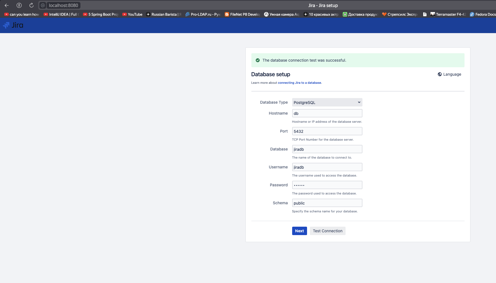

Использовал `postgres` в качестве базы данных

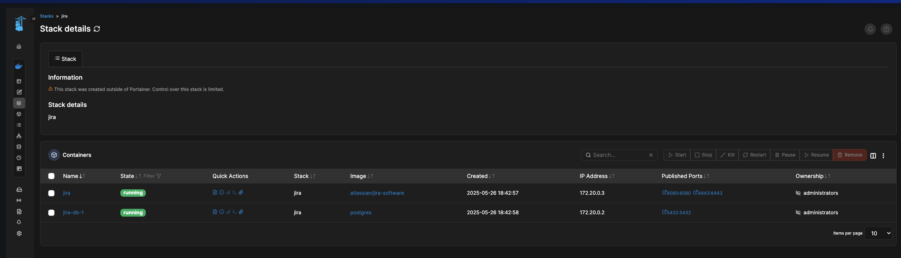

Создал два проекта отдельно для `Kanban-доски` и отдельно `Scrum` с нарезкой задач на спринты

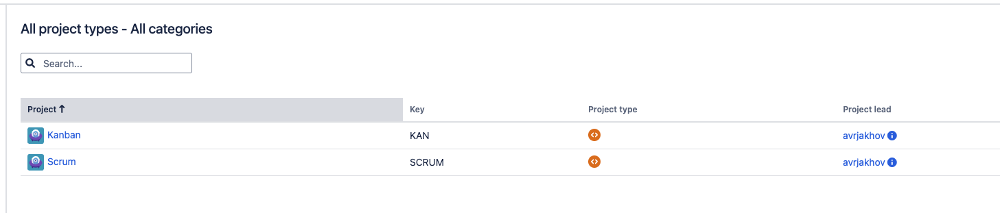

Создал **рабочий процесс** для работы с багами

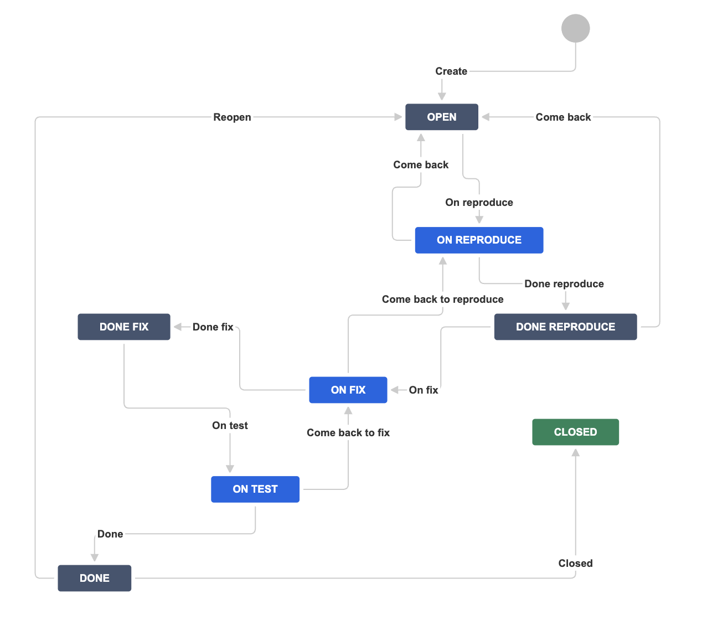

Создал **рабочий процесс** для работы с трекингом базовых задач

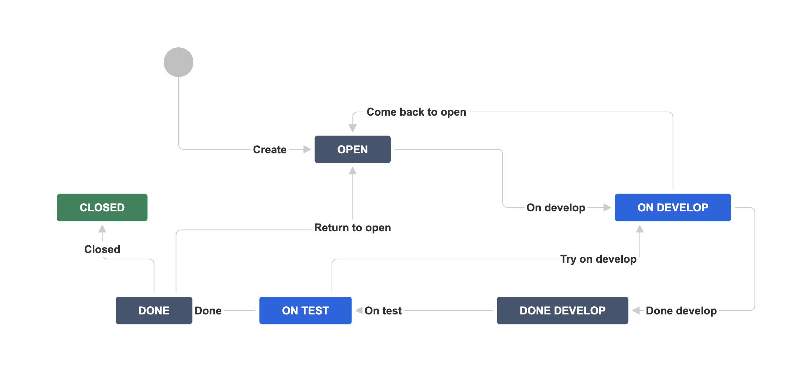

Привязал **рабочие процессы** к проектам через **схемы**

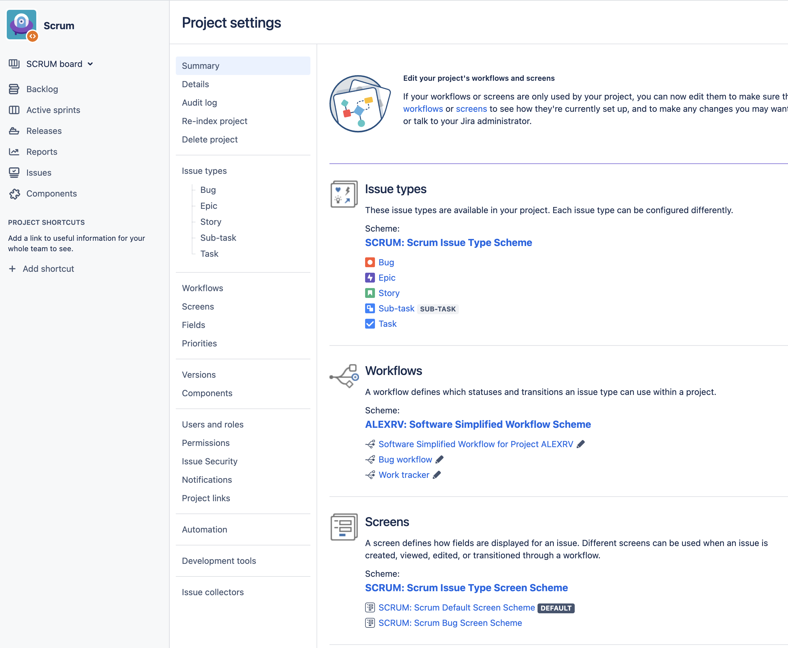

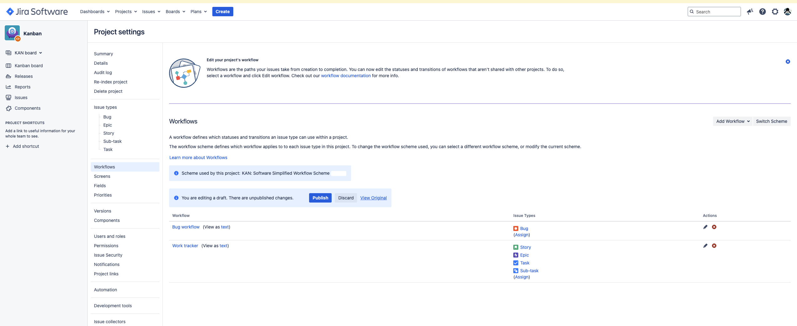

1. Переделал доску `Kanban`, а именно докинул в текущие колонки статусы из наших **workflow**

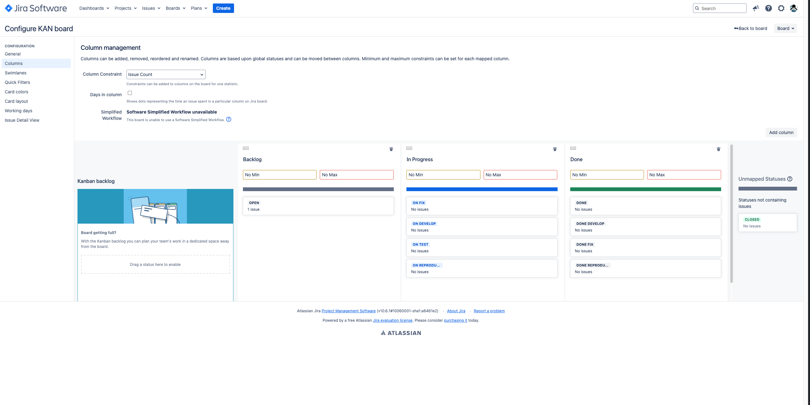

Создал задачу с типом **bug** 

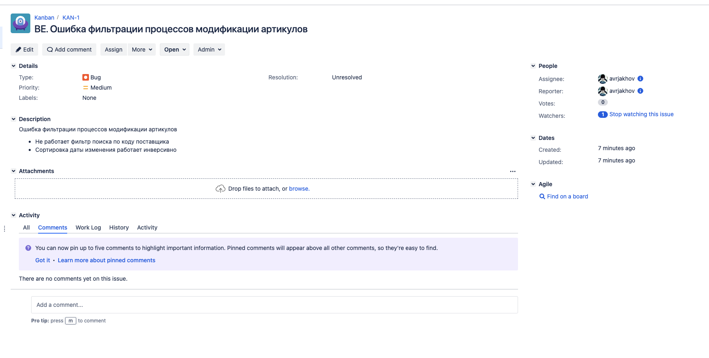

По итогу `Kanban-доска` выглядит так

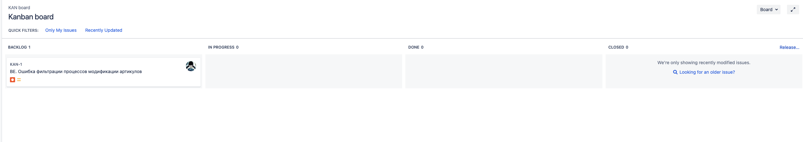

Прогнал задачу по всем статусам до статуса `Done`

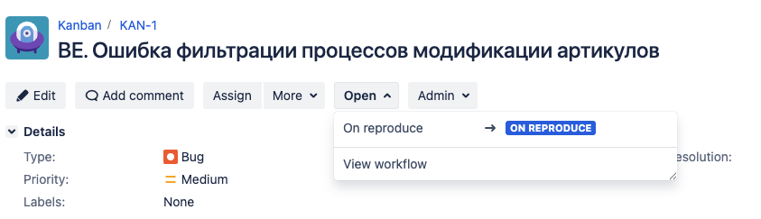

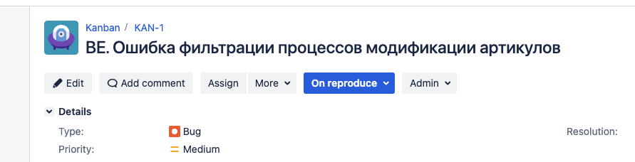

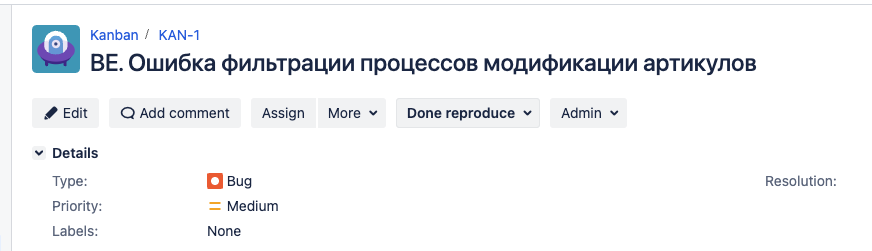

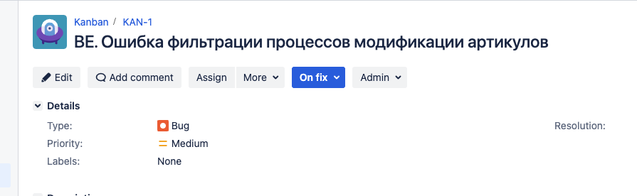

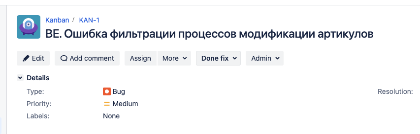

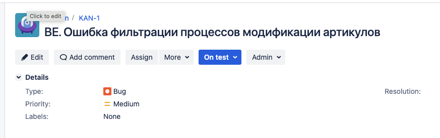

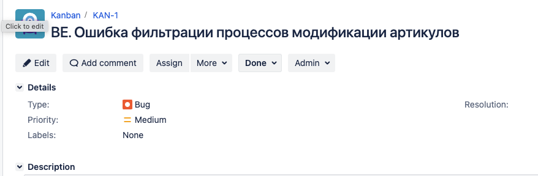

По итогу `Kanban-доска` выглядит так

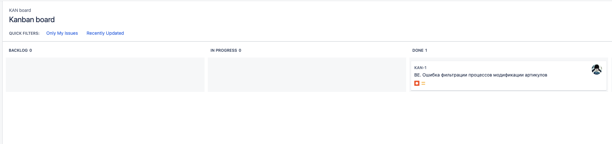

Не стал под каждый статус создавать колонку в доске для отчетности и прозрачности!

2. Создайте задачу с типом epic, к ней привяжите несколько задач с типом task, проведите их по всему workflow до Done.
3. При проведении обеих задач по статусам используйте kanban.
4. Верните задачи в статус Open.
5. Перейдите в Scrum, запланируйте новый спринт, состоящий из задач эпика и одного бага, стартуйте спринт, проведите задачи до состояния Closed. Закройте спринт.
6. Если всё отработалось в рамках ожидания — выгрузите схемы workflow для импорта в XML. Файлы с workflow и скриншоты workflow приложите к решению задания.