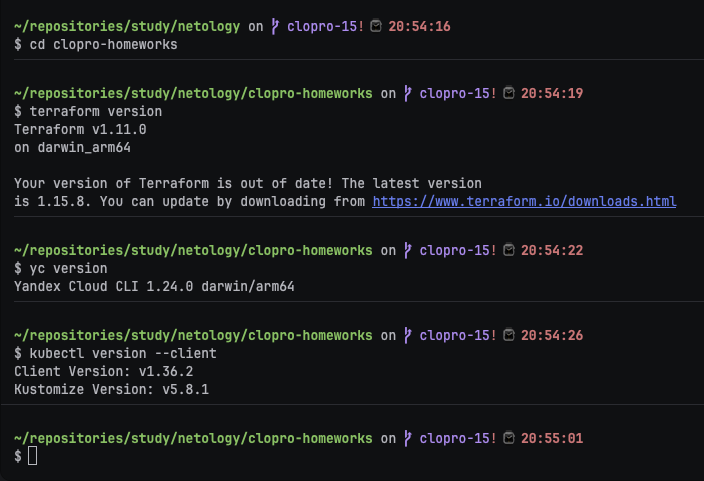
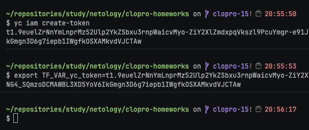
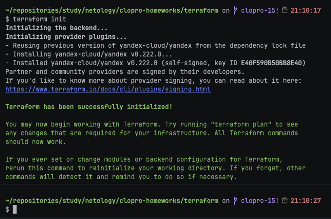
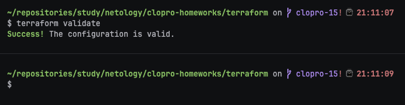
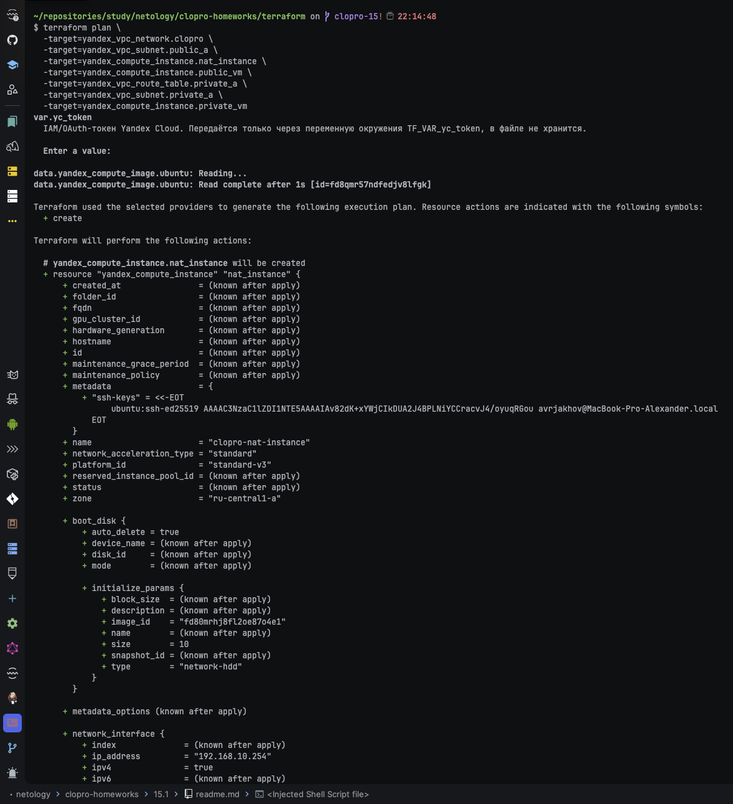
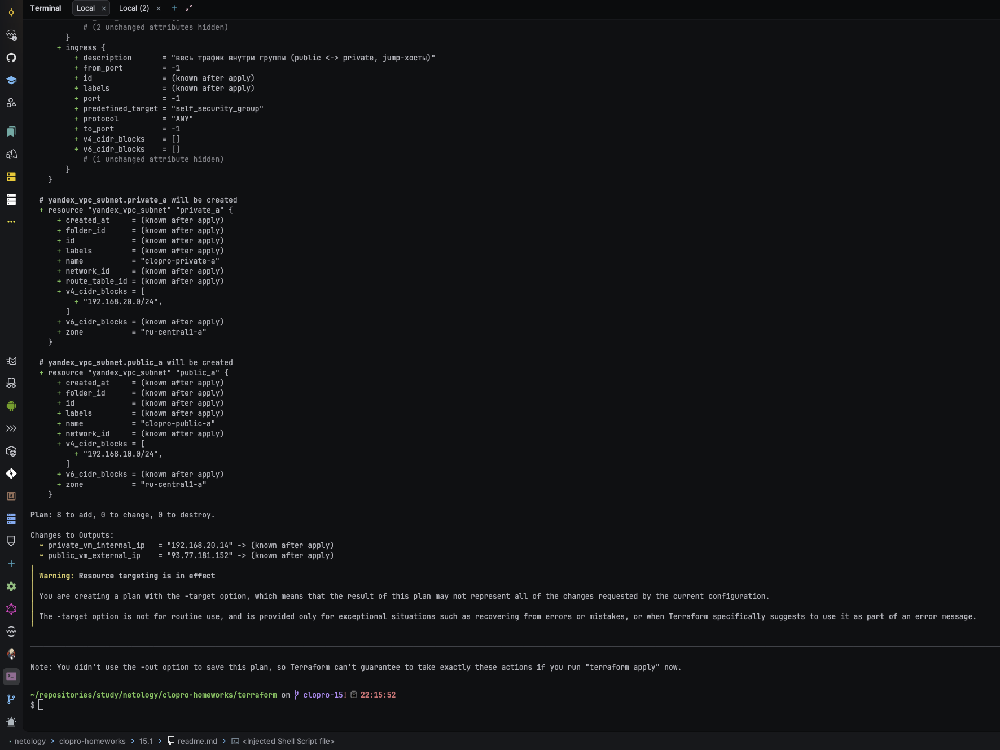
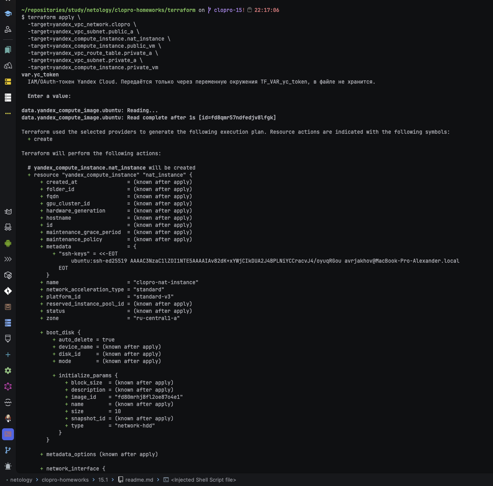
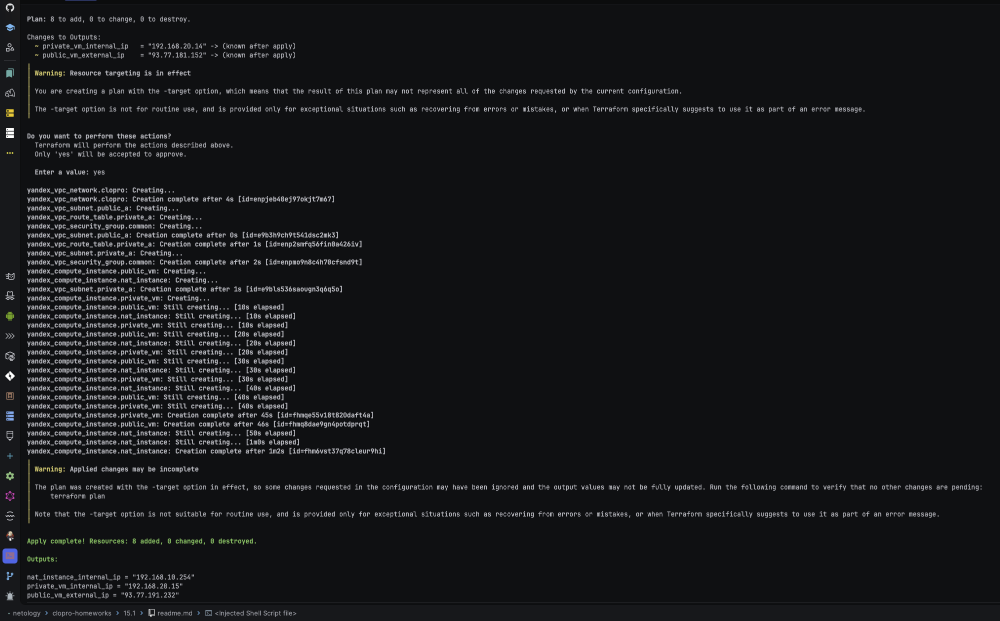
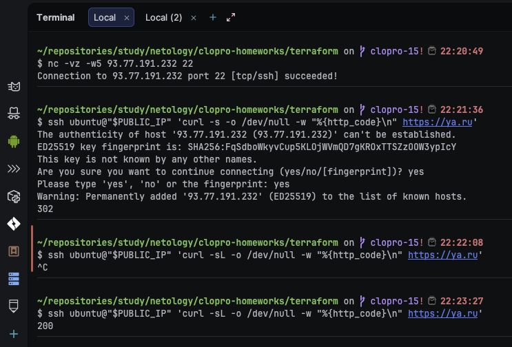
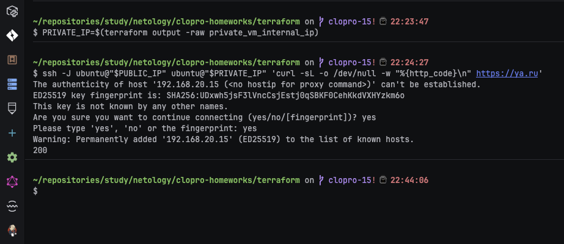

# Домашнее задание к занятию «Организация сети»

### Подготовка к выполнению задания

1. Домашнее задание состоит из обязательной части, которую нужно выполнить на провайдере Yandex Cloud, и дополнительной части в AWS (выполняется по желанию).
2. Все домашние задания в блоке 15 связаны друг с другом и в конце представляют пример законченной инфраструктуры.
3. Все задания нужно выполнить с помощью Terraform. Результатом выполненного домашнего задания будет код в репозитории.
4. Перед началом работы настройте доступ к облачным ресурсам из Terraform, используя материалы прошлых лекций и домашнее задание по теме «Облачные провайдеры и синтаксис Terraform». Заранее выберите регион (в случае AWS) и зону.

---
### Задание 1. Yandex Cloud

**Что нужно сделать**

1. Создать пустую VPC. Выбрать зону.
2. Публичная подсеть.

 - Создать в VPC subnet с названием public, сетью 192.168.10.0/24.
 - Создать в этой подсети NAT-инстанс, присвоив ему адрес 192.168.10.254. В качестве image_id использовать fd80mrhj8fl2oe87o4e1.
 - Создать в этой публичной подсети виртуалку с публичным IP, подключиться к ней и убедиться, что есть доступ к интернету.
3. Приватная подсеть.
 - Создать в VPC subnet с названием private, сетью 192.168.20.0/24.
 - Создать route table. Добавить статический маршрут, направляющий весь исходящий трафик private сети в NAT-инстанс.
 - Создать в этой приватной подсети виртуалку с внутренним IP, подключиться к ней через виртуалку, созданную ранее, и убедиться, что есть доступ к интернету.

Resource Terraform для Yandex Cloud:

- [VPC subnet](https://registry.terraform.io/providers/yandex-cloud/yandex/latest/docs/resources/vpc_subnet).
- [Route table](https://registry.terraform.io/providers/yandex-cloud/yandex/latest/docs/resources/vpc_route_table).
- [Compute Instance](https://registry.terraform.io/providers/yandex-cloud/yandex/latest/docs/resources/compute_instance).

### Ответ:

Всю сеть, NAT-инстанс и обе ВМ описал в [`../terraform/network.tf`](../terraform/network.tf) и
[`../terraform/security-groups.tf`](../terraform/security-groups.tf). NAT-инстанс получает
фиксированный внутренний адрес 192.168.10.254 из образа `fd80mrhj8fl2oe87o4e1`, приватная подсеть
маршрутизирует весь исходящий трафик на этот адрес через отдельную route table.

На каждом сетевом интерфейсе, помимо своей security group, дополнительно подключаю
`yandex_vpc_network.clopro.default_security_group_id` — автосозданную default security group
сети. При первом прогоне с одной только кастомной SG внешний SSH (порт 22) не проходил, хотя
правило было заведено верно и привязано к интерфейсу (проверил `yc vpc security-group get` —
правило `INGRESS TCP 22 0.0.0.0/0` на месте, ICMP через ту же SG при этом ходил). В более ранних
домашних заданиях блока ([ter-homeworks/03](../../ter-homeworks/03/hw-03.md),
[virtd docker-swarm](../../virtd-homeworks/05-virt-05-docker-swarm/task1/src/terraform/nodes.tf))
`security_group_ids` вообще не указывался — туда штатно заходил Ansible по SSH через default SG
сети. Добавил default SG дополнительно к своей — это и разблокировало SSH.

---

#### Шаг 1. Проверка локальных инструментов

```bash
cd clopro-homeworks
terraform version
yc version
kubectl version --client
```



Проверяю, что terraform, yc и kubectl вообще стоят — они понадобятся во всех четырёх занятиях
блока.

---

#### Шаг 2. Получение и экспорт токена Yandex Cloud

```bash
yc iam create-token
```

Копирую напечатанный токен и экспортирую его в переменную окружения текущего терминала — Terraform
подхватит её как `var.yc_token`:

```bash
export TF_VAR_yc_token="<вставленный токен>"
```

Сам токен на скриншот не попадает — на скрин идёт только проверка, что переменная непустая:

```bash
echo "TF_VAR_yc_token length: ${#TF_VAR_yc_token}"
```



Токен живёт только в переменной окружения текущего терминала, в файлы проекта не попадает и
действует около 12 часов — на новой сессии команду `yc iam create-token` + `export` нужно повторить.

---

#### Шаг 3. terraform init

`terraform/terraform.tfvars` уже заполнен (см. подготовку перед 15.1: скопирован из
`terraform.tfvars.example`, вписаны `ssh_public_key_path` и `student_bucket_name` — секретов там
нет, `cloud_id`/`folder_id` не требуют маскировки).

```bash
cd terraform
terraform init
```



---

#### Шаг 4. terraform validate

```bash
terraform validate
```



---

#### Шаг 5. Проверка плана только для ресурсов сети

```bash
terraform plan \
  -target=yandex_vpc_network.clopro \
  -target=yandex_vpc_subnet.public_a \
  -target=yandex_compute_instance.nat_instance \
  -target=yandex_compute_instance.public_vm \
  -target=yandex_vpc_route_table.private_a \
  -target=yandex_vpc_subnet.private_a \
  -target=yandex_compute_instance.private_vm
```





Ограничиваю план `-target`, чтобы на этом занятии применились только ресурсы сети — остальной
код (бакет, кластеры) уже лежит в проекте, но появится в инфраструктуре только на своих занятиях.

---

#### Шаг 6. terraform apply

```bash
terraform apply \
  -target=yandex_vpc_network.clopro \
  -target=yandex_vpc_subnet.public_a \
  -target=yandex_compute_instance.nat_instance \
  -target=yandex_compute_instance.public_vm \
  -target=yandex_vpc_route_table.private_a \
  -target=yandex_vpc_subnet.private_a \
  -target=yandex_compute_instance.private_vm
```





---

#### Шаг 7. Проверка публичной ВМ

```bash
PUBLIC_IP=$(terraform output -raw public_vm_external_ip)
ssh ubuntu@"$PUBLIC_IP" 'curl -s -o /dev/null -w "%{http_code}\n" https://ya.ru'
```



Код `200` подтверждает, что публичная ВМ ходит в интернет напрямую через свой публичный IP.

---

#### Шаг 8. Проверка приватной ВМ через NAT-инстанс

```bash
PRIVATE_IP=$(terraform output -raw private_vm_internal_ip)
ssh -J ubuntu@"$PUBLIC_IP" ubuntu@"$PRIVATE_IP" 'curl -s -o /dev/null -w "%{http_code}\n" https://ya.ru'
```



Подключаюсь к приватной ВМ через публичную как jump-хост (`-J`, у приватной ВМ нет собственного
публичного IP). Код `200` подтверждает, что весь исходящий трафик приватной подсети действительно
идёт через NAT-инстанс с адресом 192.168.10.254 — маршрут в route table работает.

---
### Задание 2. AWS* (задание со звёздочкой)

Это необязательное задание. Его выполнение не влияет на получение зачёта по домашней работе.

**Что нужно сделать**

1. Создать пустую VPC с подсетью 10.10.0.0/16.
2. Публичная подсеть.

 - Создать в VPC subnet с названием public, сетью 10.10.1.0/24.
 - Разрешить в этой subnet присвоение public IP по-умолчанию.
 - Создать Internet gateway.
 - Добавить в таблицу маршрутизации маршрут, направляющий весь исходящий трафик в Internet gateway.
 - Создать security group с разрешающими правилами на SSH и ICMP. Привязать эту security group на все, создаваемые в этом ДЗ, виртуалки.
 - Создать в этой подсети виртуалку и убедиться, что инстанс имеет публичный IP. Подключиться к ней, убедиться, что есть доступ к интернету.
 - Добавить NAT gateway в public subnet.
3. Приватная подсеть.
 - Создать в VPC subnet с названием private, сетью 10.10.2.0/24.
 - Создать отдельную таблицу маршрутизации и привязать её к private подсети.
 - Добавить Route, направляющий весь исходящий трафик private сети в NAT.
 - Создать виртуалку в приватной сети.
 - Подключиться к ней по SSH по приватному IP через виртуалку, созданную ранее в публичной подсети, и убедиться, что с виртуалки есть выход в интернет.

Resource Terraform:

1. [VPC](https://registry.terraform.io/providers/hashicorp/aws/latest/docs/resources/vpc).
1. [Subnet](https://registry.terraform.io/providers/hashicorp/aws/latest/docs/resources/subnet).
1. [Internet Gateway](https://registry.terraform.io/providers/hashicorp/aws/latest/docs/resources/internet_gateway).

### Ответ:

Задание со звёздочкой, необязательное — не влияет на зачёт, не выполнялось.

### Правила приёма работы

Домашняя работа оформляется в своём Git репозитории в файле README.md. Выполненное домашнее задание пришлите ссылкой на .md-файл в вашем репозитории.
Файл README.md должен содержать скриншоты вывода необходимых команд, а также скриншоты результатов.
Репозиторий должен содержать тексты манифестов или ссылки на них в файле README.md.
