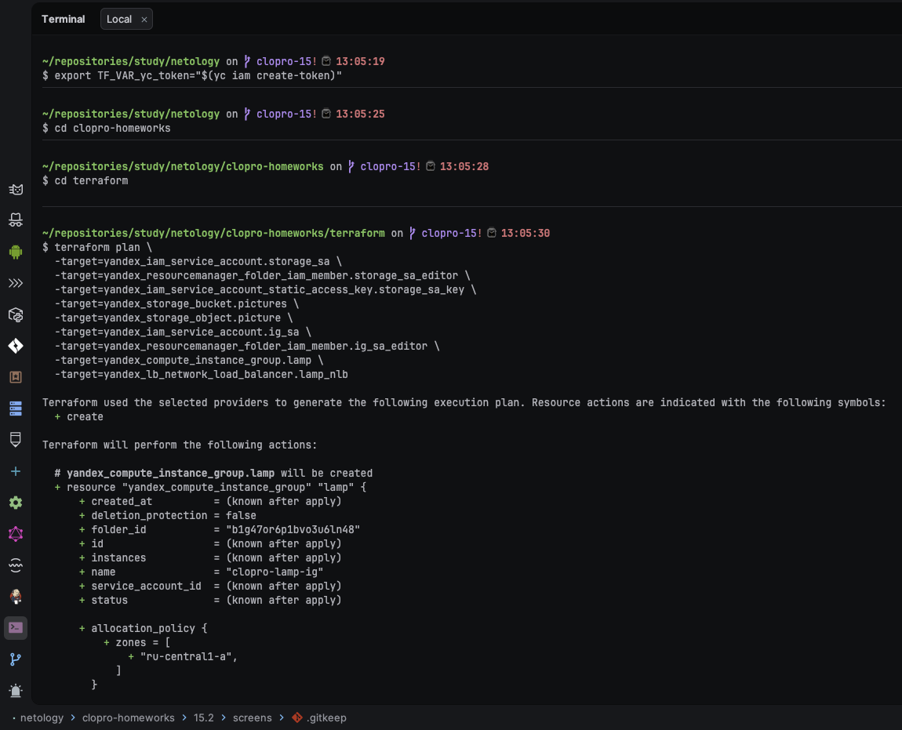
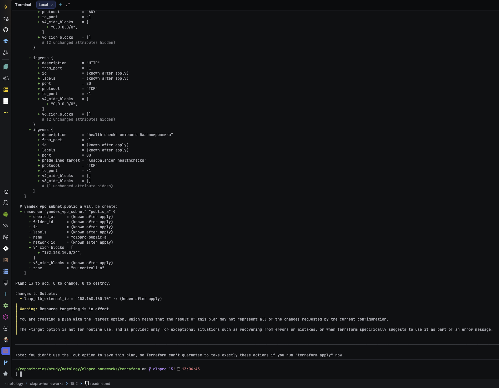
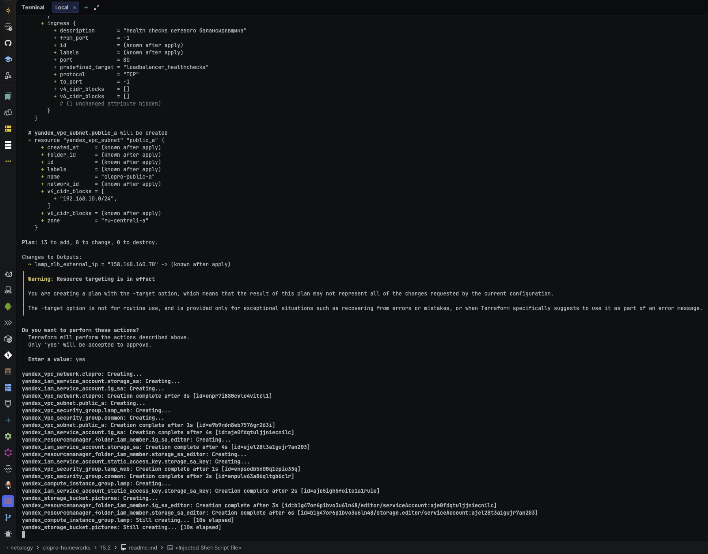
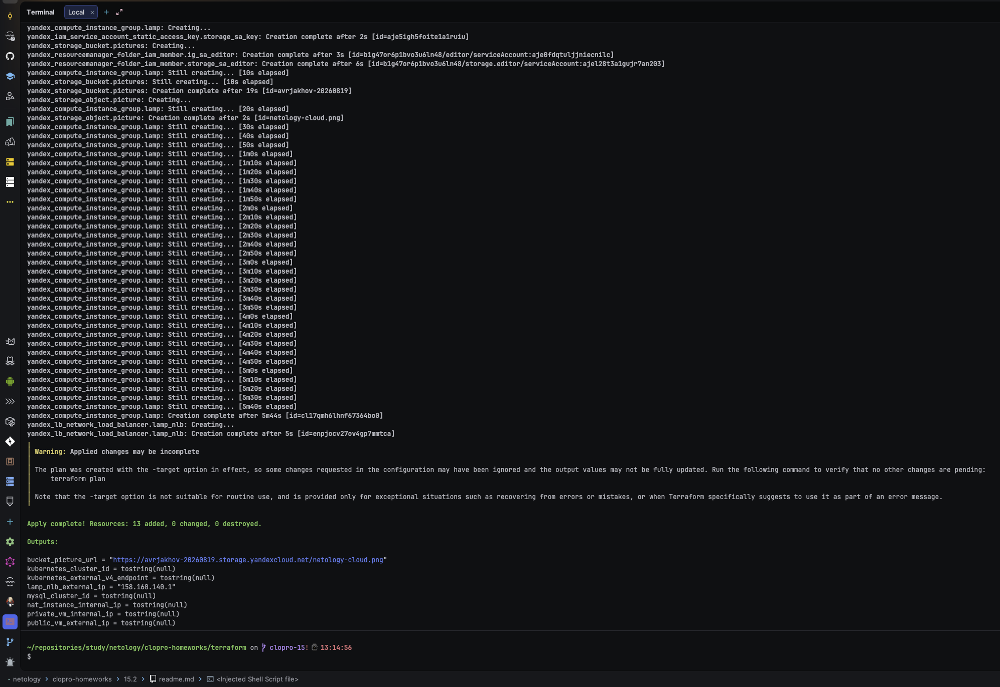
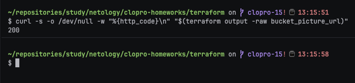
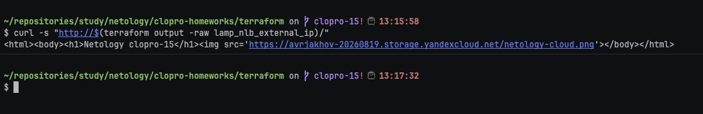
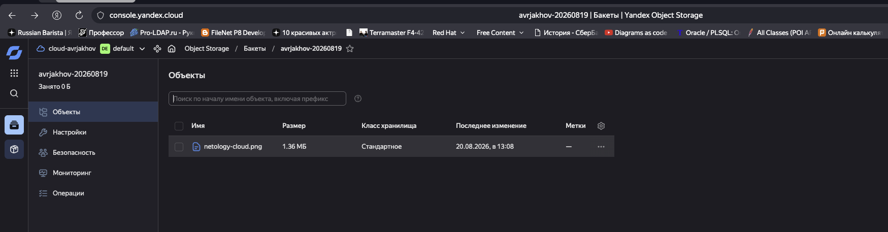
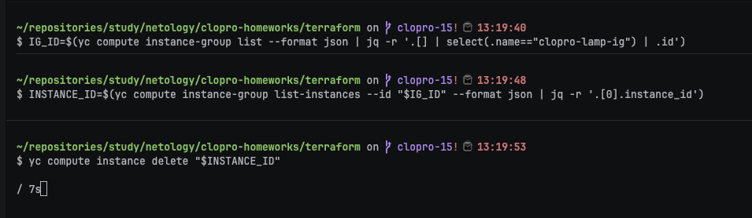
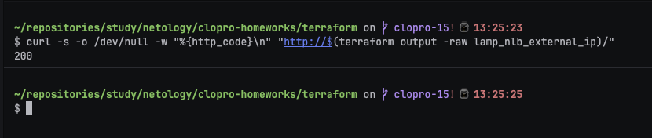

# Домашнее задание к занятию «Вычислительные мощности. Балансировщики нагрузки»

### Подготовка к выполнению задания

1. Домашнее задание состоит из обязательной части, которую нужно выполнить на провайдере Yandex Cloud, и дополнительной части в AWS (выполняется по желанию).
2. Все домашние задания в блоке 15 связаны друг с другом и в конце представляют пример законченной инфраструктуры.
3. Все задания нужно выполнить с помощью Terraform. Результатом выполненного домашнего задания будет код в репозитории.
4. Перед началом работы настройте доступ к облачным ресурсам из Terraform, используя материалы прошлых лекций и домашних заданий.

---
## Задание 1. Yandex Cloud

**Что нужно сделать**

1. Создать бакет Object Storage и разместить в нём файл с картинкой:

 - Создать бакет в Object Storage с произвольным именем (например, _имя_студента_дата_).
 - Положить в бакет файл с картинкой.
 - Сделать файл доступным из интернета.

2. Создать группу ВМ в public подсети фиксированного размера с шаблоном LAMP и веб-страницей, содержащей ссылку на картинку из бакета:

 - Создать Instance Group с тремя ВМ и шаблоном LAMP. Для LAMP рекомендуется использовать `image_id = fd827b91d99psvq5fjit`.
 - Для создания стартовой веб-страницы рекомендуется использовать раздел `user_data` в [meta_data](https://cloud.yandex.ru/docs/compute/concepts/vm-metadata).
 - Разместить в стартовой веб-странице шаблонной ВМ ссылку на картинку из бакета.
 - Настроить проверку состояния ВМ.

3. Подключить группу к сетевому балансировщику:

 - Создать сетевой балансировщик.
 - Проверить работоспособность, удалив одну или несколько ВМ.
4. (дополнительно)* Создать Application Load Balancer с использованием Instance group и проверкой состояния.

Полезные документы:

- [Compute instance group](https://registry.terraform.io/providers/yandex-cloud/yandex/latest/docs/resources/compute_instance_group).
- [Network Load Balancer](https://registry.terraform.io/providers/yandex-cloud/yandex/latest/docs/resources/lb_network_load_balancer).
- [Группа ВМ с сетевым балансировщиком](https://cloud.yandex.ru/docs/compute/operations/instance-groups/create-with-balancer).

### Ответ:

Бакет и Instance Group с LAMP-шаблоном описал в [`../terraform/storage.tf`](../terraform/storage.tf)
и [`../terraform/compute-group.tf`](../terraform/compute-group.tf). Управлять Object Storage из
Terraform можно только через статический ключ (access_key/secret_key), а не через основной
IAM-токен — поэтому вместе с бакетом создал отдельный сервисный аккаунт и статический ключ. Бакет на
этом занятии создаётся без шифрования — оно появится в [15.3](../15.3/readme.md). Пункт 4
(«дополнительно», со звёздочкой — Application Load Balancer) не выполнялся, обошёлся сетевым
балансировщиком из пункта 3.

---

#### Шаг 1. Картинка для бакета

В IDE положил файл по пути `terraform/assets/netology-cloud.png`:


---

#### Шаг 2. План для бакета и Instance Group

```bash
cd terraform
terraform plan \
  -target=yandex_iam_service_account.storage_sa \
  -target=yandex_resourcemanager_folder_iam_member.storage_sa_editor \
  -target=yandex_iam_service_account_static_access_key.storage_sa_key \
  -target=yandex_storage_bucket.pictures \
  -target=yandex_storage_object.picture \
  -target=yandex_iam_service_account.ig_sa \
  -target=yandex_resourcemanager_folder_iam_member.ig_sa_editor \
  -target=yandex_compute_instance_group.lamp \
  -target=yandex_lb_network_load_balancer.lamp_nlb
```





---

#### Шаг 3. terraform apply

```bash
terraform apply \
  -target=yandex_iam_service_account.storage_sa \
  -target=yandex_resourcemanager_folder_iam_member.storage_sa_editor \
  -target=yandex_iam_service_account_static_access_key.storage_sa_key \
  -target=yandex_storage_bucket.pictures \
  -target=yandex_storage_object.picture \
  -target=yandex_iam_service_account.ig_sa \
  -target=yandex_resourcemanager_folder_iam_member.ig_sa_editor \
  -target=yandex_compute_instance_group.lamp \
  -target=yandex_lb_network_load_balancer.lamp_nlb
```





---

#### Шаг 4. Картинка доступна из интернета

```bash
curl -s -o /dev/null -w "%{http_code}\n" "$(terraform output -raw bucket_picture_url)"
```



Код `200` без какой-либо авторизации подтверждает, что `anonymous_access_flags.read = true`
действительно делает файл публичным.

---

#### Шаг 5. Веб-страница на балансировщике

```bash
curl -s "http://$(terraform output -raw lamp_nlb_external_ip)/"
```



В HTML виден `` со ссылкой на картинку из бакета — страница сгенерирована `user-data` при
создании каждой ВМ шаблона.



---

#### Шаг 6. Проверка отказоустойчивости — удаление одной ВМ

```bash
IG_ID=$(yc compute instance-group list --format json | jq -r '.[] | select(.name=="clopro-lamp-ig") | .id')
INSTANCE_ID=$(yc compute instance-group list-instances --id "$IG_ID" --format json | jq -r '.[0].instance_id')
yc compute instance delete "$INSTANCE_ID"

# балансировщик продолжает отвечать, пока Instance Group разворачивает замену
curl -s -o /dev/null -w "%{http_code}\n" "http://$(terraform output -raw lamp_nlb_external_ip)/"
```





Пока Instance Group поднимает новую ВМ взамен удалённой, балансировщик продолжает отдавать `200` —
health check исключил нездоровый таргет из ротации автоматически.

---
## Задание 2*. AWS (задание со звёздочкой)

Это необязательное задание. Его выполнение не влияет на получение зачёта по домашней работе.

**Что нужно сделать**

Используя конфигурации, выполненные в домашнем задании из предыдущего занятия, добавить к  Production like сети Autoscaling group из трёх EC2-инстансов с  автоматической установкой веб-сервера в private домен.

1. Создать бакет S3 и разместить в нём файл с картинкой:

 - Создать бакет в S3 с произвольным именем (например, _имя_студента_дата_).
 - Положить в бакет файл с картинкой.
 - Сделать доступным из интернета.
2. Сделать Launch configurations с использованием bootstrap-скрипта с созданием веб-страницы, на которой будет ссылка на картинку в S3.
3. Загрузить три ЕС2-инстанса и настроить LB с помощью Autoscaling Group.

Resource Terraform:

- [S3 bucket](https://registry.terraform.io/providers/hashicorp/aws/latest/docs/resources/s3_bucket)
- [Launch Template](https://registry.terraform.io/providers/hashicorp/aws/latest/docs/resources/launch_template).
- [Autoscaling group](https://registry.terraform.io/providers/hashicorp/aws/latest/docs/resources/autoscaling_group).
- [Launch configuration](https://registry.terraform.io/providers/hashicorp/aws/latest/docs/resources/launch_configuration).

Пример bootstrap-скрипта:

```
#!/bin/bash
yum install httpd -y
service httpd start
chkconfig httpd on
cd /var/www/html
echo "<html><h1>My cool web-server</h1></html>" > index.html
```

### Ответ:

Задание со звёздочкой, необязательное — не влияет на зачёт, не выполнялось.

### Правила приёма работы

Домашняя работа оформляется в своём Git репозитории в файле README.md. Выполненное домашнее задание пришлите ссылкой на .md-файл в вашем репозитории.
Файл README.md должен содержать скриншоты вывода необходимых команд, а также скриншоты результатов.
Репозиторий должен содержать тексты манифестов или ссылки на них в файле README.md.
