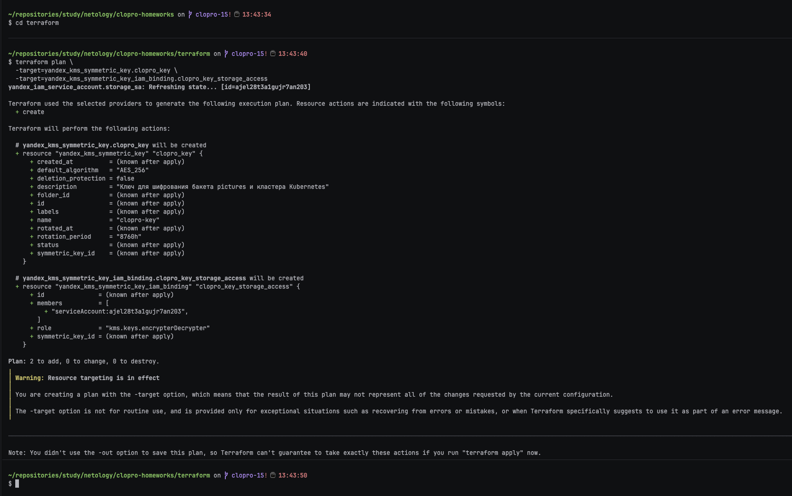
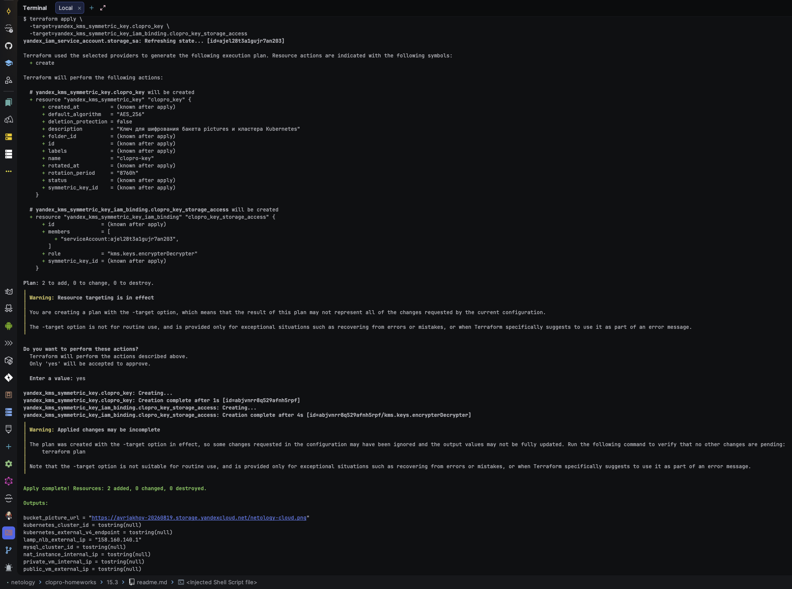
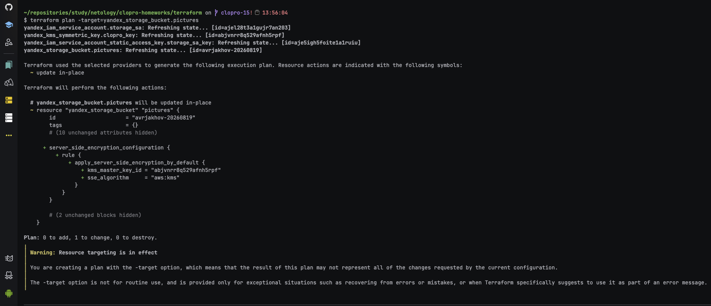
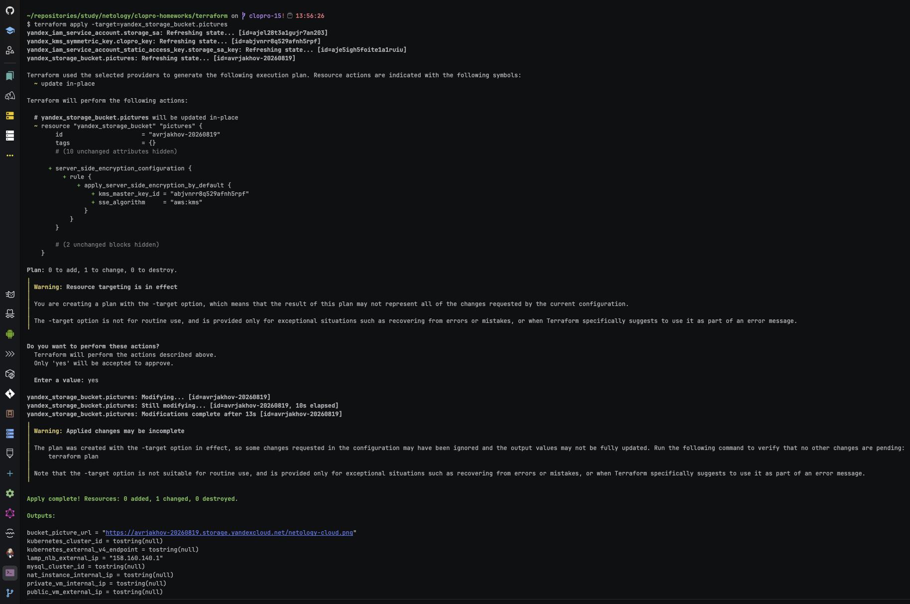
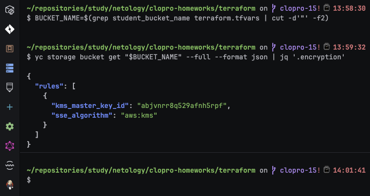

# Домашнее задание к занятию «Безопасность в облачных провайдерах»

Используя конфигурации, выполненные в рамках предыдущих домашних заданий, нужно добавить возможность шифрования бакета.

---
## Задание 1. Yandex Cloud

1. С помощью ключа в KMS необходимо зашифровать содержимое бакета:

 - создать ключ в KMS;
 - с помощью ключа зашифровать содержимое бакета, созданного ранее.
2. (Выполняется не в Terraform)* Создать статический сайт в Object Storage c собственным публичным адресом и сделать доступным по HTTPS:

 - создать сертификат;
 - создать статическую страницу в Object Storage и применить сертификат HTTPS;
 - в качестве результата предоставить скриншот на страницу с сертификатом в заголовке (замочек).

Полезные документы:

- [Настройка HTTPS статичного сайта](https://cloud.yandex.ru/docs/storage/operations/hosting/certificate).
- [Object Storage bucket](https://registry.terraform.io/providers/yandex-cloud/yandex/latest/docs/resources/storage_bucket).
- [KMS key](https://registry.terraform.io/providers/yandex-cloud/yandex/latest/docs/resources/kms_symmetric_key).

### Ответ:

Ключ описан в [`../terraform/kms.tf`](../terraform/kms.tf) вместе с правом
`kms.keys.encrypterDecrypter` для сервисного аккаунта бакета — без этого права Object Storage не
сможет обращаться к ключу при шифровании/расшифровке объектов. Затем в уже существующий ресурс
бакета в [`../terraform/storage.tf`](../terraform/storage.tf) добавлен блок
`server_side_encryption_configuration`. Пункт 2 (со звёздочкой, статический сайт по HTTPS вне
Terraform) не выполнялся.

---

#### Шаг 1. Создание ключа KMS

```bash
cd terraform
terraform plan \
  -target=yandex_kms_symmetric_key.clopro_key \
  -target=yandex_kms_symmetric_key_iam_binding.clopro_key_storage_access
terraform apply \
  -target=yandex_kms_symmetric_key.clopro_key \
  -target=yandex_kms_symmetric_key_iam_binding.clopro_key_storage_access
```





---

#### Шаг 2. Применение шифрования к бакету

```bash
terraform plan -target=yandex_storage_bucket.pictures
terraform apply -target=yandex_storage_bucket.pictures
```





---

#### Шаг 3. Проверка, что шифрование применилось

```bash
BUCKET_NAME=$(grep student_bucket_name terraform.tfvars | cut -d'"' -f2)
yc storage bucket get "$BUCKET_NAME" --full --format json | jq '.encryption'
```



В выводе было видно `kms_key_id`, совпадающий с идентификатором ключа `clopro_key` — новые объекты
в бакете стали шифроваться им автоматически. Публичное чтение картинки из 15.2 при этом продолжало
работать: `anonymous_access_flags.read` и шифрование на стороне сервера — независимые настройки,
шифрование прозрачно для читающего клиента.

---
## Задание 2*. AWS (задание со звёздочкой)

Это необязательное задание. Его выполнение не влияет на получение зачёта по домашней работе.

**Что нужно сделать**

1. С помощью роли IAM записать файлы ЕС2 в S3-бакет:
 - создать роль в IAM для возможности записи в S3 бакет;
 - применить роль к ЕС2-инстансу;
 - с помощью bootstrap-скрипта записать в бакет файл веб-страницы.
2. Организация шифрования содержимого S3-бакета:

 - используя конфигурации, выполненные в домашнем задании из предыдущего занятия, добавить к созданному ранее бакету S3 возможность шифрования Server-Side, используя общий ключ;
 - включить шифрование SSE-S3 бакету S3 для шифрования всех вновь добавляемых объектов в этот бакет.

3. *Создание сертификата SSL и применение его к ALB:

 - создать сертификат с подтверждением по email;
 - сделать запись в Route53 на собственный поддомен, указав адрес LB;
 - применить к HTTPS-запросам на LB созданный ранее сертификат.

Resource Terraform:

- [IAM Role](https://registry.terraform.io/providers/hashicorp/aws/latest/docs/resources/iam_role).
- [AWS KMS](https://registry.terraform.io/providers/hashicorp/aws/latest/docs/resources/kms_key).
- [S3 encrypt with KMS key](https://registry.terraform.io/providers/hashicorp/aws/latest/docs/resources/s3_bucket_object#encrypting-with-kms-key).

Пример bootstrap-скрипта:

```
#!/bin/bash
yum install httpd -y
service httpd start
chkconfig httpd on
cd /var/www/html
echo "<html><h1>My cool web-server</h1></html>" > index.html
aws s3 mb s3://mysuperbacketname2021
aws s3 cp index.html s3://mysuperbacketname2021
```

### Ответ:

Задание со звёздочкой, необязательное — не влияет на зачёт, не выполнялось.

### Правила приёма работы

Домашняя работа оформляется в своём Git репозитории в файле README.md. Выполненное домашнее задание пришлите ссылкой на .md-файл в вашем репозитории.
Файл README.md должен содержать скриншоты вывода необходимых команд, а также скриншоты результатов.
Репозиторий должен содержать тексты манифестов или ссылки на них в файле README.md.
