# Домашнее задание к занятию «Кластеры. Ресурсы под управлением облачных провайдеров»

### Цели задания

1. Организация кластера Kubernetes и кластера баз данных MySQL в отказоустойчивой архитектуре.
2. Размещение в private подсетях кластера БД, а в public — кластера Kubernetes.

---
## Задание 1. Yandex Cloud

1. Настроить с помощью Terraform кластер баз данных MySQL.

 - Используя настройки VPC из предыдущих домашних заданий, добавить дополнительно подсеть private в разных зонах, чтобы обеспечить отказоустойчивость.
 - Разместить ноды кластера MySQL в разных подсетях.
 - Необходимо предусмотреть репликацию с произвольным временем технического обслуживания.
 - Использовать окружение Prestable, платформу Intel Broadwell с производительностью 50% CPU и размером диска 20 Гб.
 - Задать время начала резервного копирования — 23:59.
 - Включить защиту кластера от непреднамеренного удаления.
 - Создать БД с именем `netology_db`, логином и паролем.

2. Настроить с помощью Terraform кластер Kubernetes.

 - Используя настройки VPC из предыдущих домашних заданий, добавить дополнительно две подсети public в разных зонах, чтобы обеспечить отказоустойчивость.
 - Создать отдельный сервис-аккаунт с необходимыми правами.
 - Создать региональный мастер Kubernetes с размещением нод в трёх разных подсетях.
 - Добавить возможность шифрования ключом из KMS, созданным в предыдущем домашнем задании.
 - Создать группу узлов, состояющую из трёх машин с автомасштабированием до шести.
 - Подключиться к кластеру с помощью `kubectl`.
 - *Запустить микросервис phpmyadmin и подключиться к ранее созданной БД.
 - *Создать сервис-типы Load Balancer и подключиться к phpmyadmin. Предоставить скриншот с публичным адресом и подключением к БД.

Полезные документы:

- [MySQL cluster](https://registry.terraform.io/providers/yandex-cloud/yandex/latest/docs/resources/mdb_mysql_cluster).
- [Создание кластера Kubernetes](https://cloud.yandex.ru/docs/managed-kubernetes/operations/kubernetes-cluster/kubernetes-cluster-create)
- [K8S Cluster](https://registry.terraform.io/providers/yandex-cloud/yandex/latest/docs/resources/kubernetes_cluster).
- [K8S node group](https://registry.terraform.io/providers/yandex-cloud/yandex/latest/docs/resources/kubernetes_node_group).

### Ответ:

MySQL-кластер — в [`../terraform/mysql.tf`](../terraform/mysql.tf): два хоста в private-подсетях
зон A и B (private-подсеть зоны A — та же, что и в 15.1), между ними Managed MySQL настраивает
репликацию автоматически. Kubernetes-кластер — в
[`../terraform/kubernetes.tf`](../terraform/kubernetes.tf): региональный мастер в трёх
public-подсетях (зона A — из 15.1, зоны B и D — новые), шифрование тем же ключом KMS, что и бакет
в 15.3, группа узлов с автоскейлингом 3→6. Два последних пункта (со звёздочкой — phpmyadmin и
Load Balancer к нему) не выполнялись.

---

#### Шаг 1. Свежий токен и уточнение resource_preset_id для MySQL

Токен (`TF_VAR_yc_token`) живёт только в переменной окружения текущего терминала и действует около
12 часов — с [15.1](../15.1/readme.md#шаг-2-получение-и-экспорт-токена-yandex-cloud) он давно
протух, получил новый прямо в `export` через подстановку команды (сам токен на экран не печатается).
Заодно, прежде чем применять MySQL-кластер, которому потом включится защита от удаления, проверил,
что «Intel Broadwell, 50% CPU» на момент выполнения соответствует именно `b2.medium`. Пароль
пользователя MySQL берётся из дефолта `variable "mysql_user_password"` в
[`../terraform/variables.tf`](../terraform/variables.tf) — учебный стенд, вводить его вручную не
нужно.

```bash
export TF_VAR_yc_token="$(yc iam create-token)"
cd clopro-homeworks
cd terraform
yc managed-mysql resource-preset list
```

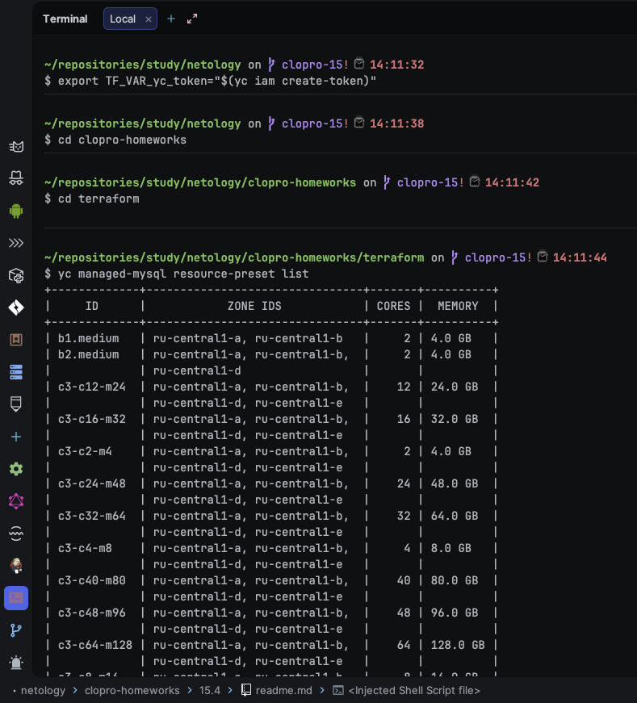

---

#### Шаг 2. План для MySQL-кластера

```bash
terraform plan \
  -target=yandex_mdb_mysql_cluster.clopro_mysql \
  -target=yandex_mdb_mysql_database.netology_db \
  -target=yandex_mdb_mysql_user.netology_user
```

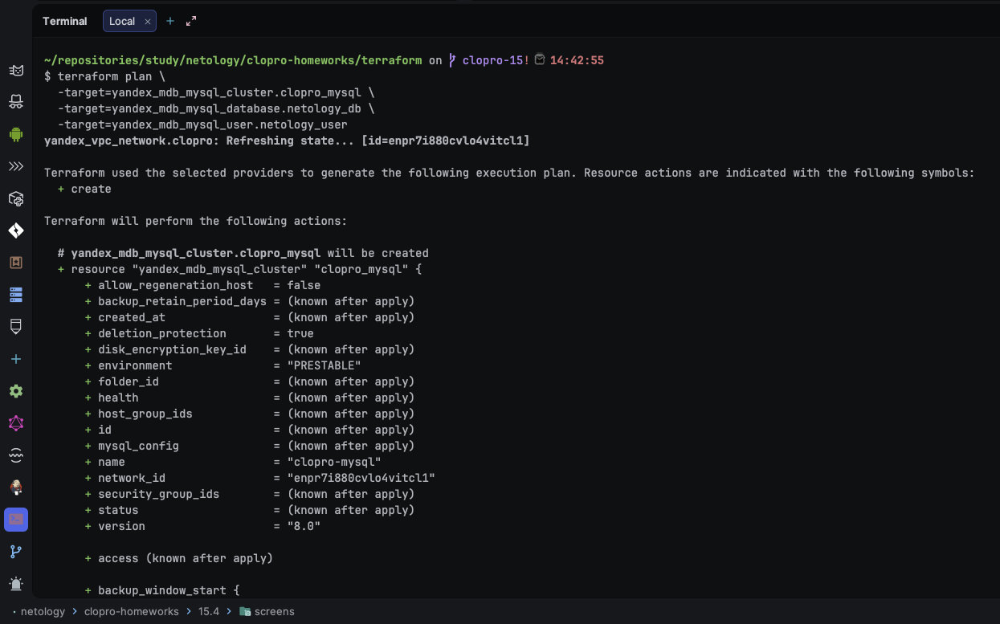

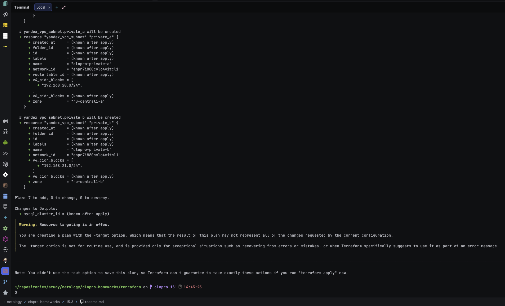

В плане было видно, что вместе с кластером создавались недостающие подсети `private_b` — Terraform
сам подтянул их как зависимость `host.subnet_id`.

---

#### Шаг 3. terraform apply — MySQL

```bash
terraform apply \
  -target=yandex_mdb_mysql_cluster.clopro_mysql \
  -target=yandex_mdb_mysql_database.netology_db \
  -target=yandex_mdb_mysql_user.netology_user
```

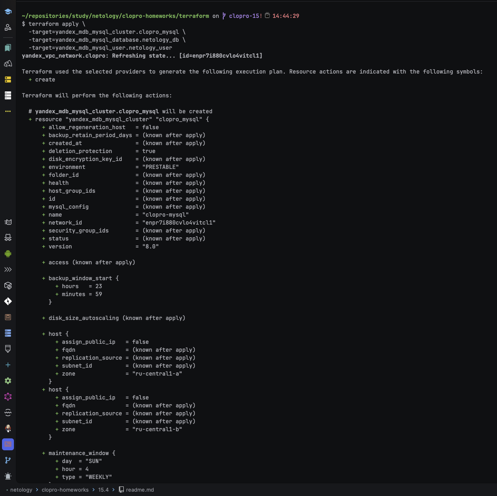

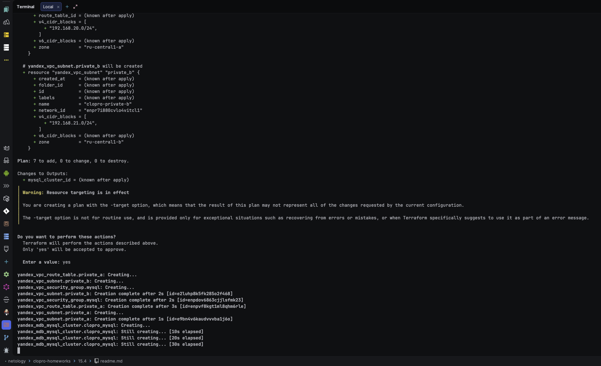

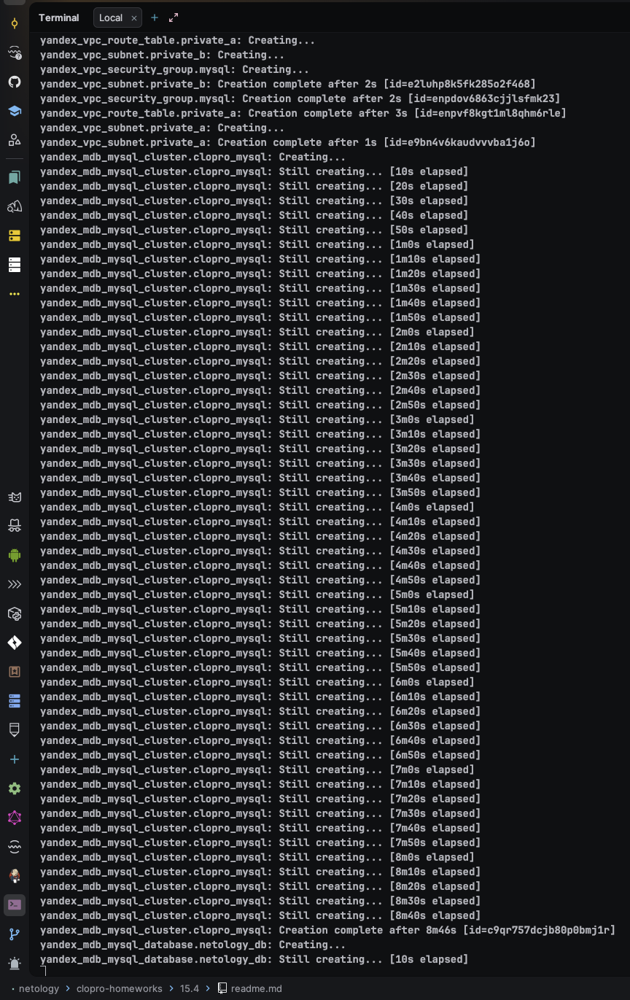

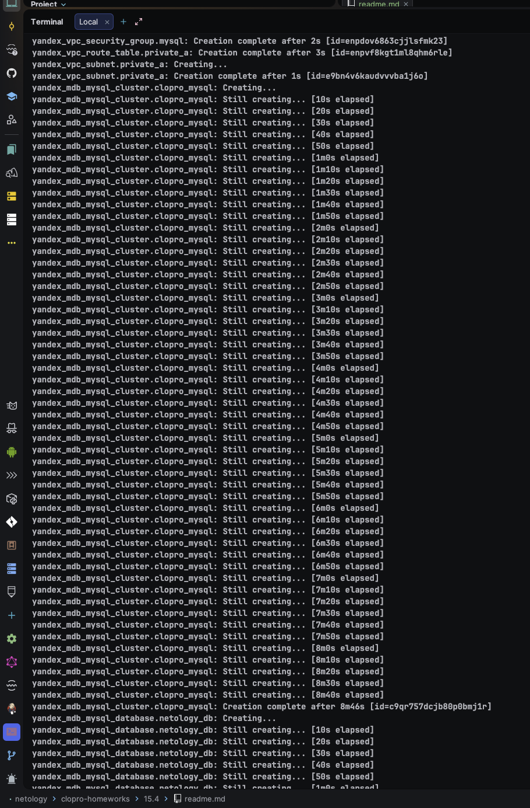

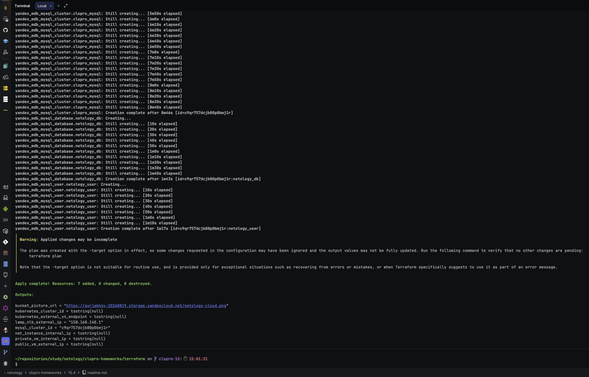

Кластер MySQL разворачивается дольше всего в этом блоке ДЗ — обычно 15-20 минут на два хоста с
настройкой репликации.

---

#### Шаг 4. Проверка кластера MySQL и защиты от удаления

```bash
CLUSTER_ID=$(terraform output -raw mysql_cluster_id)
yc managed-mysql cluster get "$CLUSTER_ID" \
  --format json | jq '.status, .config.access, .deletion_protection'
```

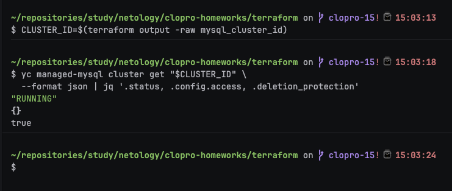

`"deletion_protection": true` и `"status": "RUNNING"` подтверждают выполнение соответствующих
пунктов задания.

---

#### Шаг 5. План для Kubernetes

Первая попытка apply упала с `PermissionDenied` при создании кластера: роли `editor` и
`container-registry.images.puller` у `k8s_sa` недостаточно, Managed Kubernetes отдельно требует
`k8s.clusters.agent`, а так как у мастера включён `public_ip = true` — ещё и `vpc.publicAdmin`.
Добавил обе роли в [`../terraform/kubernetes.tf`](../terraform/kubernetes.tf) и явный `depends_on`
у ресурса кластера на все четыре IAM-биндинга, чтобы Terraform не начинал создавать кластер раньше,
чем права реально применятся. План из-за этого вырос — было 8 ресурсов, теперь 10:

```bash
terraform plan \
  -target=yandex_iam_service_account.k8s_sa \
  -target=yandex_resourcemanager_folder_iam_member.k8s_sa_editor \
  -target=yandex_resourcemanager_folder_iam_member.k8s_sa_images_puller \
  -target=yandex_resourcemanager_folder_iam_member.k8s_sa_clusters_agent \
  -target=yandex_resourcemanager_folder_iam_member.k8s_sa_vpc_public_admin \
  -target=yandex_kubernetes_cluster.clopro_k8s \
  -target=yandex_kubernetes_node_group.clopro_nodes
```

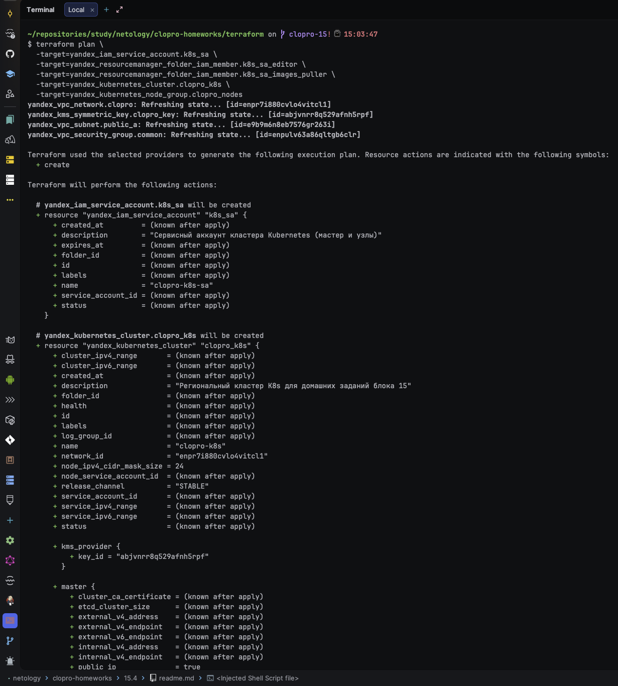

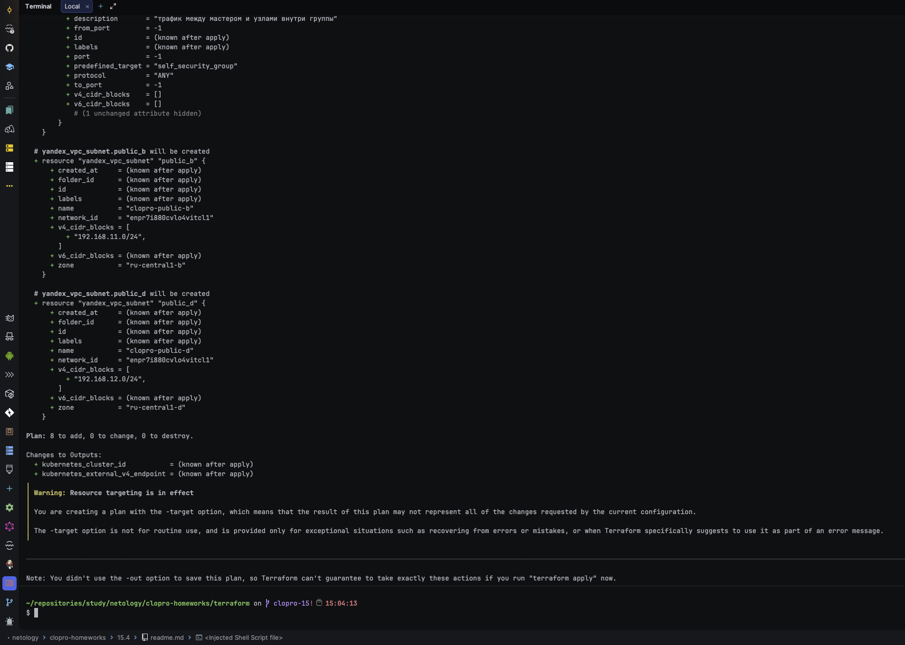

---

#### Шаг 6. terraform apply — Kubernetes

```bash
terraform apply \
  -target=yandex_iam_service_account.k8s_sa \
  -target=yandex_resourcemanager_folder_iam_member.k8s_sa_editor \
  -target=yandex_resourcemanager_folder_iam_member.k8s_sa_images_puller \
  -target=yandex_resourcemanager_folder_iam_member.k8s_sa_clusters_agent \
  -target=yandex_resourcemanager_folder_iam_member.k8s_sa_vpc_public_admin \
  -target=yandex_kubernetes_cluster.clopro_k8s \
  -target=yandex_kubernetes_node_group.clopro_nodes
```

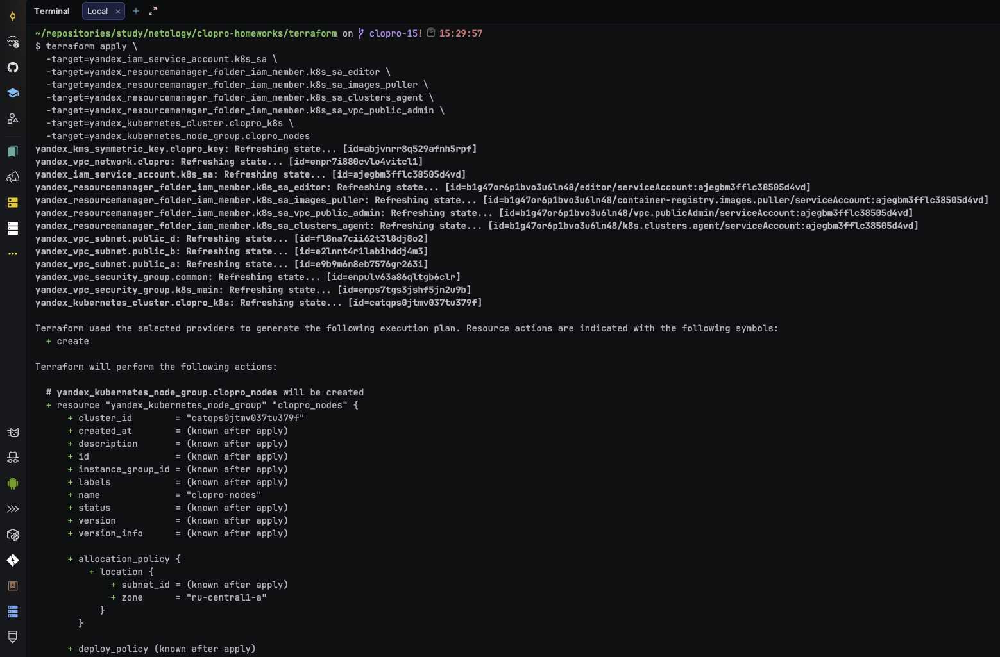

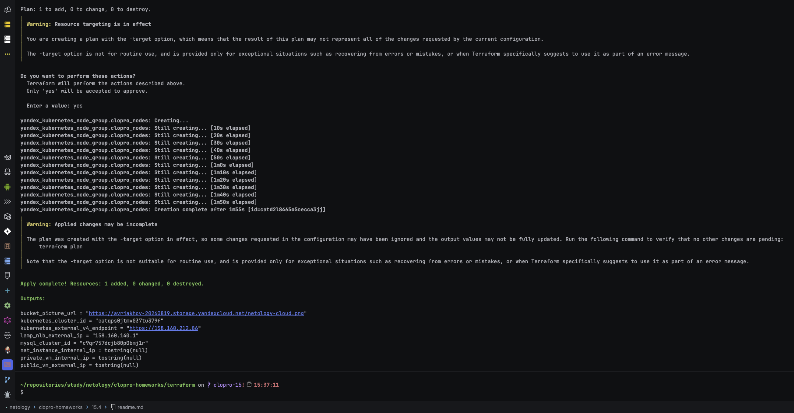

Как и с MySQL, вместе с кластером создались недостающие `public_b` и `public_d` — три зоны для
регионального мастера, как требует задание.

---

#### Шаг 7. Подключение kubectl к кластеру

```bash
CLUSTER_ID=$(terraform output -raw kubernetes_cluster_id)
yc managed-kubernetes cluster get-credentials --id "$CLUSTER_ID" --external --force
kubectl get nodes
```

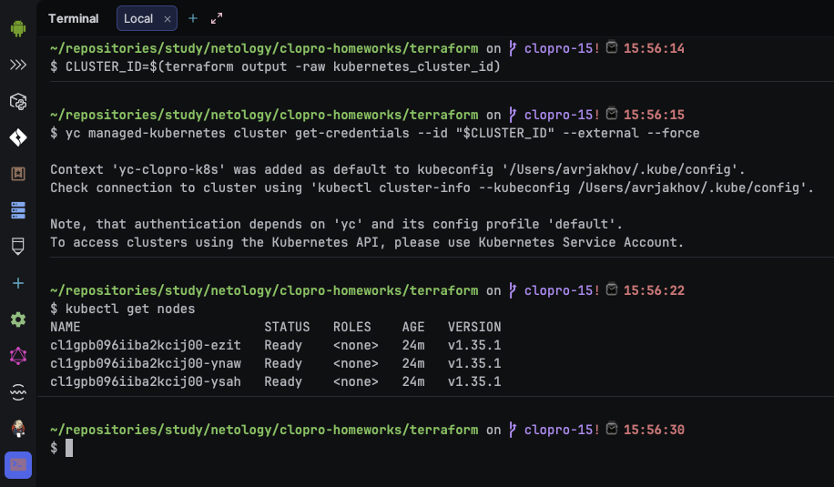

Три узла в статусе `Ready` — группа узлов поднялась в исходном размере `initial = 3`.

---

#### Шаг 8. Проверка шифрования кластера ключом KMS

```bash
yc managed-kubernetes cluster get "$CLUSTER_ID" --format json | jq '.kms_provider'
```

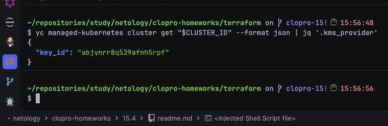

`key_id` совпал с ключом `clopro_key` из [15.3](../15.3/readme.md) — кластер использовал тот же
ключ, что и бакет, как и требует задание.

---
## Задание 2*. Вариант с AWS (задание со звёздочкой)

Это необязательное задание. Его выполнение не влияет на получение зачёта по домашней работе.

**Что нужно сделать**

1. Настроить с помощью Terraform кластер EKS в три AZ региона, а также RDS на базе MySQL с поддержкой MultiAZ для репликации и создать два readreplica для работы.

 - Создать кластер RDS на базе MySQL.
 - Разместить в Private subnet и обеспечить доступ из public сети c помощью security group.
 - Настроить backup в семь дней и MultiAZ для обеспечения отказоустойчивости.
 - Настроить Read prelica в количестве двух штук на два AZ.

2. Создать кластер EKS на базе EC2.

 - С помощью Terraform установить кластер EKS на трёх EC2-инстансах в VPC в public сети.
 - Обеспечить доступ до БД RDS в private сети.
 - С помощью kubectl установить и запустить контейнер с phpmyadmin (образ взять из docker hub) и проверить подключение к БД RDS.
 - Подключить ELB (на выбор) к приложению, предоставить скрин.

Полезные документы:

- [Модуль EKS](https://learn.hashicorp.com/tutorials/terraform/eks).

### Ответ:

Задание со звёздочкой, необязательное — не влияет на зачёт, не выполнялось.

### Правила приёма работы

Домашняя работа оформляется в своём Git репозитории в файле README.md. Выполненное домашнее задание пришлите ссылкой на .md-файл в вашем репозитории.
Файл README.md должен содержать скриншоты вывода необходимых команд, а также скриншоты результатов.
Репозиторий должен содержать тексты манифестов или ссылки на них в файле README.md.
