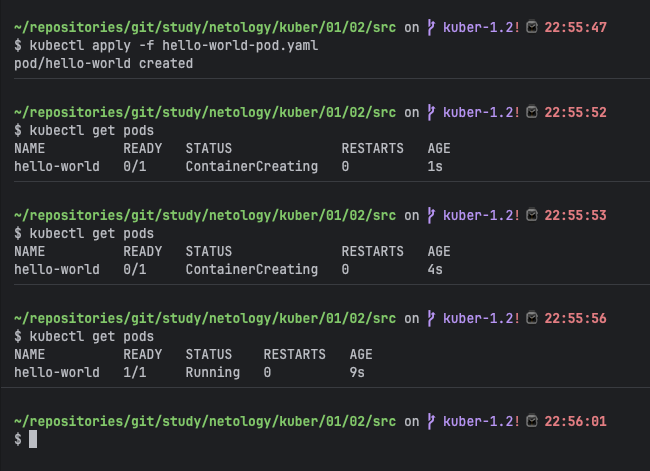
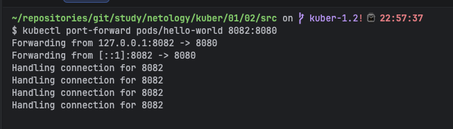
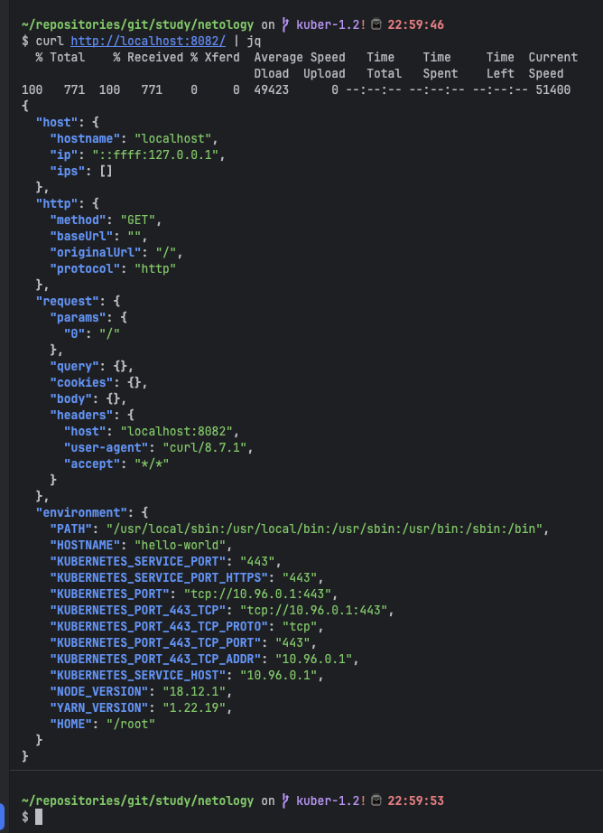
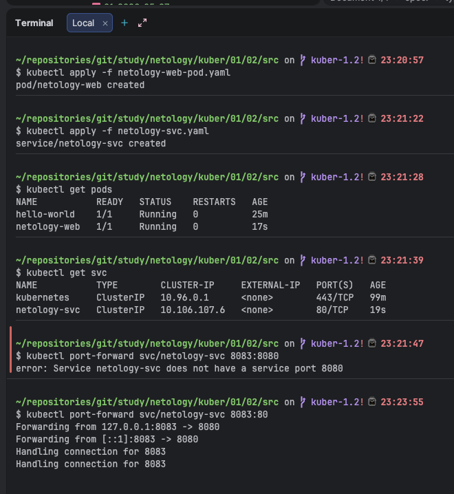
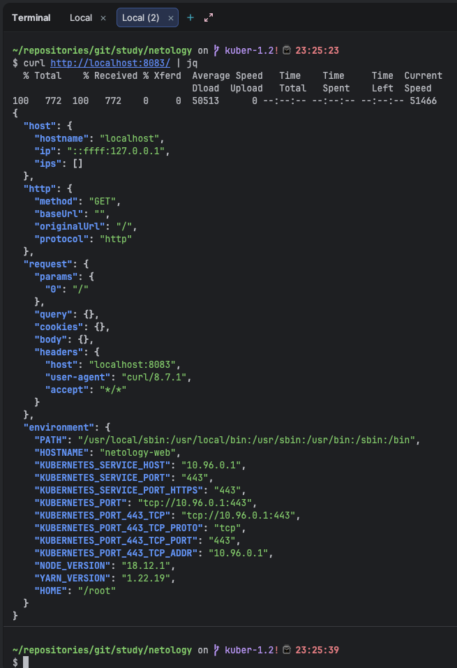
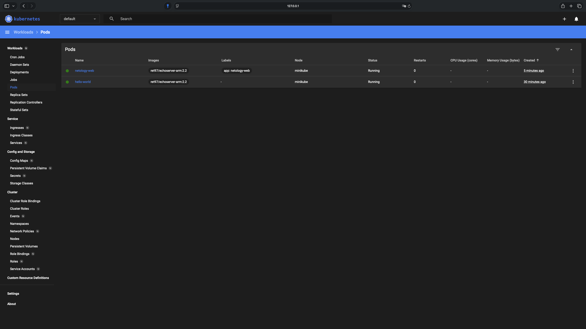
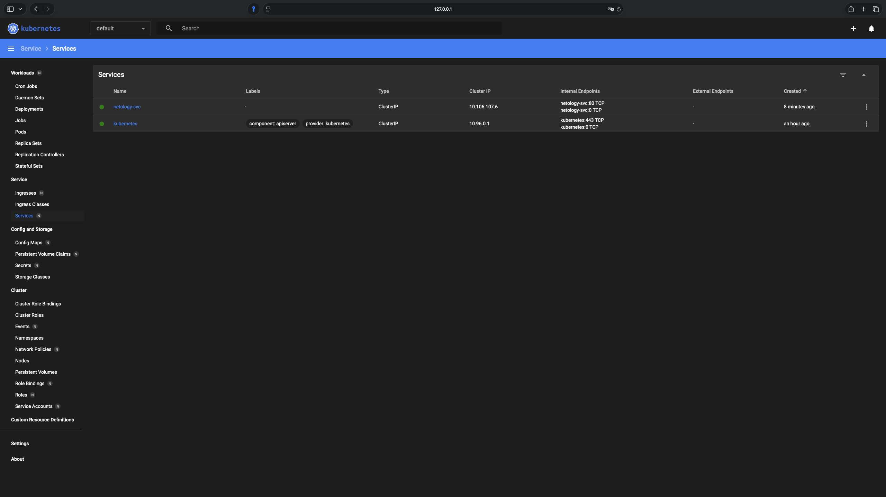

# Домашнее задание к занятию «Базовые объекты K8S»

### Цель задания

В тестовой среде для работы с Kubernetes, установленной в предыдущем ДЗ, необходимо развернуть Pod с приложением и подключиться к нему со своего локального компьютера.

------

### Чеклист готовности к домашнему заданию

1. Установленное k8s-решение (например, MicroK8S).
2. Установленный локальный kubectl.
3. Редактор YAML-файлов с подключенным Git-репозиторием.

------

### Инструменты и дополнительные материалы, которые пригодятся для выполнения задания

1. Описание [Pod](https://kubernetes.io/docs/concepts/workloads/pods/) и примеры манифестов.
2. Описание [Service](https://kubernetes.io/docs/concepts/services-networking/service/).

------

### Задание 1. Создать Pod с именем hello-world

1. Создать манифест (yaml-конфигурацию) Pod.
2. Использовать image - gcr.io/kubernetes-e2e-test-images/echoserver:2.2.
3. Подключиться локально к Pod с помощью `kubectl port-forward` и вывести значение (curl или в браузере).


### Ответ:

**Развернул Pod `hello-world` с образом echoserver:2.2 (ARM-совместимая версия)**

Для решения проблемы совместимости с Apple Silicon использовал образ `ret97/echoserver-arm:2.2` — это ARM64-версия официального образа `gcr.io/kubernetes-e2e-test-images/echoserver:2.2`.

Манифест `hello-world-pod.yaml`:

```yaml
apiVersion: v1
kind: Pod
metadata:
  name: hello-world
spec:
  containers:
    - name: echoserver
      image: ret97/echoserver-arm:2.2
      ports:
        - containerPort: 8080
```

**Применил манифест и проверил статус Pod:**

```bash
kubectl apply -f hello-world-pod.yaml
kubectl get pods
```



Статус `1/1 Running` — контейнер успешно запущен.

**Подключился через port-forward (локальный порт 8082 → порт контейнера 8080):**

```bash
kubectl port-forward pods/hello-world 8082:8080
```

**Проверил доступность приложения через curl:**

```bash
curl http://localhost:8082 | jq
```



Получен JSON-ответ от echoserver с информацией о хосте, HTTP-запросе и переменных окружения Kubernetes. Pod работает корректно.



------

### Задание 2. Создать Service и подключить его к Pod

1. Создать Pod с именем netology-web.
2. Использовать image — gcr.io/kubernetes-e2e-test-images/echoserver:2.2.
3. Создать Service с именем netology-svc и подключить к netology-web.
4. Подключиться локально к Service с помощью `kubectl port-forward` и вывести значение (curl или в браузере).


### Ответ:

**Создал Pod `netology-web` и Service `netology-svc` для доступа к нему**

Манифест Pod `netology-web-pod.yaml`:

```yaml
apiVersion: v1
kind: Pod
metadata:
  name: netology-web
  labels:
    app: netology-web
spec:
  containers:
    - name: echoserver
      image: ret97/echoserver-arm:2.2
      ports:
        - containerPort: 8080
```

Манифест Service `netology-svc.yaml`:

```yaml
apiVersion: v1
kind: Service
metadata:
  name: netology-svc
spec:
  selector:
    app: netology-web
  ports:
    - protocol: TCP
      port: 80
      targetPort: 8080
  type: ClusterIP
```

**Применил манифесты и проверил статус ресурсов:**

```bash
kubectl apply -f netology-web-pod.yaml
kubectl apply -f netology-svc.yaml
kubectl get pods
kubectl get svc
```

Оба Pod работают (`1/1 Running`), Service создан с типом `ClusterIP` на порту 80.

**Подключился к Service через port-forward (локальный порт 8083 → порт Service 80):**

```bash
kubectl port-forward svc/netology-svc 8083:80
```



**Проверил доступность приложения через Service:**

```bash
curl http://localhost:8083 | jq
```



Получен ответ от echoserver. В поле `HOSTNAME` видно значение `netology-web` — это подтверждает, что запрос прошёл через Service к правильному Pod.

**Проверка в Kubernetes Dashboard:**

Pod'ы в статусе Running:



Service `netology-svc` с типом ClusterIP и внутренним endpoint на порту 80:



