# Домашнее задание к занятию «Запуск приложений в K8S»

### Цель задания

В тестовой среде для работы с Kubernetes, установленной в предыдущем ДЗ, необходимо развернуть Deployment с приложением, состоящим из нескольких контейнеров, и масштабировать его.

------

### Чеклист готовности к домашнему заданию

1. Установленное k8s-решение (например, MicroK8S).
2. Установленный локальный kubectl.
3. Редактор YAML-файлов с подключённым git-репозиторием.

------

### Инструменты и дополнительные материалы, которые пригодятся для выполнения задания

1. [Описание](https://kubernetes.io/docs/concepts/workloads/controllers/deployment/) Deployment и примеры манифестов.
2. [Описание](https://kubernetes.io/docs/concepts/workloads/pods/init-containers/) Init-контейнеров.
3. [Описание](https://github.com/wbitt/Network-MultiTool) Multitool.

------

### Задание 1. Создать Deployment и обеспечить доступ к репликам приложения из другого Pod

1. Создать Deployment приложения, состоящего из двух контейнеров — nginx и multitool. Решить возникшую ошибку.
2. После запуска увеличить количество реплик работающего приложения до 2.
3. Продемонстрировать количество подов до и после масштабирования.
4. Создать Service, который обеспечит доступ до реплик приложений из п.1.
5. Создать отдельный Pod с приложением multitool и убедиться с помощью `curl`, что из пода есть доступ до приложений из п.1.

------

### Ответ:

**Развернул Deployment `nginx-multitool` с двумя контейнерами — nginx и multitool**

**Первоначальный манифест:**

```yaml
apiVersion: apps/v1
kind: Deployment
metadata:
  name: nginx-multitool
  labels:
    app: nginx-multitool
spec:
  replicas: 1
  selector:
    matchLabels:
      app: nginx-multitool
  template:
    metadata:
      labels:
        app: nginx-multitool
    spec:
      containers:
        - name: nginx
          image: nginx:latest
          ports:
            - containerPort: 80
        - name: multitool
          image: wbitt/network-multitool:latest
          ports:
            - containerPort: 8080
```

**Применил манифест и столкнулся с ошибкой:**

```bash
kubectl apply -f deployment-nginx-multitool.yaml
kubectl get pods
```

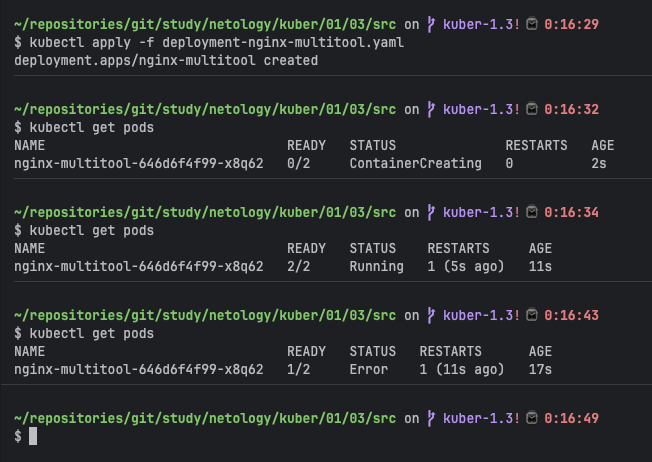

Pod перешёл в статус `Error` с READY `1/2` — один контейнер работает, второй падает.

**Проверил логи проблемного контейнера:**

```bash
kubectl logs nginx-multitool-646d6f4f99-x8q62 -c multitool
```

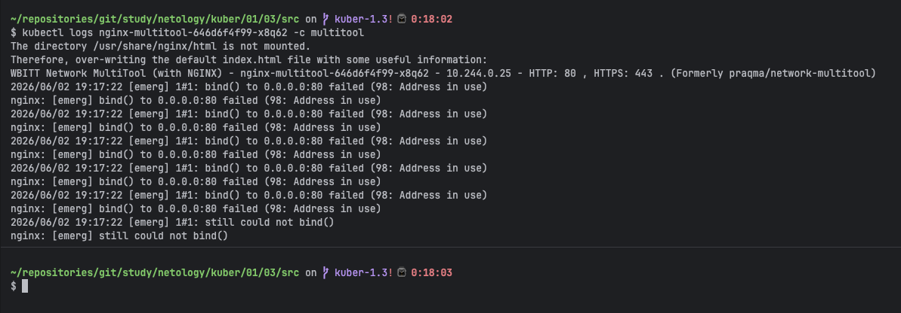

Получил ошибку:
```
nginx: [emerg] bind() to 0.0.0.0:80 failed (98: Address in use)
```

**Диагностика:** контейнер multitool по умолчанию запускает внутренний nginx на порту 80, независимо от того, какой `containerPort` указан в манифесте Kubernetes. Параметр `containerPort` в Kubernetes — это только декларация для документации, он не меняет поведение приложения внутри контейнера. Поскольку оба контейнера в Pod находятся в одной network namespace и делят один IP-адрес, возник конфликт портов.

**Решение:** задал переменную окружения `HTTP_PORT: "8080"` для контейнера multitool — это заставляет внутренний nginx в multitool слушать порт 8080 вместо 80, что устраняет конфликт портов.

**Исправленный манифест `deployment-nginx-multitool.yaml`:**

```yaml
apiVersion: apps/v1
kind: Deployment
metadata:
  name: nginx-multitool
  labels:
    app: nginx-multitool
spec:
  replicas: 1
  selector:
    matchLabels:
      app: nginx-multitool
  template:
    metadata:
      labels:
        app: nginx-multitool
    spec:
      containers:
        - name: nginx
          image: nginx:latest
          ports:
            - containerPort: 80
        - name: multitool
          image: wbitt/network-multitool:latest
          env:
            - name: HTTP_PORT
              value: "8080"
```

**Пересоздал Deployment с исправленным манифестом:**

```bash
kubectl delete -f deployment-nginx-multitool.yaml
kubectl apply -f deployment-nginx-multitool.yaml
kubectl get pods
```

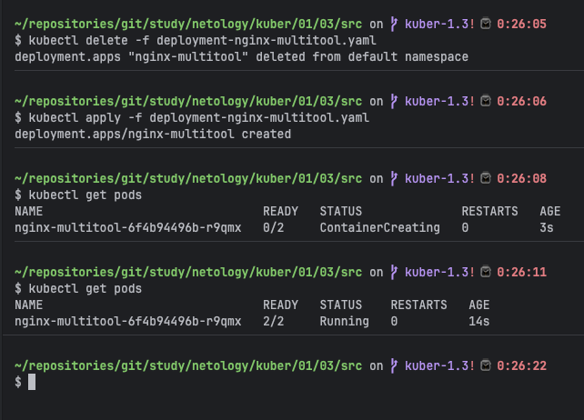

Статус `2/2 Running` — оба контейнера (nginx и multitool) успешно запущены в одном Pod.

**Увеличил количество реплик Deployment до 2:**

```bash
kubectl scale deployment/nginx-multitool --replicas=2
kubectl get pods
```

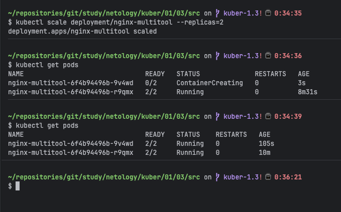

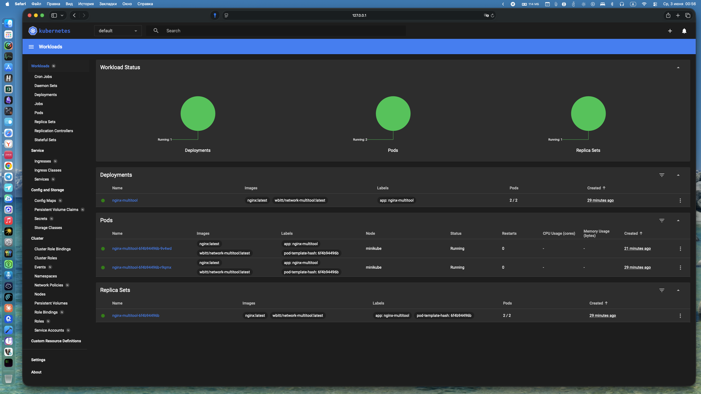

До масштабирования — 1 Pod, после — 2 Pod в статусе `Running` с READY `2/2`.

**Создал Service для доступа к репликам Deployment:**

Манифест `service-nginx-multitool.yaml`:

```yaml
apiVersion: v1
kind: Service
metadata:
  name: nginx-multitool-svc
spec:
  selector:
    app: nginx-multitool
  ports:
    - protocol: TCP
      port: 80
      targetPort: 80
  type: ClusterIP
```

```bash
kubectl apply -f service-nginx-multitool.yaml
kubectl get svc
```

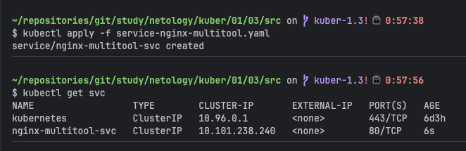

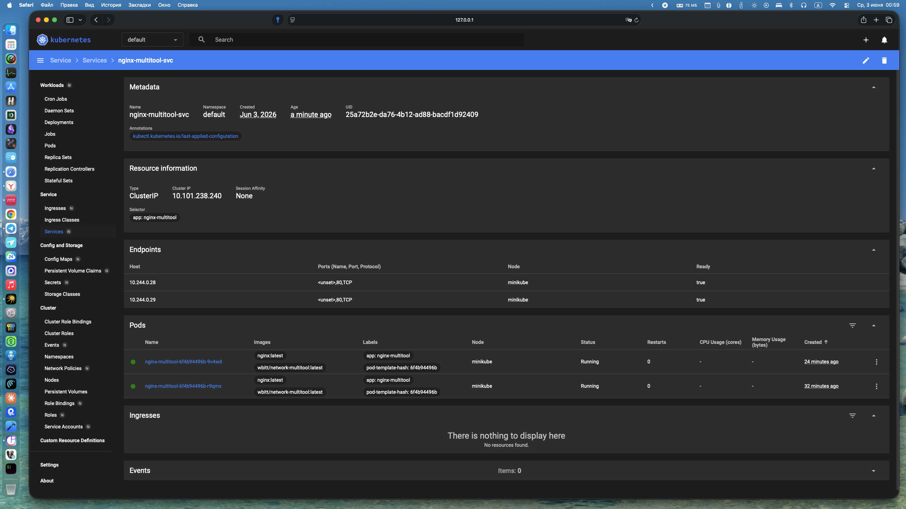

Service `nginx-multitool-svc` создан с типом `ClusterIP` на порту 80, selector соответствует label Pod'ов Deployment.

**Создал отдельный Pod с multitool для проверки доступа:**

Манифест `pod-multitool-test.yaml`:

```yaml
apiVersion: v1
kind: Pod
metadata:
  name: multitool-test
  labels:
    app: multitool-test
spec:
  containers:
    - name: multitool
      image: wbitt/network-multitool:latest
```

```bash
kubectl apply -f pod-multitool-test.yaml
kubectl get pods
```

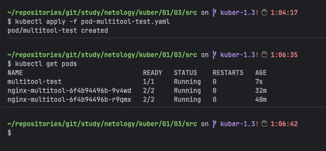

Pod `multitool-test` запущен и находится в статусе `Running`.

**Проверил доступ к приложению из Pod `multitool-test` через Service:**

```bash
kubectl exec -it multitool-test -- curl http://nginx-multitool-svc
```

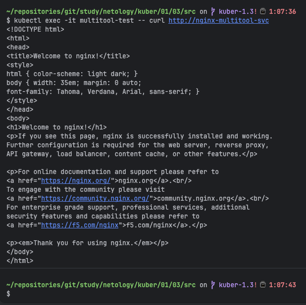

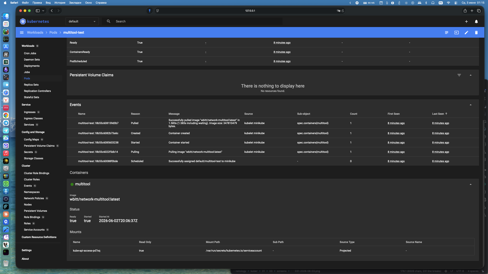

Получен HTML-ответ от nginx — доступ из Pod `multitool-test` к репликам Deployment через Service работает корректно.

------

### Задание 2. Создать Deployment и обеспечить старт основного контейнера при выполнении условий

1. Создать Deployment приложения nginx и обеспечить старт контейнера только после того, как будет запущен сервис этого приложения.
2. Убедиться, что nginx не стартует. В качестве Init-контейнера взять busybox.
3. Создать и запустить Service. Убедиться, что Init запустился.
4. Продемонстрировать состояние пода до и после запуска сервиса.

------

### Ответ:

**Развернул Deployment `nginx-init` с Init-контейнером `busybox` и основным контейнером `nginx`**

**Манифест `deployment-nginx-init.yaml`:**

```yaml
apiVersion: apps/v1
kind: Deployment
metadata:
  name: nginx-init
  labels:
    app: nginx-init
spec:
  replicas: 1
  selector:
    matchLabels:
      app: nginx-init
  template:
    metadata:
      labels:
        app: nginx-init
    spec:
      initContainers:
        - name: init-check
          image: busybox
          command: ['sh', '-c', 'until nslookup nginx-init-svc; do echo "Waiting for service..."; sleep 2; done']
      containers:
        - name: nginx
          image: nginx:latest
          ports:
            - containerPort: 80
```

**Применил манифест Deployment (Service на данном этапе не создан):**

```bash
kubectl apply -f deployment-nginx-init.yaml
kubectl get pods
```

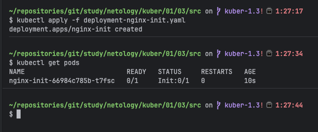

Pod находится в статусе `Init:0/1` — основной контейнер `nginx` не стартует, так как Init-контейнер `busybox` циклически ожидает появления DNS-записи сервиса `nginx-init-svc`.

**Проверил логи Init-контейнера:**

```bash
kubectl logs nginx-init-66984c785b-t7fsc -c init-check
```

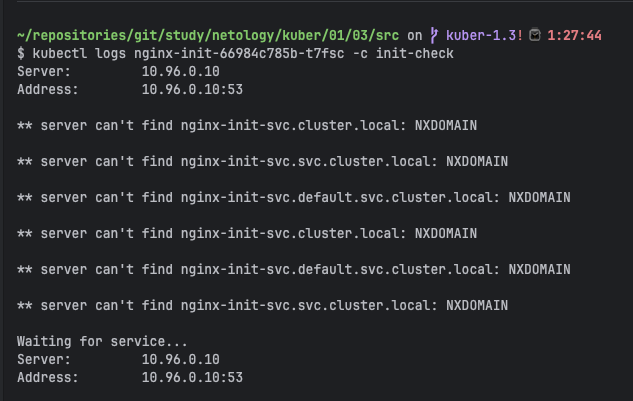

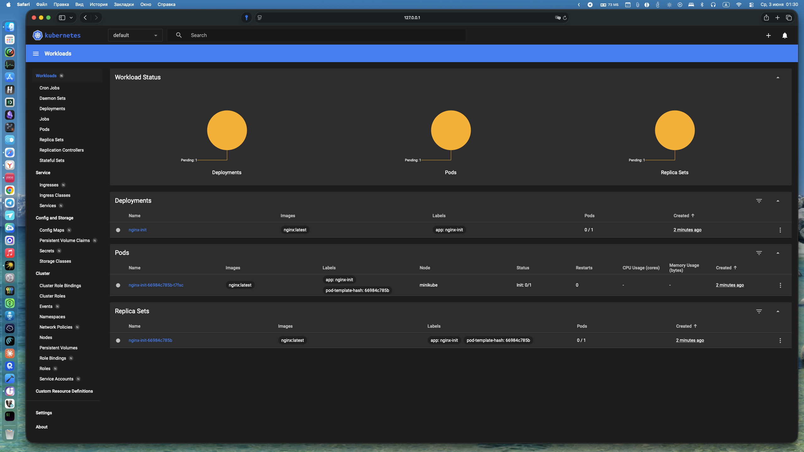

**Создал Service для Deployment:**

Манифест `service-nginx-init.yaml`:

```yaml
apiVersion: v1
kind: Service
metadata:
  name: nginx-init-svc
spec:
  selector:
    app: nginx-init
  ports:
    - protocol: TCP
      port: 80
      targetPort: 80
  type: ClusterIP
```

```bash
kubectl apply -f service-nginx-init.yaml
kubectl get svc
```

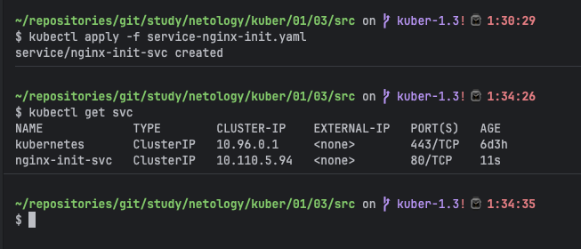

**Проверил состояние пода после запуска сервиса:**

```bash
kubectl get pods
```

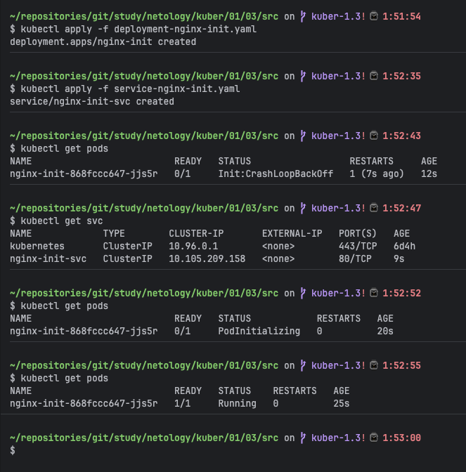

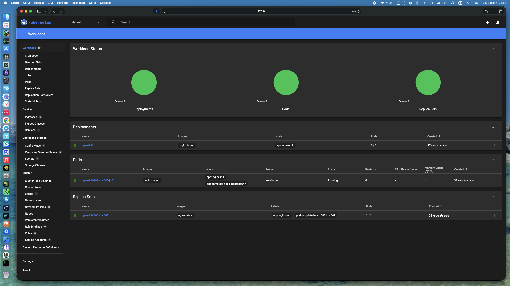

Init-контейнер успешно разрешил имя сервиса, завершил свою работу, после чего автоматически запустился основной контейнер `nginx`. Pod перешёл в статус `Running` с READY `1/1`.


> Возникла проблема: Init-контейнер не завершался после создания Service. Причина — `nslookup` в busybox всегда выводит адрес DNS-сервера (10.96.0.10), даже при ошибке NXDOMAIN, из-за чего цикл `until` не мог корректно определить момент успешного разрешения DNS. Решение — убрать цикл и использовать одиночный вызов `nslookup nginx-init-svc.default.svc.cluster.local` с полным FQDN-именем: команда возвращает exit code 0 только при успешном разрешении, после чего Init-контейнер завершается и стартует основной контейнер nginx.