# Домашнее задание к занятию «Сетевое взаимодействие в Kubernetes»

### Примерное время выполнения задания

120 минут

### Цель задания

Научиться настраивать доступ к приложениям в Kubernetes:
- Внутри кластера через **Service** (ClusterIP, NodePort).
- Снаружи кластера через **Ingress**.

Это задание поможет вам освоить базовые принципы сетевого взаимодействия в Kubernetes — ключевого навыка для работы с кластерами.
На практике Service и Ingress используются для доступа к приложениям, балансировки нагрузки и маршрутизации трафика. Понимание этих механизмов поможет вам упростить управление сервисами в рабочих окружениях и снизит риски ошибок при развёртывании.

------

## **Подготовка**
### **Чеклист готовности**
- Установлен Kubernetes (MicroK8S, Minikube или другой).
- Установлен `kubectl`.
- Редактор для YAML-файлов (VS Code, Vim и др.).

------

### Инструменты, которые пригодятся для выполнения задания

1. [Инструкция](https://microk8s.io/docs/getting-started) по установке MicroK8S.
2. [Инструкция](https://minikube.sigs.k8s.io/docs/start/?arch=%2Fwindows%2Fx86-64%2Fstable%2F.exe+download) по установке Minikube.
3. [Инструкция](https://kubernetes.io/docs/tasks/tools/install-kubectl-windows/)по установке kubectl.
4. [Инструкция](https://marketplace.visualstudio.com/items?itemName=ms-kubernetes-tools.vscode-kubernetes-tools) по установке VS Code

### Дополнительные материалы, которые пригодятся для выполнения задания

1. [Описание](https://kubernetes.io/docs/concepts/workloads/controllers/deployment/) Deployment и примеры манифестов.
2. [Описание](https://kubernetes.io/docs/concepts/services-networking/service/) Описание Service.
3. [Описание](https://kubernetes.io/docs/concepts/services-networking/ingress/) Ingress.
4. [Описание](https://github.com/wbitt/Network-MultiTool) Multitool.

------

## **Задание 1: Настройка Service (ClusterIP и NodePort)**
### **Задача**
Развернуть приложение из двух контейнеров (`nginx` и `multitool`) и обеспечить доступ к ним:
- Внутри кластера через **ClusterIP**.
- Снаружи через **NodePort**.

### **Шаги выполнения**
1. **Создать Deployment** с двумя контейнерами:
    - `nginx` (порт `80`).
    - `multitool` (порт `8080`).
    - Количество реплик: `3`.
2. **Создать Service типа ClusterIP**, который:
    - Открывает `nginx` на порту `9001`.
    - Открывает `multitool` на порту `9002`.
3. **Проверить доступность** изнутри кластера:
```bash
 kubectl run test-pod --image=wbitt/network-multitool --rm -it -- sh
 curl <service-name>:9001 # Проверить nginx
 curl <service-name>:9002 # Проверить multitool
```
4. **Создать Service типа NodePort** для доступа к `nginx` снаружи.
5. **Проверить доступ** с локального компьютера:
```bash
 curl <node-ip>:<node-port>
   ```
или через браузер.

### **Что сдать на проверку**
- Манифесты:
    - `deployment-multi-container.yaml`
    - `service-clusterip.yaml`
    - `service-nodeport.yaml`
- Скриншоты проверки доступа (`curl` или браузер).

---

### Ответ:

**Шаг 1. Создал Deployment с двумя контейнерами.**

Манифест `src/task1/deployment-multi-container.yaml`:
```yaml
apiVersion: apps/v1
kind: Deployment
metadata:
  name: multi-container-app
  labels:
    app: multi-container-app
spec:
  replicas: 3
  selector:
    matchLabels:
      app: multi-container-app
  template:
    metadata:
      labels:
        app: multi-container-app
    spec:
      containers:
        - name: nginx
          image: nginx:latest
          ports:
            - containerPort: 80
        - name: multitool
          image: wbitt/network-multitool:latest
          ports:
            - containerPort: 8080
          env:
            - name: HTTP_PORT
              value: "8080"
```

Применил манифест и проверил статус подов:
```bash
kubectl apply -f src/task1/deployment-multi-container.yaml
kubectl get pods
```

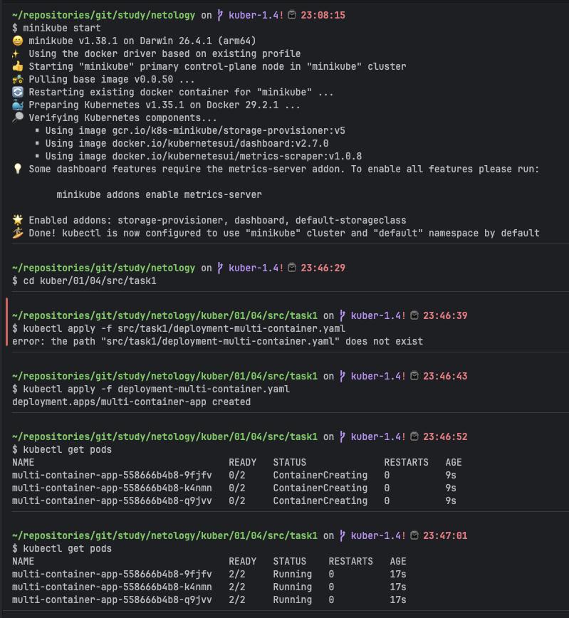

**Шаг 2. Создал Service типа ClusterIP.**

Манифест `src/task1/service-clusterip.yaml`:
```yaml
apiVersion: v1
kind: Service
metadata:
  name: multi-container-svc
spec:
  selector:
    app: multi-container-app
  ports:
    - name: nginx-port
      protocol: TCP
      port: 9001
      targetPort: 80
    - name: multitool-port
      protocol: TCP
      port: 9002
      targetPort: 8080
  type: ClusterIP
```

```bash
kubectl apply -f src/task1/service-clusterip.yaml
kubectl get svc multi-container-svc
```

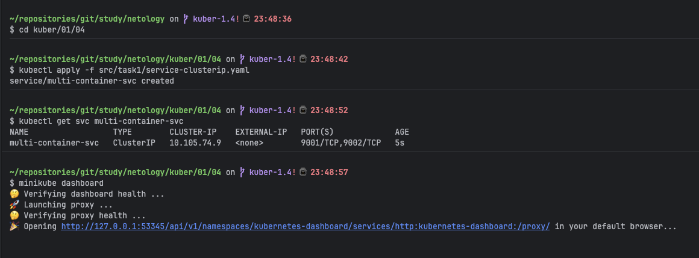

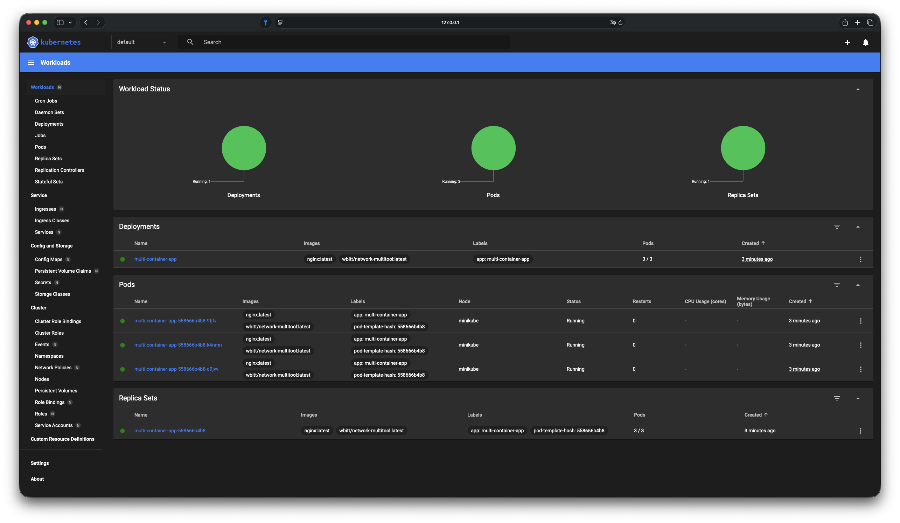

**Шаг 3. Проверил доступность изнутри кластера.**

Запустил тестовый Pod и выполнил запросы:
```bash
kubectl run test-pod --image=wbitt/network-multitool --rm -it -- sh
curl multi-container-svc:9001
curl multi-container-svc:9002
```

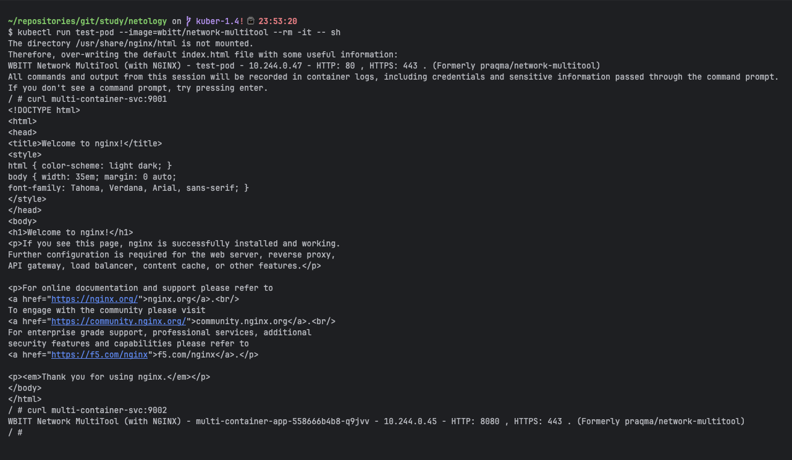

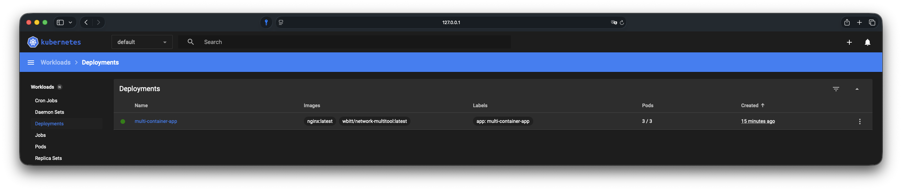

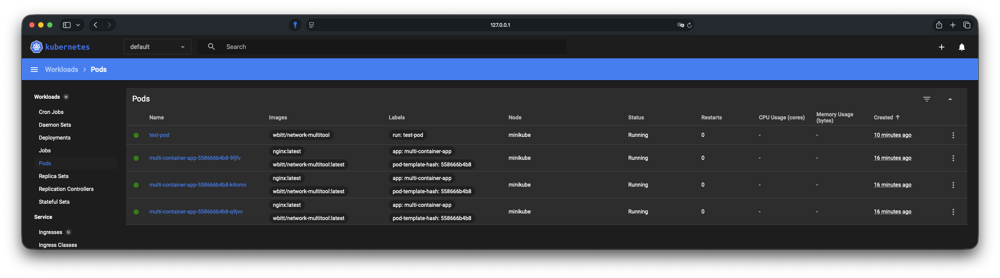

**Шаг 4. Создал Service типа NodePort.**

Манифест `src/task1/service-nodeport.yaml`:
```yaml
apiVersion: v1
kind: Service
metadata:
  name: multi-container-nodeport
spec:
  selector:
    app: multi-container-app
  ports:
    - name: nginx-port
      protocol: TCP
      port: 80
      targetPort: 80
      nodePort: 30080
  type: NodePort
```

```bash
kubectl apply -f src/task1/service-nodeport.yaml
kubectl get svc multi-container-nodeport
```

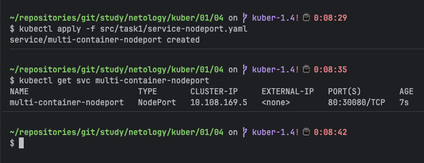

**Шаг 5. Проверил доступ с локального компьютера.**

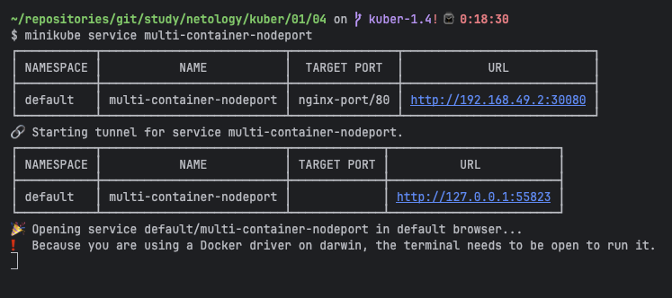

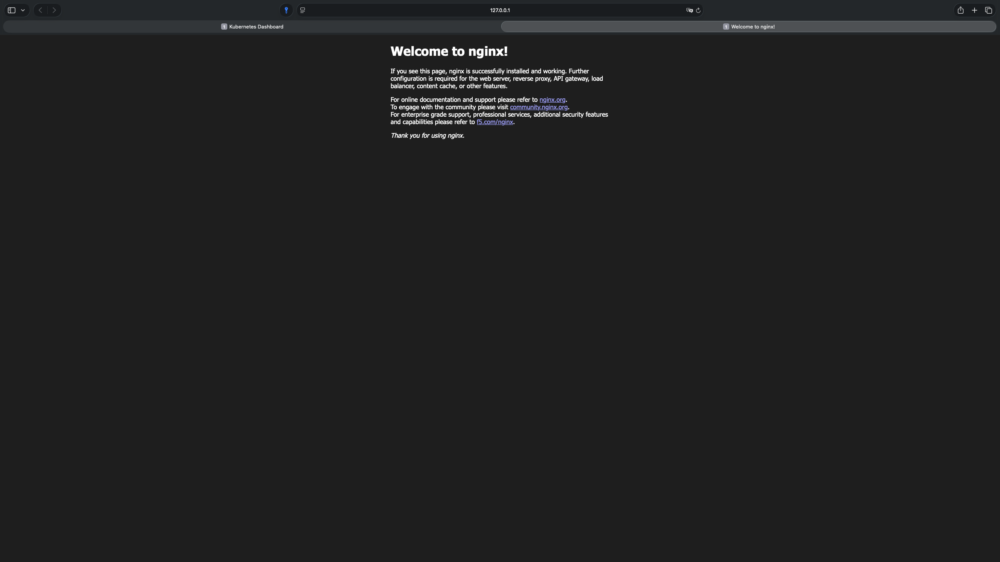

> *NodePort Service работает корректно — порт 30080 открыт на ноде кластера. Для проверки доступа в Minikube на macOS используется штатная команда `minikube service`, которая создаёт туннель между localhost и VM. Это стандартный механизм Minikube для локальной разработки (прямой доступ к IP виртуальной машины 192.168.49.2 заблокирован на уровне Docker). В production-кластере (bare metal или облако) доступ осуществлялся бы напрямую по `curl 192.168.49.2:30080`.*

---

## **Задание 2: Настройка Ingress**
### **Задача**
Развернуть два приложения (`frontend` и `backend`) и обеспечить доступ к ним через **Ingress** по разным путям.

### **Шаги выполнения**
1. **Развернуть два Deployment**:
    - `frontend` (образ `nginx`).
    - `backend` (образ `wbitt/network-multitool`).
2. **Создать Service** для каждого приложения.
3. **Включить Ingress-контроллер**:
```bash
 microk8s enable ingress
   ```
4. **Создать Ingress**, который:
    - Открывает `frontend` по пути `/`.
    - Открывает `backend` по пути `/api`.
5. **Проверить доступность**:
```bash
 curl <host>/
 curl <host>/api
   ```
или через браузер.

### **Что сдать на проверку**
- Манифесты:
    - `deployment-frontend.yaml`
    - `deployment-backend.yaml`
    - `service-frontend.yaml`
    - `service-backend.yaml`
    - `ingress.yaml`
- Скриншоты проверки доступа (`curl` или браузер).

---

### Ответ:

**Шаг 1. Развернул два Deployment.**

Манифест `src/task2/deployment-frontend.yaml`:
```yaml
apiVersion: apps/v1
kind: Deployment
metadata:
  name: frontend
  labels:
    app: frontend
spec:
  replicas: 2
  selector:
    matchLabels:
      app: frontend
  template:
    metadata:
      labels:
        app: frontend
    spec:
      containers:
        - name: nginx
          image: nginx:latest
          ports:
            - containerPort: 80
```

Манифест `src/task2/deployment-backend.yaml`:
```yaml
apiVersion: apps/v1
kind: Deployment
metadata:
  name: backend
  labels:
    app: backend
spec:
  replicas: 2
  selector:
    matchLabels:
      app: backend
  template:
    metadata:
      labels:
        app: backend
    spec:
      containers:
        - name: multitool
          image: wbitt/network-multitool:latest
          ports:
            - containerPort: 8080
          env:
            - name: HTTP_PORT
              value: "8080"
```

```bash
kubectl apply -f src/task2/deployment-frontend.yaml
kubectl apply -f src/task2/deployment-backend.yaml
kubectl get pods
```

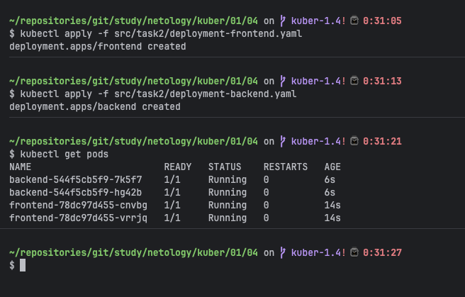

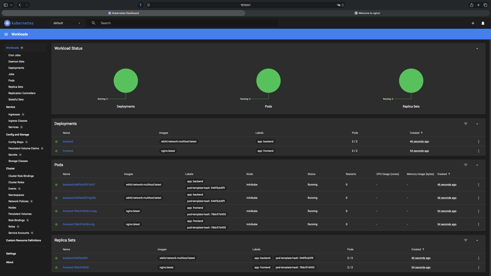

**Шаг 2. Создал Service для каждого приложения.**

Манифест `src/task2/service-frontend.yaml`:
```yaml
apiVersion: v1
kind: Service
metadata:
  name: frontend-svc
spec:
  selector:
    app: frontend
  ports:
    - protocol: TCP
      port: 80
      targetPort: 80
  type: ClusterIP
```

Манифест `src/task2/service-backend.yaml`:
```yaml
apiVersion: v1
kind: Service
metadata:
  name: backend-svc
spec:
  selector:
    app: backend
  ports:
    - protocol: TCP
      port: 80
      targetPort: 8080
  type: ClusterIP
```

```bash
kubectl apply -f src/task2/service-frontend.yaml
kubectl apply -f src/task2/service-backend.yaml
kubectl get svc
```

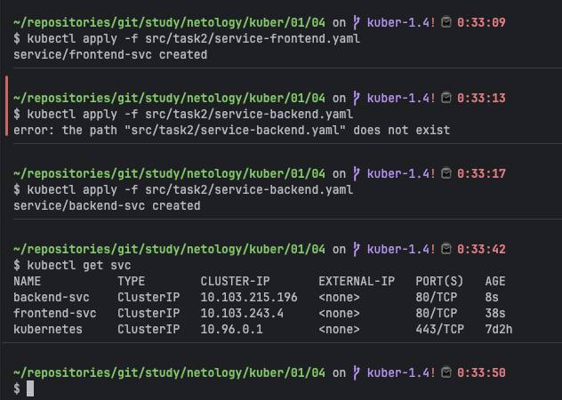

**Шаг 3. Включил Ingress-контроллер.**

```bash
minikube addons enable ingress
minikube addons list
```

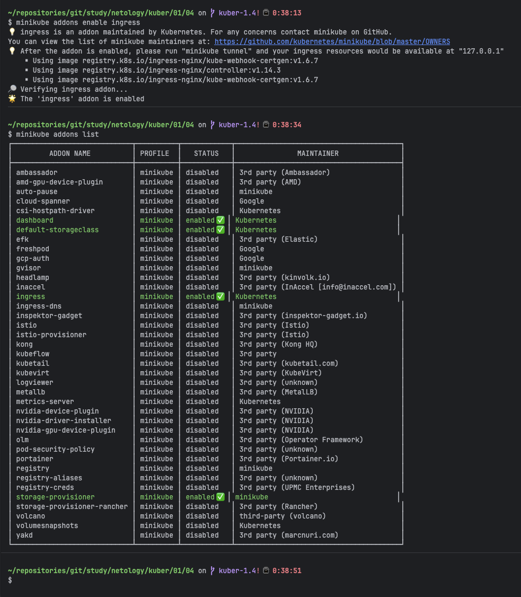

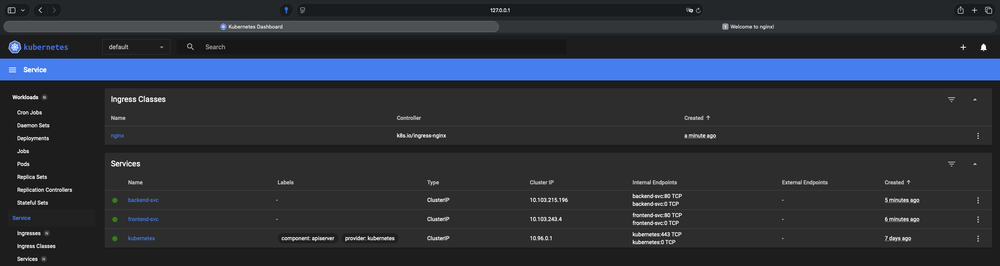

**Проверил, что Ingress Controller запущен:**

```bash
kubectl get pods -n ingress-nginx
kubectl get svc -n ingress-nginx
```

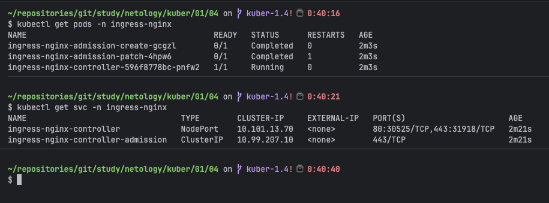

Ingress Controller запущен в namespace `ingress-nginx` и получил NodePort Service.

**Шаг 4. Создал Ingress.**

Манифест `src/task2/ingress.yaml`:
```yaml
apiVersion: networking.k8s.io/v1
kind: Ingress
metadata:
  name: app-ingress
  annotations:
    nginx.ingress.kubernetes.io/rewrite-target: /
spec:
  rules:
    - http:
        paths:
          - path: /
            pathType: Prefix
            backend:
              service:
                name: frontend-svc
                port:
                  number: 80
          - path: /api
            pathType: Prefix
            backend:
              service:
                name: backend-svc
                port:
                  number: 80
```

```bash
kubectl apply -f src/task2/ingress.yaml
kubectl get ingress
```

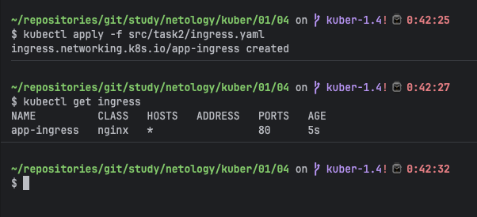

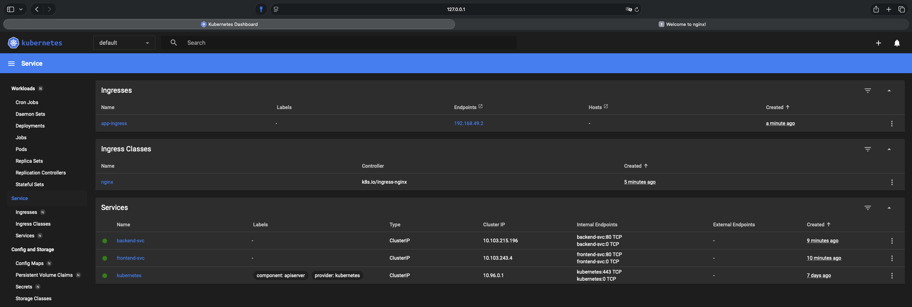

Ingress `app-ingress` создан с правилами маршрутизации по путям `/` и `/api`.

**Шаг 5. Проверил доступность.**

Получил адрес Ingress Controller через Minikube:

```bash
minikube service -n ingress-nginx ingress-nginx-controller --url
```

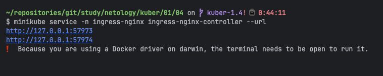

**Проверка frontend по пути `/`:**

```bash
curl http://127.0.0.1:55824/
```


**Проверка backend по пути `/api`:**

```bash
curl http://127.0.0.1:55824/api
```

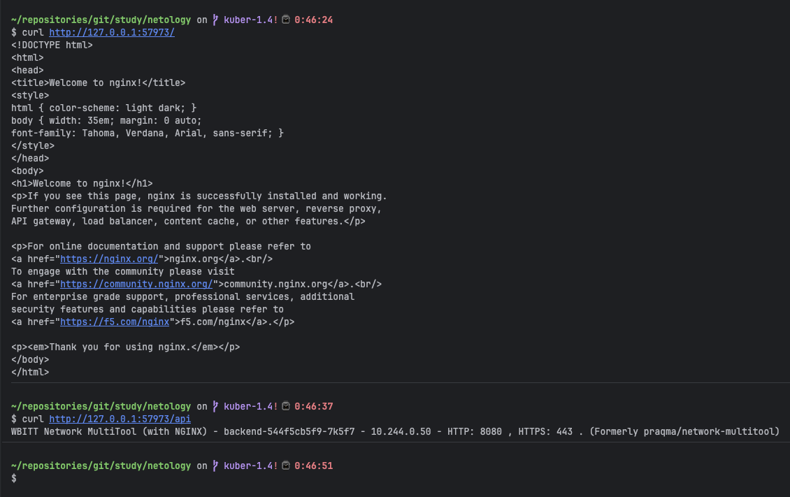

Получен HTML-ответ от Nginx — frontend доступен по пути `/`. Backend доступен по пути `/api`

> *Для проверки Ingress в Minikube используется команда `minikube service`, которая создаёт туннель между localhost и Ingress Controller внутри VM. Это стандартный механизм Minikube для локальной разработки. В production-кластере доступ осуществлялся бы по внешнему IP балансировщика.*
