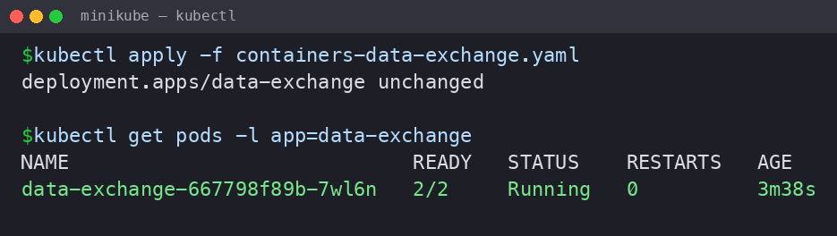
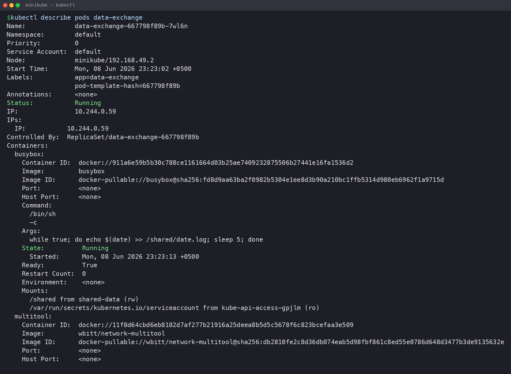
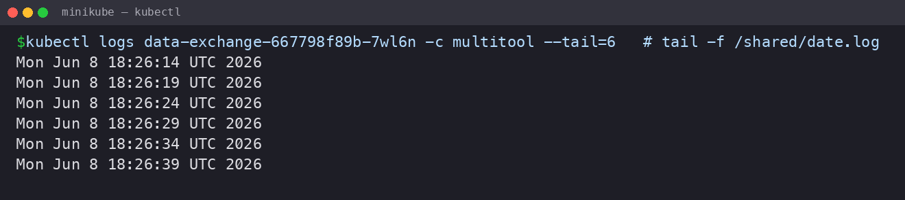
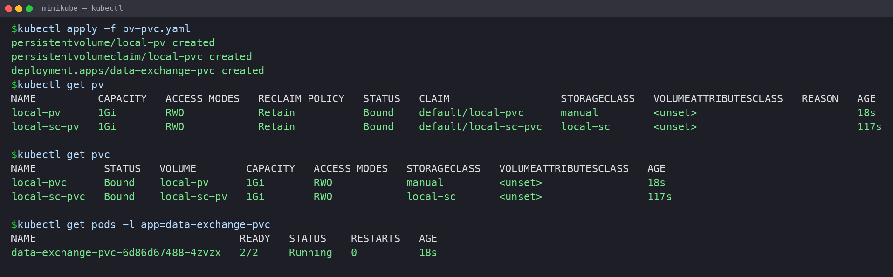
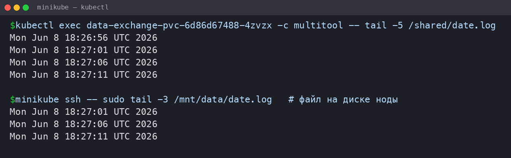
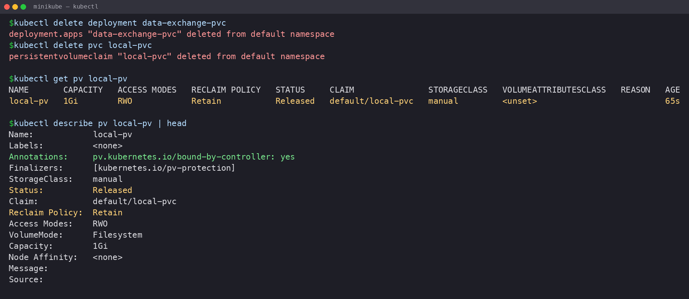
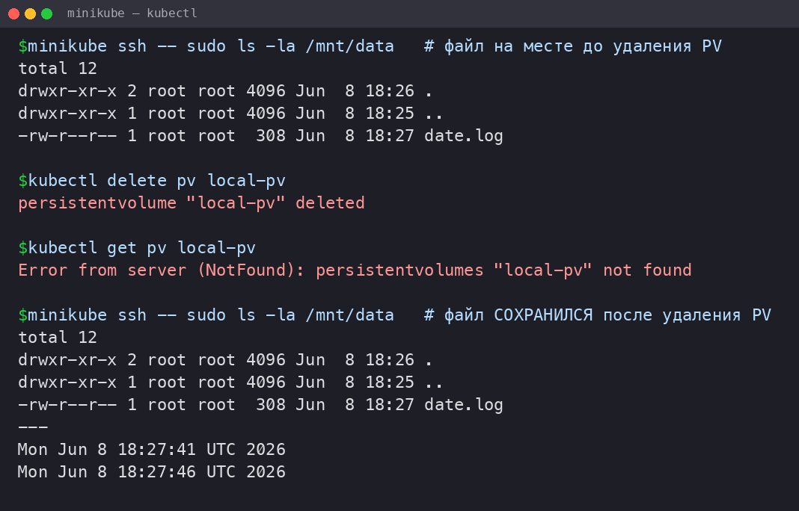
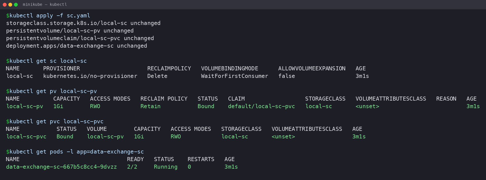
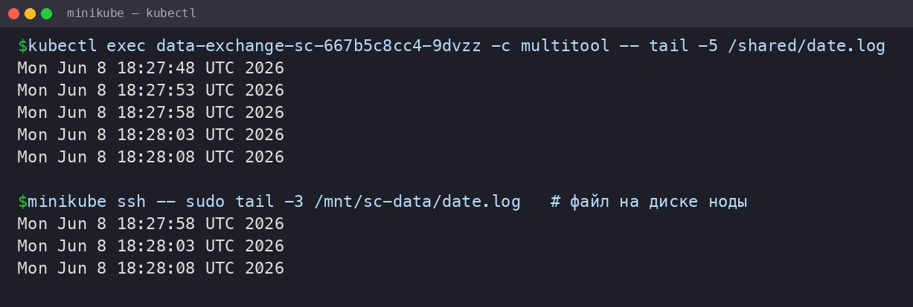

# Домашнее задание к занятию «Хранение в K8s»

### Примерное время выполнения задания — 180 минут

### Цель задания

Научиться работать с хранилищами в тестовой среде Kubernetes:
- обеспечить обмен файлами между контейнерами пода;
- создавать **PersistentVolume** (PV) и использовать его в подах через **PersistentVolumeClaim** (PVC);
- объявлять свой **StorageClass** (SC) и монтировать его в под через **PVC**.

Это задание поможет вам освоить базовые принципы взаимодействия с хранилищами в Kubernetes — одного из ключевых навыков для работы с кластерами. На практике Volume, PV, PVC используются для хранения данных независимо от пода, обмена данными между подами и контейнерами внутри пода. Понимание этих механизмов поможет вам упростить проектирование слоя данных для приложений, разворачиваемых в кластере k8s.

------

## **Подготовка**
### **Чеклист готовности**

1. Установленное K8s-решение (допустим, MicroK8S).
2. Установленный локальный kubectl.
3. Редактор YAML-файлов с подключенным GitHub-репозиторием.

> **Окружение, в котором выполнялась работа:** macOS (Apple Silicon, M4), Docker Desktop в роли драйвера, Minikube (`minikube start --driver=docker`), локальный `kubectl`.
>
> Файловая система контейнера **эфемерна**: файлы существуют, пока существует контейнер, а при его удалении или перезапуске изменения исчезают. Чтобы данные жили за пределами контейнера и пода, используется **Volume** — директория, которая объявляется на уровне пода и монтируется внутрь нужного контейнера по своему `mountPath`.

------

### Инструменты, которые пригодятся для выполнения задания

1. [Инструкция](https://microk8s.io/docs/getting-started) по установке MicroK8S.
2. [Инструкция](https://minikube.sigs.k8s.io/docs/start/?arch=%2Fwindows%2Fx86-64%2Fstable%2F.exe+download) по установке Minikube.
3. [Инструкция](https://kubernetes.io/docs/tasks/tools/install-kubectl-windows/) по установке kubectl.
4. [Инструкция](https://marketplace.visualstudio.com/items?itemName=ms-kubernetes-tools.vscode-kubernetes-tools) по установке VS Code

### Дополнительные материалы, которые пригодятся для выполнения задания
1. [Описание Volumes](https://kubernetes.io/docs/concepts/storage/volumes/).
2. [Описание Ephemeral Volumes](https://kubernetes.io/docs/concepts/storage/volumes/).
3. [Описание PersistentVolume](https://kubernetes.io/docs/concepts/storage/persistent-volumes/).
4. [Описание PersistentVolumeClaim](https://kubernetes.io/docs/concepts/storage/persistent-volumes/#persistentvolumeclaims).
5. [Описание StorageClass](https://kubernetes.io/docs/concepts/storage/storage-classes/).
6. [Описание Multitool](https://github.com/wbitt/Network-MultiTool).

------

## Задание 1. Volume: обмен данными между контейнерами в поде
### Задача

Создать Deployment приложения, состоящего из двух контейнеров, обменивающихся данными.

### Шаги выполнения
1. Создать Deployment приложения, состоящего из контейнеров busybox и multitool.
2. Настроить busybox на запись данных каждые 5 секунд в некий файл в общей директории.
3. Обеспечить возможность чтения файла контейнером multitool.


### Что сдать на проверку
- Манифесты:
    - `containers-data-exchange.yaml`
- Скриншоты:
    - описание пода с контейнерами (`kubectl describe pods data-exchange`)
    - вывод команды чтения файла (`tail -f <имя общего файла>`)

### Ответ

Манифест: [`src/task1/containers-data-exchange.yaml`](src/task1/containers-data-exchange.yaml)

Для обмена файлами между контейнерами одного пода использовал **Shared Volume** типа `emptyDir`. Это штатный сценарий: под объявляет локальный том на своём уровне, а каждый контейнер монтирует его в свою файловую систему.

- том `shared-data` (`emptyDir: {}`) объявлен на уровне пода;
- оба контейнера монтируют его в `/shared`, поэтому видят один и тот же файл;
- контейнер `busybox` каждые 5 секунд дописывает дату в `/shared/date.log`;
- контейнер `multitool` читает этот же файл командой `tail -f /shared/date.log`.

`emptyDir` создаётся и удаляется вместе с подом и хорошо подходит как раз для обмена файлами между контейнерами внутри пода.

**Шаг 1. Создал Deployment, под поднялся со статусом `2/2 Running`.**

```bash
kubectl apply -f containers-data-exchange.yaml
kubectl get pods -l app=data-exchange
```



**Шаг 2. Описание пода с двумя контейнерами (`kubectl describe pods data-exchange`).**

В описании видно оба контейнера (`busybox`, `multitool`) и общий том `shared-data`, смонтированный в `/shared` у каждого из них.



**Шаг 3. Контейнер `multitool` читает файл, который пишет `busybox` (`tail -f /shared/date.log`).**

Записи появляются с интервалом 5 секунд — значит, контейнеры действительно обмениваются данными через общий том.



------

## Задание 2. PV, PVC
### Задача
Создать Deployment приложения, использующего локальный PV, созданный вручную.

### Шаги выполнения
1. Создать Deployment приложения, состоящего из контейнеров busybox и multitool, использующего созданный ранее PVC
2. Создать PV и PVC для подключения папки на локальной ноде, которая будет использована в поде.
3. Продемонстрировать, что контейнер multitool может читать данные из файла в смонтированной директории, в который busybox записывает данные каждые 5 секунд.
4. Удалить Deployment и PVC. Продемонстрировать, что после этого произошло с PV. Пояснить, почему. (Используйте команду `kubectl describe pv`).
5. Продемонстрировать, что файл сохранился на локальном диске ноды. Удалить PV.  Продемонстрировать, что произошло с файлом после удаления PV. Пояснить, почему.


### Что сдать на проверку
- Манифесты:
    - `pv-pvc.yaml`
- Скриншоты:
    - каждый шаг выполнения задания, начиная с шага 2.
- Описания:
    - объяснение наблюдаемого поведения ресурсов в двух последних шагах.

### Ответ

Манифест: [`src/task2/pv-pvc.yaml`](src/task2/pv-pvc.yaml)

Здесь применил разделение ролей: **PV** — это представление хранилища в кластере (абстрактный ресурс, который не зависит от пода), а **PVC** — заявка на выделение тома, которую под подключает к себе.

- **PersistentVolume** `local-pv` — локальный том типа `hostPath` (`/mnt/data` на ноде), `capacity: 1Gi`, `accessModes: ReadWriteOnce` (RWO — том монтируется на чтение и запись только к одной ноде), `persistentVolumeReclaimPolicy: Retain`;
- **PersistentVolumeClaim** `local-pvc` — заявка на `1Gi` с тем же классом и режимом доступа; через `volumeName: local-pv` привязана к конкретному PV;
- **Deployment** `data-exchange-pvc` — те же `busybox` (писатель) и `multitool` (читатель), но том берётся уже из PVC.

Связка (bound) PVC ↔ PV происходит при совпадении характеристик (класс, объём, режим доступа). `storageClassName: manual` указан и в PV, и в PVC намеренно: в Minikube включён аддон `default-storageclass`, и без явного класса PVC ушёл бы на динамический провижининг вместо привязки к нашему ручному PV.

**Шаг 2. Создал PV и PVC, развернул Deployment. PVC связался с PV (`STATUS: Bound`), под `2/2 Running`.**

```bash
kubectl apply -f pv-pvc.yaml
kubectl get pv
kubectl get pvc
kubectl get pods -l app=data-exchange-pvc
```



**Шаг 3. `multitool` читает данные из смонтированной директории; тот же файл лежит на диске ноды в `/mnt/data`.**

```bash
kubectl exec <pod> -c multitool -- tail -5 /shared/date.log
minikube ssh -- sudo tail -3 /mnt/data/date.log
```



**Шаг 4. Удалил Deployment и PVC. PV перешёл в статус `Released`.**

```bash
kubectl delete deployment data-exchange-pvc
kubectl delete pvc local-pvc
kubectl get pv local-pv
kubectl describe pv local-pv
```



**Пояснение (шаг 4).**
PV не удалился вместе с PVC и не вернулся в статус `Available`, а перешёл в `Released`. Причина — политика `persistentVolumeReclaimPolicy: Retain`. `ReclaimPolicy` определяет, что произойдёт с ресурсами после удаления PV: при `Retain` Kubernetes намеренно **не освобождает** том и не удаляет данные автоматически — это сделано для томов с ценными данными. В поле `Claim` у PV по-прежнему указан удалённый `default/local-pvc`: именно эта ссылка не даёт тому связаться с новым PVC. Чтобы переиспользовать PV, его пришлось бы вручную «почистить» (убрать `claimRef`) или пересоздать. (Для сравнения: `Delete` удаляет внешний ресурс автоматически, но работает в облачных Storage, а `Recycle` — устаревший вариант.)

**Шаг 5. Файл сохранился на локальном диске ноды. Удалил PV — файл остался на месте.**

```bash
minikube ssh -- sudo ls -la /mnt/data        # файл на месте до удаления PV
kubectl delete pv local-pv
kubectl get pv local-pv                       # NotFound — объект PV удалён
minikube ssh -- sudo ls -la /mnt/data         # файл СОХРАНИЛСЯ после удаления PV
```



**Пояснение (шаг 5).**
После удаления объекта PV файл `date.log` остался лежать в `/mnt/data` на ноде. Причина та же — политика `Retain` плюс природа `hostPath`. PV — это объект Kubernetes, который лишь **описывает** хранилище и работает с ним как с абстрактным ресурсом; он не владеет самими данными. Для `hostPath` физические данные — это обычная директория на диске ноды. Удаление PV убирает только запись об объекте в API кластера, но не трогает каталог на хосте. Поэтому файл переживает и удаление PVC, и удаление PV, и убирать его пришлось бы вручную с ноды.

------

## Задание 3. StorageClass
### Задача
Создать Deployment приложения, использующего PVC, созданный на основе StorageClass.

### Шаги выполнения

1. Создать Deployment приложения, состоящего из контейнеров busybox и multitool, использующего созданный ранее PVC.
2. Создать SC и PVC для подключения папки на локальной ноде, которая будет использована в поде.
3. Продемонстрировать, что контейнер multitool может читать данные из файла в смонтированной директории, в который busybox записывает данные каждые 5 секунд.

### Что сдать на проверку
- Манифесты:
    - `sc.yaml`
- Скриншоты:
    - каждый шаг выполнения задания, начиная с шага 2

### Ответ

Манифест: [`src/task3/sc.yaml`](src/task3/sc.yaml)

**StorageClass** — это объект, который описывает класс хранилища (имя, `provisioner` — драйвер хранилища, параметры). Обычно SC применяют для динамического создания PV: provisioner сам выделяет PV под характеристики из PVC. Но для локального хранилища провижинить нечего, поэтому используется «пустой» провижинер.

- **StorageClass** `local-sc` — `provisioner: kubernetes.io/no-provisioner` (автоматического создания томов нет), `volumeBindingMode: WaitForFirstConsumer` (привязка PVC к PV откладывается до появления пода-потребителя);
- **PersistentVolume** `local-sc-pv` — статический локальный PV под этот класс (`hostPath: /mnt/sc-data`, `storageClassName: local-sc`);
- **PersistentVolumeClaim** `local-sc-pvc` — заявка к классу `local-sc`;
- **Deployment** `data-exchange-sc` — `busybox` + `multitool` поверх PVC.

С `no-provisioner` тома автоматически не создаются, поэтому к классу добавлен статический PV — иначе при `WaitForFirstConsumer` PVC так и остался бы в `Pending` (связывать его было бы не с чем).

**Шаг 2. Создал SC, PV под него и PVC, развернул Deployment. PVC связался (`Bound`), под `2/2 Running`.**

```bash
kubectl apply -f sc.yaml
kubectl get sc local-sc
kubectl get pv local-sc-pv
kubectl get pvc local-sc-pvc
kubectl get pods -l app=data-exchange-sc
```



**Шаг 3. `multitool` читает файл, который `busybox` пишет каждые 5 секунд; тот же файл на диске ноды в `/mnt/sc-data`.**

```bash
kubectl exec <pod> -c multitool -- tail -5 /shared/date.log
minikube ssh -- sudo tail -3 /mnt/sc-data/date.log
```



---
## Шаблоны манифестов с учебными комментариями
### 1. Deployment (containers-data-exchange.yaml)
```yaml
apiVersion: apps/v1
kind: Deployment
metadata:
  name: data-exchange
spec:
  replicas: # ЗАДАНИЕ: Укажите количество реплик
  selector:
    matchLabels:
      app: # ДОПОЛНИТЕ: Метка для селектора
  template:
    metadata:
      labels:
        app: # ПОВТОРИТЕ: Метка из selector.matchLabels
    spec:
      containers:
      - name: # ДОПОЛНИТЕ: Имя первого контейнера
        image: busybox
        command: ["/bin/sh", "-c"] 
        args: ["echo $(date) > путь_к_файлу; sleep 3600"] # КЛЮЧЕВОЕ: Команда записи данных в файл в директории из секции volumeMounts контейнера
        volumeMounts:
        - name: # ДОПОЛНИТЕ: Имя монтируемого раздела. Должно совпадать с именем эфемерного хранилища, объявленного на уровне пода.
          mountPath: # КЛЮЧЕВОЕ: Путь монтирования эфемерного хранилища внутри контейнера 1
      - name: # ДОПОЛНИТЕ: Имя второго контейнера
        image: busybox
        command: ["/bin/sh", "-c"]
        args: ["tail -f путь_к_файлу"] # КЛЮЧЕВОЕ: Команда для чтения данных из файла, расположенного в директории, указанной в volumeMounts контейнера
        volumeMounts:
        - name: # ДОПОЛНИТЕ: Имя монтируемого раздела. Должно совпадать с именем эфемерного хранилища, объявленного на уровне пода
          mountPath: # КЛЮЧЕВОЕ: Путь монтирования эфемерного хранилища внутри контейнера 2
      volumes:
      - name: # ДОПОЛНИТЕ: Имя монтируемого раздела эфемерного хранилища
        emptyDir: {} # ИНФОРМАЦИЯ: Определяем эфемерное хранилище, которое работает только внутри пода
```
### 2. Deployment (pv-pvc.yaml)
```yaml
---
apiVersion: v1
kind: PersistentVolume
metadata:
  name: # ДОПОЛНИТЕ: Имя хранилища
spec:
  capacity:
    storage: 1Gi
  volumeMode: Filesystem
  accessModes:
    - ReadWriteOnce
  persistentVolumeReclaimPolicy: Retain
  hostPath:
    path: # КЛЮЧЕВОЕ: Путь к директории на ноде (хосте, на котором развёрнут кластер)
---
apiVersion: v1
kind: PersistentVolumeClaim
metadata:
  name: # ДОПОЛНИТЕ: Имя PVC
spec:
  volumeName: # ДОПОЛНИТЕ: Имя PV, к которому будет привязан PVC, должен совпадать с созданным ранее PV
  volumeMode: Filesystem
  accessModes:
    - ReadWriteOnce
  resources:
    requests:
      storage: # ДОПОЛНИТЕ: Какой объём хранилища вы хотите передать в контейнер. Должно быть меньше или равно параметру storage из PV
---
apiVersion: apps/v1
kind: Deployment
metadata:
  name: data-exchange-pvc
spec:
  replicas: # ЗАДАНИЕ: Укажите количество реплик
  selector:
    matchLabels:
      app: # ДОПОЛНИТЕ: Метка для селектора
  template:
    metadata:
      labels:
        app: # ПОВТОРИТЕ: Метка из selector.matchLabels
    spec:
      containers:
      - name: # ДОПОЛНИТЕ: Имя первого контейнера
        image: busybox
        command: ["/bin/sh", "-c"] 
        args: ["echo $(date) > путь_к_файлу; sleep 3600"] # КЛЮЧЕВОЕ: Команда записи данных в файл в директории из секции volumeMounts контейнера 
        volumeMounts:
        - name: # ДОПОЛНИТЕ: Имя монтируемого раздела. Должно совпадать с именем хранилища, объявленного на уровне пода
          mountPath: # КЛЮЧЕВОЕ: Путь монтирования хранилища внутри контейнера 1
      - name: # ДОПОЛНИТЕ: Имя второго контейнера
        image: busybox
        command: ["/bin/sh", "-c"]
        args: ["tail -f путь_к_файлу"] # КЛЮЧЕВОЕ: Команда для чтения данных из файла, расположенного в директории, указанной в volumeMounts контейнера
        volumeMounts:
        - name: # ДОПОЛНИТЕ: Имя монтируемого раздела. Должно совпадать с именем хранилища, объявленного на уровне пода
          mountPath: # КЛЮЧЕВОЕ: Путь монтирования хранилища внутри контейнера 2
      volumes:
      - name: # ДОПОЛНИТЕ: Имя монтируемого раздела хранилища
        persistentVolumeClaim:
          claimName: # КЛЮЧЕВОЕ: Совпадает с именем PVC объявленного ранее
```
### 3. Deployment (sc.yaml)
```yaml
apiVersion: storage.k8s.io/v1
kind: StorageClass
metadata:
  name: # ДОПОЛНИТЕ: Имя StorageClass
provisioner: kubernetes.io/no-provisioner # ИНФОРМАЦИЯ: Нет автоматического развёртывания
volumeBindingMode: WaitForFirstConsumer
---
apiVersion: v1
kind: PersistentVolumeClaim
metadata:
  name: # ДОПОЛНИТЕ: Имя PVC
spec:
  volumeMode: Filesystem
  accessModes:
    - ReadWriteOnce
  resources:
    requests:
      storage: # ДОПОЛНИТЕ: Какой объем хранилища вы хотите передать в контейнер. Должно быть меньше или равно параметру storage из PV
  storageClassName: # ДОПОЛНИТЕ: Имя StorageClass. Должно совпадать с объявленным ранее
---
apiVersion: apps/v1
kind: Deployment
metadata:
  name: data-exchange-sc
spec:
  replicas: # ЗАДАНИЕ: Укажите количество реплик
  selector:
    matchLabels:
      app: # ДОПОЛНИТЕ: Метка для селектора
  template:
    metadata:
      labels:
        app: # ПОВТОРИТЕ: Метка из selector.matchLabels
    spec:
      containers:
      - name: # ДОПОЛНИТЕ: Имя первого контейнера
        image: busybox
        command: ["/bin/sh", "-c"] 
        args: ["echo $(date) > путь_к_файлу; sleep 3600"] # КЛЮЧЕВОЕ: Команда для чтения данных из файла, расположенного в директории, указанной в volumeMounts контейнера
        volumeMounts:
        - name: # ДОПОЛНИТЕ: Имя монтируемого раздела. Должно совпадать с именем хранилища, объявленного на уровне пода
          mountPath: # КЛЮЧЕВОЕ: Путь монтирования хранилища внутри контейнера 1
      - name: # ДОПОЛНИТЕ: Имя второго контейнера
        image: busybox
        command: ["/bin/sh", "-c"]
        args: ["tail -f путь_к_файлу"] # КЛЮЧЕВОЕ: Команда для чтения данных из файла, расположенного в директории, указанной в volumeMounts контейнера
        volumeMounts:
        - name: # ДОПОЛНИТЕ: Имя монтируемого раздела. Должно совпадать с именем хранилища, объявленного на уровне пода
          mountPath: # КЛЮЧЕВОЕ: Путь монтирования хранилища внутри контейнера 2
      volumes:
      - name: # ДОПОЛНИТЕ: Имя монтируемого раздела хранилища
        persistentVolumeClaim:
          claimName: # КЛЮЧЕВОЕ: Совпадает с именем PVC объявленного ранее
```

## **Правила приёма работы**
1. Домашняя работа оформляется в своём Git-репозитории в файле README.md. Выполненное домашнее задание пришлите ссылкой на .md-файл в вашем репозитории.
2. Файл README.md должен содержать скриншоты вывода необходимых команд `kubectl`, скриншоты результатов, пояснения.
3. Репозиторий должен содержать тексты манифестов или ссылки на них в файле README.md.

## **Критерии оценивания задания**
1. Зачёт: Все задачи выполнены, манифесты корректны, есть доказательства работы (скриншоты) и пояснения по заданию 2.
2. Доработка (на доработку задание направляется 1 раз): основные задачи выполнены, при этом есть ошибки в манифестах или отсутствуют проверочные скриншоты.
3. Незачёт: работа выполнена не в полном объёме, есть ошибки в манифестах, отсутствуют проверочные скриншоты. Все попытки доработки израсходованы (на доработку работа направляется 1 раз). Этот вид оценки используется крайне редко.

## **Срок выполнения задания**
1. 5 дней на выполнение задания.
2. 5 дней на доработку задания (в случае направления задания на доработку).
