# Домашнее задание к занятию «Настройка приложений и управление доступом в Kubernetes»

### Примерное время выполнения задания

120 минут

### Цель задания

Научиться:
- Настраивать конфигурацию приложений с помощью **ConfigMaps** и **Secrets**
- Управлять доступом пользователей через **RBAC**

Это задание поможет вам освоить ключевые механизмы Kubernetes для работы с конфигурацией и безопасностью. Эти навыки необходимы для уверенного администрирования кластеров в реальных проектах. На практике навыки используются для:
- Хранения чувствительных данных (Secrets)
- Гибкого управления настройками приложений (ConfigMaps)
- Контроля доступа пользователей и сервисов (RBAC)

------

## **Подготовка**
### **Чеклист готовности**
- Установлен Kubernetes (MicroK8S, Minikube или другой)
- Установлен `kubectl`
- Редактор для YAML-файлов (VS Code, Vim и др.)
- Утилита `openssl` для генерации сертификатов

------

### Инструменты, которые пригодятся для выполнения задания

1. [Инструкция](https://microk8s.io/docs/getting-started) по установке MicroK8S
2. [Инструкция](https://minikube.sigs.k8s.io/docs/start/) по установке Minikube
3. [Инструкция](https://kubernetes.io/docs/tasks/tools/) по установке kubectl
4. [Инструкция](https://marketplace.visualstudio.com/items?itemName=ms-kubernetes-tools.vscode-kubernetes-tools) по установке VS Code

### Дополнительные материалы, которые пригодятся для выполнения задания

1. [Описание](https://kubernetes.io/docs/concepts/configuration/secret/) Secret.
2. [Описание](https://kubernetes.io/docs/concepts/configuration/configmap/) ConfigMap.
3. [Описание](https://github.com/wbitt/Network-MultiTool) Multitool.
4. [Описание](https://kubernetes.io/docs/reference/access-authn-authz/rbac/) RBAC.
5. [Пользователи и авторизация RBAC в Kubernetes](https://habr.com/ru/company/flant/blog/470503/).
6. [RBAC with Kubernetes in Minikube](https://medium.com/@HoussemDellai/rbac-with-kubernetes-in-minikube-4deed658ea7b).

------

## **Задание 1: Работа с ConfigMaps**
### **Задача**
Развернуть приложение (nginx + multitool), решить проблему конфигурации через ConfigMap и подключить веб-страницу.

### **Шаги выполнения**
1. **Создать Deployment** с двумя контейнерами
    - `nginx`
    - `multitool`
3. **Подключить веб-страницу** через ConfigMap
4. **Проверить доступность**

### **Что сдать на проверку**
- Манифесты:
    - `deployment.yaml`
    - `configmap-web.yaml`
- Скриншот вывода `curl` или браузера

### Ответ:

**Манифест `src/task1/configmap-web.yaml`:**

```yaml
apiVersion: v1
kind: ConfigMap
metadata:
  name: web-content
  namespace: default
data:
  index.html: |
    <!DOCTYPE html>
    <html>
    <head>
      <title>Netology K8s Lab 2.3</title>
    </head>
    <body>
      <h1>Hello from Kubernetes ConfigMap!</h1>
      <p>Задание 1: ConfigMap подключён как Volume</p>
    </body>
    </html>
```

**Манифест `src/task1/deployment.yaml`:**

```yaml
apiVersion: apps/v1
kind: Deployment
metadata:
  name: web-app
  namespace: default
  labels:
    app: web-app
spec:
  replicas: 1
  selector:
    matchLabels:
      app: web-app
  template:
    metadata:
      labels:
        app: web-app
    spec:
      containers:
        - name: nginx
          image: nginx:latest
          ports:
            - containerPort: 80
          volumeMounts:
            - name: web-content
              mountPath: /usr/share/nginx/html
        - name: multitool
          image: wbitt/network-multitool
          ports:
            - containerPort: 8080
          env:
            - name: HTTP_PORT
              value: "8080"
      volumes:
        - name: web-content
          configMap:
            name: web-content
---
apiVersion: v1
kind: Service
metadata:
  name: web-app-svc
  namespace: default
spec:
  selector:
    app: web-app
  ports:
    - name: nginx
      port: 80
      targetPort: 80
    - name: multitool
      port: 8080
      targetPort: 8080
```

---

**1.** Применил ConfigMap и проверил его содержимое с помощью команд:
```bash
kubectl apply -f configmap-web.yaml
kubectl get cm web-content
kubectl describe cm web-content
```

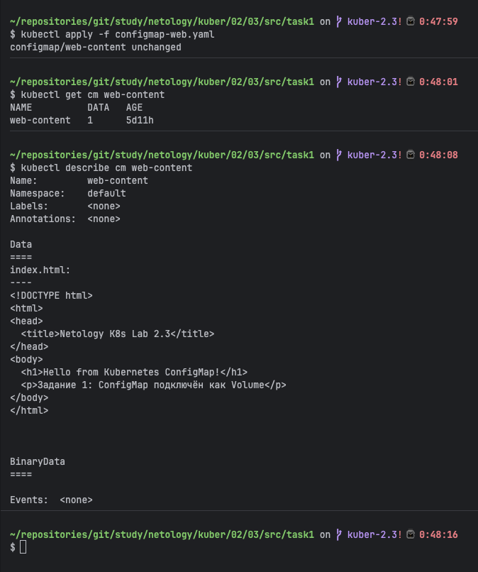

**2.** Затем шли Deployment и Service:
```bash
kubectl apply -f deployment.yaml
kubectl get pods -l app=web-app
kubectl get svc web-app-svc
```

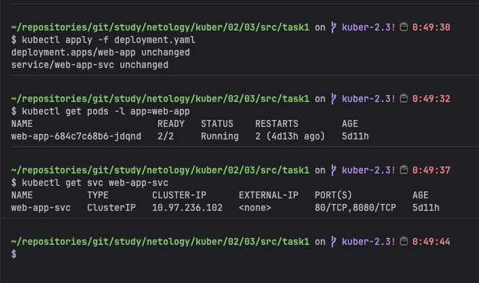

**3.** После проброса порта из ConfigMap провил страницу:
```bash
kubectl port-forward svc/web-app-svc 8090:80 &
curl http://localhost:8090
kill %1
```

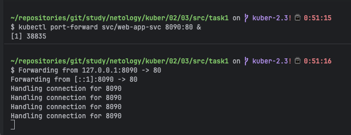

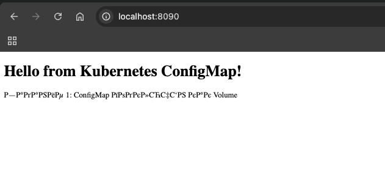

> поплыла кодировка
---

**5.** Внутри контейнера файл есть. Убедились благодаря сложному запросу с помощью одной строки:
```bash
kubectl exec \
  $(kubectl get pods -l app=web-app -o jsonpath='{.items[0].metadata.name}') \
  -c nginx -- ls /usr/share/nginx/html/
```

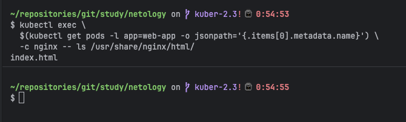

---
## **Задание 2: Настройка HTTPS с Secrets**
### **Задача**
Развернуть приложение с доступом по HTTPS, используя самоподписанный сертификат.

### **Шаги выполнения**
1. **Сгенерировать SSL-сертификат**
```bash
openssl req -x509 -nodes -days 365 -newkey rsa:2048 \
  -keyout tls.key -out tls.crt -subj "/CN=myapp.example.com"
```
2. **Создать Secret**
3. **Настроить Ingress**
4. **Проверить HTTPS-доступ**

### **Что сдать на проверку**
- Манифесты:
    - `secret-tls.yaml`
    - `ingress-tls.yaml`
- Скриншот вывода `curl -k`

### Ответ:

Создал самоподписанный TLS-сертификат, упаковал его в Secret типа `kubernetes.io/tls` и настроил Ingress с TLS-терминацией.

> **Важно про SAN:** Современный nginx-ingress отклоняет сертификаты без поля SAN (Subject Alternative Name) с ошибкой `x509: certificate relies on legacy Common Name field`. Поэтому в openssl добавлен флаг `-addext`.

> **Важно про SNI:** Флаг `curl -H "Host:"` меняет только HTTP-заголовок, но НЕ меняет имя в TLS-рукопожатии (SNI). Nginx-ingress смотрит именно на SNI, чтобы выбрать нужный сертификат. Поэтому используем `--resolve`.

> **Важно про NodeIP на macOS:** minikube с Docker driver не пробрасывает NodeIP (192.168.49.2) на хост. Используем `kubectl port-forward` на ingress-controller.

**Манифест `src/task2/secret-tls.yaml`:**

```yaml
apiVersion: v1
kind: Secret
metadata:
  name: myapp-tls-secret
  namespace: default
type: kubernetes.io/tls
data:
  tls.crt: <base64: cat tls.crt | base64 | tr -d '\n'>
  tls.key: <base64: cat tls.key | base64 | tr -d '\n'>
```

**Манифест `src/task2/ingress-tls.yaml`:**

```yaml
apiVersion: networking.k8s.io/v1
kind: Ingress
metadata:
  name: myapp-ingress-tls
  namespace: default
  annotations:
    nginx.ingress.kubernetes.io/ssl-redirect: "true"
spec:
  ingressClassName: nginx
  tls:
    - hosts:
        - myapp.example.com
      secretName: myapp-tls-secret
  rules:
    - host: myapp.example.com
      http:
        paths:
          - path: /
            pathType: Prefix
            backend:
              service:
                name: web-app-svc
                port:
                  number: 80
```

---

**1.** Включил Ingress addon:
```bash
minikube addons enable ingress
kubectl get pods -n ingress-nginx
```

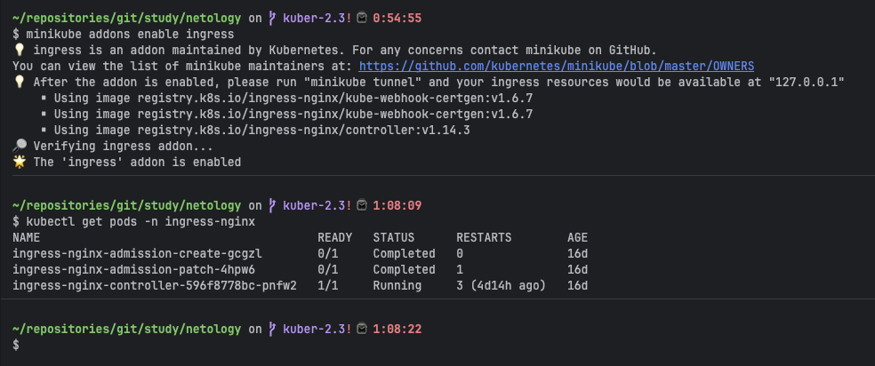

**2.** Сгенерировал самоподписанный сертификат с SAN:
```bash
openssl req -x509 -nodes -days 365 -newkey rsa:2048 \
  -keyout tls.key \
  -out tls.crt \
  -subj "/CN=myapp.example.com/O=Netology" \
  -addext "subjectAltName=DNS:myapp.example.com"
```

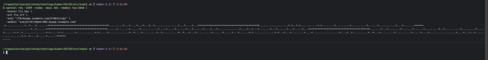

SAN прописан:
```bash
openssl x509 -in tls.crt -noout -text | grep -A2 "Subject Alternative"
```

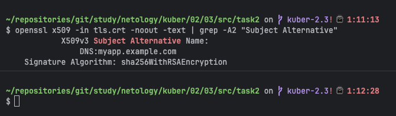

**3.** Создал Secret, а затем применил его:
```bash
kubectl create secret tls myapp-tls-secret \
  --cert=tls.crt \
  --key=tls.key \
  --dry-run=client -o yaml > secret-tls.yaml

kubectl apply -f secret-tls.yaml
kubectl get secret myapp-tls-secret
```

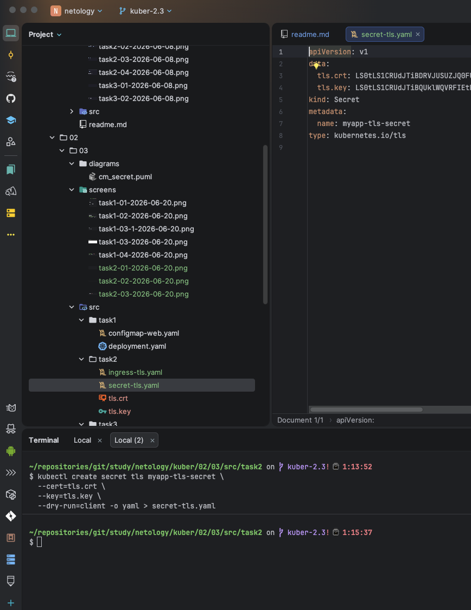

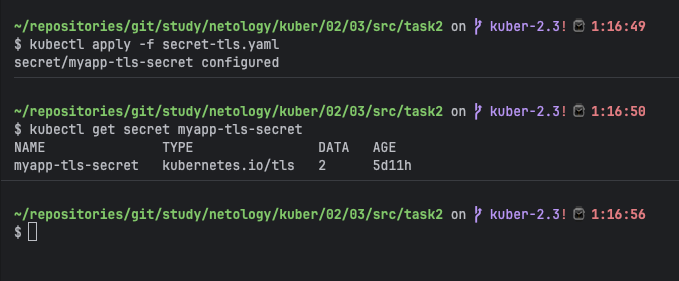

**4.** А теперь проверим Ingress:
```bash
kubectl apply -f ingress-tls.yaml
kubectl get ingress myapp-ingress-tls
kubectl describe ingress myapp-ingress-tls
```

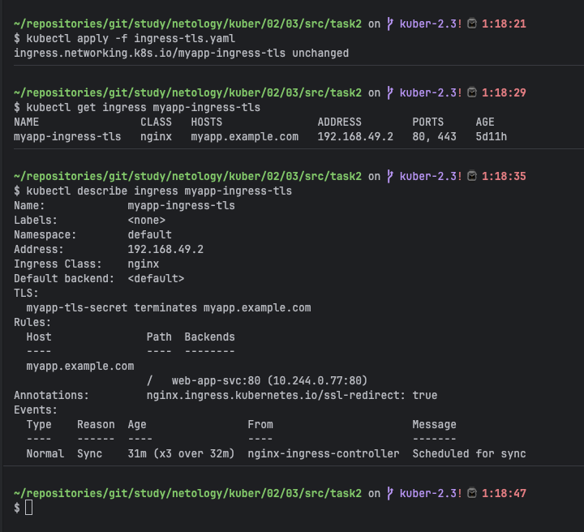

**5.** HTTPS через port-forward:
```bash
kubectl port-forward -n ingress-nginx \
  $(kubectl get pod -n ingress-nginx -l app.kubernetes.io/component=controller \
    -o jsonpath='{.items[0].metadata.name}') 9443:443 &
```

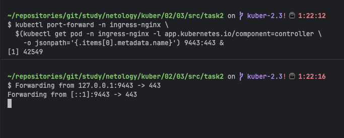

и проверим живучесть:

```bash
curl -k --resolve "myapp.example.com:9443:127.0.0.1" \
  https://myapp.example.com:9443/

openssl s_client -connect localhost:9443 \
  -servername myapp.example.com 2>&1 | grep "subject="
```

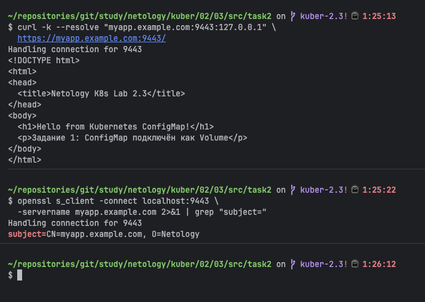

---
## **Задание 3: Настройка RBAC**
### **Задача**
Создать пользователя с ограниченными правами (только просмотр логов и описания подов).

### **Шаги выполнения**
1. **Включите RBAC в microk8s**
```bash
microk8s enable rbac
```
2. **Создать SSL-сертификат для пользователя**
```bash
openssl genrsa -out developer.key 2048
openssl req -new -key developer.key -out developer.csr -subj "/CN={ИМЯ ПОЛЬЗОВАТЕЛЯ}"
openssl x509 -req -in developer.csr -CA {CA серт вашего кластера} -CAkey {CA ключ вашего кластера} -CAcreateserial -out developer.crt -days 365
```
3. **Создать Role (только просмотр логов и описания подов) и RoleBinding**
4. **Проверить доступ**

### **Что сдать на проверку**
- Манифесты:
    - `role-pod-reader.yaml`
    - `rolebinding-developer.yaml`
- Команды генерации сертификатов
- Скриншот проверки прав (`kubectl get pods --as=developer`)

### Ответ:

Создал пользователя `developer` через SSL-сертификат, подписанный CA кластера minikube. Назначил Role с доступом только к `pods` и `pods/log`. Проверил, что запрещённые операции возвращают Forbidden.

> Как Kubernetes понимает, кто такой `developer`? Имя пользователя — это поле `CN` (Common Name) в SSL-сертификате. Когда `kubectl` делает запрос с этим сертификатом, кластер читает CN и ищет его в RoleBinding.

**Манифест `src/task3/role-pod-reader.yaml`:**

```yaml
apiVersion: rbac.authorization.k8s.io/v1
kind: Role
metadata:
  name: pod-reader
  namespace: default
rules:
  - apiGroups: [""]
    resources:
      - pods
      - pods/log
    verbs:
      - get
      - list
      - watch
```

**Манифест `src/task3/rolebinding-developer.yaml`:**

```yaml
apiVersion: rbac.authorization.k8s.io/v1
kind: RoleBinding
metadata:
  name: developer-pod-reader
  namespace: default
subjects:
  - kind: User
    name: developer
    apiGroup: rbac.authorization.k8s.io
roleRef:
  kind: Role
  name: pod-reader
  apiGroup: rbac.authorization.k8s.io
```

---

**1.** Создал ключ и CSR для пользователя:
```bash
openssl genrsa -out developer.key 2048

openssl req -new -key developer.key-out developer.csr -subj "/CN=developer"
```

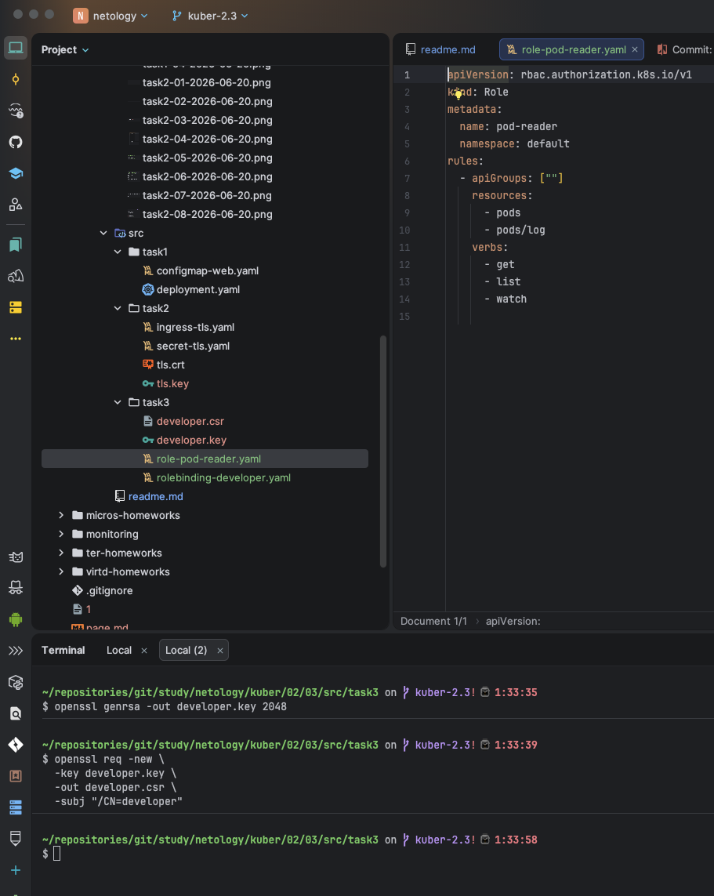

**2.** Далее пропишем CSR через CA кластера minikube:
```bash
openssl x509 -req \
  -in developer.csr \
  -CA ~/.minikube/ca.crt \
  -CAkey ~/.minikube/ca.key \
  -CAcreateserial \
  -out developer.crt \
  -days 365

openssl x509 -in developer.crt -noout -subject
```

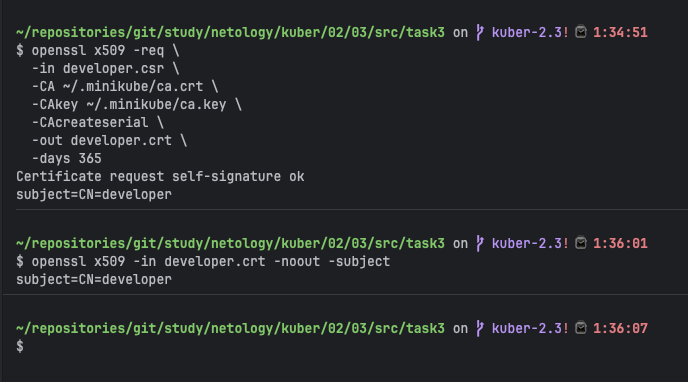

**3.** Затем идут Role и RoleBinding:
```bash
kubectl apply -f role-pod-reader.yaml
kubectl apply -f rolebinding-developer.yaml
kubectl describe role pod-reader
```

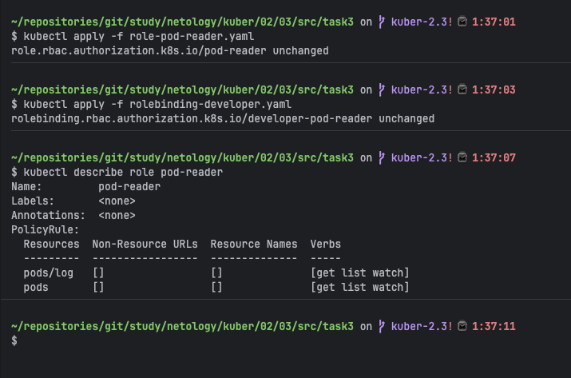

**4.** Зарегали пользователя в kubeconfig с помощью команд:
```bash
kubectl config set-credentials developer \
  --client-certificate=developer.crt \
  --client-key=developer.key

kubectl config set-context developer-context \
  --cluster=minikube \
  --namespace=default \
  --user=developer
```

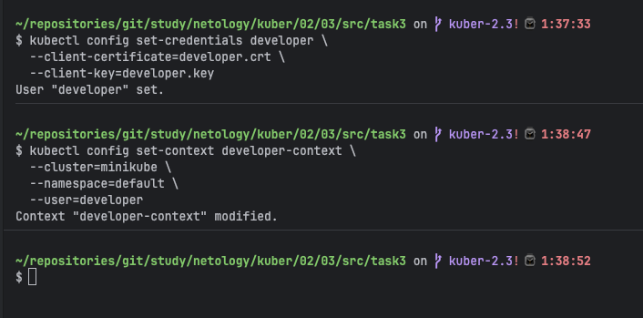

Доверяем, но проверяем:
```bash
kubectl get pods --context=developer-context

kubectl logs \
  $(kubectl get pods -l app=web-app -o jsonpath='{.items[0].metadata.name}') \
  -c nginx --context=developer-context | head -5
```

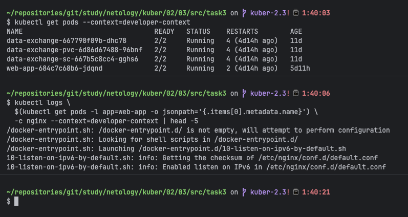

**5.** Все три операции дали `Forbidden` по следующим запрещенным командам:
```bash
kubectl get deployments --context=developer-context
kubectl get secrets --context=developer-context
kubectl delete pod \
  $(kubectl get pods -l app=web-app -o jsonpath='{.items[0].metadata.name}') \
  --context=developer-context
```

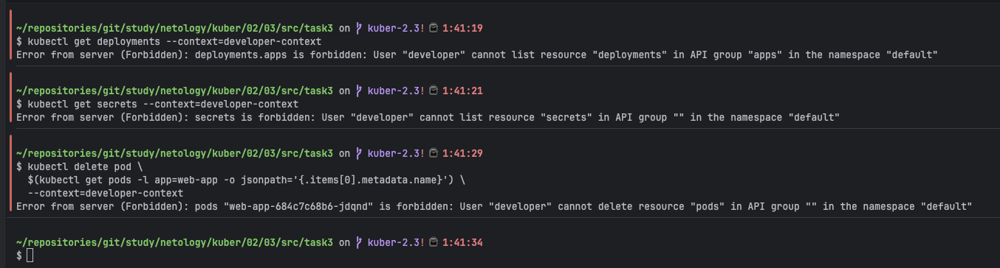

---
## Шаблоны манифестов с учебными комментариями
### **1. Deployment с ConfigMap (nginx + multitool)**
```yaml
apiVersion: apps/v1
kind: Deployment
metadata:
  name: web-app
spec:
  replicas: 1
  selector:
    matchLabels:
      app: web-app
  template:
    metadata:
      labels:
        app: web-app
    spec:
      containers:
      - name: nginx
        image: nginx:latest
        ports:
        - containerPort: 80
        volumeMounts:
        - name: nginx-config # ПОДКЛЮЧЕНИЕ ConfigMap
          mountPath: /etc/nginx/conf.d
      volumes:
      - name: nginx-config
        configMap:
          name: nginx-config # УКАЖИТЕ имя созданного ConfigMap
```
### **2. ConfigMap для веб-страницы**
```yaml
apiVersion: v1
kind: ConfigMap
metadata:
  name: web-content # ИЗМЕНИТЕ: Укажите имя ConfigMap
  namespace: default # ОПЦИОНАЛЬНО: Укажите namespace, если не default
data:
  # КЛЮЧЕВОЙ МОМЕНТ: index.html будет подключен как файл
  index.html: |
    <!DOCTYPE html>
    <html>
    <head>
      <title>Страница из ConfigMap</title> # ИЗМЕНИТЕ: Заголовок страницы
    </head>
    <body>
      <h1>Привет от Kubernetes!</h1> # ДОБАВЬТЕ: Свой контент страницы
    </body>
    </html>
```

### **3. Secret для TLS-сертификата**
```yaml
apiVersion: v1
kind: Secret
metadata:
  name: tls-secret # ИЗМЕНИТЕ при необходимости
type: kubernetes.io/tls
data:
  tls.crt: # ЗАМЕНИТЕ на base64-код сертификата (cat tls.crt | base64 -w 0)
  tls.key: # ЗАМЕНИТЕ на base64-код ключа (cat tls.key | base64 -w 0)
```
### **4. Role для просмотра подов**
```yaml
apiVersion: rbac.authorization.k8s.io/v1
kind: Role
metadata:
  name: pod-viewer # ИЗМЕНИТЕ: Название роли
  namespace: default # ВАЖНО: Role работает только в указанном namespace
rules:
- apiGroups: [""] # КЛЮЧЕВОЙ МОМЕНТ: "" означает core API group
  resources: # РАЗРЕШЕННЫЕ РЕСУРСЫ:
    - pods # Доступ к просмотру подов
    - pods/log # Доступ к логам подов
  verbs: # РАЗРЕШЕННЫЕ ДЕЙСТВИЯ:
    - get # Просмотр отдельных подов
    - list # Список всех подов
    - watch # Мониторинг изменений
    - describe # Просмотр деталей
# ДОПОЛНИТЕЛЬНО: Можно добавить больше правил для других ресурсов
```
---

## **Правила приёма работы**
1. Домашняя работа оформляется в своём Git-репозитории в файле README.md. Выполненное домашнее задание пришлите ссылкой на .md-файл в вашем репозитории.
2. Файл README.md должен содержать:
    - Скриншоты вывода команд `kubectl`
    - Скриншоты результатов выполнения
    - Тексты манифестов или ссылки на них
3. Для заданий с TLS приложите команды генерации сертификатов

## **Критерии оценивания задания**
1. Зачёт: Все задачи выполнены, манифесты корректны, есть доказательства работы (скриншоты).
2. Доработка (на доработку задание направляется 1 раз): основные задачи выполнены, при этом есть ошибки в манифестах или отсутствуют проверочные скриншоты.
3. Незачёт: работа выполнена не в полном объёме, есть ошибки в манифестах, отсутствуют проверочные скриншоты. Все попытки доработки израсходованы (на доработку работа направляется 1 раз). Этот вид оценки используется крайне редко.

## **Срок выполнения задания**
1. 5 дней на выполнение задания.
2. 5 дней на доработку задания (в случае направления задания на доработку).