# Домашнее задание к занятию «Helm»

### Цель задания

В тестовой среде Kubernetes необходимо установить и обновить приложения с помощью Helm.

------

### Чеклист готовности к домашнему заданию

1. Установленное k8s-решение, например, MicroK8S.
2. Установленный локальный kubectl.
3. Установленный локальный Helm.
4. Редактор YAML-файлов с подключенным репозиторием GitHub.

------

### Инструменты и дополнительные материалы, которые пригодятся для выполнения задания

1. [Инструкция](https://helm.sh/docs/intro/install/) по установке Helm. [Helm completion](https://helm.sh/docs/helm/helm_completion/).

------

### Задание 1. Подготовить Helm-чарт для приложения

1. Необходимо упаковать приложение в чарт для деплоя в разные окружения.
2. Каждый компонент приложения деплоится отдельным deployment’ом или statefulset’ом.
3. В переменных чарта измените образ приложения для изменения версии.

------

### Ответ:

**Шаг 1. Подготовил структуру Helm-чарта.**

Чарт приложения находится в каталоге [`src/netology-app`](src/netology-app). Внутри него используются стандартные файлы `Chart.yaml`, `values.yaml` и шаблоны Kubernetes-ресурсов.

Проверил структуру каталога:

```bash
find ./src/netology-app -maxdepth 2 -type f | sort
```

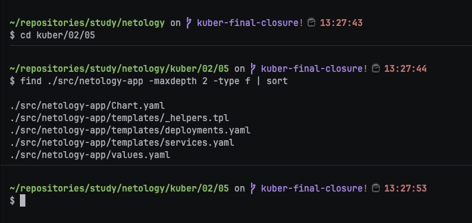

На скриншоте видны `Chart.yaml`, `values.yaml` и файлы из каталога `templates`.

**Шаг 2. Проверил, что компоненты приложения разворачиваются отдельно.**

Frontend и backend описаны отдельными Deployment и Service. Это позволяет независимо изменять образы и параметры каждого компонента.

Проверил итоговые Kubernetes-манифесты, которые формирует Helm:

```bash
helm template app1-v1 ./src/netology-app \
  --namespace app1 \
  -f ./src/values-app1-v1.yaml
```

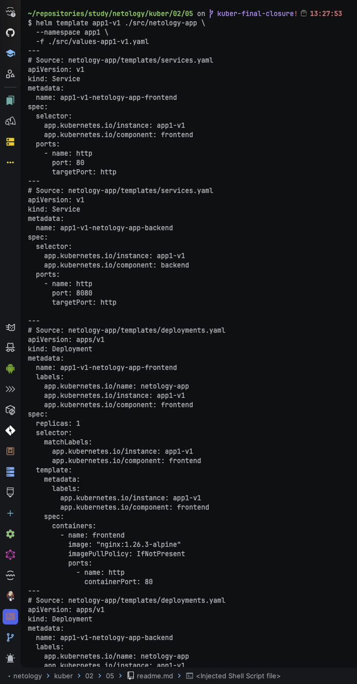

В выводе последовательно ресурсы frontend и backend с именами релиза `app1-v1`.

**Шаг 3. Проверил возможность менять версии образов через values-файлы.**

Для разных версий подготовлены отдельные файлы:

- [`src/values-app1-v1.yaml`](src/values-app1-v1.yaml);
- [`src/values-app1-v2.yaml`](src/values-app1-v2.yaml);
- [`src/values-app2-v1.yaml`](src/values-app2-v1.yaml).

Сравнил значения образов:

```bash
diff -u ./src/values-app1-v1.yaml ./src/values-app1-v2.yaml || true
```

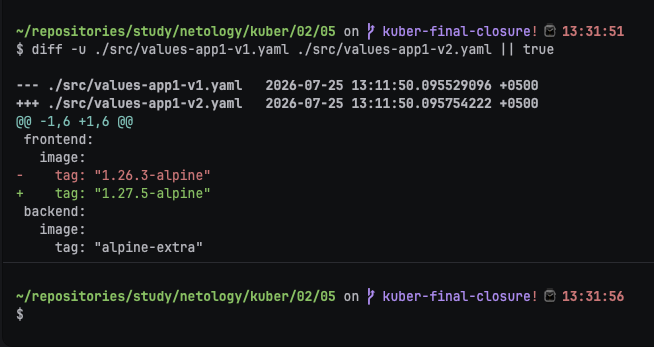

Разница в values-файлах показывает изменение тегов образов без редактирования шаблонов чарта.

**Шаг 4. Выполнил статическую проверку чарта.**

```bash
helm lint ./src/netology-app
```

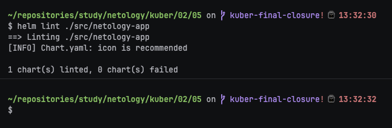

Успешный `helm lint` подтверждает, что структура чарта и шаблоны корректны.

---

## Задание 2. Запустить две версии в разных неймспейсах

1. Подготовив чарт, необходимо его проверить. Запуститe несколько копий приложения.
2. Одну версию в namespace=app1, вторую версию в том же неймспейсе, третью версию в namespace=app2.
3. Продемонстрируйте результат.

### Ответ:

**Шаг 1. Создал namespace `app1`.**

```bash
kubectl create namespace app1 --dry-run=client -o yaml | kubectl apply -f -
```

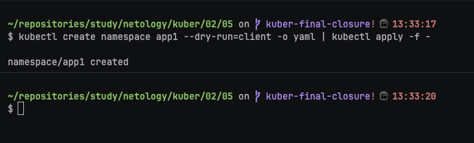

Команда идемпотентно создаёт namespace `app1` или оставляет существующий без ошибки.

**Шаг 2. Создал namespace `app2`.**

```bash
kubectl create namespace app2 --dry-run=client -o yaml | kubectl apply -f -
```

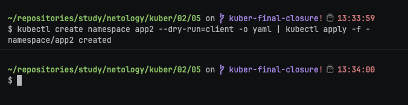

После этого оба окружения готовы к установке релизов.

**Шаг 3. Установил первую версию приложения в namespace `app1`.**

```bash
helm upgrade --install app1-v1 ./src/netology-app \
  --namespace app1 \
  -f ./src/values-app1-v1.yaml
```

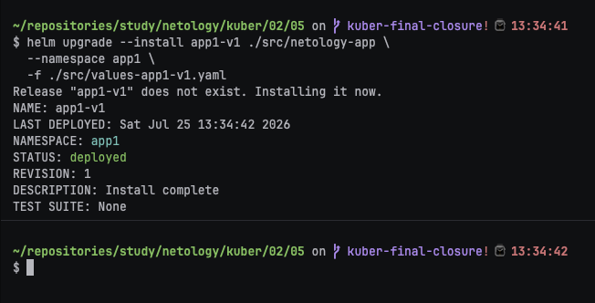

Релиз `app1-v1` устанавливается с параметрами первой версии.

**Шаг 4. Установил вторую версию приложения в том же namespace `app1`.**

```bash
helm upgrade --install app1-v2 ./src/netology-app \
  --namespace app1 \
  -f ./src/values-app1-v2.yaml
```

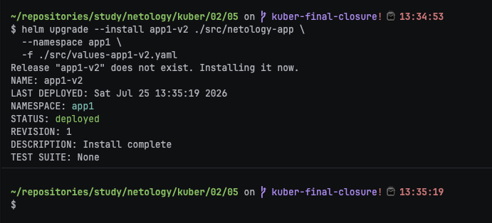

В одном namespace одновременно находятся два независимых Helm-релиза с разными именами и версиями образов.

**Шаг 5. Установил третью версию приложения в namespace `app2`.**

```bash
helm upgrade --install app2-v1 ./src/netology-app \
  --namespace app2 \
  -f ./src/values-app2-v1.yaml
```

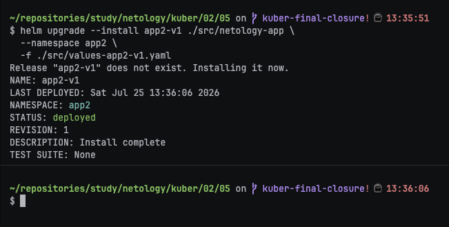

Третий релиз изолирован отдельным namespace.

**Шаг 6. Проверил список Helm-релизов.**

```bash
helm list --all-namespaces
```

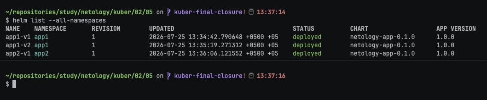

В выводе видны `app1-v1`, `app1-v2` и `app2-v1` с соответствующими namespace.

**Шаг 7. Проверил ресурсы в namespace `app1`.**

```bash
kubectl get deployments,pods,services -n app1 -o wide
```

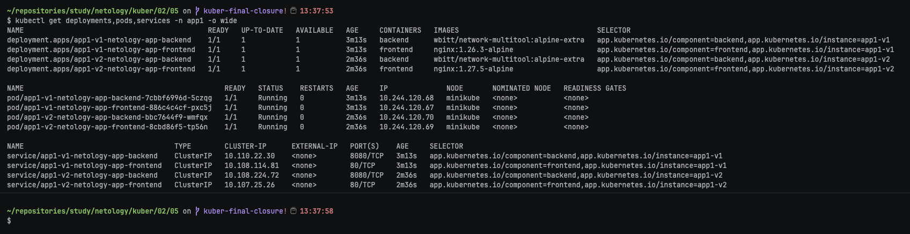

На скриншоте видны ресурсы двух релизов из `app1`.

**Шаг 8. Проверил ресурсы в namespace `app2`.**

```bash
kubectl get deployments,pods,services -n app2 -o wide
```

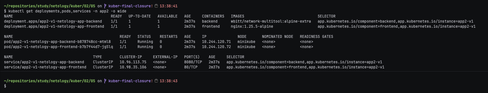

На скриншоте должны быть видны ресурсы релиза `app2-v1`. Фактический статус фиксируется только после выполнения команд в кластере.

### Правила приёма работы

1. Домашняя работа оформляется в своём Git репозитории в файле README.md. Выполненное домашнее задание пришлите ссылкой на .md-файл в вашем репозитории.
2. Файл README.md должен содержать скриншоты вывода необходимых команд `kubectl`, `helm`, а также скриншоты результатов.
3. Репозиторий должен содержать тексты манифестов или ссылки на них в файле README.md.
