# Домашнее задание к занятию «Установка Kubernetes»

### Цель задания

Установить кластер K8s.

### Чеклист готовности к домашнему заданию

1. Развёрнутые ВМ с ОС Ubuntu 20.04-lts.


### Инструменты и дополнительные материалы, которые пригодятся для выполнения задания

1. [Инструкция по установке kubeadm](https://kubernetes.io/docs/setup/production-environment/tools/kubeadm/create-cluster-kubeadm/).
2. [Документация kubespray](https://kubespray.io/).

-----

### Задание 1. Установить кластер k8s с 1 master node

1. Подготовка работы кластера из 5 нод: 1 мастер и 4 рабочие ноды.
2. В качестве CRI — containerd.
3. Запуск etcd производить на мастере.
4. Способ установки выбрать самостоятельно.

### Ответ:

Для выполнения задания использовал `Minikube` с Docker driver. Кластер разворачивался локально на MacBook с процессором Apple Silicon (`arm64`) и 16 ГБ оперативной памяти. В качестве CRI использовал `containerd`.

> В исходном условии указаны отдельные ВМ с Ubuntu 20.04 LTS. На моём стенде отдельные ВМ не использовались: Minikube создаёт изолированные Kubernetes-ноды внутри Docker Desktop. Такой вариант позволяет выполнить задание локально на macOS и проверить кластер из пяти нод.

**1.** Проверил архитектуру MacBook и версии установленных инструментов:

```bash
uname -m
minikube version
kubectl version --client
```

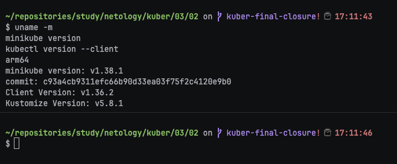

Архитектура хоста — `arm64`.

**2.** Создал кластер из пяти нод через Docker driver с `containerd`:

```bash
minikube start \
  -p netology-k8s \
  --driver=docker \
  --container-runtime=containerd \
  --nodes=5 \
  --cpus=2 \
  --memory=2048mb
```

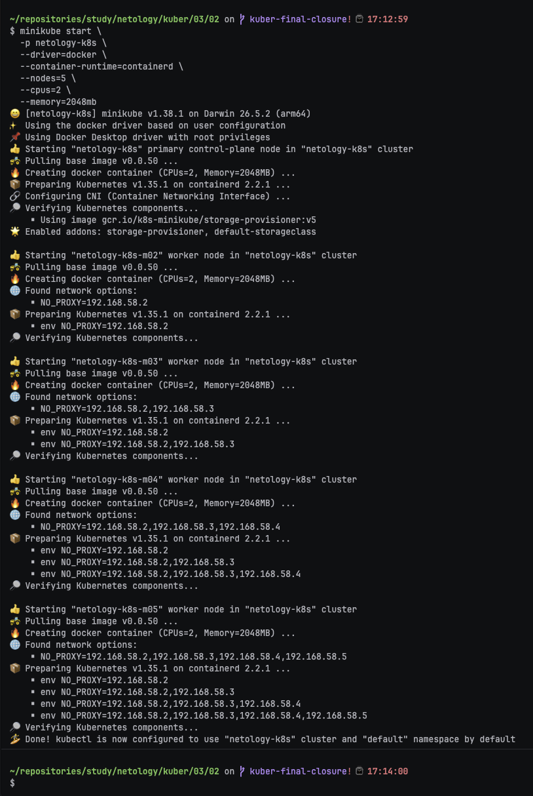


На MacBook с 16 ГБ памяти для каждой ноды выделено по 2 ГБ. Перед запуском закрыл лишние ресурсоёмкие приложения и не запускал одновременно второй Minikube-профиль.

**4.** Проверил состояние профиля и всех созданных нод:

```bash
minikube status -p netology-k8s
minikube profile list
```

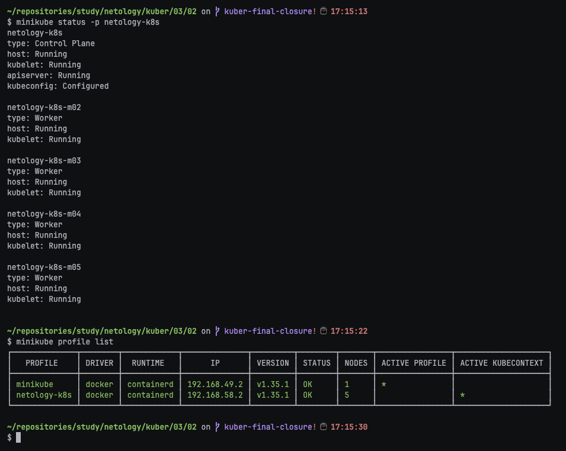

Основная нода имеет роль control plane, остальные четыре ноды добавлены как worker.

**5.** Проверил состав кластера:

```bash
kubectl get nodes -o wide
```

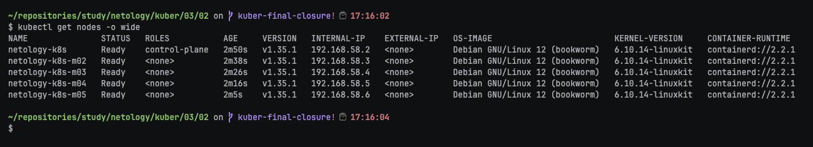

В выводе получили пять нод:

- `netology-k8s` — control-plane;
- `netology-k8s-m02` — worker;
- `netology-k8s-m03` — worker;
- `netology-k8s-m04` — worker;
- `netology-k8s-m05` — worker.

**6.** Далее проверил, что на всех нодах используется `containerd`:

```bash
kubectl get nodes \
  -o custom-columns='NAME:.metadata.name,ROLE:.metadata.labels.node-role\.kubernetes\.io/control-plane,RUNTIME:.status.nodeInfo.containerRuntimeVersion'
```

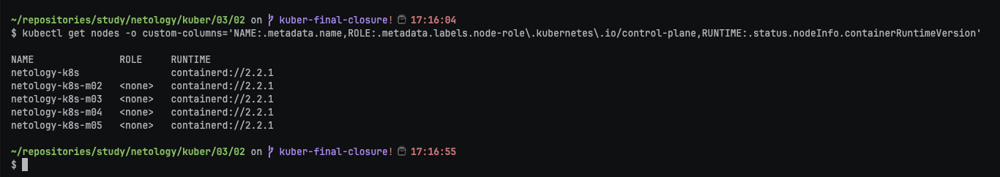

В колонке `RUNTIME` у всех пяти нод должно быть значение `containerd://...`.

**7.** Проверил запуск `etcd` на control-plane-ноде:

```bash
kubectl get pods -n kube-system \
  -l component=etcd \
  -o wide
```

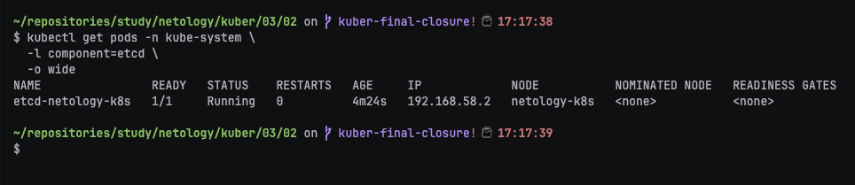

В обычном многоузловом профиле Minikube экземпляр `etcd` запущен на основной control-plane-ноде `netology-k8s`.

**8.** Затем проверил системные Pod кластера:

```bash
kubectl get pods -A -o wide
```

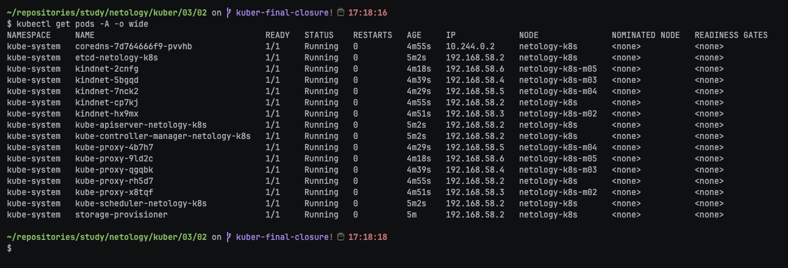

Системные компоненты Kubernetes находятся в состоянии `Running`.

**9.** Для проверки работы scheduler создал тестовый Deployment из четырёх реплик:

```bash
kubectl create deployment nginx \
  --image=nginx:alpine \
  --replicas=4

kubectl rollout status deployment/nginx
kubectl get pods -o wide
```

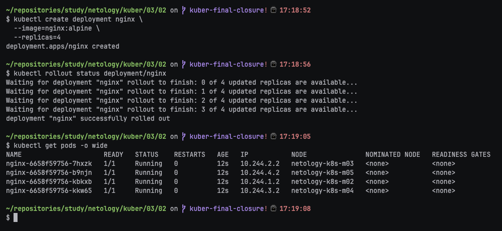

По выводу `kubectl get pods -o wide` можно проверить, на каких worker-нодах были запущены реплики.

**10.** Открыл тестовое приложение через Service:

```bash
kubectl expose deployment nginx \
  --type=NodePort \
  --port=80

minikube service nginx -p netology-k8s --url
```

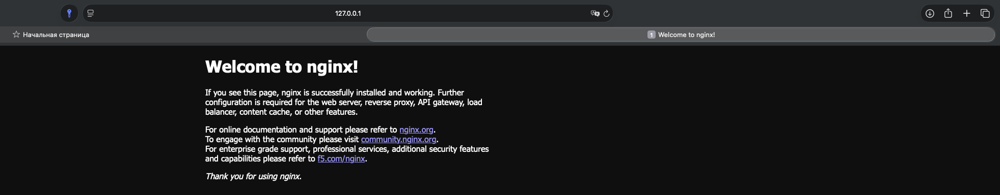

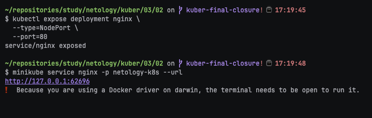

После выполнения обязательного задания остановил кластер, чтобы освободить память перед запуском HA-профиля:

```bash
minikube stop -p netology-k8s
```

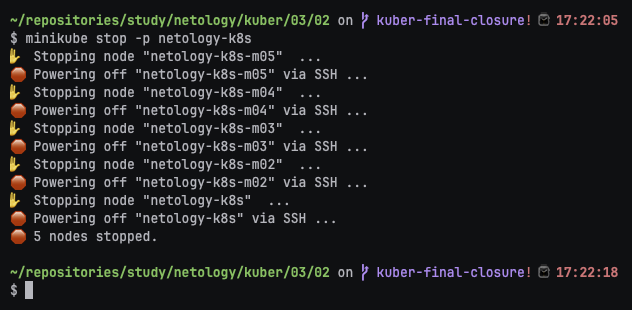

---

## Дополнительные задания (со звёздочкой)

**Настоятельно рекомендуем выполнять все задания под звёздочкой.** Их выполнение поможет глубже разобраться в материале.
Задания под звёздочкой необязательные к выполнению и не повлияют на получение зачёта по этому домашнему заданию.

------

### Задание 2*. Установить HA кластер

1. Установить кластер в режиме HA.
2. Использовать нечётное количество Master-node.
3. Для cluster ip использовать keepalived или другой способ.

### Правила приёма работы

1. Домашняя работа оформляется в своем Git-репозитории в файле README.md. Выполненное домашнее задание пришлите ссылкой на .md-файл в вашем репозитории.
2. Файл README.md должен содержать скриншоты вывода необходимых команд `kubectl get nodes`, а также скриншоты результатов.
3. Репозиторий должен содержать тексты манифестов или ссылки на них в файле README.md.
