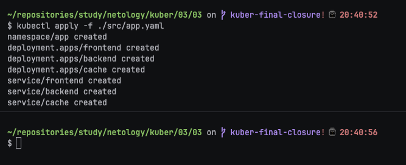
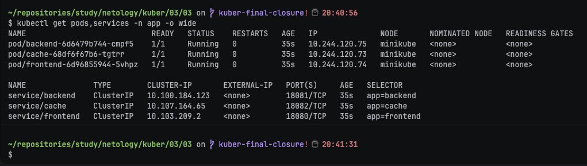
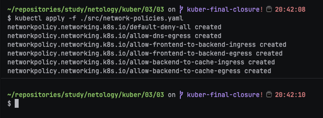
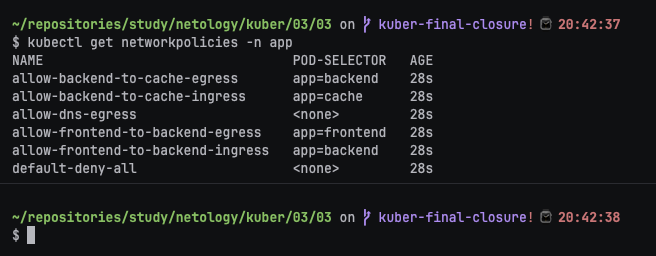
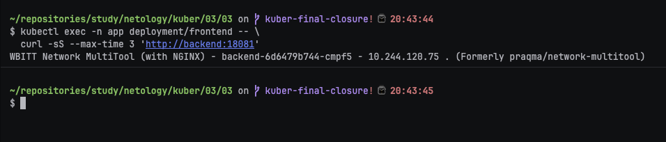
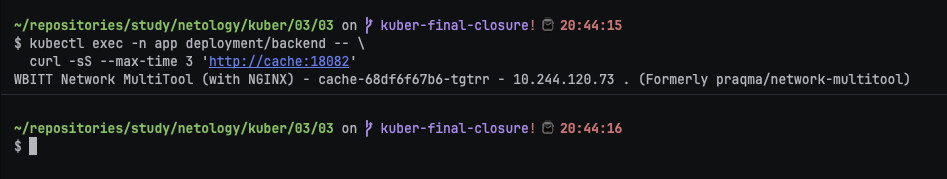
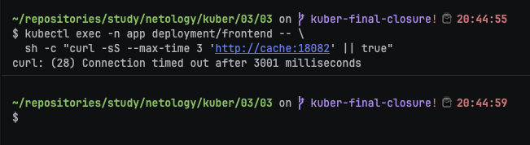
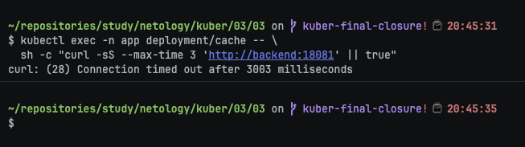

# Домашнее задание к занятию «Как работает сеть в K8s»

### Цель задания

Настроить сетевую политику доступа к подам.

### Чеклист готовности к домашнему заданию

1. Кластер K8s с установленным сетевым плагином Calico.

### Инструменты и дополнительные материалы, которые пригодятся для выполнения задания

1. [Документация Calico](https://www.tigera.io/project-calico/).
2. [Network Policy](https://kubernetes.io/docs/concepts/services-networking/network-policies/).
3. [About Network Policy](https://docs.projectcalico.org/about/about-network-policy).

-----

### Задание 1. Создать сетевую политику или несколько политик для обеспечения доступа

1. Создать deployment'ы приложений frontend, backend и cache и соответсвующие сервисы.
2. В качестве образа использовать network-multitool.
3. Разместить поды в namespace App.
4. Создать политики, чтобы обеспечить доступ frontend -> backend -> cache. Другие виды подключений должны быть запрещены.
5. Продемонстрировать, что трафик разрешён и запрещён.


### Ответ:

Манифесты приложений и Service находятся в [`src/app.yaml`](src/app.yaml), сетевые политики — в [`src/network-policies.yaml`](src/network-policies.yaml).

**Шаг 1. Создал namespace и приложения frontend, backend и cache.**

```bash
kubectl apply -f ./src/app.yaml
```



Манифест создаёт namespace `app`, три Deployment и три Service. Для всех контейнеров используется multi-arch образ `wbitt/network-multitool`.

**Шаг 2. Проверил состояние Pod и Service до применения политик.**

```bash
kubectl get pods,services -n app -o wide
```



Все три приложения должны быть запущены, а Service — иметь ClusterIP.

**Шаг 3. Применил сетевые политики.**

```bash
kubectl apply -f ./src/network-policies.yaml
```



Политики сначала запрещают весь ingress-трафик, затем отдельно разрешают DNS, направление `frontend -> backend` и направление `backend -> cache`.

**Шаг 4. Проверил созданные NetworkPolicy.**

```bash
kubectl get networkpolicies -n app
```



В namespace `app` должны отображаться default-deny и разрешающие политики.

**Шаг 5. Проверил разрешённое соединение frontend → backend.**

```bash
kubectl exec -n app deployment/frontend -- \
  curl -sS --max-time 3 'http://backend:18081'
```



Успешный HTTP-ответ подтверждает разрешённое направление.

**Шаг 6. Проверил разрешённое соединение backend → cache.**

```bash
kubectl exec -n app deployment/backend -- \
  curl -sS --max-time 3 'http://cache:18082'
```



Успешный HTTP-ответ подтверждает второе разрешённое направление.

**Шаг 7. Проверил запрещённое соединение frontend → cache.**

```bash
kubectl exec -n app deployment/frontend -- \
  sh -c "curl -sS --max-time 3 'http://cache:18082' || true"
```



Тайм-аут или ошибка соединения подтверждают, что прямой доступ frontend к cache запрещён.

**Шаг 8. Проверил запрещённое обратное соединение cache → backend.**

```bash
kubectl exec -n app deployment/cache -- \
  sh -c "curl -sS --max-time 3 'http://backend:18081' || true"
```



Ошибка соединения подтверждает, что непредусмотренное обратное направление заблокировано.

### Правила приёма работы

1. Домашняя работа оформляется в своём Git-репозитории в файле README.md. Выполненное домашнее задание пришлите ссылкой на .md-файл в вашем репозитории.
2. Файл README.md должен содержать скриншоты вывода необходимых команд, а также скриншоты результатов.
3. Репозиторий должен содержать тексты манифестов или ссылки на них в файле README.md.