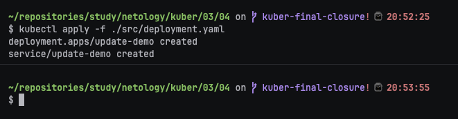
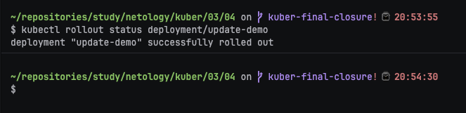
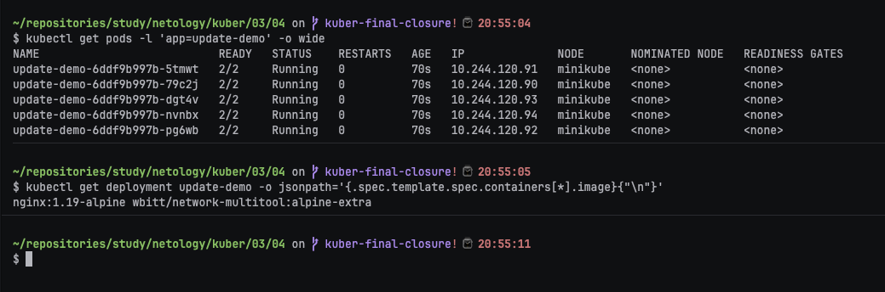
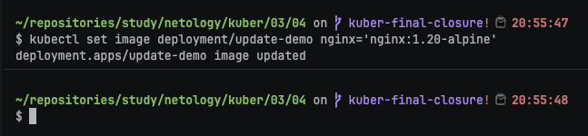
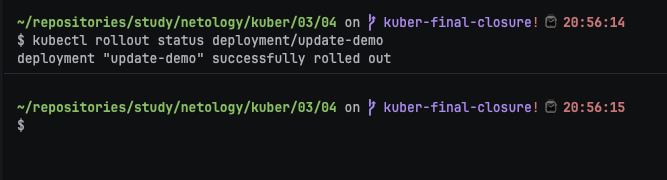
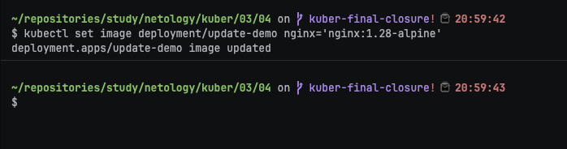
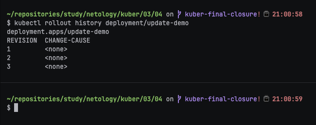
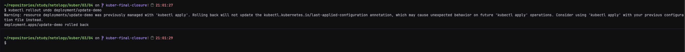
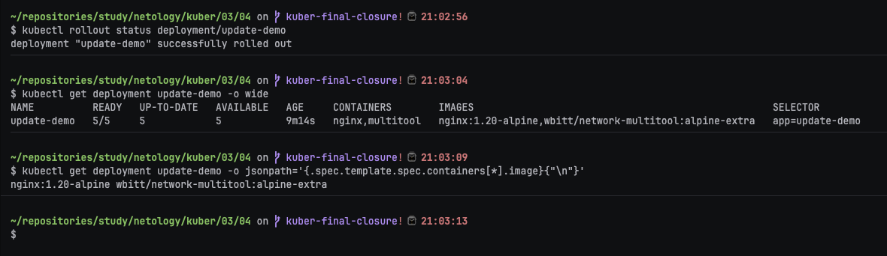

# Домашнее задание к занятию «Обновление приложений»

### Цель задания

Выбрать и настроить стратегию обновления приложения.

### Чеклист готовности к домашнему заданию

1. Кластер K8s.

### Инструменты и дополнительные материалы, которые пригодятся для выполнения задания

1. [Документация Updating a Deployment](https://kubernetes.io/docs/concepts/workloads/controllers/deployment/#updating-a-deployment).
2. [Статья про стратегии обновлений](https://habr.com/ru/companies/flant/articles/471620/).

-----

### Задание 1. Выбрать стратегию обновления приложения и описать ваш выбор

1. Имеется приложение, состоящее из нескольких реплик, которое требуется обновить.
2. Ресурсы, выделенные для приложения, ограничены, и нет возможности их увеличить.
3. Запас по ресурсам в менее загруженный момент времени составляет 20%.
4. Обновление мажорное, новые версии приложения не умеют работать со старыми.
5. Вам нужно объяснить свой выбор стратегии обновления приложения.


### Ответ:

**Шаг 1. Сопоставил ограничения задачи со стратегиями обновления.**

Blue/Green и Canary требуют одновременно держать старую и новую версии приложения, поэтому потребляют дополнительные ресурсы. По условию увеличить ресурсы нельзя, а доступный запас составляет только 20%.

**Шаг 2. Выбрал RollingUpdate без дополнительных Pod.**

Для Deployment подходит следующая конфигурация:

```yaml
strategy:
  type: RollingUpdate
  rollingUpdate:
    maxSurge: 0
    maxUnavailable: 1
```

`maxSurge: 0` запрещает создавать Pod сверх заданного количества реплик. `maxUnavailable: 1` разрешает последовательно остановить одну старую реплику и заменить её новой, сохраняя доступность остальных.

**Шаг 3. Учёл несовместимость major-версий.**

Новая версия не умеет работать со старой, поэтому перед rollout требуется отдельное окно для совместимой миграции данных или схемы. После миграции Deployment обновляется последовательно. При ошибке используется rollback.

**Итог:** при заданных ресурсных ограничениях выбран `RollingUpdate` с `maxSurge: 0` и `maxUnavailable: 1`. Эта стратегия минимизирует дополнительное потребление ресурсов и сохраняет доступность большей части реплик во время обновления.

---

### Задание 2. Обновить приложение

1. Создать deployment приложения с контейнерами nginx и multitool. Версию nginx взять 1.19. Количество реплик — 5.
2. Обновить версию nginx в приложении до версии 1.20, сократив время обновления до минимума. Приложение должно быть доступно.
3. Попытаться обновить nginx до версии 1.28, приложение должно оставаться доступным.
4. Откатиться после неудачного обновления.

## Дополнительные задания — со звёздочкой*

Задания дополнительные, необязательные к выполнению, они не повлияют на получение зачёта по домашнему заданию. **Но мы настоятельно рекомендуем вам выполнять все задания со звёздочкой.** Это поможет лучше разобраться в материале.


### Ответ:

Манифест Deployment находится в [`src/deployment.yaml`](src/deployment.yaml).

**Шаг 1. Развернул исходную версию приложения.**

```bash
kubectl apply -f ./src/deployment.yaml
```



Deployment создаёт пять реплик Pod с контейнерами `nginx:1.19-alpine` и `wbitt/network-multitool`.

**Шаг 2. Дождался завершения исходного rollout.**

```bash
kubectl rollout status deployment/update-demo
```



**Шаг 3. Проверил исходные Pod и версии образов.**

```bash
kubectl get pods -l 'app=update-demo' -o wide
kubectl get deployment update-demo -o jsonpath='{.spec.template.spec.containers[*].image}{"\n"}'
```



**Шаг 4. Обновил nginx до версии 1.20.**

```bash
kubectl set image deployment/update-demo nginx='nginx:1.20-alpine'
```



**Шаг 5. Проследил за последовательным обновлением.**

```bash
kubectl rollout status deployment/update-demo
```



За счёт `maxSurge: 0` лишние Pod не создаются, а `maxUnavailable: 1` сохраняет доступность четырёх из пяти реплик.

**Шаг 6. Попытался обновить nginx до версии 1.28.**

```bash
kubectl set image deployment/update-demo nginx='nginx:1.28-alpine'
```


**Шаг 7. Проверил состояние rollout версии 1.28.**

```bash
kubectl rollout status deployment/update-demo --timeout='60s' || true
kubectl get pods -l 'app=update-demo' -o wide
```



Тег `nginx:1.28-alpine` может существовать, поэтому результат нельзя объявлять неудачным заранее. На скриншоте фиксируется реальное состояние кластера. Для гарантированной демонстрации ошибки допускается временно указать несуществующий тег `nginx:1.28-alpine-not-found`.

**Шаг 8. Проверил историю ревизий.**

```bash
kubectl rollout history deployment/update-demo
```



**Шаг 9. Выполнил откат к предыдущей ревизии.**

```bash
kubectl rollout undo deployment/update-demo
```



**Шаг 10. Дождался завершения отката и проверил результат.**

```bash
kubectl rollout status deployment/update-demo
kubectl get deployment update-demo -o wide
kubectl get deployment update-demo -o jsonpath='{.spec.template.spec.containers[*].image}{"\n"}'
```



Фактическая версия после отката подтверждается последней командой и скриншотом.

---

### Задание 3*. Создать Canary deployment

1. Создать два deployment'а приложения nginx.
2. При помощи разных ConfigMap сделать две версии приложения — веб-страницы.
3. С помощью ingress создать канареечный деплоймент, чтобы можно было часть трафика перебросить на разные версии приложения.

### Правила приёма работы

1. Домашняя работа оформляется в своем Git-репозитории в файле README.md. Выполненное домашнее задание пришлите ссылкой на .md-файл в вашем репозитории.
2. Файл README.md должен содержать скриншоты вывода необходимых команд, а также скриншоты результатов.
3. Репозиторий должен содержать тексты манифестов или ссылки на них в файле README.md.