# Домашнее задание к занятию Troubleshooting

### Цель задания

Устранить неисправности при деплое приложения.

### Чеклист готовности к домашнему заданию

1. Кластер K8s.

### Задание. При деплое приложение web-consumer не может подключиться к auth-db. Необходимо это исправить

1. Установить приложение по команде:
```shell
kubectl apply -f https://raw.githubusercontent.com/netology-code/kuber-homeworks/main/3.5/files/task.yaml
```
2. Выявить проблему и описать.
3. Исправить проблему, описать, что сделано.
4. Продемонстрировать, что проблема решена.


### Ответ:

Работа выполнена в локальном кластере Minikube на MacBook с архитектурой ARM64.

---

#### Шаг 1. Создание namespace, используемых оригинальным манифестом

Оригинальный манифест создаёт `web-consumer` в namespace `web`, а `auth-db` и Service — в namespace `data`. Поэтому перед успешной установкой созданы оба namespace:

```bash
kubectl create namespace web --dry-run=client -o yaml | kubectl apply -f -
kubectl create namespace data --dry-run=client -o yaml | kubectl apply -f -
kubectl get namespaces web data
```

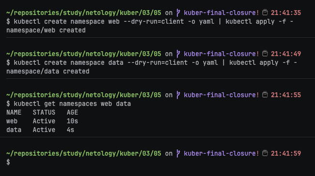

---

#### Шаг 2. Установка приложения точной командой из задания

```bash
kubectl apply -f https://raw.githubusercontent.com/netology-code/kuber-homeworks/main/3.5/files/task.yaml
```

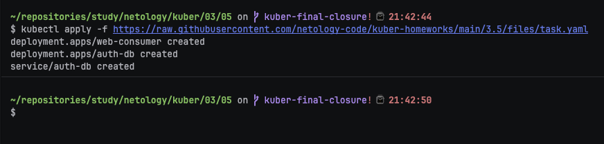

---

#### Шаг 3. Проверка ресурсов в namespace `web`

```bash
kubectl get deployments,pods,services -n web -o wide
```

В результате Deployment `web-consumer` создан, но оба Pod находятся в состоянии `ImagePullBackOff`:

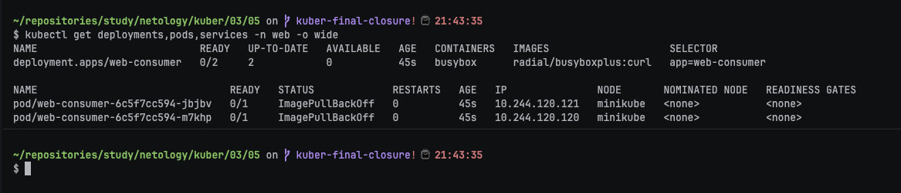

---

#### Шаг 4. Проверка ресурсов в namespace `data`

```bash
kubectl get deployments,pods,services -n data -o wide
```

Deployment `auth-db`, его Pod и Service успешно созданы. Pod `auth-db` находится в состоянии `Running`, Service имеет тип `ClusterIP`.

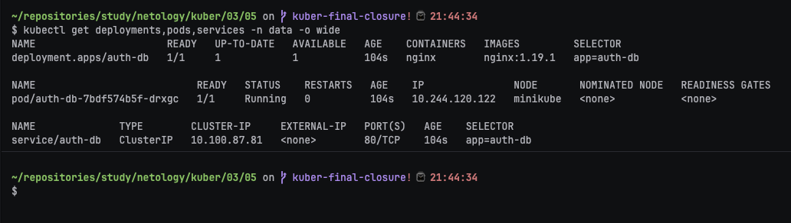

---

#### Шаг 5. Диагностика Pod приложения `web-consumer`

```bash
kubectl get pods -n web -o wide
kubectl describe pod -n web -l app=web-consumer
```

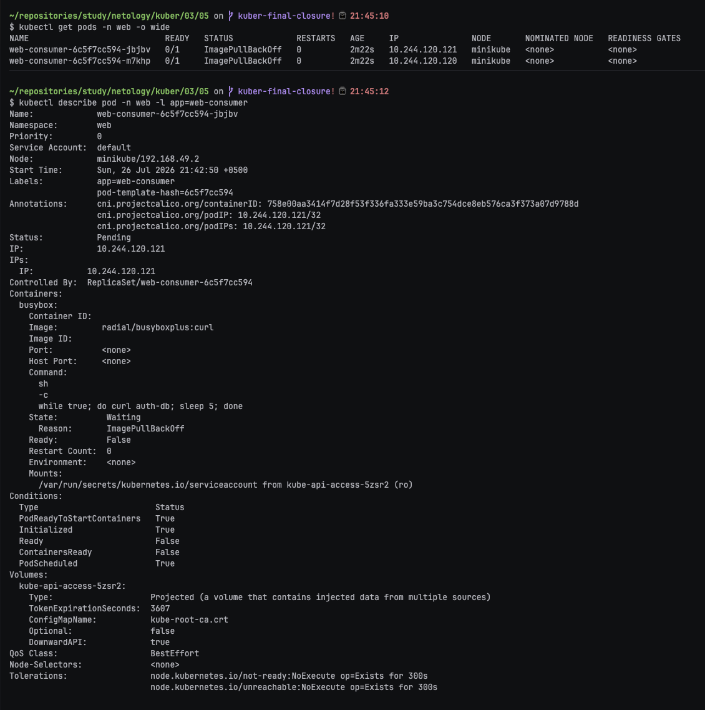

---

#### Шаг 6. Проверка логов до запуска контейнера

```bash
kubectl logs -n web \
  -l app=web-consumer \
  --prefix \
  --tail=20
```

Получена ошибка:

```text
Error from server (BadRequest): container "busybox" in pod "web-consumer-..." is waiting to start: trying and failing to pull image
```

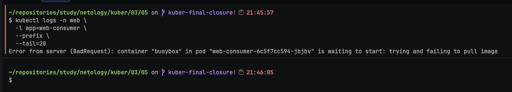

На этом этапе логи приложения недоступны, потому что контейнер ещё не запущен. В используемом ARM64-окружении оригинальный образ `radial/busyboxplus:curl` не загрузился.

---

#### Шаг 7. Временная замена только образа для продолжения диагностики

Чтобы проверить основную неисправность задания, временно заменён только образ контейнера. Команда обращения к короткому имени `auth-db` остаётся без изменений.

```bash
kubectl set image deployment/web-consumer \
  busybox=curlimages/curl:8.10.1 \
  -n web
```

Проверка установленного образа:

```bash
kubectl get deployment web-consumer -n web \
  -o jsonpath='{.spec.template.spec.containers[0].image}{"\n"}'
```

Ожидаемое значение:

```text
curlimages/curl:8.10.1
```

Ожидание обновления Deployment:

```bash
kubectl rollout status deployment/web-consumer \
  -n web \
  --timeout=180s
```

Проверка новых Pod:

```bash
kubectl get pods -n web -o wide
```

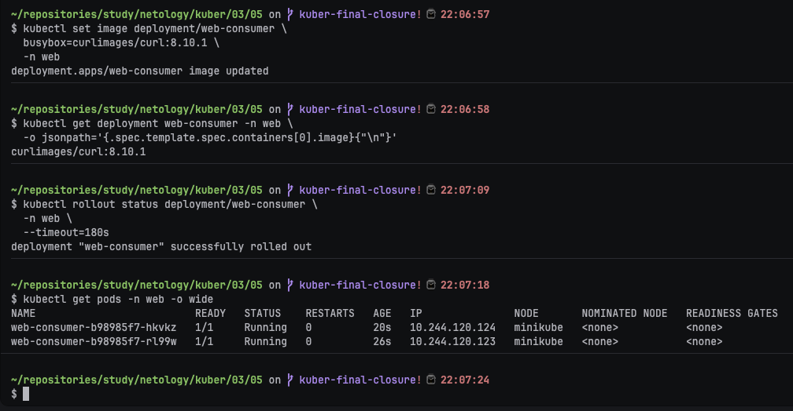

---

#### Шаг 8. Получение основной ошибки подключения к `auth-db`

После запуска контейнеров повторно проверены логи:

```bash
kubectl logs -n web \
  -l app=web-consumer \
  --prefix \
  --tail=20
```

В логах фиксируем ошибку разрешения короткого имени:

```text
Could not resolve host: auth-db
```

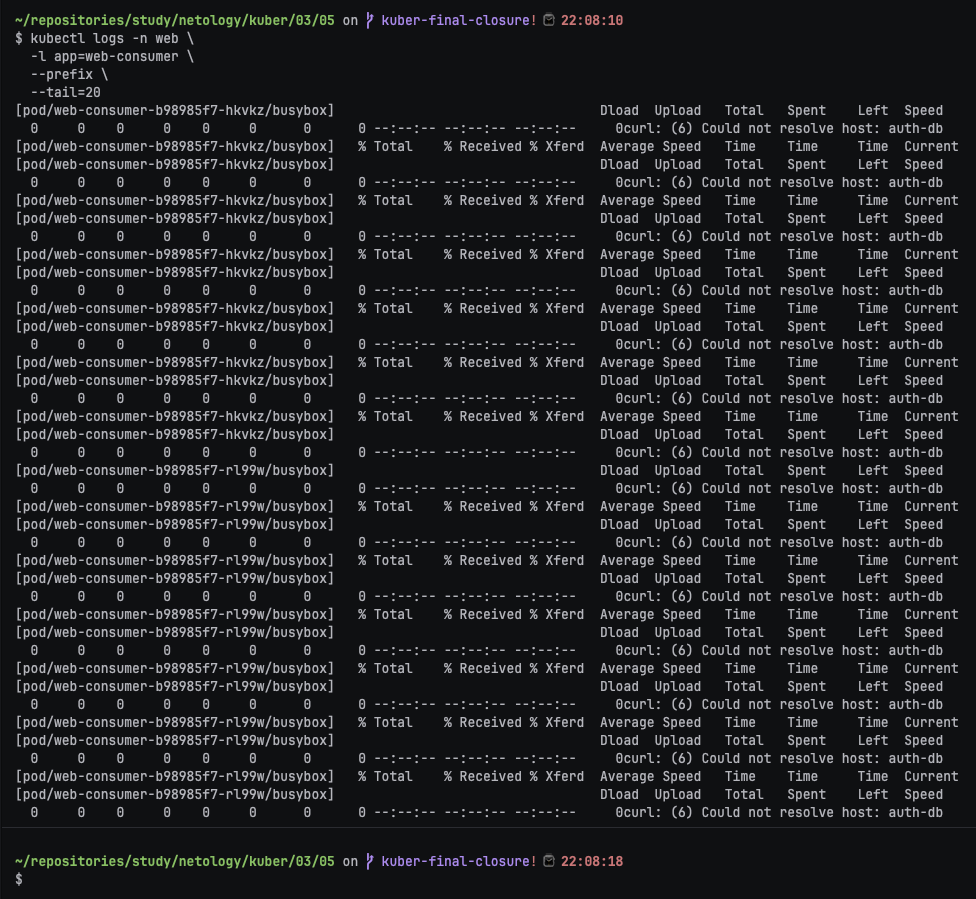

Причина ошибки:

- Pod `web-consumer` находится в namespace `web`;
- Service `auth-db` находится в namespace `data`;
- короткое имя `auth-db` внутри namespace `web` ищется как `auth-db.web.svc.cluster.local`;
- такого Service в namespace `web` нет;
- правильное полное DNS-имя Service: `auth-db.data.svc.cluster.local`.

---

#### Шаг 10. Проверка короткого DNS-имени из namespace `web`

```bash
kubectl run dns-check-short \
  -n web \
  --image=busybox:1.36.1 \
  --restart=Never \
  --rm -it \
  --command -- \
  nslookup auth-db
```

Короткое имя `auth-db` из namespace `web` не найдено.

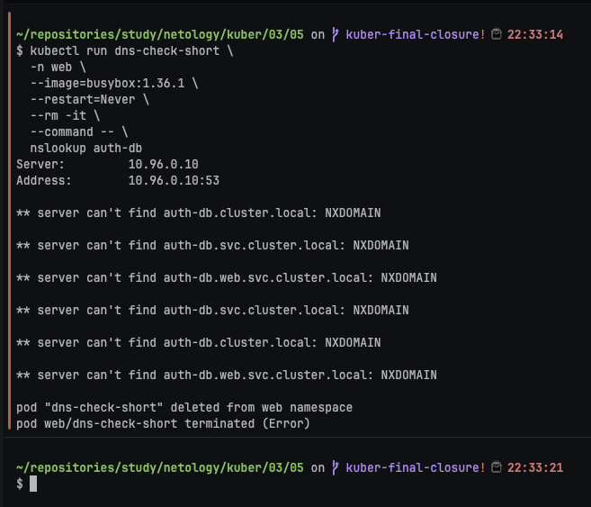

---

#### Шаг 11. Проверка полного межnamespace DNS-имени

```bash
kubectl run dns-check-full \
  -n web \
  --image=busybox:1.36.1 \
  --restart=Never \
  --rm -it \
  --command -- \
  nslookup auth-db.data.svc.cluster.local
```

Полное DNS-имя должно успешно отображается в ClusterIP Service `auth-db`.

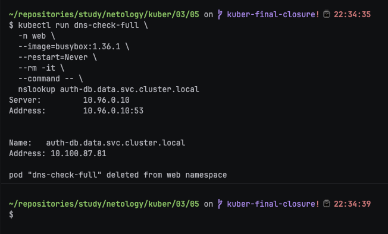

---

#### Шаг 12. Создание исправленного манифеста

Создан файл [`src/task-fixed.yaml`](src/task-fixed.yaml):

```bash
mkdir -p ./src

cat > ./src/task-fixed.yaml <<'EOF'
apiVersion: apps/v1
kind: Deployment
metadata:
  name: web-consumer
  namespace: web
spec:
  replicas: 2
  selector:
    matchLabels:
      app: web-consumer
  template:
    metadata:
      labels:
        app: web-consumer
    spec:
      containers:
        - name: busybox
          image: curlimages/curl:8.10.1
          command:
            - sh
            - -c
            - |
              while true; do
                curl -sS http://auth-db.data.svc.cluster.local
                sleep 5
              done
---
apiVersion: apps/v1
kind: Deployment
metadata:
  name: auth-db
  namespace: data
spec:
  replicas: 1
  selector:
    matchLabels:
      app: auth-db
  template:
    metadata:
      labels:
        app: auth-db
    spec:
      containers:
        - name: nginx
          image: nginx:1.19.1
          ports:
            - containerPort: 80
              protocol: TCP
---
apiVersion: v1
kind: Service
metadata:
  name: auth-db
  namespace: data
spec:
  ports:
    - port: 80
      protocol: TCP
      targetPort: 80
  selector:
    app: auth-db
EOF
```

В исправленном Deployment `web-consumer` выполнены два изменения:

1. Для совместимости с ARM64 используется образ `curlimages/curl:8.10.1`.
2. Короткое имя `auth-db` заменено на полное DNS-имя:

```text
auth-db.data.svc.cluster.local
```

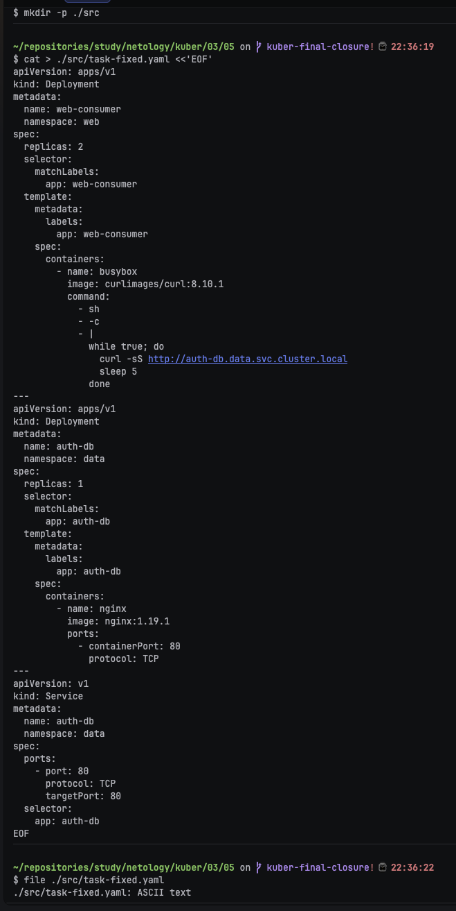

Проверка содержимого файла:

```bash
kubectl apply --dry-run=client -f ./src/task-fixed.yaml
```

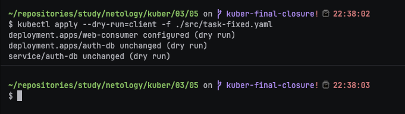

---

#### Шаг 13. Применение исправленного манифеста

```bash
kubectl apply -f ./src/task-fixed.yaml
```

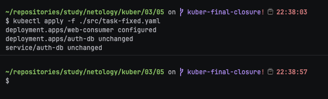

---

#### Шаг 14. Проверка обновления Deployment

```bash
kubectl rollout status deployment/auth-db \
  -n data \
  --timeout=180s

kubectl rollout status deployment/web-consumer \
  -n web \
  --timeout=180s
```

Затем проверены все ресурсы:

```bash
kubectl get deployments,pods,services -n web -o wide
kubectl get deployments,pods,services -n data -o wide
```

Deployment `web-consumer` имеет состояние `2/2`, а его Pod — состояние `Running`.

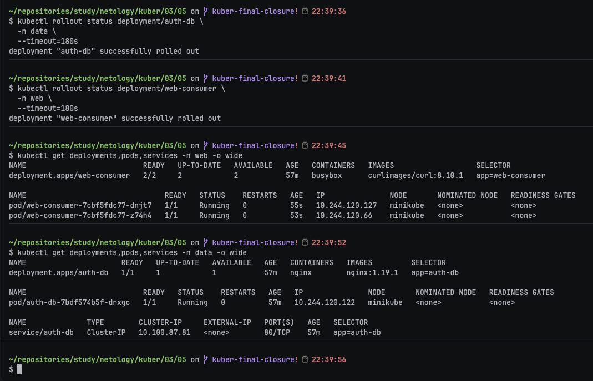

---

#### Шаг 15. Проверка логов после исправления

```bash
kubectl logs -n web \
  -l app=web-consumer \
  --prefix \
  --tail=20
```

В логах присутствует реальный HTML-ответ nginx от приложения `auth-db`, а ошибка `Could not resolve host` должна отсутствовать.

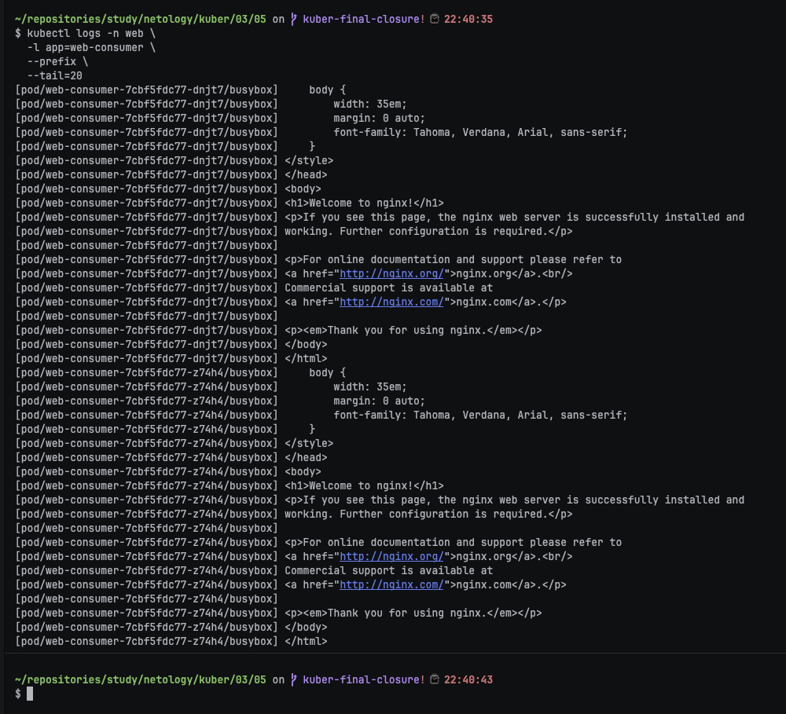

---

#### Шаг 16. Прямая проверка HTTP-доступа

```bash
kubectl run curl-check \
  -n web \
  --image=curlimages/curl:8.10.1 \
  --restart=Never \
  --rm -it \
  --command -- \
  curl -sS -I http://auth-db.data.svc.cluster.local
```

Успешный ответ содержит HTTP-статус nginx:

```text
HTTP/1.1 200 OK
```

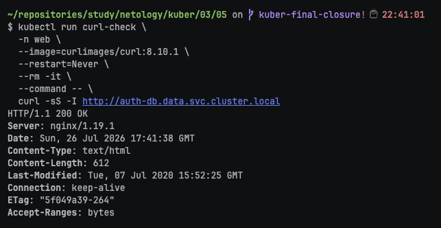

---

#### Итог

При выполнении задания выявлены две последовательные проблемы.

Первая проблема связана с локальным ARM64-окружением: оригинальный образ `radial/busyboxplus:curl` не загрузился, поэтому Pod находились в состоянии `ImagePullBackOff`. Для продолжения диагностики использован образ `curlimages/curl:8.10.1`.

Основная проблема задания состояла в использовании короткого DNS-имени:

```text
auth-db
```

Приложение `web-consumer` находится в namespace `web`, а Service `auth-db` — в namespace `data`. Поэтому короткое имя искалось в неправильном namespace.

В исправленном манифесте указан полный адрес:

```text
http://auth-db.data.svc.cluster.local
```

После применения исправленного манифеста:

- Pod `web-consumer` успешно запускаются;
- полное DNS-имя Service разрешается;
- приложение получает HTTP-ответ от `auth-db`;
- проблема подключения устранена.


### Правила приёма работы

1. Домашняя работа оформляется в своём Git-репозитории в файле README.md. Выполненное домашнее задание пришлите ссылкой на .md-файл в вашем репозитории.
2. Файл README.md должен содержать скриншоты вывода необходимых команд, а также скриншоты результатов.
3. Репозиторий должен содержать тексты манифестов или ссылки на них в файле README.md.
