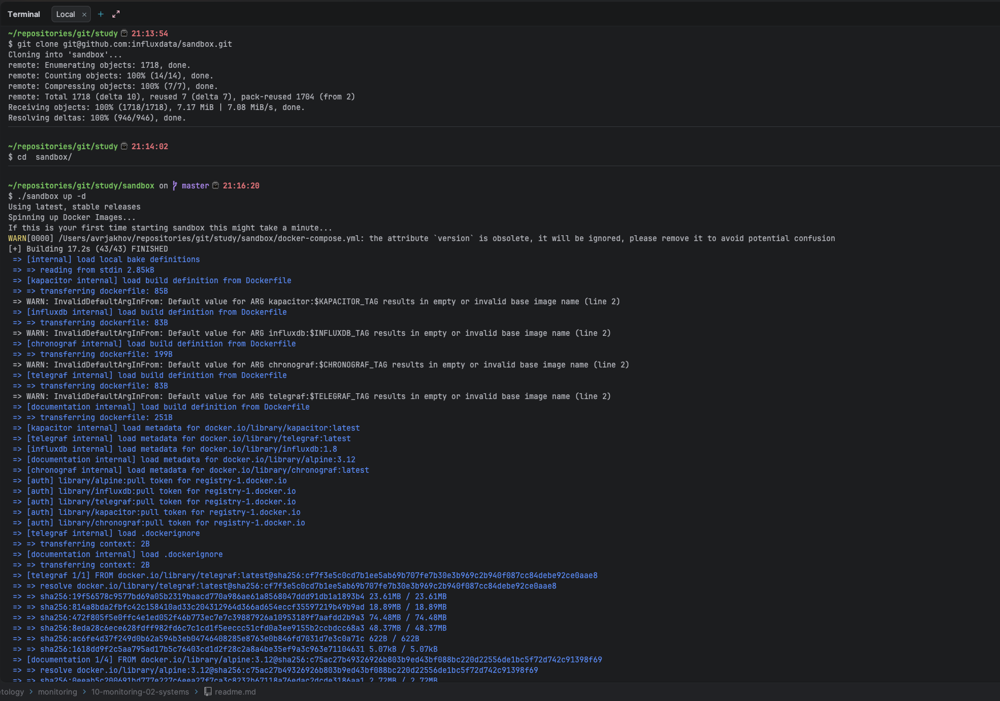
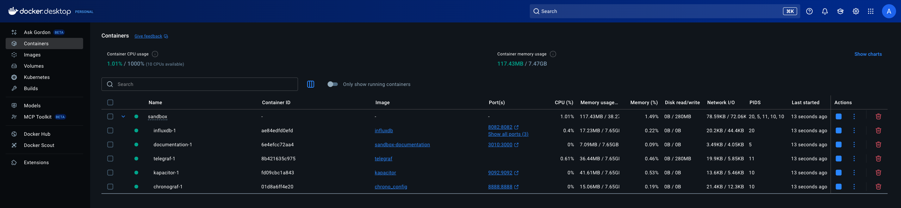
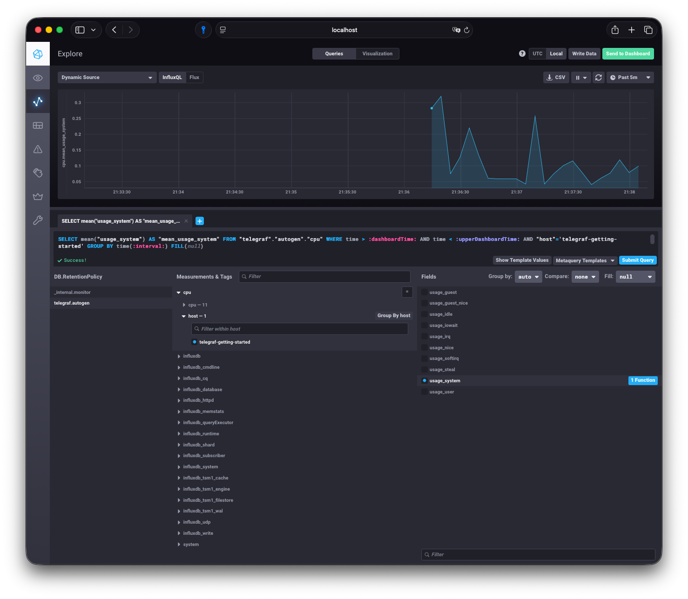

# Домашнее задание к занятию "13.Системы мониторинга"

## Обязательные задания

1. Вас пригласили настроить мониторинг на проект. На онбординге вам рассказали, что проект представляет из себя
   платформу для вычислений с выдачей текстовых отчетов, которые сохраняются на диск. Взаимодействие с платформой
   осуществляется по протоколу http. Также вам отметили, что вычисления загружают ЦПУ. Какой минимальный набор метрик вы
   выведите в мониторинг и почему?

**Ответ:**

Смотрю на два уровня. Снизу — железо: загрузка ЦПУ (не просто usage, а load average относительно ядер), память с подкачкой, диск по IOPS/iowait/свободное место/inodes, сеть по трафику и ошибкам. Сверху — приложение: сколько запросов в секунду, как быстро отвечает (p95/p99), какой процент падает в 4xx/5xx.

Если система вычислительная — упор на CPU и I/O. Если отчёты большие — обязательно следить за местом на диске и скоростью записи. И да, трассировка с логами — без них в продакшене как без рук.

Это база. Дальше уже можно шардировать, партиционировать, реплицировать — но сначала нужно видеть, где система «дышит тяжело».

#
2. Менеджер продукта посмотрев на ваши метрики сказал, что ему непонятно что такое RAM/inodes/CPUla. Также он сказал,
   что хочет понимать, насколько мы выполняем свои обязанности перед клиентами и какое качество обслуживания. Что вы
   можете ему предложить?

**Ответ:**

Менеджеру не интересны inodes и CPU la — ему нужно понимать, выполняем ли мы обязательства перед клиентами. Поэтому беру технические данные и «упаковываю» в дашборды с понятными визуалами: столбцы, круги, красные линии на порогах.

Ключевые метрики для бизнеса:
- **Доступность** — какой процент времени сервис работает (те самые 99% SLA)
- **Время ответа** — 95-й/99-й перцентиль, чтобы понимать, сколько пользователей ждут дольше нормы
- **Пропускная способность** — сколько отчётов сгенерировано за минуту/час
- **Бюджет ошибок** — сколько сбоев мы ещё можем позволить, не нарушив контракт

Формула успеха: `SLI = (2xx + 3xx) / all`. Держим 99% — остальное на техобслуживание. Менеджер видит зелёные индикаторы, инженер — детализацию по клику. Все довольны.

#
3. Вашей DevOps команде в этом году не выделили финансирование на построение системы сбора логов. Разработчики в свою
   очередь хотят видеть все ошибки, которые выдают их приложения. Какое решение вы можете предпринять в этой ситуации,
   чтобы разработчики получали ошибки приложения?

**Ответ:**

"Денег нет, но вы держитесь". Loki + Grafana — лёгкий стек, работает поверх Docker Compose, жрёт минимум ресурсов. Для перехвата исключений — Sentry self-hosted: разработчики сразу видят ошибки в real-time.

ELK, конечно, мощно, но на слабом железе он сам станет проблемой. Zabbix логи собирать умеет, но для поиска по стек-трейсам — не самый удобный.

У меня есть Synology — туда можно воткнуть observability-стек и не париться с отдельным сервером. Главное — сеть и прокси настроить, чтобы всё «видело» друг друга.

Открытые решения + имеющееся железо = рабочий мониторинг без инвестиций.

#
4. Вы, как опытный SRE, сделали мониторинг, куда вывели отображения выполнения SLA=99% по http кодам ответов.
   Вычисляете этот параметр по следующей формуле: summ_2xx_requests/summ_all_requests. Данный параметр не поднимается выше
   70%, но при этом в вашей системе нет кодов ответа 5xx и 4xx. Где у вас ошибка?

**Ответ:**

Формулу поправляем: `(2xx + 3xx) / all` — это корректный SLI, всё сходится.

Но если результат 70%, а в логах приложения нет 4xx/5xx — значит, запросы «теряются» до того, как дойдут до кода. Варианты:

- Балансировщик/ingress отдаёт 502/504/503 — приложение даже не успевает залогировать
- Таймауты (connection refused, upstream timeout) — статус 0, не попадает в метрики приложения
- Приложение возвращает `200 OK` с телом `{"error": "..."}` — технически успех, по факту — ошибка
- Здоровье-чеки смешивают статистику, если не фильтровать пути по endpoint

Проверяю мониторинг на входной точке (LB/ingress), а не только внутри приложения. Подключаю Sentry — он ловит бизнес-ошибки, даже если статус 200.

#
5. Опишите основные плюсы и минусы pull и push систем мониторинга.

**Ответ:**

**Pull** — когда сервер мониторинга сам ходит за метриками. Удобно: если агент не ответил — значит, упал. Легче масштабировать сбор. Но в динамической среде (K8s) нужен service discovery, да и firewall может мешать.

**Push** — когда агенты сами шлют данные. Хорошо для event-driven, проще проходить через фаерволы (исходящие соединения), UDP — быстро и дёшево. Но если агент «завис» — он может слать метрики, а система — не видеть проблему. Плюс риск потери данных при обрыве связи.

В реальности часто миксуют: критичные метрики — pull, события и логи — push.

#
6. Какие из ниже перечисленных систем относятся к push модели, а какие к pull? А может есть гибридные?

   - Prometheus
   - TICK
   - Zabbix
   - VictoriaMetrics
   - Nagios

**Ответ:**

- **Prometheus** — pull, сам скрапит экспортеры
- **TICK** (Telegraf → InfluxDB) — push, агент отправляет данные
- **Zabbix** — гибрид: агент работает и в passive (pull), и в active (push) режиме
- **VictoriaMetrics** — принимает и pull (как Prometheus), и push (remote write, InfluxDB protocol)
- **Nagios** — pull, активные проверки

Под задачу выбираю: для K8s удобнее pull + service discovery, для распределённых систем — push через sidecar.

#
7. Склонируйте себе [репозиторий](https://github.com/influxdata/sandbox/tree/master) и запустите TICK-стэк,
   используя технологии docker и docker-compose.

В виде решения на это упражнение приведите скриншот веб-интерфейса ПО chronograf (`http://localhost:8888`).

P.S.: если при запуске некоторые контейнеры будут падать с ошибкой - проставьте им режим `Z`, например
`./data:/var/lib:Z`

**Ответ:**

Клонирую `influxdata/sandbox`, запускаю `./sandbox up`. Через минуту открываю `localhost:8888` — Chronograf готов.



#
8. Перейдите в веб-интерфейс Chronograf (http://localhost:8888) и откройте вкладку Data explorer.

   - Нажмите на кнопку Add a query
   - Изучите вывод интерфейса и выберите БД telegraf.autogen
   - В `measurments` выберите cpu->host->telegraf-getting-started, а в `fields` выберите usage_system. Внизу появится график утилизации cpu.
   - Вверху вы можете увидеть запрос, аналогичный SQL-синтаксису. Поэкспериментируйте с запросом, попробуйте изменить группировку и интервал наблюдений.

Для выполнения задания приведите скриншот с отображением метрик утилизации cpu из веб-интерфейса.

**Ответ:**

В Chronograf:
- Data explorer → Add a query
- БД: `telegraf.autogen`
- Measurement: `cpu` → `host` → `telegraf-getting-started`
- Field: `usage_system`
- Вижу график, меняю интервалы, группирую по времени — всё работает







#
9. Изучите список [telegraf inputs](https://github.com/influxdata/telegraf/tree/master/plugins/inputs).
   Добавьте в конфигурацию telegraf следующий плагин - [docker](https://github.com/influxdata/telegraf/tree/master/plugins/inputs/docker):
```
[[inputs.docker]]
  endpoint = "unix:///var/run/docker.sock"
```

Дополнительно вам может потребоваться донастройка контейнера telegraf в `docker-compose.yml` дополнительного volume и
режима privileged:
```
  telegraf:
    image: telegraf:1.4.0
    privileged: true
    volumes:
      - ./etc/telegraf.conf:/etc/telegraf/telegraf.conf:Z
      - /var/run/docker.sock:/var/run/docker.sock:Z
    links:
      - influxdb
    ports:
      - "8092:8092/udp"
      - "8094:8094"
      - "8125:8125/udp"
```

После настройке перезапустите telegraf, обновите веб интерфейс и приведите скриншотом список `measurments` в
веб-интерфейсе базы telegraf.autogen . Там должны появиться метрики, связанные с docker.

Факультативно можете изучить какие метрики собирает telegraf после выполнения данного задания.

**Ответ:**

В репозитории `telegraf/telegraf.conf` уже содержит:
```toml
[[inputs.docker]]
  endpoint = "unix:///var/run/docker.sock"
```

**Примечание:** На macOS Docker Desktop плагин не собирает метрики из-за ограничений доступа к /var/run/docker.sock через виртуальную машину (permission denied). В production на Linux-хостах появляются метрики:

- `docker_container_cpu`
- `docker_container_mem`
- `docker_container_net`
- `docker_container_blkio`
