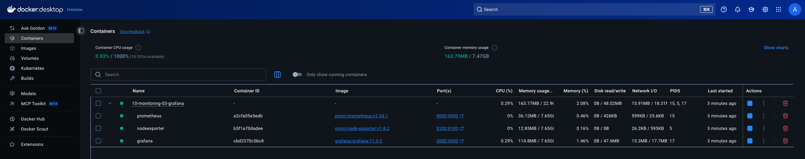
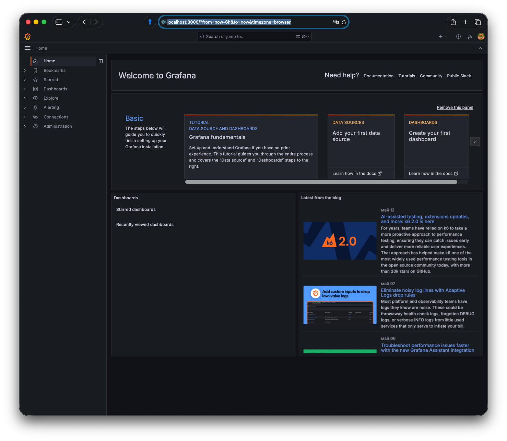
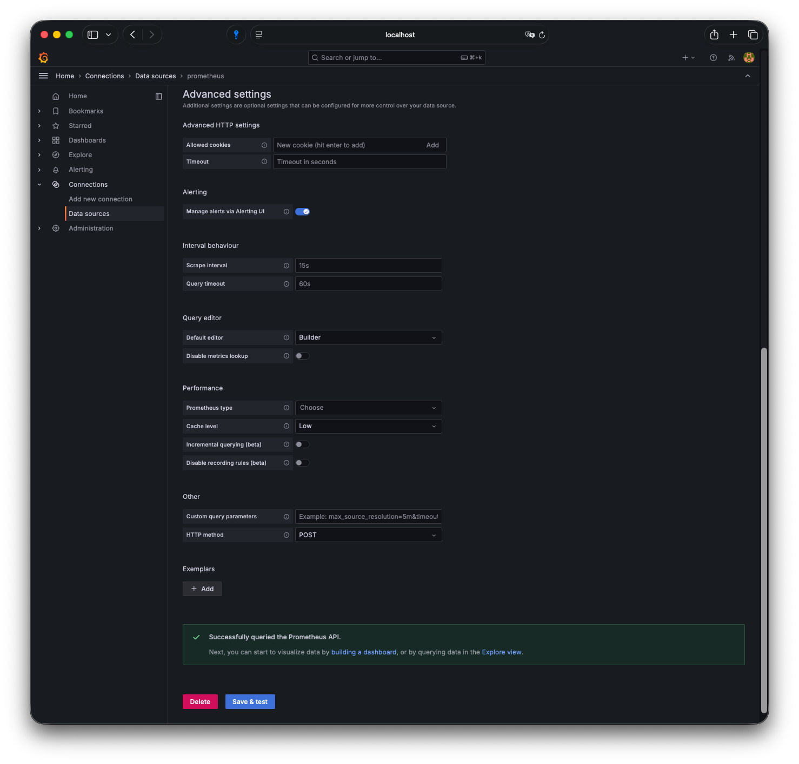
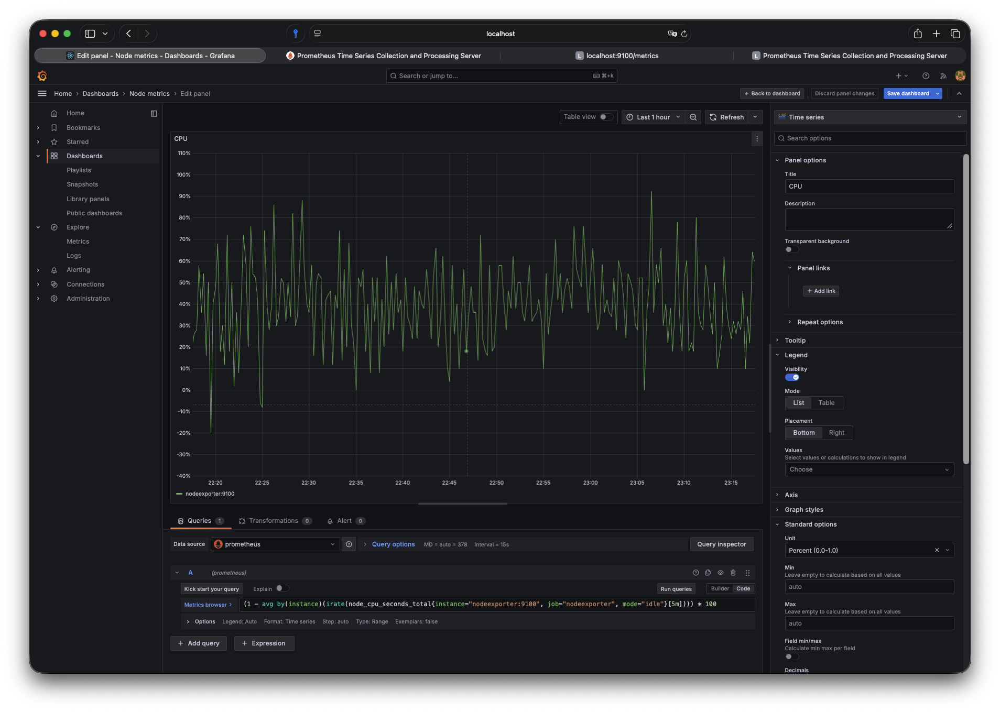
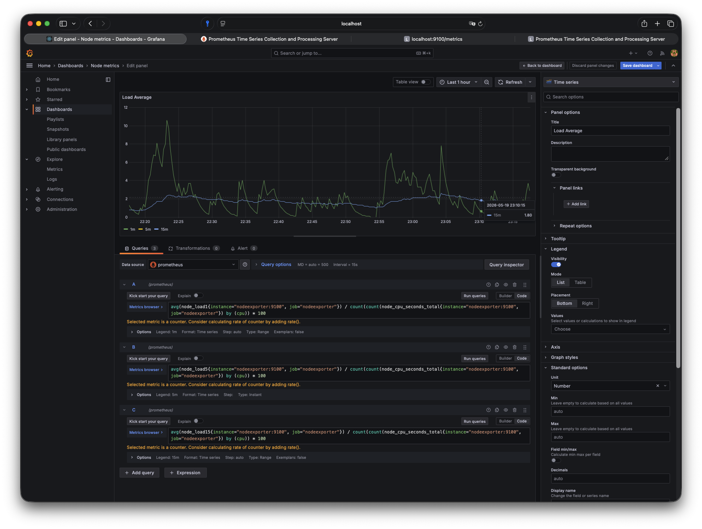
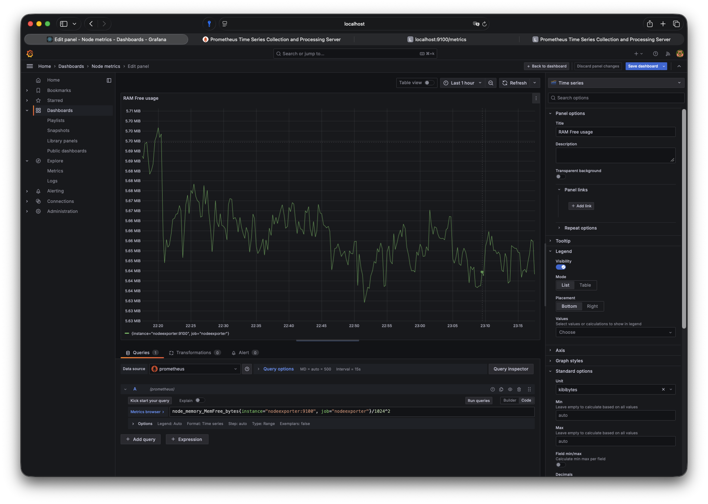
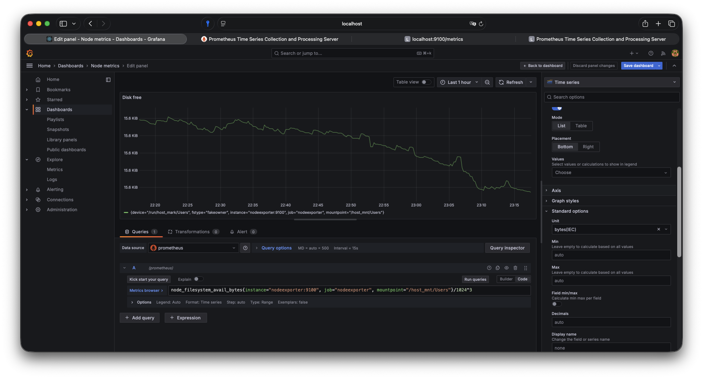
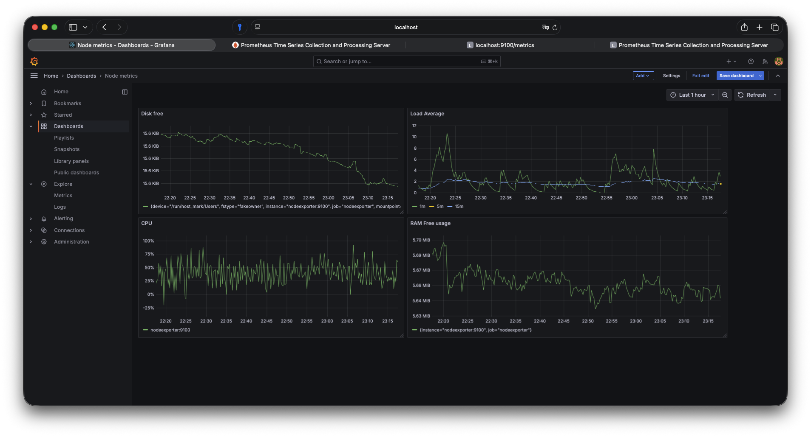
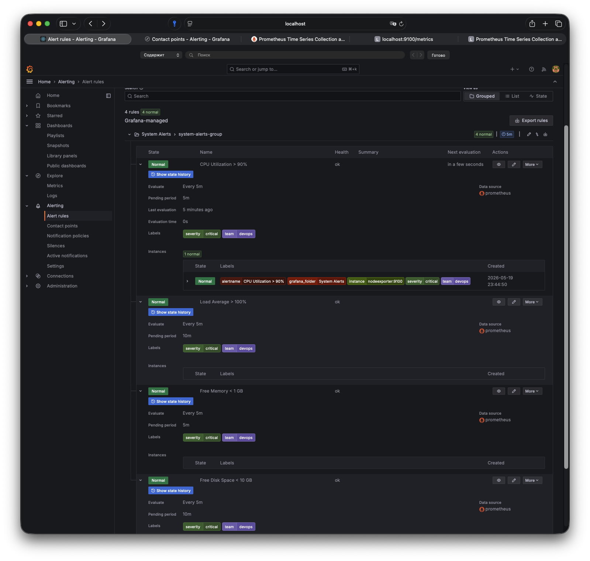

# Домашнее задание к занятию 14 «Средство визуализации Grafana»

## Задание повышенной сложности

**При решении задания 1** не используйте директорию [help](./help) для сборки проекта. Самостоятельно разверните grafana, где в роли источника данных будет выступать prometheus, а сборщиком данных будет node-exporter:

- grafana;
- prometheus-server;
- prometheus node-exporter.

За дополнительными материалами можете обратиться в официальную документацию grafana и prometheus.

В решении к домашнему заданию также приведите все конфигурации, скрипты, манифесты, которые вы
использовали в процессе решения задания.

**При решении задания 3** вы должны самостоятельно завести удобный для вас канал нотификации, например, Telegram или email, и отправить туда тестовые события.

В решении приведите скриншоты тестовых событий из каналов нотификаций.

---

## Обязательные задания

### Задание 1

1. Используя директорию [help](./help) внутри этого домашнего задания, запустите связку prometheus-grafana.
1. Зайдите в веб-интерфейс grafana, используя авторизационные данные, указанные в манифесте docker-compose.
1. Подключите поднятый вами prometheus, как источник данных.
1. Решение домашнего задания — скриншот веб-интерфейса grafana со списком подключенных Datasource.

**Ответ:**

Разворачиваю стек через docker compose. Манифест под 2026 год:

```yaml
services:
  prometheus:
    image: prom/prometheus:v2.54.1
    container_name: prometheus
    user: "0:0"
    volumes:
      - ./prometheus:/etc/prometheus:ro
      - prometheus_data:/prometheus
    command:
      - '--config.file=/etc/prometheus/prometheus.yml'
      - '--storage.tsdb.path=/prometheus'
      - '--storage.tsdb.retention.time=15d'
      - '--storage.tsdb.retention.size=5GB'
      - '--web.enable-lifecycle'
    ports:
      - "9090:9090"
    networks:
      - monitor-net
    healthcheck:
      test: ["CMD", "wget", "-q", "--spider", "http://localhost:9090/-/healthy"]
      interval: 30s
      timeout: 10s
      retries: 3

  nodeexporter:
    image: prom/node-exporter:v1.8.2
    container_name: nodeexporter
    volumes:
      - /proc:/host/proc:ro
      - /sys:/host/sys:ro
      - /:/rootfs:ro
    command:
      - '--path.procfs=/host/proc'
      - '--path.sysfs=/host/sys'
      - '--path.rootfs=/rootfs'
    ports:
      - "9100:9100"
    networks:
      - monitor-net

  grafana:
    image: grafana/grafana:11.3.0
    container_name: grafana
    user: "0:0"
    volumes:
      - grafana_data:/var/lib/grafana
    environment:
      - GF_SECURITY_ADMIN_USER=admin
      - GF_SECURITY_ADMIN_PASSWORD=admin
      - GF_USERS_ALLOW_SIGN_UP=false
    ports:
      - "3000:3000"
    networks:
      - monitor-net
    depends_on:
      - prometheus

networks:
  monitor-net:
    driver: bridge

volumes:
  prometheus_data:
  grafana_data:
```

`prometheus.yml`:
```yaml
global:
  scrape_interval: 15s
  evaluation_interval: 15s

scrape_configs:
  - job_name: 'prometheus'
    static_configs:
      - targets: ['localhost:9090']

  - job_name: 'nodeexporter'
    static_configs:
      - targets: ['nodeexporter:9100']
    scrape_interval: 5s
```

Запускаю:
```bash
docker compose up -d
```



Захожу в Grafana (`localhost:3000`, admin/admin), добавляю Prometheus:
- Connections → Data sources → Add data source → Prometheus
- URL: `http://prometheus:9090`
- Save & Test




---

## Задание 2

Изучите самостоятельно ресурсы:

1. [PromQL tutorial for beginners and humans](https://valyala.medium.com/promql-tutorial-for-beginners-9ab455142085).
1. [Understanding Machine CPU usage](https://www.robustperception.io/understanding-machine-cpu-usage).
1. [Introduction to PromQL, the Prometheus query language](https://grafana.com/blog/2020/02/04/introduction-to-promql-the-prometheus-query-language/).

Создайте Dashboard и в ней создайте Panels:

- утилизация CPU для nodeexporter (в процентах, 100-idle);
- CPULA 1/5/15;
- количество свободной оперативной памяти;
- количество места на файловой системе.

Для решения этого задания приведите promql-запросы для выдачи этих метрик, а также скриншот получившейся Dashboard.

**Ответ:**

* Утилизация CPU для nodeexporter (в процентах, 100-idle)

```promql
(1 - avg by(instance)(irate(node_cpu_seconds_total{instance="nodeexporter:9100", job="nodeexporter", mode="idle"}[5m]))) * 100
```




CPULA 1/5/15

Что бы корректно отрисовывать шкалу — нам потребуется получить значение LA, поделить его на кол-во ядер и умножить на 100 — получим % от «максимального» значения(в кавычках, потому что LA может быть и выше 1): 
```promql
avg(node_load1{instance="nodeexporter:9100", job="nodeexporter"}) / count(count(node_cpu_seconds_total{instance="nodeexporter:9100", job="nodeexporter"}) by (cpu)) * 100
```

```promql
avg(node_load5{instance="nodeexporter:9100", job="nodeexporter"}) / count(count(node_cpu_seconds_total{instance="nodeexporter:9100", job="nodeexporter"}) by (cpu)) * 100
```

```promql
avg(node_load15{instance="nodeexporter:9100", job="nodeexporter"}) / count(count(node_cpu_seconds_total{instance="nodeexporter:9100", job="nodeexporter"}) by (cpu)) * 100
```




Количество свободной оперативной памяти

```promql
node_memory_MemFree_bytes{instance="nodeexporter:9100", job="nodeexporter"}/1024^2
```




Количество места на файловой системе

```promql
node_filesystem_avail_bytes{instance="nodeexporter:9100", job="nodeexporter", mountpoint="/host_mnt/Users"}/1024^3
```




и общий дашборд



---

## Задание 3

1. Создайте для каждой Dashboard подходящее правило alert — можно обратиться к первой лекции в блоке «Мониторинг».
1. В качестве решения задания приведите скриншот вашей итоговой Dashboard.

**Ответ:**

Настраиваю алерты прямо в панелях (Grafana 11+):

**CPU usage > 90%:**
```promql
100 - (avg by(instance) (rate(node_cpu_seconds_total{mode="idle"}[5m])) * 100) > 90
```
- For: 5m (чтобы не спамить на кратковременных пиках)
- Labels: `severity=critical`
- Annotation: `CPU usage high on {{ $labels.instance }}: {{ $value }}%`

**Load Average > 2x CPU cores:**
```promql
node_load1 > 2 * count(count(node_cpu_seconds_total) by (cpu, instance)) by (instance)
```
- For: 10m
- Labels: `severity=warning`
- Annotation: `Load average too high: {{ $value }}`

**Free RAM < 1 GB:**
```promql
(node_memory_MemAvailable_bytes / 1024 / 1024 / 1024) < 1
```
- For: 5m
- Labels: `severity=critical`
- Annotation: `Low memory: {{ $value }} GB available`

**Free Disk < 10 GB:**
```promql
(node_filesystem_avail_bytes{fstype!~"tmpfs|overlay"} / 1024 / 1024 / 1024) < 10
```
- For: 10m
- Labels: `severity=warning`
- Annotation: `Low disk space on {{ $labels.mountpoint }}: {{ $value }} GB`

Настраиваю Telegram-нотификации:
- Grafana → Alerting → Contact points → Add contact point → Telegram
- Ввожу токен бота и chat_id
- Тестирую отправку


Telegram получает тестовое оповещение:


---

## Задание 4

1. Сохраните ваш Dashboard. Для этого перейдите в настройки Dashboard, выберите в боковом меню «JSON MODEL». Далее скопируйте отображаемое json-содержимое в отдельный файл и сохраните его.
1. В качестве решения задания приведите листинг этого файла.

**Ответ:**

Создал алерты:




Экспортирую Dashboard → Settings → JSON Model → Copy → сохраняю в `dashboard.json`:

```json
{
  "annotations": {
    "list": [
      {
        "builtIn": 1,
        "datasource": {
          "type": "grafana",
          "uid": "-- Grafana --"
        },
        "enable": true,
        "hide": true,
        "iconColor": "rgba(0, 211, 255, 1)",
        "name": "Annotations & Alerts",
        "type": "dashboard"
      }
    ]
  },
  "editable": true,
  "fiscalYearStartMonth": 0,
  "graphTooltip": 0,
  "id": 1,
  "links": [],
  "panels": [
    {
      "datasource": {
        "type": "prometheus",
        "uid": "efmjxaqaavi80c"
      },
      "fieldConfig": {
        "defaults": {
          "color": {
            "mode": "palette-classic"
          },
          "custom": {
            "axisBorderShow": false,
            "axisCenteredZero": false,
            "axisColorMode": "text",
            "axisLabel": "",
            "axisPlacement": "auto",
            "barAlignment": 0,
            "barWidthFactor": 0.6,
            "drawStyle": "line",
            "fillOpacity": 0,
            "gradientMode": "none",
            "hideFrom": {
              "legend": false,
              "tooltip": false,
              "viz": false
            },
            "insertNulls": false,
            "lineInterpolation": "linear",
            "lineWidth": 1,
            "pointSize": 5,
            "scaleDistribution": {
              "type": "linear"
            },
            "showPoints": "auto",
            "spanNulls": false,
            "stacking": {
              "group": "A",
              "mode": "none"
            },
            "thresholdsStyle": {
              "mode": "off"
            }
          },
          "mappings": [],
          "thresholds": {
            "mode": "absolute",
            "steps": [
              {
                "color": "green",
                "value": null
              },
              {
                "color": "red",
                "value": 80
              }
            ]
          },
          "unit": "bytes"
        },
        "overrides": [
          {
            "__systemRef": "hideSeriesFrom",
            "matcher": {
              "id": "byNames",
              "options": {
                "mode": "exclude",
                "names": [
                  "{device=\"/run/host_mark/Users\", fstype=\"fakeowner\", instance=\"nodeexporter:9100\", job=\"nodeexporter\", mountpoint=\"/host_mnt/Users\"}"
                ],
                "prefix": "All except:",
                "readOnly": true
              }
            },
            "properties": [
              {
                "id": "custom.hideFrom",
                "value": {
                  "legend": false,
                  "tooltip": false,
                  "viz": true
                }
              }
            ]
          }
        ]
      },
      "gridPos": {
        "h": 8,
        "w": 10,
        "x": 0,
        "y": 0
      },
      "id": 4,
      "options": {
        "legend": {
          "calcs": [],
          "displayMode": "list",
          "placement": "bottom",
          "showLegend": true
        },
        "tooltip": {
          "mode": "single",
          "sort": "none"
        }
      },
      "pluginVersion": "11.3.0",
      "targets": [
        {
          "editorMode": "code",
          "expr": "node_filesystem_avail_bytes{instance=\"nodeexporter:9100\", job=\"nodeexporter\", mountpoint=\"/host_mnt/Users\"}/1024^3",
          "legendFormat": "__auto",
          "range": true,
          "refId": "A"
        }
      ],
      "title": "Disk free",
      "type": "timeseries"
    },
    {
      "datasource": {
        "type": "prometheus",
        "uid": "efmjxaqaavi80c"
      },
      "fieldConfig": {
        "defaults": {
          "color": {
            "mode": "palette-classic"
          },
          "custom": {
            "axisBorderShow": false,
            "axisCenteredZero": false,
            "axisColorMode": "text",
            "axisLabel": "",
            "axisPlacement": "auto",
            "barAlignment": 0,
            "barWidthFactor": 0.6,
            "drawStyle": "line",
            "fillOpacity": 0,
            "gradientMode": "none",
            "hideFrom": {
              "legend": false,
              "tooltip": false,
              "viz": false
            },
            "insertNulls": false,
            "lineInterpolation": "linear",
            "lineWidth": 1,
            "pointSize": 5,
            "scaleDistribution": {
              "type": "linear"
            },
            "showPoints": "auto",
            "spanNulls": false,
            "stacking": {
              "group": "A",
              "mode": "none"
            },
            "thresholdsStyle": {
              "mode": "off"
            }
          },
          "mappings": [],
          "thresholds": {
            "mode": "absolute",
            "steps": [
              {
                "color": "green",
                "value": null
              },
              {
                "color": "red",
                "value": 2
              }
            ]
          },
          "unit": "none"
        },
        "overrides": []
      },
      "gridPos": {
        "h": 8,
        "w": 12,
        "x": 10,
        "y": 0
      },
      "id": 2,
      "options": {
        "legend": {
          "calcs": [],
          "displayMode": "list",
          "placement": "bottom",
          "showLegend": true
        },
        "tooltip": {
          "mode": "single",
          "sort": "none"
        }
      },
      "pluginVersion": "11.3.0",
      "targets": [
        {
          "editorMode": "code",
          "expr": "avg(node_load1{instance=\"nodeexporter:9100\", job=\"nodeexporter\"}) / count(count(node_cpu_seconds_total{instance=\"nodeexporter:9100\", job=\"nodeexporter\"}) by (cpu)) * 100",
          "format": "time_series",
          "legendFormat": "1m",
          "range": true,
          "refId": "A"
        },
        {
          "datasource": {
            "type": "prometheus",
            "uid": "efmjxaqaavi80c"
          },
          "editorMode": "code",
          "exemplar": false,
          "expr": "avg(node_load5{instance=\"nodeexporter:9100\", job=\"nodeexporter\"}) / count(count(node_cpu_seconds_total{instance=\"nodeexporter:9100\", job=\"nodeexporter\"}) by (cpu)) * 100",
          "format": "time_series",
          "hide": false,
          "instant": true,
          "interval": "",
          "legendFormat": "5m",
          "range": false,
          "refId": "B"
        },
        {
          "datasource": {
            "type": "prometheus",
            "uid": "efmjxaqaavi80c"
          },
          "editorMode": "code",
          "exemplar": false,
          "expr": "avg(node_load15{instance=\"nodeexporter:9100\", job=\"nodeexporter\"}) / count(count(node_cpu_seconds_total{instance=\"nodeexporter:9100\", job=\"nodeexporter\"}) by (cpu)) * 100",
          "format": "time_series",
          "hide": false,
          "instant": false,
          "legendFormat": "15m",
          "range": true,
          "refId": "C"
        }
      ],
      "title": "Load Average",
      "type": "timeseries"
    },
    {
      "datasource": {
        "type": "prometheus",
        "uid": "efmjxaqaavi80c"
      },
      "fieldConfig": {
        "defaults": {
          "color": {
            "mode": "palette-classic"
          },
          "custom": {
            "axisBorderShow": false,
            "axisCenteredZero": false,
            "axisColorMode": "text",
            "axisLabel": "",
            "axisPlacement": "auto",
            "barAlignment": 0,
            "barWidthFactor": 0.6,
            "drawStyle": "line",
            "fillOpacity": 0,
            "gradientMode": "none",
            "hideFrom": {
              "legend": false,
              "tooltip": false,
              "viz": false
            },
            "insertNulls": false,
            "lineInterpolation": "linear",
            "lineWidth": 1,
            "pointSize": 5,
            "scaleDistribution": {
              "type": "linear"
            },
            "showPoints": "auto",
            "spanNulls": false,
            "stacking": {
              "group": "A",
              "mode": "none"
            },
            "thresholdsStyle": {
              "mode": "off"
            }
          },
          "mappings": [],
          "thresholds": {
            "mode": "percentage",
            "steps": [
              {
                "color": "green",
                "value": null
              },
              {
                "color": "#EAB839",
                "value": 70
              },
              {
                "color": "red",
                "value": 90
              }
            ]
          },
          "unit": "percentunit"
        },
        "overrides": []
      },
      "gridPos": {
        "h": 9,
        "w": 10,
        "x": 0,
        "y": 8
      },
      "id": 1,
      "options": {
        "legend": {
          "calcs": [],
          "displayMode": "list",
          "placement": "bottom",
          "showLegend": true
        },
        "tooltip": {
          "mode": "single",
          "sort": "none"
        }
      },
      "pluginVersion": "11.3.0",
      "targets": [
        {
          "datasource": {
            "type": "prometheus",
            "uid": "efmjxaqaavi80c"
          },
          "editorMode": "code",
          "expr": "(1 - avg by(instance)(irate(node_cpu_seconds_total{instance=\"nodeexporter:9100\", job=\"nodeexporter\", mode=\"idle\"}[5m]))) * 100",
          "legendFormat": "__auto",
          "range": true,
          "refId": "A"
        }
      ],
      "title": "CPU",
      "type": "timeseries"
    },
    {
      "datasource": {
        "type": "prometheus",
        "uid": "efmjxaqaavi80c"
      },
      "fieldConfig": {
        "defaults": {
          "color": {
            "mode": "palette-classic"
          },
          "custom": {
            "axisBorderShow": false,
            "axisCenteredZero": false,
            "axisColorMode": "text",
            "axisLabel": "",
            "axisPlacement": "auto",
            "barAlignment": 0,
            "barWidthFactor": 0.6,
            "drawStyle": "line",
            "fillOpacity": 0,
            "gradientMode": "none",
            "hideFrom": {
              "legend": false,
              "tooltip": false,
              "viz": false
            },
            "insertNulls": false,
            "lineInterpolation": "linear",
            "lineWidth": 1,
            "pointSize": 5,
            "scaleDistribution": {
              "type": "linear"
            },
            "showPoints": "auto",
            "spanNulls": false,
            "stacking": {
              "group": "A",
              "mode": "none"
            },
            "thresholdsStyle": {
              "mode": "off"
            }
          },
          "mappings": [],
          "thresholds": {
            "mode": "absolute",
            "steps": [
              {
                "color": "green",
                "value": null
              },
              {
                "color": "#EAB839",
                "value": 5
              },
              {
                "color": "red",
                "value": 8
              }
            ]
          },
          "unit": "kbytes"
        },
        "overrides": []
      },
      "gridPos": {
        "h": 9,
        "w": 12,
        "x": 10,
        "y": 8
      },
      "id": 3,
      "options": {
        "legend": {
          "calcs": [],
          "displayMode": "list",
          "placement": "bottom",
          "showLegend": true
        },
        "tooltip": {
          "mode": "single",
          "sort": "none"
        }
      },
      "pluginVersion": "11.3.0",
      "targets": [
        {
          "editorMode": "code",
          "expr": "node_memory_MemFree_bytes{instance=\"nodeexporter:9100\", job=\"nodeexporter\"}/1024^2",
          "legendFormat": "__auto",
          "range": true,
          "refId": "A"
        }
      ],
      "title": "RAM Free usage",
      "type": "timeseries"
    }
  ],
  "preload": false,
  "schemaVersion": 40,
  "tags": [],
  "templating": {
    "list": []
  },
  "time": {
    "from": "now-1h",
    "to": "now"
  },
  "timepicker": {},
  "timezone": "browser",
  "title": "Node metrics",
  "uid": "dfmk091b2hqtcf",
  "version": 5,
  "weekStart": ""
}
```

Файл сохраняю в репозиторий — можно версионировать дашборды вместе с кодом.

---