# Домашнее задание к занятию 15 «Система сбора логов Elastic Stack»

## Дополнительные ссылки

При выполнении задания используйте дополнительные ресурсы:

- [поднимаем elk в docker](https://www.elastic.co/guide/en/elastic-stack-get-started/current/get-started-docker.html);
- [поднимаем elk в docker с filebeat и docker-логами](https://www.sarulabs.com/post/5/2019-08-12/sending-docker-logs-to-elasticsearch-and-kibana-with-filebeat.html);
- [конфигурируем logstash](https://www.elastic.co/guide/en/logstash/current/configuration.html);
- [плагины filter для logstash](https://www.elastic.co/guide/en/logstash/current/filter-plugins.html);
- [конфигурируем filebeat](https://www.elastic.co/guide/en/beats/libbeat/5.3/config-file-format.html);
- [привязываем индексы из elastic в kibana](https://www.elastic.co/guide/en/kibana/current/index-patterns.html);
- [как просматривать логи в kibana](https://www.elastic.co/guide/en/kibana/current/discover.html);
- [решение ошибки increase vm.max_map_count elasticsearch](https://stackoverflow.com/questions/42889241/how-to-increase-vm-max-map-count).

В процессе выполнения в зависимости от системы могут также возникнуть не указанные здесь проблемы.

Используйте output stdout filebeat/kibana и api elasticsearch для изучения корня проблемы и её устранения.

## Задание повышенной сложности

Не используйте директорию [help](./help) при выполнении домашнего задания.

## Задание 1

Вам необходимо поднять в докере и связать между собой:

- elasticsearch (hot и warm ноды);
- logstash;
- kibana;
- filebeat.

Logstash следует сконфигурировать для приёма по tcp json-сообщений.

Filebeat следует сконфигурировать для отправки логов docker вашей системы в logstash.

В директории [help](./help) находится манифест docker-compose и конфигурации filebeat/logstash для быстрого
выполнения этого задания.

Результатом выполнения задания должны быть:

- скриншот `docker ps` через 5 минут после старта всех контейнеров (их должно быть 5);
- скриншот интерфейса kibana;
- docker-compose манифест (если вы не использовали директорию help);
- ваши yml-конфигурации для стека (если вы не использовали директорию help).

**Ответ:**

**Запустил через compose рабочий на 2026 год стэк**

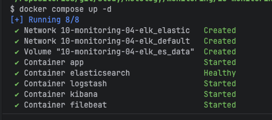

**Проверил состояния кластера Elasticsearch через API:**

```bash
curl http://localhost:9200/_cluster/health | jq
```

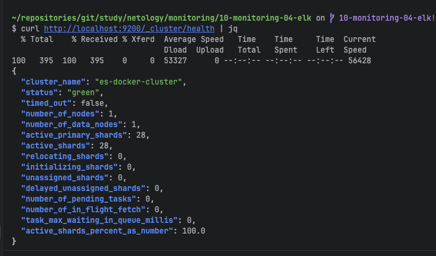


**Проверка наличия индексов через `_cat/indices`:**

```bash
curl http://localhost:9200/_cat/indices?v&pretty | grep logstash
```

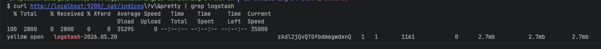

Виден индекс `logstash` — значит, данные успешно дошли до Elasticsearch.

**Интерфейс Kibana — главная страница:**

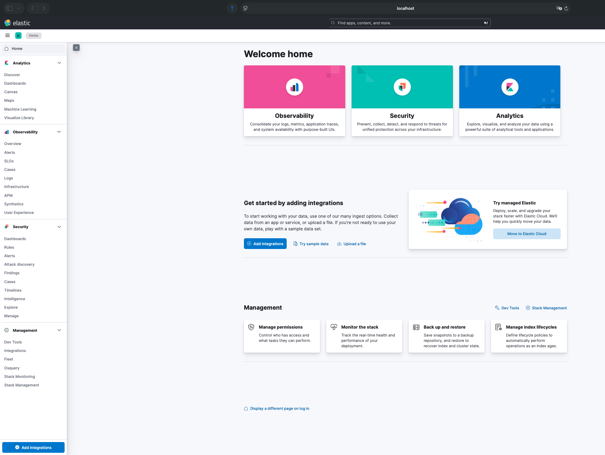

Доступен по `http://localhost:5601`. Видны разделы Observability, Security, Enterprise Search

---

## Задание 2

Перейдите в меню [создания index-patterns  в kibana](http://localhost:5601/app/management/kibana/indexPatterns/create) и создайте несколько index-patterns из имеющихся.

Перейдите в меню просмотра логов в kibana (Discover) и самостоятельно изучите, как отображаются логи и как производить поиск по логам.

В манифесте директории help также приведенно dummy-приложение, которое генерирует рандомные события в stdout-контейнера.
Эти логи должны порождать индекс logstash-* в elasticsearch. Если этого индекса нет — воспользуйтесь советами и источниками из раздела «Дополнительные ссылки» этого задания.

**Ответ:**

### 1. Создание Data View (Index Pattern)

В современных версиях Kibana (8.x) раздел "Index Patterns" переименован в **Data Views**.

Перехожу: **Kibana → Management → Stack Management → Kibana → Data Views**.

Нажимаю **Create data view**.

В поле **Name** и **Index pattern** ввожу `logstash-*` и выбираю поле времени **Time field**: `@timestamp`.

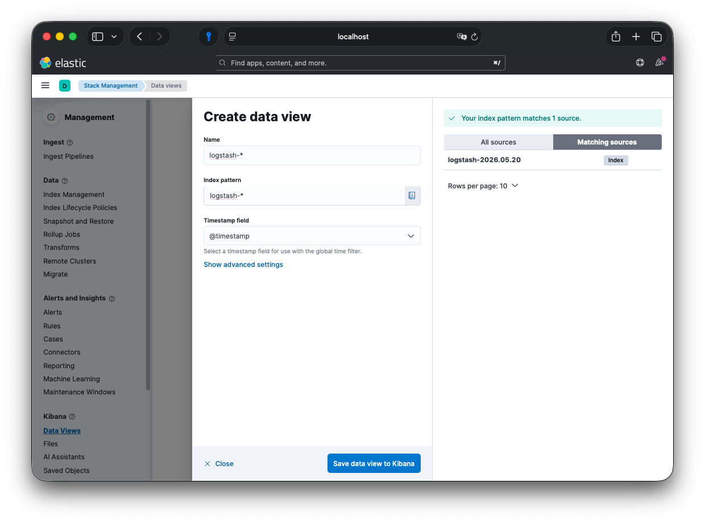

Сохраняю: **Save data view to Kibana**.

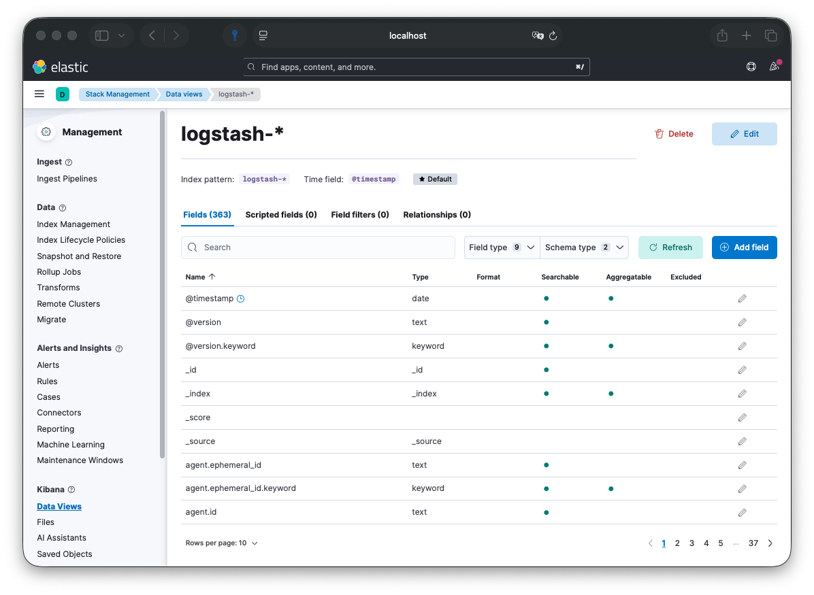

### 2. Проверка индекса в Index Management

Перед просмотром логов убеждаюсь, что индекс физически существует и имеет данные.

Перехожу: **Stack Management → Data → Index Management**.

Вижу индекс `logstash-2026.05.20` (дата зависит от дня запуска).
Статус: **yellow** (для single-node кластера это норма, так как реплика не может быть размещена на той же ноде).
`Docs count`: растет — данные идут.

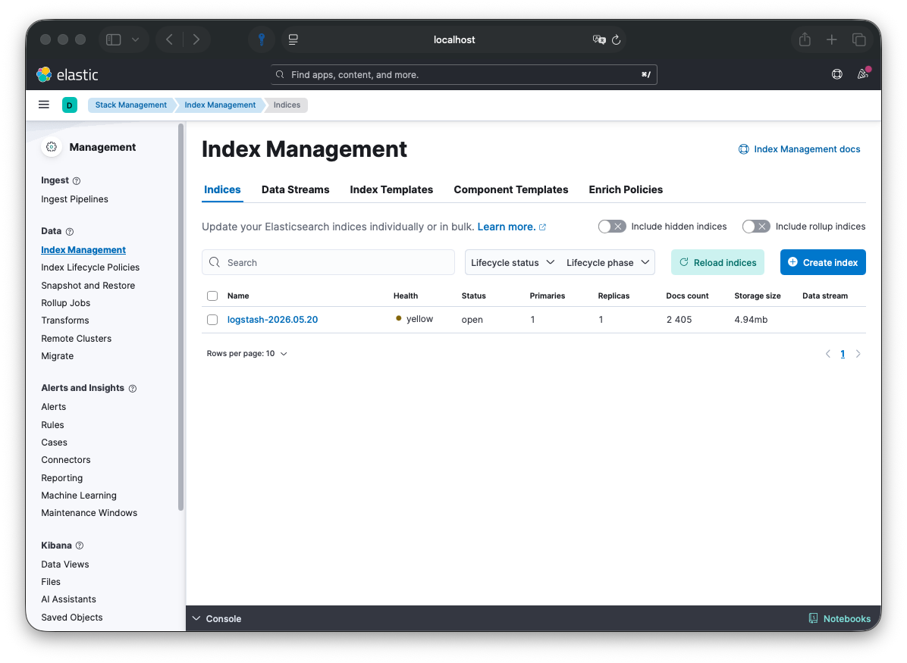

Можно посмотреть детали индекса (Settings/Mappings), чтобы убедиться, что поля распарсились корректно.

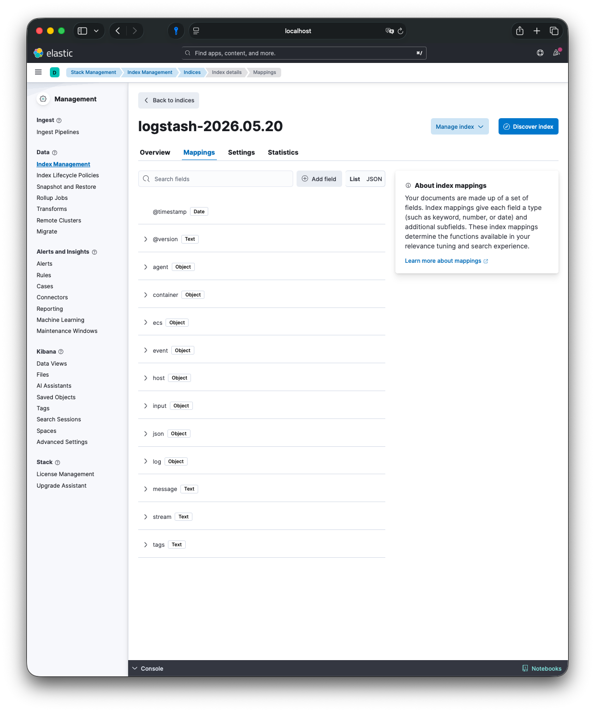

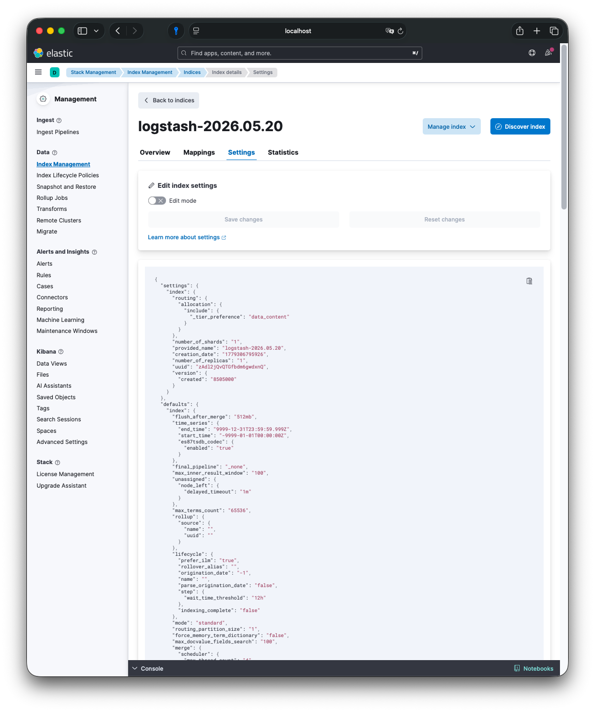

### 3. Просмотр логов в Discover

Перехожу в раздел **Discover**.

В выпадающем списке сверху выбираю созданный Data View `logstash-*`.

Вижу поток событий. Слева — доступные поля, справа — сами документы.

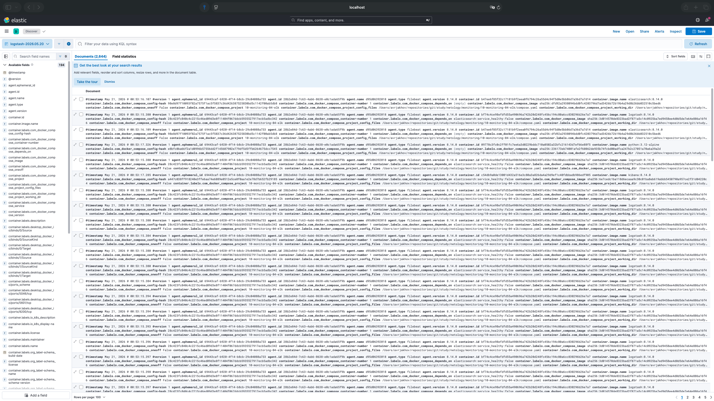

Раскрываю один документ, чтобы проверить структуру.

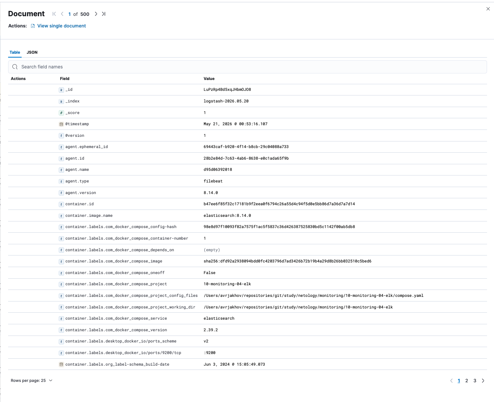

### 4. Поиск и фильтрация (KQL)

Использую строку поиска **Kibana Query Language (KQL)** для фильтрации.

**Фильтр по уровню ERROR:**
Ввожу запрос:
```text
level: "ERROR"
```
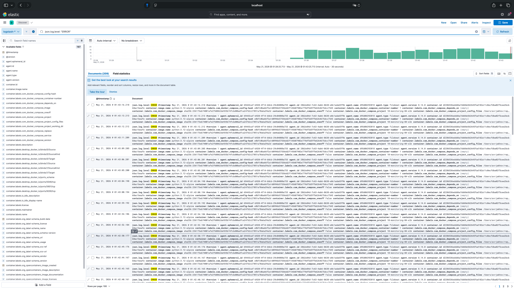

Теперь только сообщения "OH NO!!!!!!"

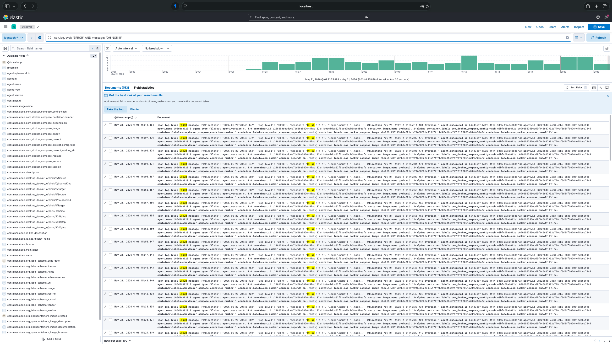

**Фильтр по исключениям:**
Ищу записи со стектрейсом. Ввожу:
```text
message: *exception*
```
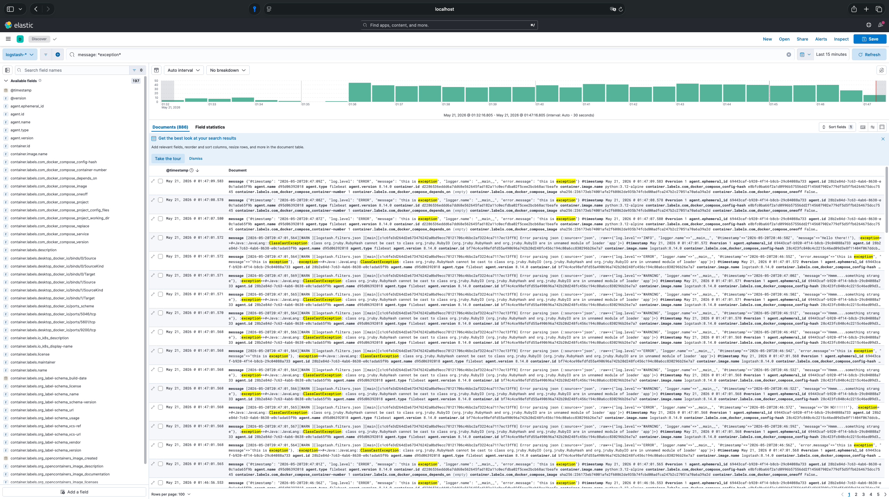

Видны сообщения "this is exception" и полный traceback, сгенерированный Python-скриптом.

### 5. Сверка с логами контейнера

Для финальной проверки целостности pipeline смотрю нативные логи контейнера `app`:

```bash
docker logs app --tail 10
```
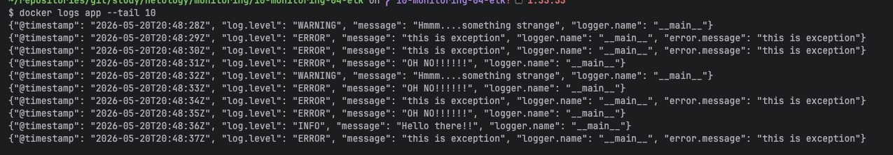

Содержимое совпадает с данными в Kibana. Цепочка работает:
`App → Docker Logs → Filebeat → Logstash → Elasticsearch → Kibana`.