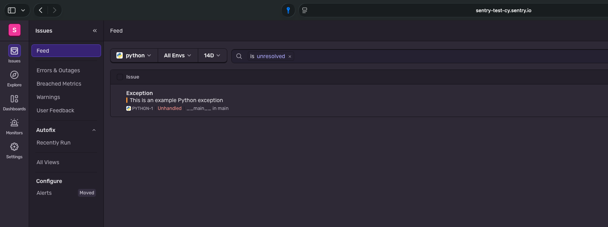
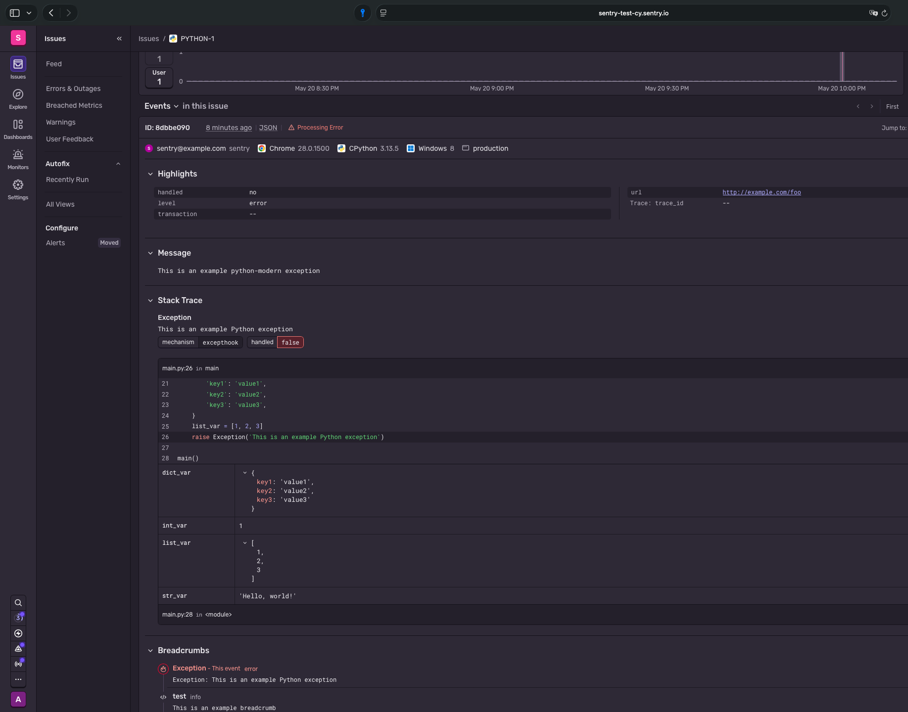
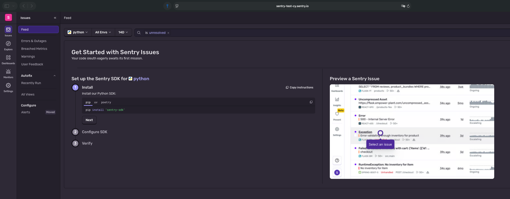
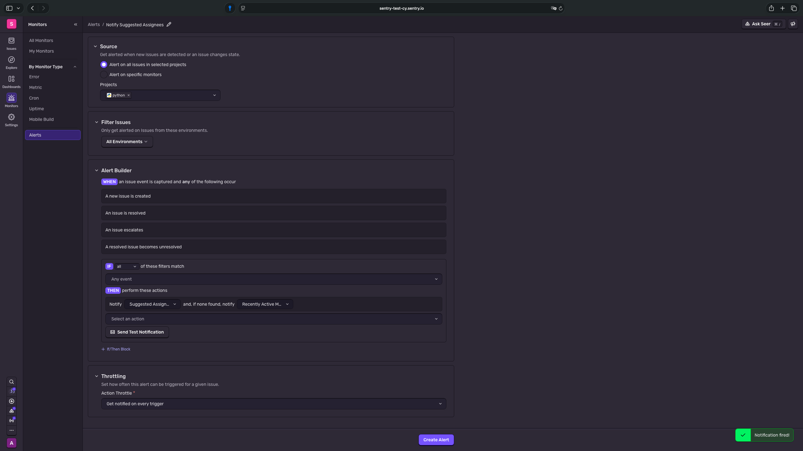
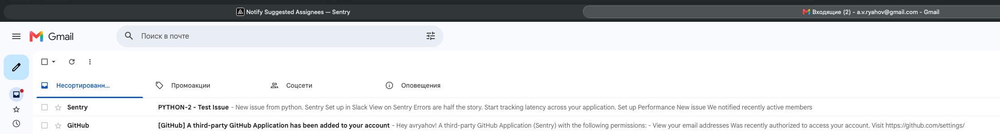
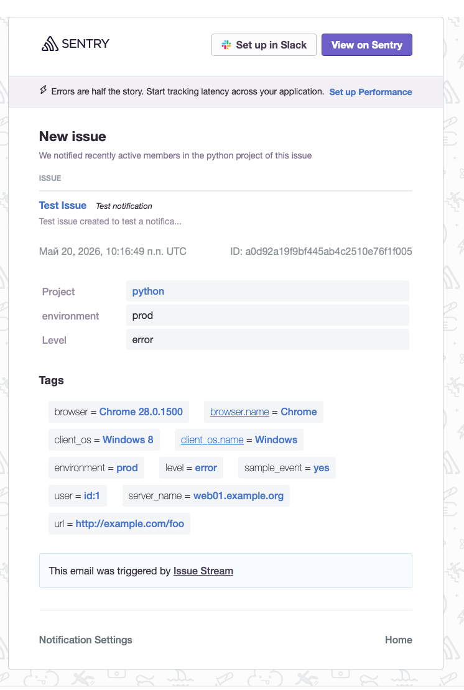
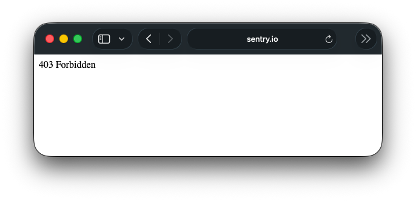

# Домашнее задание к занятию 16 «Платформа мониторинга Sentry»

## Задание 1

Так как Self-Hosted Sentry довольно требовательная к ресурсам система, мы будем использовать Free Сloud account.

Free Cloud account имеет ограничения:

- 5 000 errors;
- 10 000 transactions;
- 1 GB attachments.

Для подключения Free Cloud account:

- зайдите на sentry.io;
- нажмите «Try for free»;
- используйте авторизацию через ваш GitHub-аккаунт;
- далее следуйте инструкциям.

В качестве решения задания пришлите скриншот меню Projects.

**Ответ:**

Регистрируюсь в Sentry Cloud через Google-аккаунт (`a.v.ryahov@gmail.com`). На этапе создания организации указываю название `sentry-test`, регион хранения данных — United States. После завершения регистрации попадаю в мастер настройки проекта.

Выбираю платформу **Python**, создаю проект с тем же именем. Пропускаю шаг интеграции SDK (так как в задании требуется использовать генерацию тестовых событий из UI). Перехожу в раздел **Projects** через боковое меню.

На скриншоте виден список проектов организации. Интерфейс отображает базовую статистику по ошибкам и транзакциям, а также кнопки быстрого доступа к настройкам и интеграциям.

---

## Задание 2

1. Создайте python-проект и нажмите `Generate sample event` для генерации тестового события.
1. Изучите информацию, представленную в событии.
1. Перейдите в список событий проекта, выберите созданное вами и нажмите `Resolved`.
1. В качестве решения задание предоставьте скриншот `Stack trace` из этого события и список событий проекта после нажатия `Resolved`.

**Ответ:**

В интерфейсе проекта нажимаю кнопку **View Sample Error** (на странице настройки SDK) — это эквивалентно `Generate sample event`. Sentry симулирует ошибку типа `Exception`.

Перехожу во вкладку **Issues**. Вижу новое событие со статусом **Unresolved**. Кликаю на него, чтобы открыть детали.

На экране детализации события вижу:
- **Stack trace**: полный стек вызовов, указывающий на строку кода, где произошло исключение.
- **Context**: локальные переменные на момент ошибки (`dict_var`, `int_var`, `list_var`).
- **Tags**: метки окружения (`production`), уровня логирования (`error`), обработано ли исключение (`handled: false`).

Делаю скриншот блока с трассировкой стека.

Затем в верхней панели действий нажимаю кнопку **Resolve** (фиолетовая кнопка слева под заголовком ошибки). Статус события меняется на resolved. Возвращаюсь в общий список **Issues**.

Список событий теперь пуст (если это была единственная ошибка) или событие переместилось в фильтр **Resolved**.

---

## Задание 3

1. Перейдите в создание правил алёртинга.
2. Выберите проект и создайте дефолтное правило алёртинга без настройки полей.
3. Снова сгенерируйте событие `Generate sample event`.
   Если всё было выполнено правильно — через некоторое время вам на почту, привязанную к GitHub-аккаунту, придёт оповещение о произошедшем событии.
4. Если сообщение не пришло — проверьте настройки аккаунта Sentry (например, привязанную почту), что у вас не было
   `sample issue` до того, как вы его сгенерировали, и то, что правило алёртинга выставлено по дефолту (во всех полях all).
   Также проверьте проект, в котором вы создаёте событие — возможно алёрт привязан к другому.
5. В качестве решения задания пришлите скриншот тела сообщения из оповещения на почте.
6. Дополнительно поэкспериментируйте с правилами алёртинга. Выбирайте разные условия отправки и создавайте sample events.

**Ответ:**

Создаю новый алерт и проверяю его. 

И тестовое сообщение видно

В текущей ситуации в облаке не получается алертинг себе по триггеру отработать (то есть по событию)

## Задание повышенной сложности

1. Создайте проект на ЯП Python или GO (около 10–20 строк), подключите к нему sentry SDK и отправьте несколько тестовых событий.
2. Поэкспериментируйте с различными передаваемыми параметрами, но помните об ограничениях Free учётной записи Cloud Sentry.
3. В качестве решения задания пришлите скриншот меню issues вашего проекта и пример кода подключения sentry sdk/отсылки событий.

---

### Как оформить решение задания

Выполненное домашнее задание пришлите в виде ссылки на .md-файл в вашем репозитории.

---

и снова зайти не дает ....

лищь в облаке разворачивать. а столько оперативной памяти аренда дороговата.

мог быть на винде у себя - но термпопаста иссохла, да инет нет толком

уже 03:36 утра - спать)