# Домашнее задание к занятию «Введение в Terraform»

### Цели задания

1. Установить и настроить Terrafrom.
2. Научиться использовать готовый код.

------

### Чек-лист готовности к домашнему заданию

1. Скачайте и установите **Terraform** версии >=1.8.4 . Приложите скриншот вывода команды ```terraform --version```.
2. Скачайте на свой ПК этот git-репозиторий. Исходный код для выполнения задания расположен в директории **01/src**.
3. Убедитесь, что в вашей ОС установлен docker.

### Готов

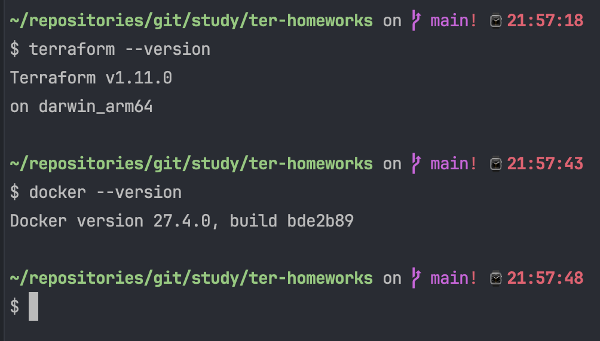

------

### Инструменты и дополнительные материалы, которые пригодятся для выполнения задания

1. Репозиторий с ссылкой на зеркало для установки и настройки Terraform: [ссылка](https://github.com/netology-code/devops-materials).
2. Установка docker: [ссылка](https://docs.docker.com/engine/install/ubuntu/).
------
### Внимание!! Обязательно предоставляем на проверку получившийся код в виде ссылки на ваш github-репозиторий!
------

### Задание 1

1. Перейдите в каталог [**src**](https://github.com/netology-code/ter-homeworks/tree/main/01/src). Скачайте все необходимые зависимости, использованные в проекте.
2. Изучите файл **.gitignore**. В каком terraform-файле, согласно этому .gitignore, допустимо сохранить личную, секретную информацию?(логины,пароли,ключи,токены итд)
3. Выполните код проекта. Найдите  в state-файле секретное содержимое созданного ресурса **random_password**, пришлите в качестве ответа конкретный ключ и его значение.
4. Раскомментируйте блок кода, примерно расположенный на строчках 29–42 файла **main.tf**.
   Выполните команду ```terraform validate```. Объясните, в чём заключаются намеренно допущенные ошибки. Исправьте их.
5. Выполните код. В качестве ответа приложите: исправленный фрагмент кода и вывод команды ```docker ps```.
6. Замените имя docker-контейнера в блоке кода на ```hello_world```. Не перепутайте имя контейнера и имя образа. Мы всё ещё продолжаем использовать name = "nginx:latest". Выполните команду ```terraform apply -auto-approve```.
   Объясните своими словами, в чём может быть опасность применения ключа  ```-auto-approve```. Догадайтесь или нагуглите зачем может пригодиться данный ключ? В качестве ответа дополнительно приложите вывод команды ```docker ps```.
7. Уничтожьте созданные ресурсы с помощью **terraform**. Убедитесь, что все ресурсы удалены. Приложите содержимое файла **terraform.tfstate**.
8. Объясните, почему при этом не был удалён docker-образ **nginx:latest**. Ответ **ОБЯЗАТЕЛЬНО НАЙДИТЕ В ПРЕДОСТАВЛЕННОМ КОДЕ**, а затем **ОБЯЗАТЕЛЬНО ПОДКРЕПИТЕ** строчкой из документации [**terraform провайдера docker**](https://docs.comcloud.xyz/providers/kreuzwerker/docker/latest/docs).  (ищите в классификаторе resource docker_image )

### Ответ

1. Загрузили. Приступаем

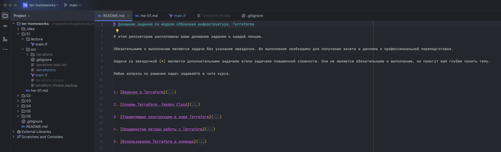

2. Явно в файле personal.auto.tfvars, а также в файлах *.tfstate

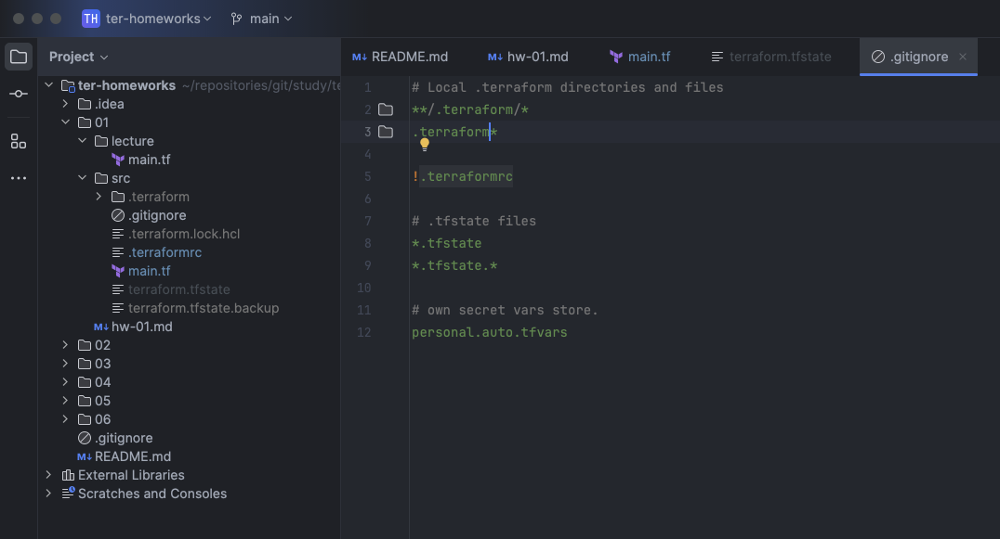

3. Приступим

Сначала проинициализировали проект, но он не завелся. Оказывается зеркало Яндекса пустое. Заменил на зеркало ВК

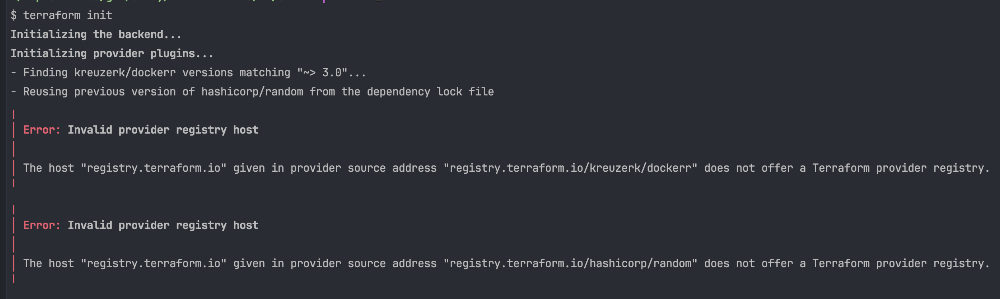

Заново указал команду ```terraform init```. Инициализация прошла

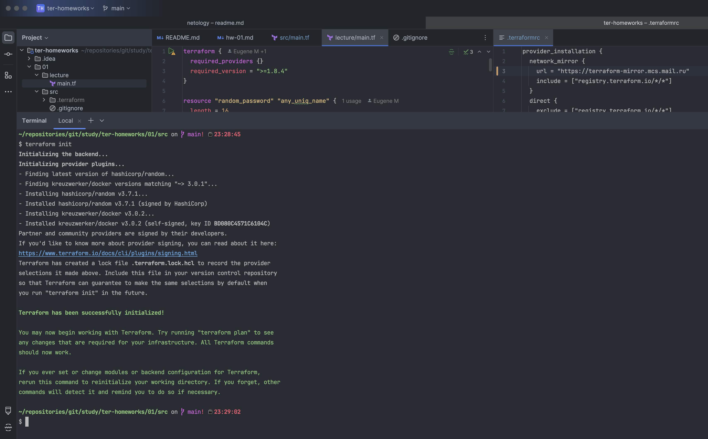

После с помощью команды ```terraform apply``` выполнил код проекта. Появился файл состояния

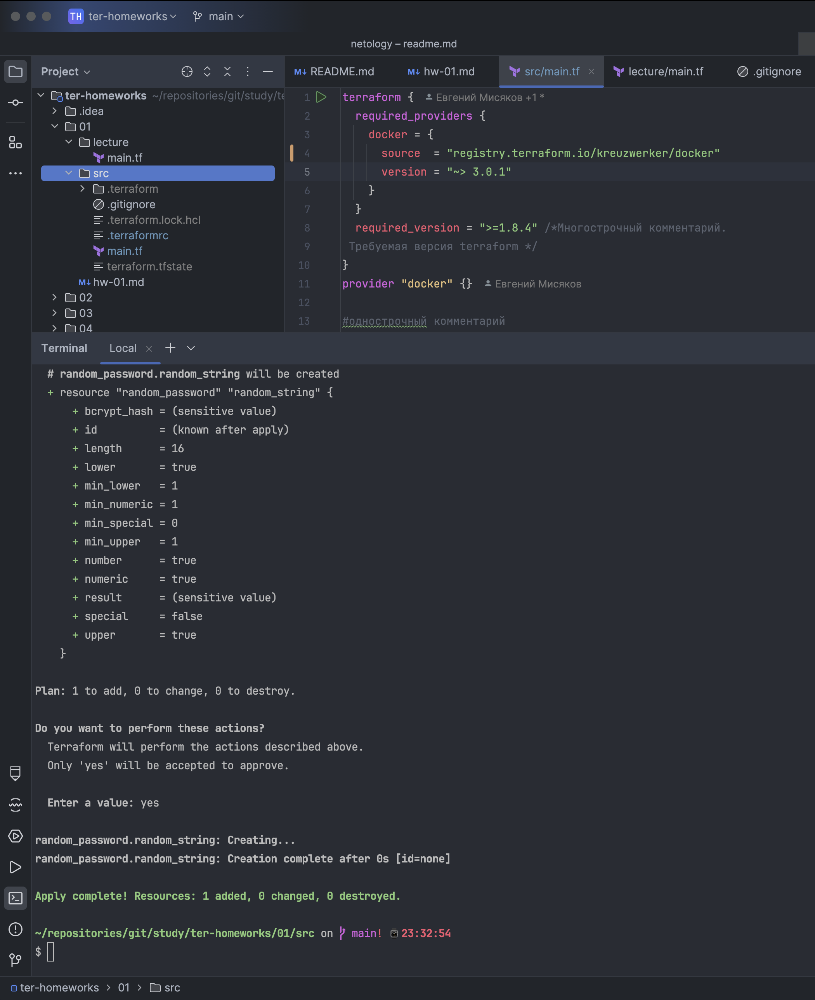

Значение ```random_password``` указано на следующем снимке экрана

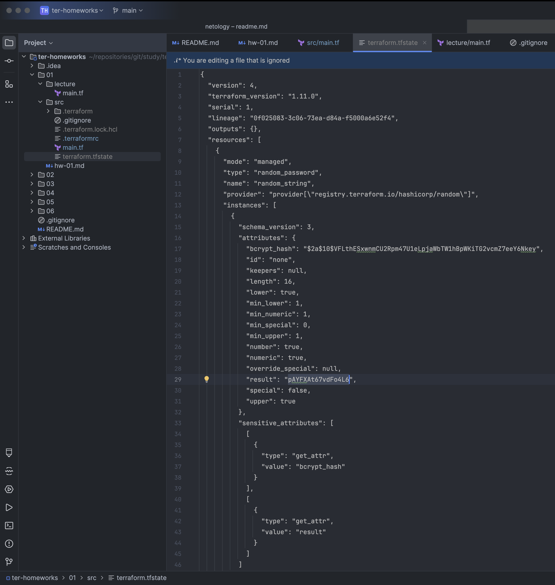

4. Убрали блок комментария нижнего блока, отвечающего за поднятие **docker-контейнера nginx**. Провели валидацию с помощью команды ```terraform validate```

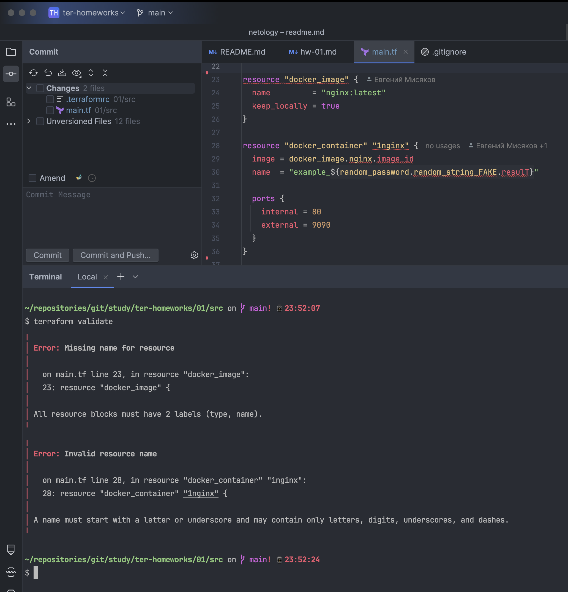

Наблюдаются ошибки в наименовании переменных ресурса. 

- Во-первых, отсутствие наименование ресурса **docker-образа nginx**. Синтаксис обязывает два параметра ресурса.
- Во-вторых, с "1" не начинают именовать ресурс "1nginx"
- В-третьих, обращение к ресурсу и его состоянию неверный

Устраняем эти шероховатости. Заново проверяем, и запускаем проект. 

### НО!

На рабочей хост-машине под управление macOS операционной системы на базе ARM-архитектуры **Docker Desktop** явно не прокидывает TCP прослушивание. Поэтому постучаться к docker сразу не получилось. Собрать проект не удалось сначала

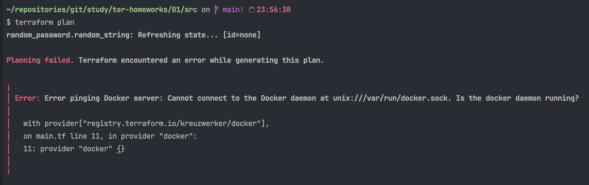

Потребовалось явно указать файл **domain.json**

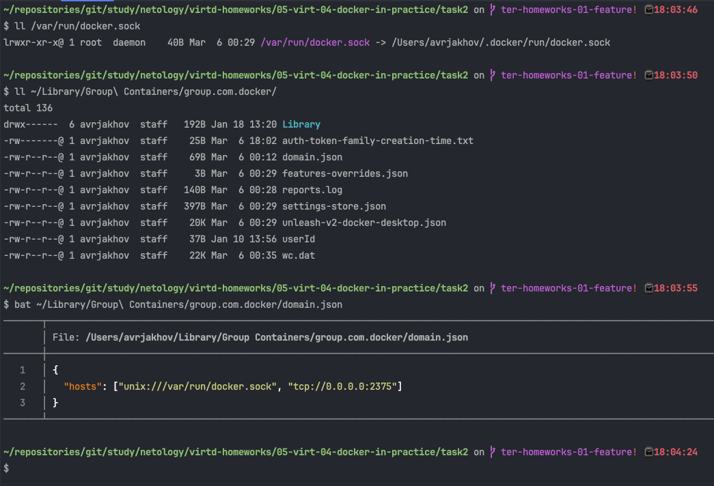

А в программе **Docker Desktop** включить экспериментальные функции

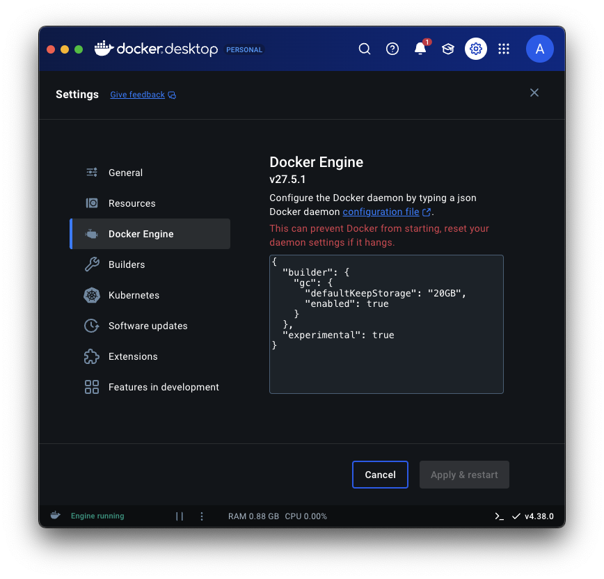

5. После перезапуска **Docker Desktop** и самой службы, смогли запустить проект. Сначала проверили все зависимости и валидацию проекта с помощью команды ```terraform plan```

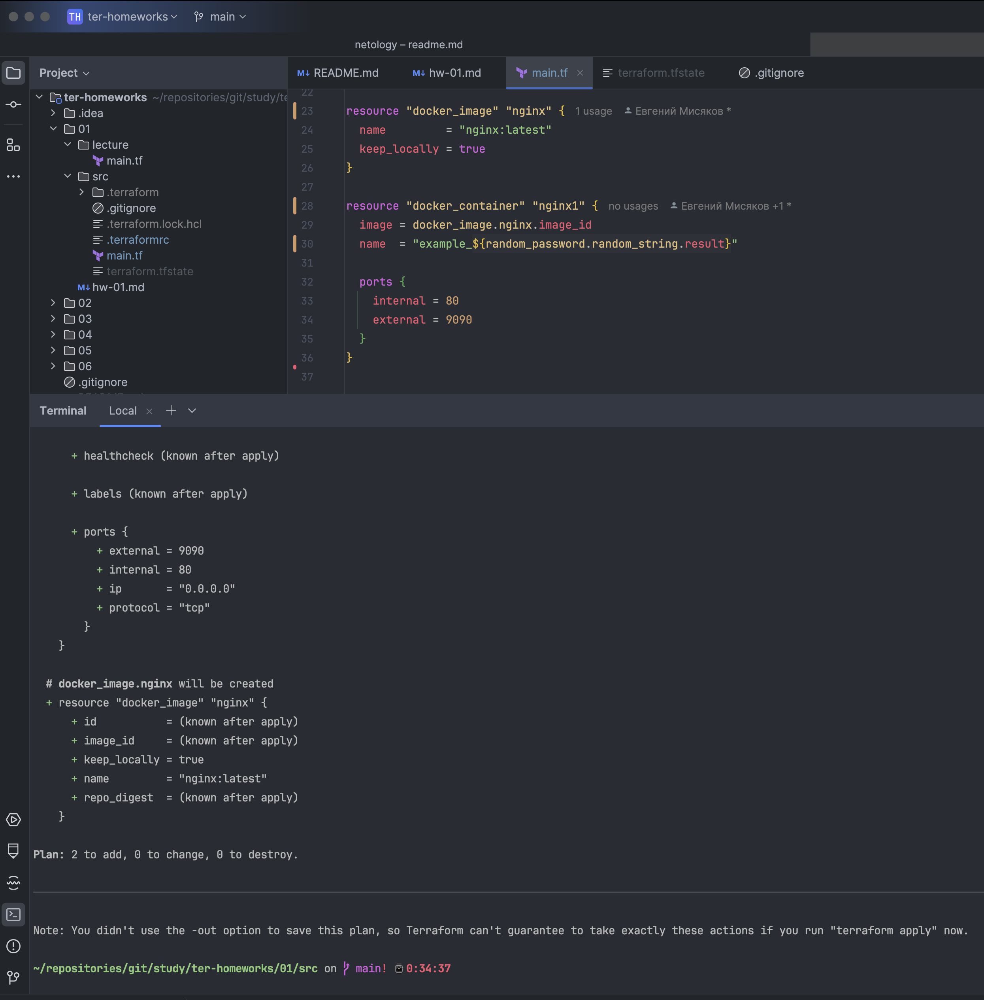

Затем с помощью команды ```terraform apply``` выполнил код проекта, загрузив образ и подняв контейнер

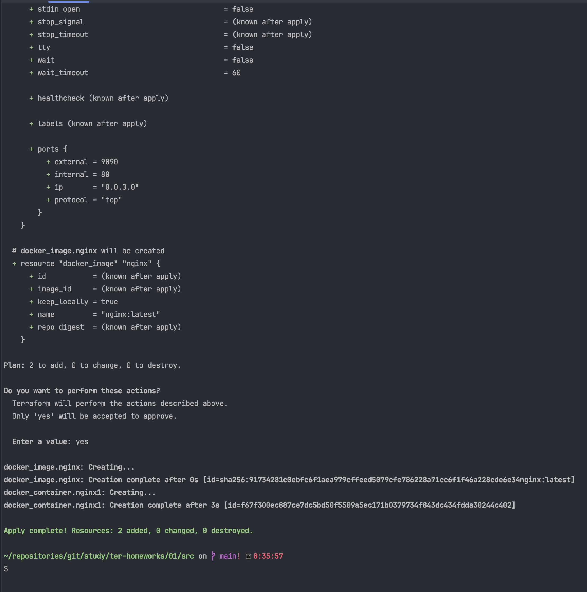

Ниже указан снимок экрана выполнения команды ```docker ps```

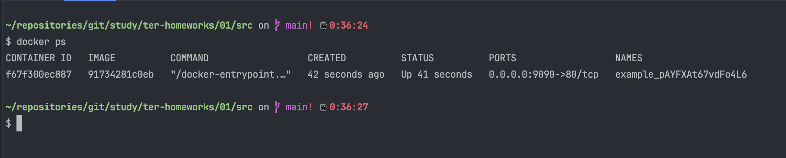

6. Заменили наименование контейнера внутри ресурса на **hello_world**. И вызвали грубую команду ```terraform apply -auto-approve```. На снимке экрана видно, как перед созданием нового контейнера предыдущий был уничтожен. Также указно выполнение команды ```docker ps```

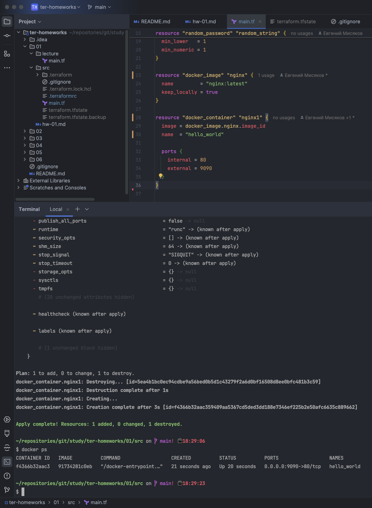

В чем особенность использовании опции ```-auto-approve```:
- Применяет изменения без подтверждения, что может привести к перезаписи/удалению инфраструктуры или непреднамеренным операциям
- Часто задействуют в CI/CD при создании "пайплайнов", при работе в тестовых стендах, или при использовании в скриптах без интерактивного ввода

7. С помощью команды ```terraform destroy``` уничтожаем наш проект

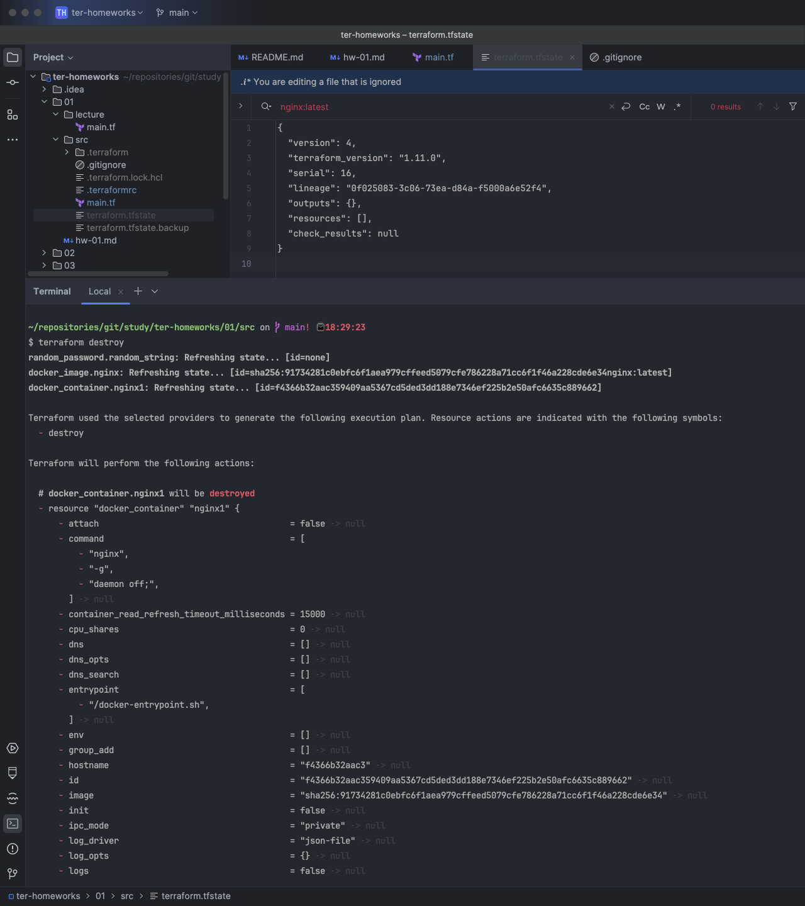

Прикладываем файл состояния проекта после уничтожения [terraform.tfstate](task1/terraform.tfstate)

8. Параметр **keep_locally** в ```terraform``` для Docker определяет, будет ли удалён образ при операции уничтожения. Если значение **true**, то образ не будет удалён. А если **false** — будет!

------

## Дополнительное задание (со звёздочкой*)

**Настоятельно рекомендуем выполнять все задания со звёздочкой.** Они помогут глубже разобраться в материале.   
Задания со звёздочкой дополнительные, не обязательные к выполнению и никак не повлияют на получение вами зачёта по этому домашнему заданию.

### Задание 2*

1. Создайте в облаке ВМ. Сделайте это через web-консоль, чтобы не слить по незнанию токен от облака в github(это тема следующей лекции). Если хотите - попробуйте сделать это через terraform, прочитав документацию yandex cloud. Используйте файл ```personal.auto.tfvars``` и гитигнор или иной, безопасный способ передачи токена!
2. Подключитесь к ВМ по ssh и установите стек docker.
3. Найдите в документации docker provider способ настроить подключение terraform на вашей рабочей станции к remote docker context вашей ВМ через ssh.
4. Используя terraform и  remote docker context, скачайте и запустите на вашей ВМ контейнер ```mysql:8``` на порту ```127.0.0.1:3306```, передайте ENV-переменные. Сгенерируйте разные пароли через random_password и передайте их в контейнер, используя интерполяцию из примера с nginx.(```name  = "example_${random_password.random_string.result}"```  , двойные кавычки и фигурные скобки обязательны!)
```
    environment:
      - "MYSQL_ROOT_PASSWORD=${...}"
      - MYSQL_DATABASE=wordpress
      - MYSQL_USER=wordpress
      - "MYSQL_PASSWORD=${...}"
      - MYSQL_ROOT_HOST="%"
```

6. Зайдите на вашу ВМ , подключитесь к контейнеру и проверьте наличие секретных env-переменных с помощью команды ```env```. Запишите ваш финальный код в репозиторий.

### Задание 3*
1. Установите [opentofu](https://opentofu.org/)(fork terraform с лицензией Mozilla Public License, version 2.0) любой версии
2. Попробуйте выполнить тот же код с помощью ```tofu apply```, а не terraform apply.
------

### Правила приёма работы

Домашняя работа оформляется в отдельном GitHub-репозитории в файле README.md.   
Выполненное домашнее задание пришлите ссылкой на .md-файл в вашем репозитории.

### Критерии оценки

Зачёт ставится, если:

* выполнены все задания,
* ответы даны в развёрнутой форме,
* приложены соответствующие скриншоты и файлы проекта,
* в выполненных заданиях нет противоречий и нарушения логики.

На доработку работу отправят, если:

* задание выполнено частично или не выполнено вообще,
* в логике выполнения заданий есть противоречия и существенные недостатки. 

