# Домашнее задание к занятию 4 «Оркестрация группой Docker контейнеров на примере Docker Compose»

## Задача 1

Сценарий выполнения задачи:
- Установите docker и docker compose plugin на свою linux рабочую станцию или ВМ.
- Если dockerhub недоступен создайте файл /etc/docker/daemon.json с содержимым: ```{"registry-mirrors": ["https://mirror.gcr.io", "https://daocloud.io", "https://c.163.com/", "https://registry.docker-cn.com"]}```
- Зарегистрируйтесь и создайте публичный репозиторий  с именем "custom-nginx" на https://hub.docker.com (ТОЛЬКО ЕСЛИ У ВАС ЕСТЬ ДОСТУП);
- скачайте образ nginx:1.21.1;
- Создайте Dockerfile и реализуйте в нем замену дефолтной индекс-страницы(/usr/share/nginx/html/index.html), на файл index.html с содержимым:
```
<html>
<head>
Hey, Netology
</head>
<body>
<h1>I will be DevOps Engineer!</h1>
</body>
</html>
```
- Соберите и отправьте созданный образ в свой dockerhub-репозитории c tag 1.0.0 (ТОЛЬКО ЕСЛИ ЕСТЬ ДОСТУП).
- Предоставьте ответ в виде ссылки на https://hub.docker.com/<username_repo>/custom-nginx/general .

### Ответ

Установлен свежей версии Docker на основную рабочую и учебную машину Macbook Pro

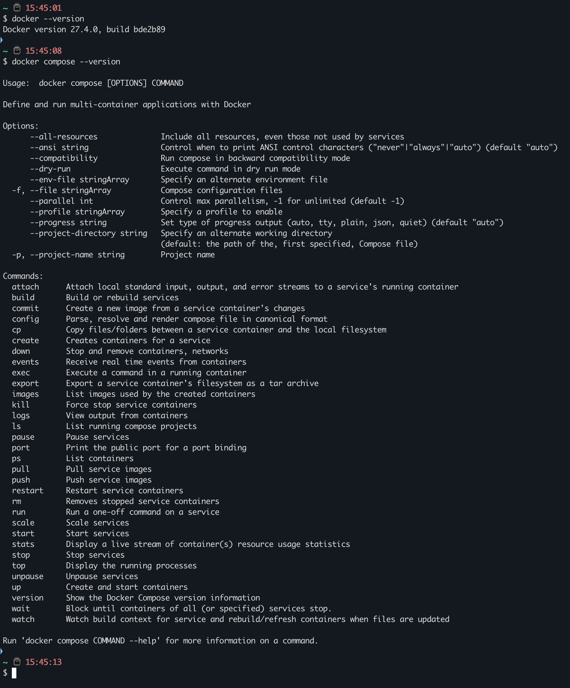

Скачан образ nginx:1.21.1 на локальный хост

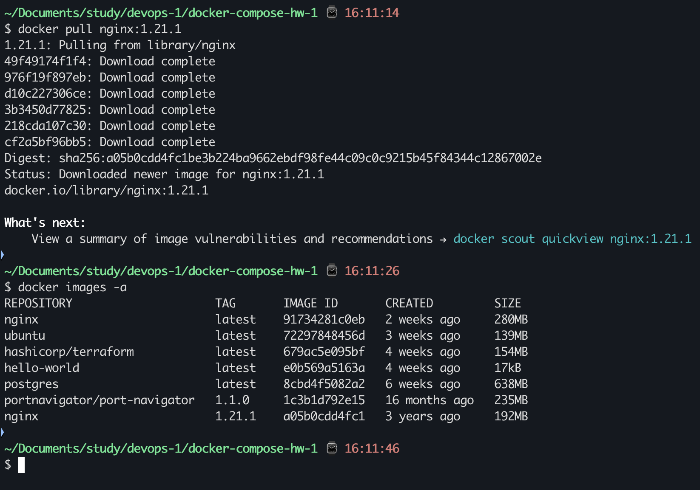

Реализация Dockerfile с обновленной стартовой веб-страницей 

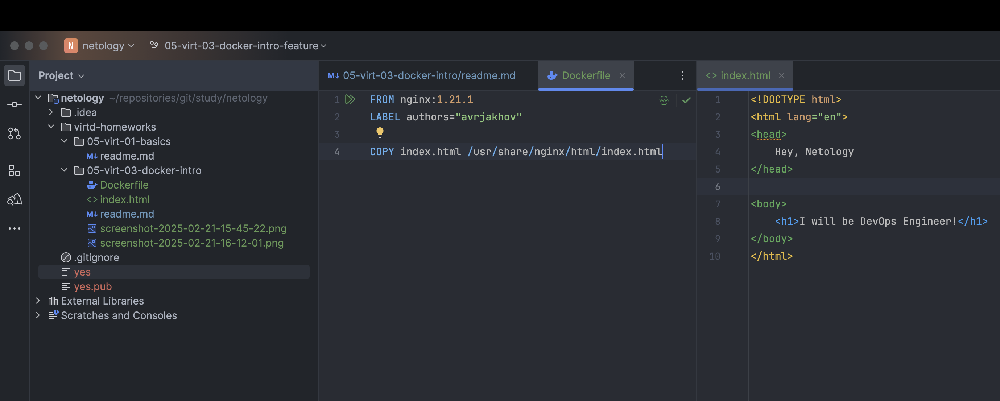

Успешная сборка образа

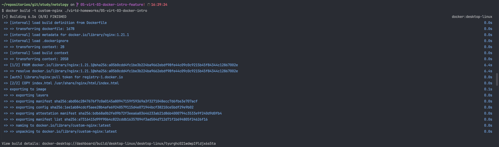

Успешный запуск контейнера на базе нового образа

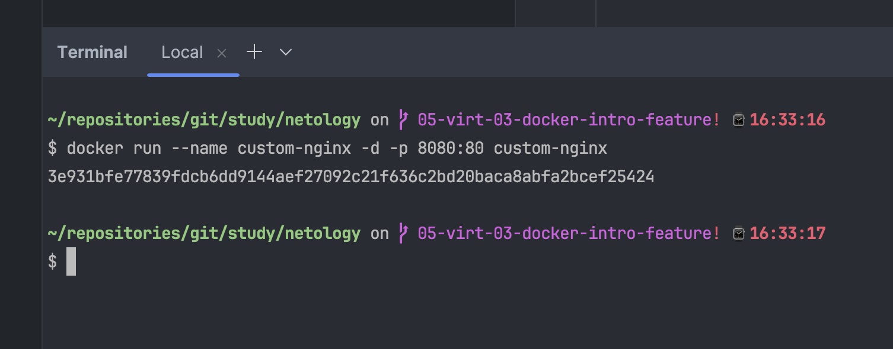

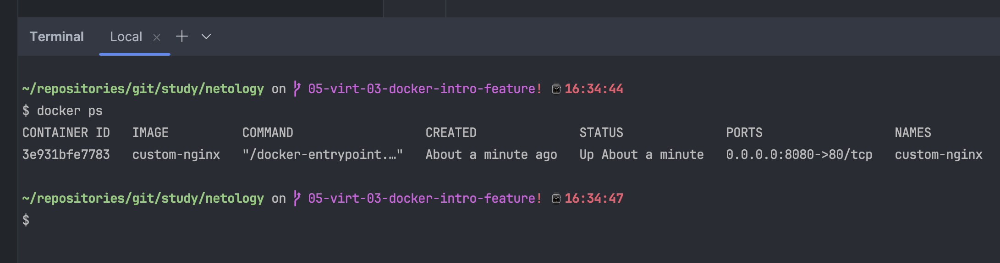

Новая стартовая веб-страница

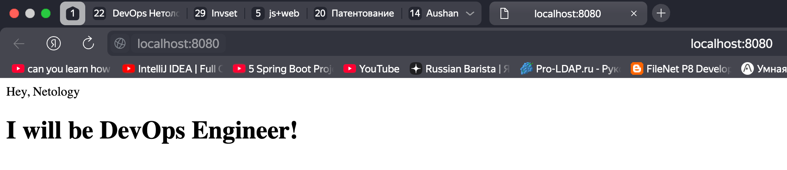

Успешно задание тега образу, и его публикация в общем репозитории

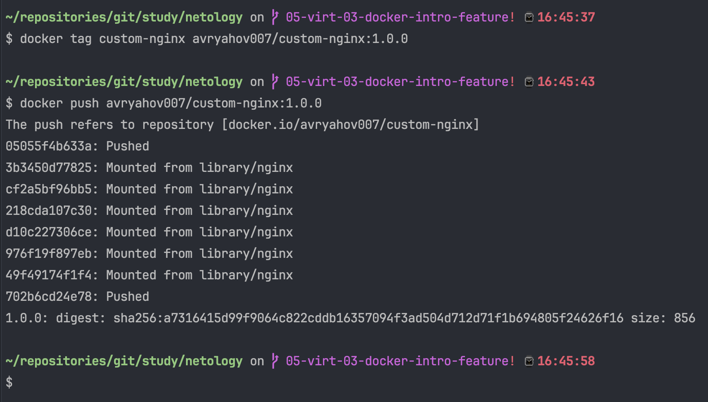

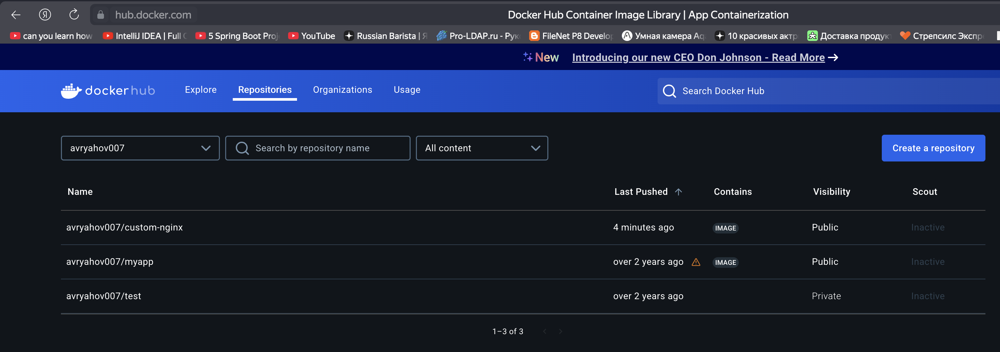

Перезапуск контейнера

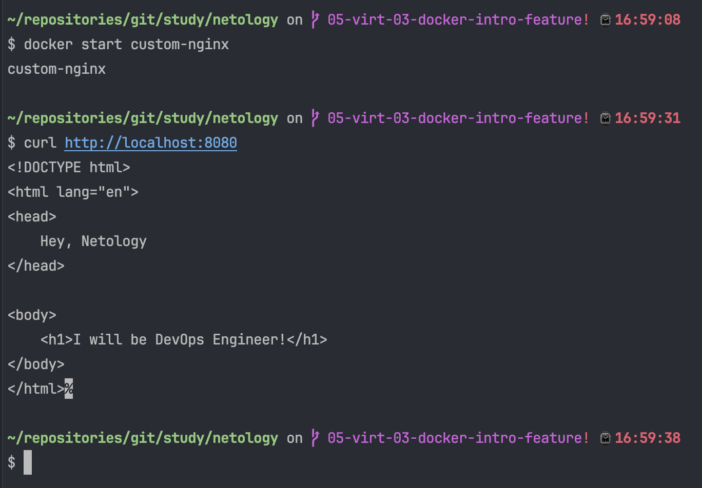

Публичный образ личного репозитория https://hub.docker.com/r/avryahov007/custom-nginx

## Задача 2
1. Запустите ваш образ custom-nginx:1.0.0 командой docker run в соответствии с требованиями:
- имя контейнера "ФИО-custom-nginx-t2"
- контейнер работает в фоне
- контейнер опубликован на порту хост системы 127.0.0.1:8080
2. Не удаляя, переименуйте контейнер в "custom-nginx-t2"
3. Выполните команду ```date +"%d-%m-%Y %T.%N %Z" ; sleep 0.150 ; docker ps ; ss -tlpn | grep 127.0.0.1:8080  ; docker logs custom-nginx-t2 -n1 ; docker exec -it custom-nginx-t2 base64 /usr/share/nginx/html/index.html```
4. Убедитесь с помощью curl или веб браузера, что индекс-страница доступна.

В качестве ответа приложите скриншоты консоли, где видно все введенные команды и их вывод.

### Ответ

Успешный запуск контейнера с заданными именем

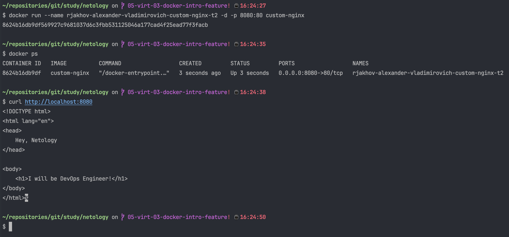

Успешное переименование контейнера

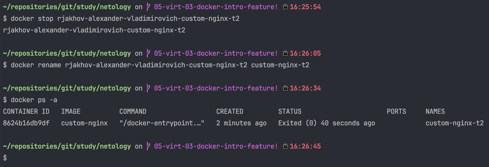

На macOS нативно отсутствует команда ```ss```. Вместо неё задействуем команду со следующими опциями ```lsof -iTCP -sTCP:LISTEN -nP```

По итогу строка видоизменится следующим образом: 
```date +"%d-%m-%Y %T.%N %Z" ; sleep 0.150 ; docker ps ; lsof -iTCP -sTCP:LISTEN -nP | grep 8080  ; docker logs custom-nginx-t2 -n1 ; docker exec -it custom-nginx-t2 base64 /usr/share/nginx/html/index.html```

Результат будет таков:


## Задача 3
1. Воспользуйтесь docker help или google, чтобы узнать как подключиться к стандартному потоку ввода/вывода/ошибок контейнера "custom-nginx-t2".
2. Подключитесь к контейнеру и нажмите комбинацию Ctrl-C.
3. Выполните ```docker ps -a``` и объясните своими словами почему контейнер остановился.
4. Перезапустите контейнер
5. Зайдите в интерактивный терминал контейнера "custom-nginx-t2" с оболочкой bash.
6. Установите любимый текстовый редактор(vim, nano итд) с помощью apt-get.
7. Отредактируйте файл "/etc/nginx/conf.d/default.conf", заменив порт "listen 80" на "listen 81".
8. Запомните(!) и выполните команду ```nginx -s reload```, а затем внутри контейнера ```curl http://127.0.0.1:80 ; curl http://127.0.0.1:81```.
9. Выйдите из контейнера, набрав в консоли  ```exit``` или Ctrl-D.
10. Проверьте вывод команд: ```ss -tlpn | grep 127.0.0.1:8080``` , ```docker port custom-nginx-t2```, ```curl http://127.0.0.1:8080```. Кратко объясните суть возникшей проблемы.
11. * Это дополнительное, необязательное задание. Попробуйте самостоятельно исправить конфигурацию контейнера, используя доступные источники в интернете. Не изменяйте конфигурацию nginx и не удаляйте контейнер. Останавливать контейнер можно. [пример источника](https://www.baeldung.com/linux/assign-port-docker-container)
12. Удалите запущенный контейнер "custom-nginx-t2", не останавливая его.(воспользуйтесь --help или google)

В качестве ответа приложите скриншоты консоли, где видно все введенные команды и их вывод.

### Ответ

Команда ```docker attach <container-name>``` позволяет подключиться к потокам ввода/вывода/ошибок контейнера

Если выполнить данную команду по отношению к нашему контейнеру, и попробовать прервать стандартной комбинацией клавишей "Ctrl+C", то контейнер завершить свою работу, так как открыт поток и ему напрямую послали сигнал SIGINT  
Обычно этот сигнал отправляется процессу на переднем плане. В docker-контейнере пересылается главному процессу (PID 1), а это обычно команды CMD или ENTRYPOINT. Обрубая их, мы рубим и сам контейнер.

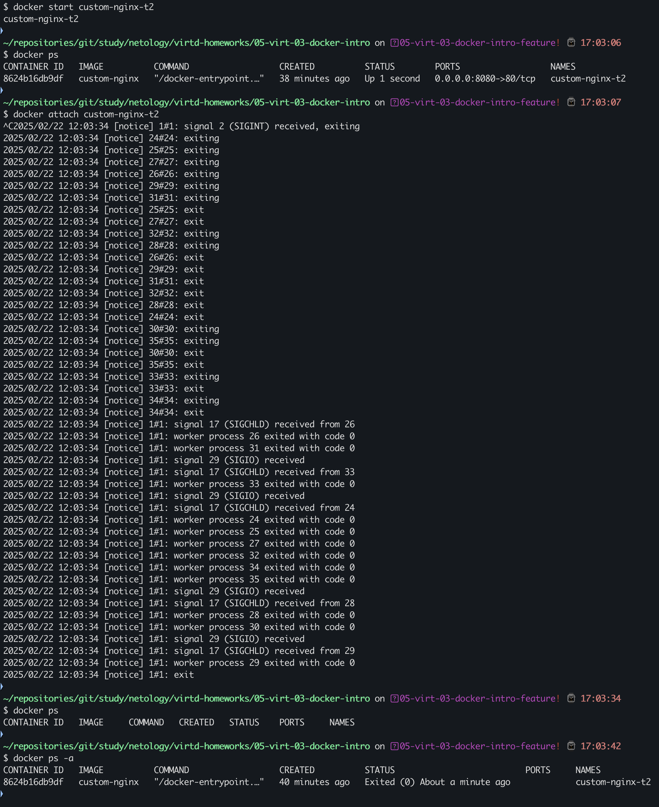

В интерактивном режиме зашли в bash-оболочку контейнера после его перезапуска. Далее обновили локальный репозиторий пакетов, и установили **nano** редактор.
Затем поменяли конфигурацию nginx на прослушивание порта 81 вместо 80. Перезагрузили nginx. 
Завершили сессию, предварительно проверив работу сервиса.

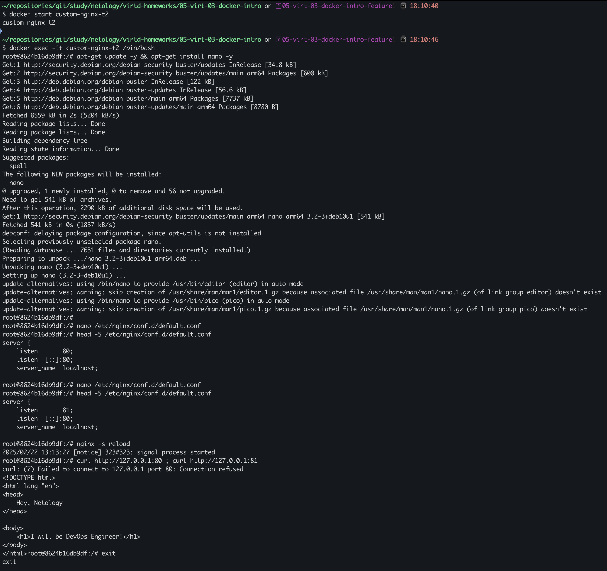

Посмотрели прослушиваемые порты на макбуке, процесс и порт докер-контейнера. Попытались проверить работу nginx в терминале макбука - ошибка.
Это естественное следование работы контейнера после изменения конфигурации nginx. Конфигурация самого контейнера и проброс его портов во вне не был изменен. Ч.Т.Д.

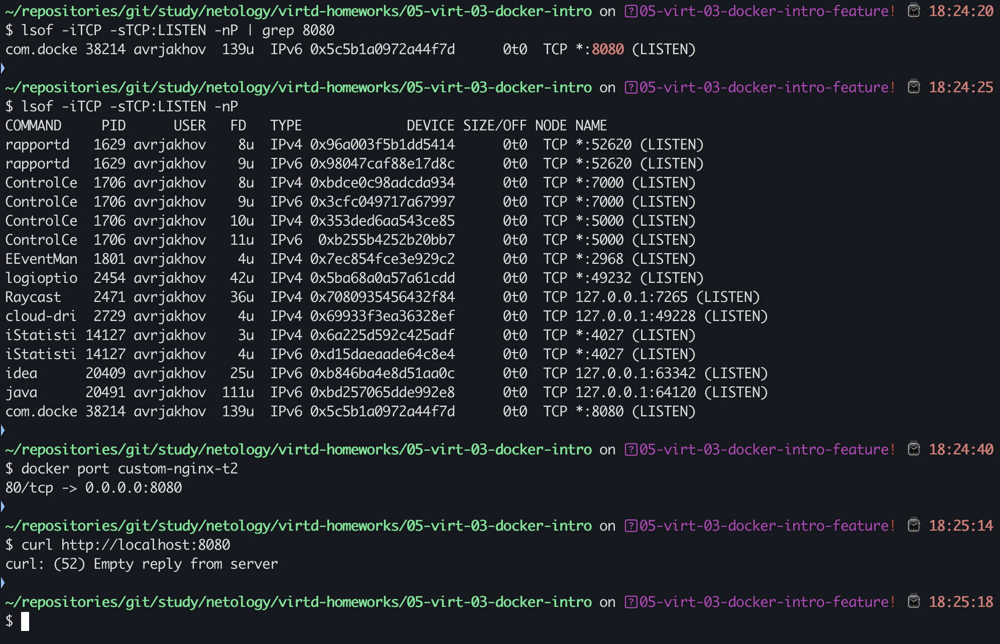

Исправляем конфигурацию контейнера, не удаляя его. 

Однако на операционной системе macOS с архитектурой ARM инструкция по смене не применима. Состояние и конфигурации контейнеров доступы только через прокси-систему с привилегированным доступом к файловой системе.
Сначала запомним идентификатор контейнера. После этого загрузим образ debian-системы. Запустим временно контейнер с рут-правами. Далее найдем конфигурационные файлы и заменим маппинг портов 80 -> 81 и 8080 -> 8081 с помощью встроенного редактора vi.

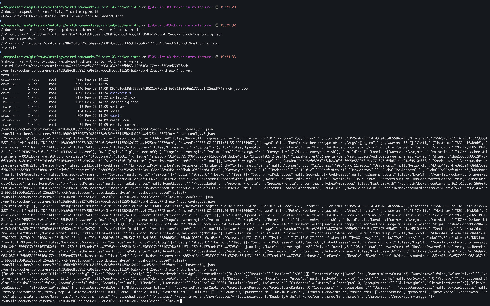

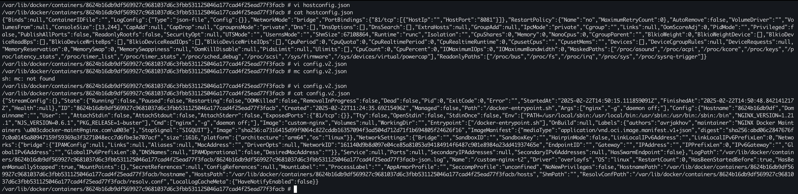

Затем перезапустим "Docker Desktop". И увидим, что наше изменение подхватилось. Вновь заводим контейнер. Проверяем успешное открытие нашей стартовой веб-страницы

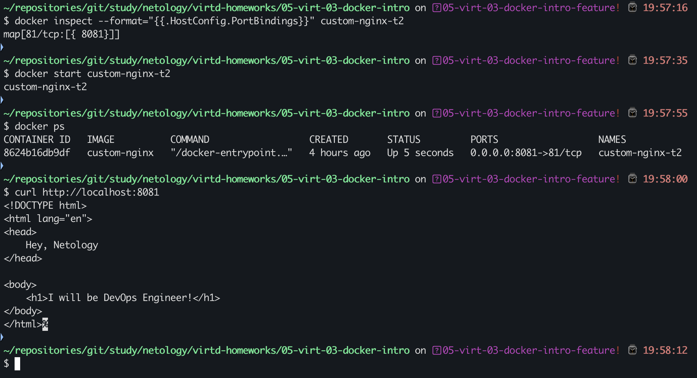

Удаляем запущенный контейнер без остановки

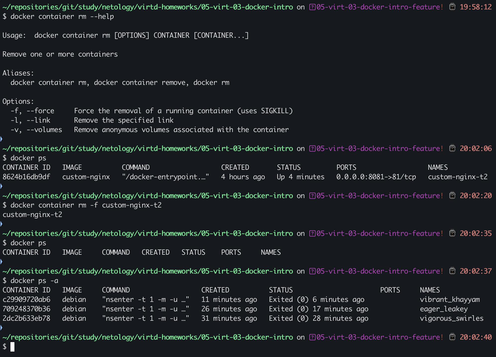

## Задача 4

- Запустите первый контейнер из образа ***centos*** c любым тегом в фоновом режиме, подключив папку  текущий рабочий каталог ```$(pwd)``` на хостовой машине в ```/data``` контейнера, используя ключ -v.
- Запустите второй контейнер из образа ***debian*** в фоновом режиме, подключив текущий рабочий каталог ```$(pwd)``` в ```/data``` контейнера.
- Подключитесь к первому контейнеру с помощью ```docker exec``` и создайте текстовый файл любого содержания в ```/data```.
- Добавьте ещё один файл в текущий каталог ```$(pwd)``` на хостовой машине.
- Подключитесь во второй контейнер и отобразите листинг и содержание файлов в ```/data``` контейнера.


В качестве ответа приложите скриншоты консоли, где видно все введенные команды и их вывод.


## Задача 5

1. Создайте отдельную директорию(например /tmp/netology/docker/task5) и 2 файла внутри него.
   "compose.yaml" с содержимым:
```
version: "3"
services:
  portainer:
    network_mode: host
    image: portainer/portainer-ce:latest
    volumes:
      - /var/run/docker.sock:/var/run/docker.sock
```
"docker-compose.yaml" с содержимым:
```
version: "3"
services:
  registry:
    image: registry:2

    ports:
    - "5000:5000"
```

И выполните команду "docker compose up -d". Какой из файлов был запущен и почему? (подсказка: https://docs.docker.com/compose/compose-application-model/#the-compose-file )

2. Отредактируйте файл compose.yaml так, чтобы были запущенны оба файла. (подсказка: https://docs.docker.com/compose/compose-file/14-include/)

3. Выполните в консоли вашей хостовой ОС необходимые команды чтобы залить образ custom-nginx как custom-nginx:latest в запущенное вами, локальное registry. Дополнительная документация: https://distribution.github.io/distribution/about/deploying/
4. Откройте страницу "https://127.0.0.1:9000" и произведите начальную настройку portainer.(логин и пароль адмнистратора)
5. Откройте страницу "http://127.0.0.1:9000/#!/home", выберите ваше local  окружение. Перейдите на вкладку "stacks" и в "web editor" задеплойте следующий компоуз:

```
version: '3'

services:
  nginx:
    image: 127.0.0.1:5000/custom-nginx
    ports:
      - "9090:80"
```
6. Перейдите на страницу "http://127.0.0.1:9000/#!/2/docker/containers", выберите контейнер с nginx и нажмите на кнопку "inspect". В представлении <> Tree разверните поле "Config" и сделайте скриншот от поля "AppArmorProfile" до "Driver".

7. Удалите любой из манифестов компоуза(например compose.yaml).  Выполните команду "docker compose up -d". Прочитайте warning, объясните суть предупреждения и выполните предложенное действие. Погасите compose-проект ОДНОЙ(обязательно!!) командой.

В качестве ответа приложите скриншоты консоли, где видно все введенные команды и их вывод, файл compose.yaml , скриншот portainer c задеплоенным компоузом.

---

### Правила приема

Домашнее задание выполните в файле readme.md в GitHub-репозитории. В личном кабинете отправьте на проверку ссылку на .md-файл в вашем репозитории.

